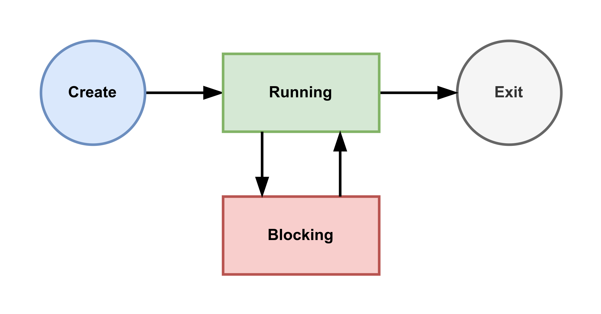

# Goroutines, Deferred Function Calls and Panic/Recover

Goroutine and deferred function call are two unique features in Go.

## Goroutines

Modern CPUs often have multiple cores, and some CPU cores support hyper-threading. In other words, modern CPUs can process multiple instruction pipelines simultaneously. To fully use the power of modern CPUs, we need to do concurrent programming in coding our programs.

Concurrent computing is a form of computing in which several computations are executed during overlapping time periods.

Concurrent computing may happen in a program, a computer, or a netword. In Go 101, we only talk about program-scope concurrent computing. Goroutine is the Go way to create concurrent computations in Go programming.

Goroutines are also often called green threads. Green threads are maintained and scheduled by the language runtime instead of the operating systems. The cost of memory consumption and context switching, of a goroutine is much lesser than an OS thread. So, it is not a problem for a Go program to maintain tens of thousands goroutines at the same time, as long as the system memory is sufficient.

Go doesn't support the creation of system threads in user code. Using goroutines is the only way to do (program scope) concurrent programming in Go.

## Concurrency Synchronization

Concurrent computations may share resources, generally memory resource. The following are some circumstances that may occur during concurrent computing:

- In the same period that one computation is writing data to a memory segment, another computation is reading data from the same memory segement. Then the integrity of the data read by the other computation might be not preserved.
- In the same period that one computation is writing data to a memory segment, another computation is also writing data to the same memory segment. Then the integrity of the data stored at the memory segment might be not preserved.

## Goroutine States

The last example shows that a live goroutine may stay in (and switch between) two states, running and blocking. In that example, the main goroutine enters the blocking state when the wg.Wait method is called, and enter running state again when the other two goroutines both finish their respective tasks.

The following picture depicts a possible lifecycle of a goroutine.

    

Note, a goroutine is still considered to be running if it asleep (after calling time.Sleep function) or awaiting the response of a system call or a network connection. 

When a new goroutine is created, it will enter the "running" state automatically. Goroutines can only exit from running state, and never from blocking state. If, for any reason, a goroutine stays in blocking state forever, then it will never exit. Such cases, except some rare ones, should be avoided in concurrent programming.

A blocking goroutine can only be unblocked by an operation made in another goroutine. If all goroutines in a Go program are in blocking state, then all of them will stay in blocking state forever. This can be viewed as an overall deadlock. When this happens in a program, the standard Go runtime will try to crash the program.

## Goroutine Schedule

**Not all goroutines in running state are being executed at a given time.** At any given time, the maximum number of goroutines being executed will not exceed the number of logical CPUs available for the current program. We can call the runtime.NumCPU function to get the number of logical CPUs avaiable for the current program. Each logical CPU can only execute one goroutine at any given time. Go runtime must frequently switch execution contexts between goroutines to let each running goroutine have a chance to execute.

The standard Go runtime adopts the M-P-G model to do the goroutine schedule job, where M represents OS threads, P represents logical/virtual processors (not logical CPUs) and G represents goroutines. Most schedule work is made by logical processors (Ps), which act as brokers by attaching goroutines (Gs) to OS threads (Ms). Each OS thread can only be attached to at most one goroutine at any given time, and each goroutine can only be attached to at most one OS thread at any given time. A goroutine can only get executed when it is attached to an OS thread. A goroutine which has been executed for a while will try to detach itself from the corresponding OS thread, so that other running goroutines can have a chance to get attached and executed.

At any time, the number of goroutines in the executing sub-state is no more than the smaller one of runtime.NumCPU and runtime.GOMAXPROCS

## Deferred function calls

A deferred function call is a function call which follows a defer keyword. The defer keyword and the deferred function call together form a defer statement. Like goroutine function calls, all the results of the function call (if the called function has return results) must be discarded in the function call statement.

When a defer statement is executed, the deferred function call is not executed immediately. Instead, it is pushed into a deferred call queue maintained by its caller goroutine. After a function call fc(...) returns (but has not fully existed yet) and enters its exiting phase, all the deferred function calls pushed into the deferred call queue during executing the function call will be removed from the deferred call queue and executed, in first-in last-out order, that is the reverse of the order in which they pushed into the deferred call queue.

## Deferred function calls can modify the named return results of nesting functions

## The evaluation moment of the arguments of deferred function calls

The arguments of a deferred function call are all evaluated at the moment when the corresponding defer statement is pushed into the deferred call queue.

## Some fatal errors are not panics and they are unrecoverable

Some fatal errors, such as stack overflow and out of memory are not recoverable. Once they occur, program will crash.