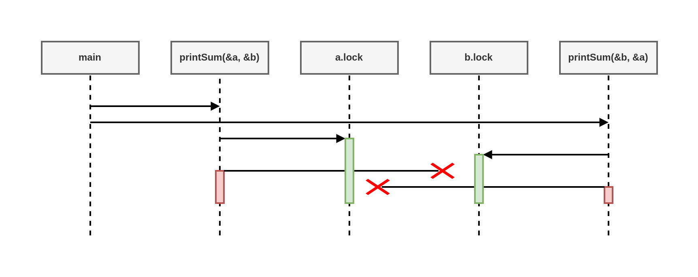

# An introduction to Concurrency

When most people use the word "concurrent", they're usually referring to a process that occurs simultaneously with one or more processes.

## Moore's Law, Web Scale, and the Mess We're In

## Why is concurrency hard?

### Race conditions

A race condition occurs when two or more operations must execute in the correct order, but the program has not been written so that this order is guaranteed to be maintained.

Most of the time, this shows up in what's called a data race, where one concurrent operation attempts to read a variable while at some undertermined time another concurrent operation is attempting to write to the same variable.

```go
var data int // 1

go func() { // 2
    data++ // 3
}() // 4
if data == 0 { // 5
    fmt.Printf("the value is %v.\n", data)
}
```

There are three possible outcomes to running this code:

- Nothing is printed. In this case, line 3 was executed before line 5.
- Value 0 is printed. In this case, line 5 -> line 6 -> line 3 (option)
- Value 1 is printed. In this case, line 5 -> line 3 -> line 6

Just a few lines of incorrect code can introduce tremendous variability into your program.

```go
var data int
go func() { data++ }()
time.Sleep(1*time.Second) // this is bad
if data == 0 {
    fmt.Printf("the value is %v.\n", data)
}
```

Have we solved our data race? No. In fact, it's still possible for all three outcomes to arise from this program, just increasingly unlikely. The longer we sleep in between invoking our goroutine and checking the value of data, the closer our program gets to achieving correctless.

Race conditions are one of the most insidious types of concurrency bugs because they may not show up until years after the code has been placed into production. They are usually precipiated by a change in the environment the code is executing in, or an unprecedented occurrence. 

### Atomicity

When something is considered atomic, or to have the property of atomicity, this means that within the context that it is operating, it is indivisible, or uninterruptible.

The first thing that's very important is the word "context". Something may be atomic in one context, but not another. Operations that are atomic within the context of your process may not be atomic in the context of the operating system; operations that are atomic within the context of the operating system may not be atomic within the context of your machine... In other words, the atomicity of an operation can change depending on the currently defined scope. This fact and work both and against you!

When thinking about atomicity, very often the frist thing you need to do is to define the context, or scope, the operation will be considered to be atomic in.

Now let's look at the terms "indivisible" and "uninterruptible". These term mean that within the context you've defined. Something that is atomic will happen in its entirely withont anything happening in that context simultaneously. That's still a monthful, so let's look at an example:

i++

It may look atomic, but a brief analysis reveals several operations:

- Retrieve the value of i.
- Increment the value of i.
- Store the value of i.

While each of these operations alone is atomic, the combination of the three may not be, depending on your context. This reveals an interesting property of atomic operations: combining them does not necessarily produce a larger atomic operation. Making the operation atomic is dependent on which  context you'd like it to be atomic within. If your context is a goroutine that doesn't expose i to other goroutines, the this code is atomic.

So why do we care? Atomicity is important because if something is atomic, implicitly it is safe within concurrent contexts. This allow us to compose logically correct programs, and-as we'll later see - can even serve as a way to optimize concurrent programs.

Most statements are not atomic, let alone functions, methods, and programs. If atomicity is the key to composing logically correct programs, and most statements aren't atomic, how do we reconcile these two statements? We can force atomicity by employing various techniques.

### Memory Access Synchronization

The following code is not idiomatic GO (don't suggest you attempt to solve your data race problems like this), but it very simply demonstrates memory access synchronization.

```go
var memoryAccess sync.Mutex
var value int
go func() {
    memoryAccess.Lock()
    value++
    memoryAccess.Unlock()
}()

memoryAccess.Lock()
if value == 0 {
    fmt.Printf("the value is %v.\n", value)
} else {
    fmt.Printf("the value is %v.\n", value)
}
memoryAccess.Unlock()
```

In this example we've created a convention for developers to follow. Anytime developers want to access the data variable's memory, they must first call Lock, and when they're finished they must call Unlock. Code between those two statements can then assume it has exclusive access to data; we have successfully synchronized access to the memory.

You may have noticed that while we have solved our data race, we haven't actually solved our race condition! The order of operations in this program is still non-deterministic; we've just narrowed the scope of the non-deterministic a bit.

Sychronizing access to the memory in this manner also has performance ramifactions. Calls to Lock you see can make our program slow. Every time we perform one of these operations, our program pauses for a period of time.

- Are my critical sections entered and exited repeatedly?
- What size should my critical section be?

Answering these two questions in the context of your program is an art, and this adds to the difficulty in synchronizing access to the memory.

### Deadlocks, Livelocks, AbandonLock and Starvation

**Deadlock**

A deadlocked program is one in which all concurrent process are waiting on one another. In this state, the program will never recover without outside intervention.

If that sounds grim, it's because it is! The Go runtime attempts to do its part and will detect some deadlocks (all goroutines must be blocked, or "asleep"), but this doesn't do much to help you prevent deadlocks.

```go
func main() {
	type value struct {
		mu    sync.Mutex
		value int
	}
	var wg sync.WaitGroup
	printSum := func(v1, v2 *value) {
		defer wg.Done()

        // we attempt to enter the critical section for the incoming value
		v1.mu.Lock()
        // we use the defer statement to exit the critical section before printSum returns
		defer v1.mu.Unlock()

        // Here we sleep a period of time to simulate work (and trigger a deadlock)
		time.Sleep(time.Second)

		v2.mu.Lock()
		defer v2.mu.Unlock()
	}
	var a, b value
	wg.Add(2)
	go printSum(&a, &b)
	go printSum(&b, &a)
	wg.Wait()
}
```

If you were to try and run this code, you'd probably see:

```txt
fatal error: all goroutines are asleep - deadlock!
```

Why? If you look carefully, you'll see a timing issue in this code. Following is a graphical representation of what's going on. The boxes represent functions, the horizontal lines calls to these functions, and the vertical bars lifetimes of the function at the head of the graphic.



Essentially, we have create two gears that cannot turn together: our first call to print Sum locks a and then attempts to lock b, but in the meantime our second call to print Sum has locked b and has attempted to lock a. Both goroutines wait infinitely on each other.

```md
**Irony**

To keep this example simple, we use a time.Sleep to trigger the deadlock. However, this introudces a race condition! Can you find it?
A logically "perfect" deadlock would require correct synchronization?
```

It seems pretty obvious with deadlock is occurring when we lay it out graphically like that, but we would benefit from a more rigorous definition. It turns out there are a few conditions that must be present for deadlocks to arise. The Coffman Conditions and are the basic for techniques that help detect, prevent, and correct deadlocks.

The Coffman Conditions are as follows:

- Mututal Exclusion: A concurrent process holds exclusive rights to a resource at any one time.
- Wait for Condition: A concurrent process must simultaneously hold a resource and be waiting for an additional resource.
- No Preemption: A resource held by a concurrent process can only be released by that process, so it fullfills this condition.
- Circular Wait: A concurrent process (P1) must be waiting on a chain of other concurrent processes (P2), which are in turn waiting on it (P1), so fullfills this final condition too.


Let's examine our contrived program and determine if it meets all four conditions:

- The printSum function does require exclusive rights at both a and b, so it fullfills this condition
- Because printSum holds either a or b and is waiting for on the other, it fullfills this condition.
- We haven't given any way for our goroutines to be preempted. 
- Our first invocation of printSum is waiting on our second invocation, and vice versa.

Yep, we definitely have a deadlock on our hands.

These laws allow us to prevent deadlocks too. If we ensure that at least one of these conditions is not true, we can prevent deadlocks from occurring. Unfortunately, in practice these conditions can be hard to reason about, and therefore difficulty to prevent.

**Livelock**

Livelocks are programs that are actively performing concurrent operations, but these operations do nothing to move the state of the program forward.

Have you ever been in hallway walking toward another person? She moves to one side, but you're just done the same. So you move to the other side, but she's also done the same. Imagine this going on forever, and you understand livelocks.

**Starvation**

Starvation is any situation where a concurrent process cannot get all the resources it needs to perform work.

When we discussed livelocks, the resource each goroutine was starved of was a shared lock. Livelocks warrant discussion separate from starvation because in a livelock, all the concurrent processes are starved equally, and no work is accomplished. More broadly, starvation usually implies that there are or more greedy concurrent process that are unfairly preventing one or more concurrent processes from accomplishing work as efficiently as possible, or maybe at all.

Here's an example of a program with a greedy goroutine and a pollite goroutine:

```go
func main() {
	var wg sync.WaitGroup
	var sharedLock sync.Mutex
	const runtime = time.Second * 1

	greedyWorker := func() {
		defer wg.Done()

		var count int
		for begin := time.Now(); time.Since(begin) <= runtime; {
			sharedLock.Lock()
			time.Sleep(3 * time.Nanosecond)
			sharedLock.Unlock()
			count++
		}

		fmt.Printf("Greedy worker was able to execute %v work loops.\n", count)
	}

	politeWorker := func() {
		defer wg.Done()

		var count int
		for begin := time.Now(); time.Since(begin) <= runtime; {
			sharedLock.Lock()
			time.Sleep(time.Nanosecond)
			sharedLock.Unlock()

			sharedLock.Lock()
			time.Sleep(time.Nanosecond)
			sharedLock.Unlock()

			sharedLock.Lock()
			time.Sleep(time.Nanosecond)
			sharedLock.Unlock()

			count++
		}

		fmt.Printf("Polite worker was able to execute %v work loops.\n", count)
	}

	wg.Add(2)
	go greedyWorker()
	go politeWorker()

	wg.Wait()
}
```

The greedy worker greedily holds onto the shared lock for entirely of its work loop, whereas the polite worker attempts to only lock when it needs to. Both wokers do the same amount of simulated work (sleeping for three nanoseconds), but as you can see in the same amount of time, the greedy worker got almost twice the amount of work done!


