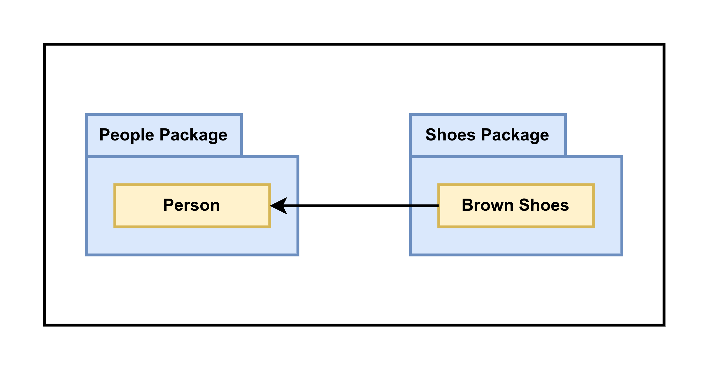
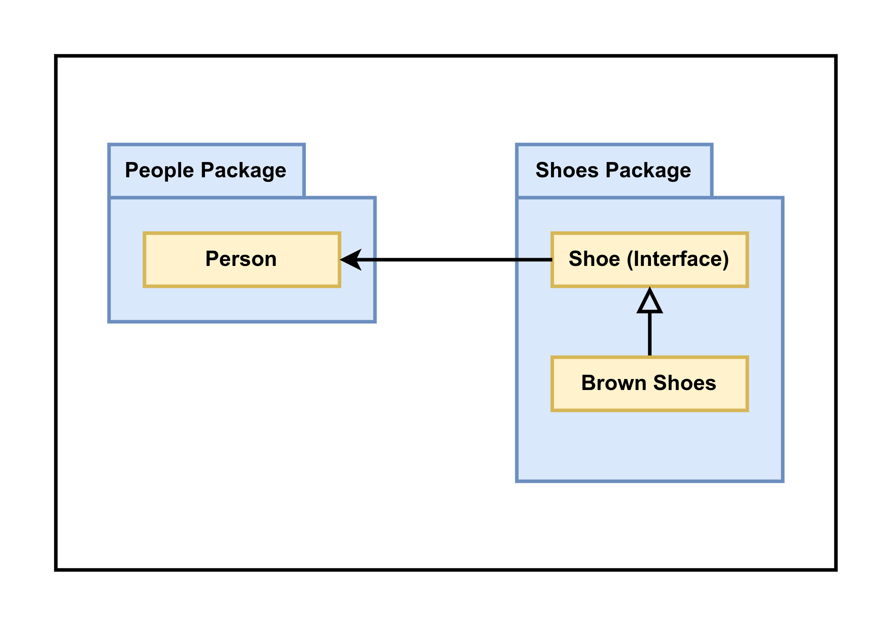
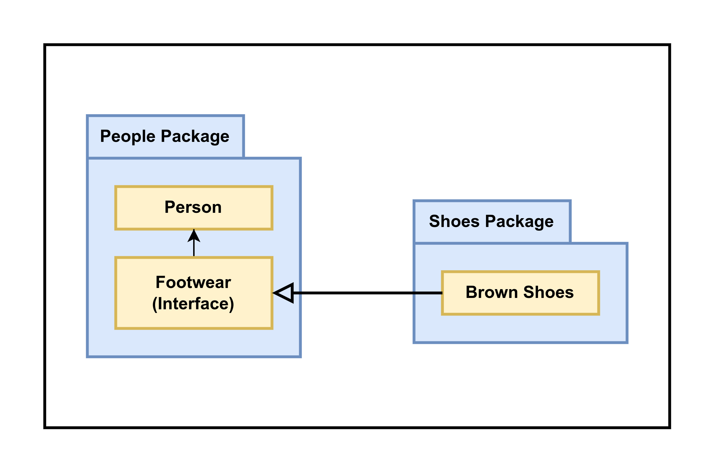

# SOLID Design Principles for Go

SOLID is an acronym for five popular principle object-oriented software design principles

- Single responsibility principle
- Open/close principle
- Liskov substitution principle
- Interface segregation principle
- Dependency inversion principle

## Single responsibility principle (SRP)

**A class should have one, and only one, reason to change**

Go doesn't have classes, but if we squint a little and replace the world class with objects (structs, functions, interfaces or packages), then the concept still applies.

Designing objects so that they all do only one thing sounds okay in the abstract. But you are probably thinking that doing so for an entire system would add a lot more code. Yes, it will. However, what it doesn't do is add complexity; in fact, it significantly reduces it. Each piece of code would be smaller and easier to understand, and therefore easier to test.

**SRP reduces the complexity by decomposing code into smaller, more concise pieces**

```go
// Calculator calculates the test coverage for a directory
// and it's sub-directories
type Caculator struct {
    // coverage data populated by Caculate() method
    data map[string]float64
}

// Calculate will calculate the coverage
func (c *Caculator) Calculate(path string) error {
    // store data
    return nil
}

// Output will print the coverage data to the supplied writer 
func (c *Caculator) Output(writer io.Writer) {
    for path, result := range c.data {
        fmt.Fprintf(writer, c.data)
    }
}
```

The code looks reasonable - one member variable and two methods. It does not, however conform to SRP. Let's assume that the app was successful, and we decided that we also needed to output the results to CSV.

```go
// OutputCSV will print the coverage data to the supplied writer
func (c *Caculator) OutputCSV(writer io.Writer) {
}
```

We have change struct and added another Output() method. We have added more responsibilities to the struct and, in doing so, we have added complexity. In this simple example, our changes are confined to one method, so there's no risk that we broke the previous code. However, as the struct gets bigger and more complicated, our changes are unlikely to be so clean.

Conversele, if we were to break the responsibilities into Calculate ond Output, then adding more outputs would mere define new structs.

```go
// Calculator calculates the test coverage for a director
// and it's sub-directories
type Calculator struct {
	data map[string]float64
}

// Calculate will calculate the coverage
func (c *Calculator) Calculate(path string) error {
	// store data
	return nil
}

func (c *Calculator) getData() map[string]float64 {
	// copy and return the map
	return nil
}

// Printer ...
type Printer interface {
	Output(data map[string]float64)
}

// DefaultPrinter ...
type DefaultPrinter struct {
	Writer io.Writer
}

func (d *DefaultPrinter) Output(data map[string]float64) {
}

type CSVPrinter struct {
	Writer io.Writer
}

// Output implements Printer
func (d *CSVPrinter) Output(data map[string]float64) {}
```

Do you notice anything significant about the printers? They have no connection at all to the calculation. They could be used for any data in the same format. This leads to the second advantage of SRP:

**SRP increases the potential reusability of code**

**SRP makes tests simpler to write and maintain**

SRP is also and excellent way to improve general code readability. Take a look at this next example.
```go
func loadUserHandler(resp http.ResponseWriter, req *http.Request) {
    err := req.ParseForm()
    if err != nil {
        resp.WriteHeader(http.StatusInternalServerError)
        return
    }
    userID, err := strconv.ParseInt(req.Form.Get("UserID"), 10, 64)
    if err != nil {
        resp.WriteHeader(http.StatusPreconditionalFailed)
        return
    }

    row := DB.QueryRow("SELECT * FROM Users WHERE ID = ?", userID)

    person := &Person{}
    err = row.Scan(&person.ID, &person.Name, &person.Phone)
    if err != nil {
        resp.WriteHeader(http.StatusInternalServerError)
        return
    }
    encoder := json.NewEncoder(resp)

    encoder.Encode(person)
}
```

That took more than five seconds to understand.

```go
func loadUserHandler(resp http.ResponseWriter, req *http.Request) {
    userID, err := extractIDFromRequest(req)
    if err != nil {
        resp.WriteHeader(http.StatusPreconditionFailed)
        return
    }

    person, err := loadPersonByID(userID)
    if err != nil {
        resp.WriteHeader(http.StatusInternalServerError)
        return
    }

    outputPerson(resp, person)
}
```

By applying SRP at the function level, we have reduced the function's bloat and increased its readability. The function's single responsibility is now to coordinate the calls to the other functions.

**Go interfaces, struct, and functions**

At the interface and struct level, applying SRP results in many small interfaces. A function that complies with the SRP has few inputs and is quite short. When applying SRP to a function to reduce bloat, no new tests are required; the tests for the original function are perfectly acceptable. \

**Go packages**

Applying SRP at the package level is perhaps harder to do. Good packages, on the other hand, are small, concise and clear of purpose.

Applying SRP and finding the correct abstractions from the beginning is difficult. You can counter this by breaking the rules first and then using subsequent changes to discover how the software wants to evolve, using the forces of evolution as the basis for refactoring.

## Open/Close principle (OCP)

Software entities (classes, modules, functions, etc) should be open for extension, but closed for modification

Open means that we should be able to extend or adapt code by adding new behaviors and features. Closed means that we should avoid making changes to existing code, changes that could result in bugs or other kinds of regression.

When talking about being open, we are talking about the design or structure of the software. From this perspective, being open means that it is easy to add new packages, new interfaces or new implementations of an existing interface.

When we talking about being closed, we are talking about existing code and minimizing the changes we make to it, particularly the APIs that are used by others.

**OCP helps reduce the risk of additions and extensions**

Modifying existing code always has some risk involved.

```go
func BuildOutput(response http.ResponseWriter, format string, person Person) {
    var err error

    switch format {
    case "csv":
        err = outputCSV(response, person)
    case "json":
        err = outputJSON(response, person)
    }

    if err != nil {
        // output a server error and quit
        response.WriteHeader(http.StatusInternalServerError)
        return
    }

    response.WriteHeader(http.StatusOK)
}
```

The first hint that something is amiss is the switch statement. It is not hard to imagine a situation where requirements change, and where we might need to add or even remove an output format.

Let's repalce the format input parameter and the switch statement with an abstraction, as shown in the following code:

```go
type PersonFormatter interface {
    Format(http.ResponseWriter, Person)
}

func BuildOutput(response http.ResponseWriter, formatter PersonFormatter, person Person) {
    err := formatter.Format(response, person)
    if err != nil {
        // output a server error and quit
        response.WriteHeader(http.StatusInternalServerError)
        return
    }

    response.WriteHeader(http.StatusOK)
}
```

How many changes was it this time? Let's see:

- We need to define another implementation of the PersonFormatter interface
- The caller of the method has to be updated to use the new format
- We have to write test scenarios for the new PersonFormatter
 
We are down to only the three unavoiable changes and we changed nothing in the primary function at all. This shows us the second advantage of OCP

**OCP can help reduce the number of changes needed to add or remove a feature**

**OCP narrows the locality of buts to only the new code its usage**

```go
func GetUserHandlerV1(resp http.ResponseWriter, req *http.Request) {
    // validate inputs
    err := req.ParseForm()
    if err != nil {
        resp.WriteHeader(http.StatusInternalServerError)
        return
    }
    userID, err := strconv.ParseInt(req.Form.Get("UserID"), 10, 64)
    if err != nil {
        resp.WriteHeader(http.StatusPreconditionFailed)
        return
    }

    user := loadUser(userID)
    outputUser(resp, user)
}

func DeleteUserHandlerV1(resp http.ResponseWriter, req *http.Request) {
    // validate inputs
    err := req.ParseForm()
    if err != nil {
        resp.WriteHeader(http.StatusInternalServerError)
        return
    }

    userID, err := strconv.ParseInt(req.Form.Get("UserID"), 10, 64)
    if err != nil {
        resp.WriteHeader(http.StatusPreconditionFailed)
        return
    }

    deleteUser(userID)
}
```
We can see shotgun surgery problem. We can extract the repeated logic to one place and then adding the new validation there

```go
func GetUserHandlerV2(resp http.ResponseWriter, req *http.Request) {
    // validate inputs
    err := req.ParseForm()
    if err != nil {
        resp.WriteHeader(http.StatusInternalServerError)
        return
    }
    userID, err := extractUserID(req.Form)
}

```

## Liskov substitution principle (LSP)

Subtypes must be substitutable for their base types

```go
func Go(vehicle actions) {
    if sled, ok := vehicle.(*Sled); ok {
        sled.pushStart()
    } else {
        vehicle.startEngine()
    }

    vehicle.drive()
}

type actions interface {
    drive()
    startEngine()
}

type Vehicle struct {}
func (v Vehicle) drive() {}
func (v Vehicle) startEngine() {}
func (v Vehicle) stopEngine() {}

type Car struct {
    Vehicle
}
type Sled struct {
    Vehicle
}
func (s Sled) startEngine() {}
func (s Sled) stopEngine() {}
func (s Sled) pushStart() {}
```

It uses and interface, but it clearly violates LSP. We could fix this by adding more interfaces

```go
type actions interface {
    drive()
}

type poweredActions interface {
    actions
    startEngine()
    stopEngine()
}

type unpoweredActions interface {
    actions
    pushStart()
}

type Vehicle struct {}

func (v Vehicle) drive() {
    // TODO: implement
}
type PoweredVehicle struct {
    Vehicle
}
func (v PoweredVehicle) startEngine() {}
func (v PoweredVehicle) stopEngine() {}

type Car struct {
    PoweredVehicle
}

type Buggy struct {
    Vehicle
}

func (b Buggy) pushStart() {
    // do nothing
}

func Go(vehicle actions) {
    // base on concrete
    switch concrete := vehicle.(type) {
    case poweredActions:
        concrete.startEngine()
    case unpoweredActions:
        concrete.pushStart()
    }

    vehicle.drive()
}
```

However, this isn't better. The fact that this code still smells indicates that we are probably using the wrong abstraction or the wrong composition. Let's try the refactor again:

```go
func Go(vehicle actions) {
    // refer behavior not implementation
    vehicle.start()
    vehicle.drive()
}

type actions interface {
    start()
    drive()
}

type Car struct {
    poweredVehicle poweredVehicle
}

func (c Car) start() {
    c.poweredVehicle.startEngine()
}
func (c Car) drive() {
    // TODO: implement
}

type poweredVehicle struct {}
func (p poweredVehicle) startEngine() {
    // common engine start code
}

type Buggy struct {}
func (b Buggy) start() {
    // push start
} 
func (b Buggy) drive() {
    // TODO: implement
}

```

**LSP refers to behavior and not implementation**

An object can implement any interface that is likes, but that doesn't make it behaviorally consistent with other implementations of the same interface.

```go
type Collection interface {
    Add(item interface{})
    Get(index int) interface{}
}

type CollectionImpl struct {
    items []interface{}
}

func (c *CollectionImpl) Add(item interface{}) {}
func (c *CollectionImpl) Get(index int) interface{} {
    return c.items[index]
}

type ReadOnlyCollection struct {
    CollectionImpl
}
func (ro *ReadOnlyCollection) Add(item interface{}) {
    // does nothing
}
```

By having our ReadOnlyCollection implement the Add() method, it satisfies the interface but introduces the potential for confusion. What happens when you have a function that accepts a Collection? When you call Add(), when would you expect to happen?

Instead of making an ImmutableCollection out of a MutableCollection, we can flip the relation over, as shown in the following code

```go
type ImmutableCollection interface {
    Get(index int) interface{}
}

type MutableCollection interface {
    ImmutableCollection
    Add(item interface{})
}

type ReadOnlyCollectionV2 struct {
    items []interface{}
}

// implement ImmutableCollection
func (ro *ReadOnlyCollectionV2) Get(index int) interface{} {
    return ro.items[index]
}

type CollectionImplV2 struct {
    ReadOnlyCollectionV2
}
// implement MutableCollection
func (c *CollectionImplV2) Add(item interface{}) {
    c.items = append(c.items, item)
}
```

**What does this mean for Go?**

By following LSP, our code performs consistently regardless of the dependencies we are injecting. Violating LSP, on the other hand, leads us to violate OCP. These violations cause our code to have too much knowledge of the implementations, which in turn breaks the abstraction of the injected dependencies.

**What does this mean for Go?**

When using composition - particularly the unnamed variable form - to satisfy interfaces, LSP applies just as it would in object-oriented languages.

## Interface segregation principle (ISP)

**Clients should not be forced to depend on methods they do not use**

Personally, I prefer a much more direct definition - interfaces should be reduced to the minimum possible size.

Let's first disucss why fat interfaces might be bad thing. Fat interfaces have more methods and are therefore likely to be harder to understand. They also require more work to use, whether this be through implementing, mocking, or stubbing them.

Fat interfaces indicate more responsibility and as we saw with the SRP, the more responsibility an object has, the more likely it will want to change. If the interface changes, it causes a ripple effect through all its users, violating OCP and causing a massive amount of shotgun surgery. This is the frist advantage of ISP:

**ISP requires us to define thin interfaces**

**ISP leads to explicit inputs**

A thin interface is also more straightforward to more fully implement, keeping us away from any potential problems with LSP.

**ISP helps to decouple the inputs from their concrete implementation, enabling them to evolve separately**

**What does this mean for Go?**

Go idiom: accept interfaces, return structs.

Implicit interfaces are a language feature whereby the implementor (that is, the struct) does not need to define the interfaces that it implements, but rather only needs to define the appropriate methods to satisfy the interface, as shown in the following code:

```go
type Talker interface {
    SayHello() string
}

type Dog struct {}

// The method implicitly implements the Talker interface
func (d Dog) SayHello() string {
    return "Woof!"
}

func Speak() {
    var talker Talker
    talker = Dog{}

    fmt.Print(talker.SayHello())
}
```

```go
// Stringer is implemented by any value that has a String method, which 
// defines the "native" format for that value. The String method is used to print values passed as an operand to any format that accepts a
// string or to an unformatted printer such as print
type Stringer interface {
    String() string
}

type person struct{}

func (p person) String() string {
	return "ngoctd"
}

func main() {
	fmt.Println(person{})
}
```

## Dependency inversion principle (DIP)

**High level modules should not depend on low level modules. Both should depend on abstractions. Abstractions should not depend upon details. Details should depend on abstractions**

<p align="center">
    
</p>

Not very flexible, is it? Let's convert the relationship into an abstraction

<p align="center">
    
</p>

That's much better. Everything relies only on nice clean abstractions, satisfying both LSP and ISP. The packages are concise and clear, happily satisfying the SRP.

In our example, the Shoes package owns the Shoe interface, which is entirely logical. However, problems arise when the requirements change. Changes to the Shoes package are likely to cause the Shoe interface to want to change. This will, in turn require the Person object to change. Any new features that we add to the Shoe interface may be not be needed or relevant to the Person object. Therefore, the Person object is still coupled to the Shoe package.

In order to entirely break this coupling, we need to change the relationship from Person use Shoe to Person requires FootWare, like this.

<p align="center">
    
</p>

There are two key points here.
Firstly, the DIP forces us to focus on the ownership of the abstractions. In our example, that means moving the interface into the package where it was used and changing the relationship from uses to requires; it's a subtle difference, but an important once.

Secondly, the DIP encourages us to decouple usage requirements from implementations.

**How does this relate to DI?**

Dependency inversion focuses on the ownership of the dependencies's abstract definition, and DI is focused on using those abstractions.

**What does this mean for Go?**

Go's support for implicit interfaces and how we can leverage that to define our dependencies as interfaces in the same package, rather than importing an interface from another package.

Perhaps your inner skeptic is going crazy, yelling, but this would mean I would have to define interfaces everywhere! Yes, that might be true. It could even result in a small amount of duplication. You will find, however, that the interfaces you would have defined without dependency inversion would have fatter and more unwidely, a fact that would have cost you more to work with in the future.

After applying DIP, you are unlikely to have any circular dependency issues. In fact, many packages will only be imported by the main package.

## Summary

