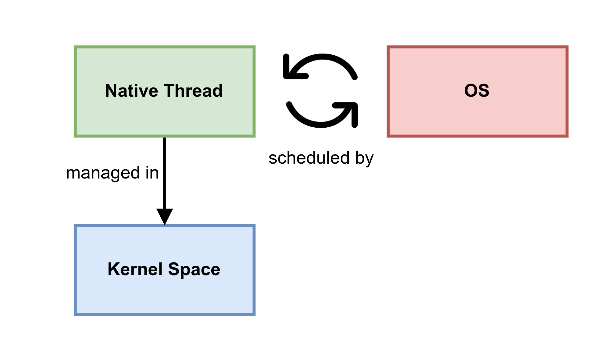
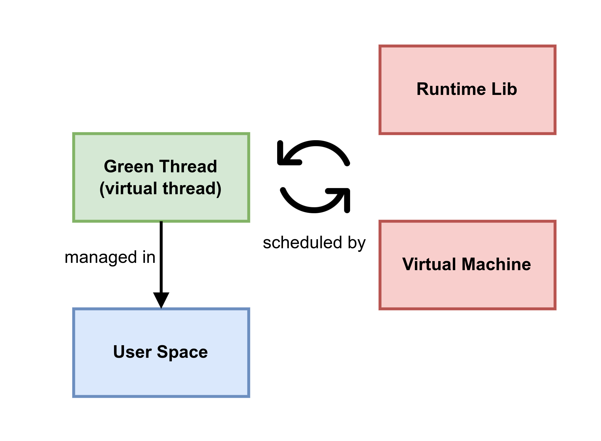

# Cpu, process and threads 

In computer programming, a green thread (virtual thread) is a thread that is scheduled by a runtime library or virtual machine (VM) instead of natively by the underlying operating system (OS). Green threads emulate multithreaded environments without relying on any native OS abilities, and they are managed in user space instead of kernel space, enabling them to work in environments that do not have native thread support.

    

    

## Hyper-threading