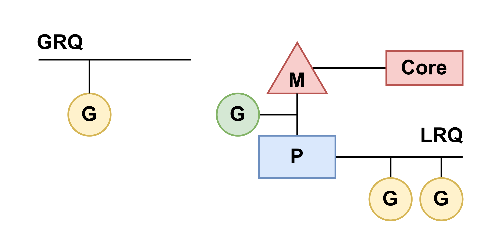

# Scheduling in Go

https://www.ardanlabs.com/blog/2018/08/scheduling-in-go-part1.html
https://golangbyexample.com/goroutines-golang/
https://go.dev/blog/waza-talk

## Part 1 - OS Scheduler

### Introduction

The design and behavior of the Go scheduler allows your multithreaded Go programs to be more efficient and performant. It's important to have a general and representative understanding of how both the OS and Go schedulers work to design our multithreaded software correctly.

### OS scheduler

Operating system schedulers are complex pieces of software. You program is just a series of machine instructions that need to be executed one after the other sequentially. To make that happen, the os uses the concept of Thread. It's the job of the Thread to account for and sequentially execute the set of instruction it's assigned. Execution continues until there are no more instructions for the Thread to execute.

The OS scheduler is responsible for making sure cores are not idle if there are Threads that can be executing. It must also create the illusion that all the Threads that can executing at the same time. In the process of creating this illusion, the scheduler needs to run Threads with a higher priority over lower priority Threads. However, Threads with a lower priority can't be starved of execution time. The scheduler also needs to minimize scheduling latencies as much as possible by making quick and smart decisions.

### Executing Instructions

The program counter (PC) which is sometimes called the instruction pointer (IP), is what allows the Thread to keep track of the next instruction to execute. In most processors, the PC points to the next instruction and not the current instruction.

The computer keeps track of the next line be executed by keeping its address in a special register called the Instruction Pointer (IP) or Program Counter.

The contents of this register is updated with every instrucion executed

Thus a program is executed sequentially line by line

### Thread States

A Thread can be in one of three states: Waiting, Runnable or Executing

### Types of Work

There are two types of work a Thread can do. The first is called CPU-Bound and the second is called IO-Bound.

**CPU-Bound:** This is work that never creates a situation where the Thread may be placed in Waiting states. This is work that is constantly making caculations.

**IO-Bound:** This is work that causes Threads to enter into Waiting states. This is work that consists in requesting access to a resource over the network or making system calls into the operation system. A Thread that needs to access a database would be IO-bound. I would include synchronization events (mutexes, atomic), that cause the Thread to wait as part of this category.

### Context Switching

If you are running on Linux, Mac or Windows, you are running on an OS that has a preemptive scheduler. This means a few important things.

First, it means the scheduler is unpredictable when it comes to what Threads will be chosen to run at any given time. Thread priorities together with events make it impossible to determine what the scheduler will choose to do and when. 

Second, it means you must never write code based on some perceived behavior that you have been luchky to experience but is not guaranteed to take place every time. It is easy to allow yourself to think, because i've seen this happen the same way 1000 times, this is guaranteed behavior. You must control the synchronization and orchestration of Threads if you need determinism in your application.

The physical act of swapping Threads on a core is called a context switching. A context switching happens when the scheduler pulls an Executing thread off a core and replaces it with a Runnable Thread. The Thread that was selected from the run queue moves into an Executing state. The Thread that was pulled can move back into a Runnable state (if it still has the ability to run), or into a Waiting state(if was replaced because of an IO-bound type of request).

Context switches are considered to be expensive because it takes times to swap Threads on and off a core. The amount of latency incurrent during a context switch depends on different factors but it's not unreasonable for it to take between 1000 and 1500 nanoseconds. Considering the hardware should be able to reasonably execute (on average) 12 instructions per nanosecond per core, a context switch can const you 12K to 18K instructions of latency. In essence, you program is losing the ability to execute a large number of instructions during a context switching.

If you have a program that is focused on IO-Bound work, then the context switches are going to be an advantages. Once a Thread moves into a Waiting state, another Thread in a Runnable state is there to take its place. This allows the core to always be doing work. This is one of the most important aspects of scheduling. **Don't allow a core to go idle if there is work(Threads in a Runnable state) to be done**

If you program is focused on CPU-Bound work, then context switches are going to be a performance nightmare. Since the Thread always has work to do, the context-switch is stopping that work from progressing. This situation is in stark contrast with what happens with an IO-Bound workload.

### Less is More

### Find the balance

### Cache lines

### Scheduling decision scenario

### Conclusion

The first part of the post provides insights into what you have to consider regarding Threads and the OS scheduler when writing multithreaded applications. These are the things the Go scheduler takes into consideration as well.

## Part 2 - Go Scheduler

### Your Program Starts 

When your Go program starts up, it's given a Logical Processor (P) for every virtual core that is identified on the host machine. If you have a processor with multiple hardware threads per physical core (Hyper-Threading), each hardware thread will be presented to your Go program as a virtual core.

```go
func main() {
    // NumCPU returns the number of logical 
    // CPUs usable by the current process
    // this mean that a Go program I run on my machine will be given runtime.NumCPU() P's
    fmt.Println(runtime.NumCPU())
}
```
Every P is assigned an OS Thread ("M"). The 'M' stands for machine. This Thread is still managed by the OS and the OS is still responsible for placing the Thread on a Core for execution. This means when I run a Go program on my machine, I have runtime.NumCPU() threads available to execute my work, each individually attached to a P.

Every Go program is also given an initial Goroutine ("G"), which is the path of execution for a Go program. A Goroutine is essentially a Coroutine but this is Go, so we replace the letter "C" with a "G" and we get the world Goroutine. You can think of Goroutines as application-level threads and they are similar to OS Threads in many ways. Just as OS Threads are context-switched on and off a core, Goroutines are context-switched on and off an M.

There are two different run queues in the Go scheduler: the Global Run Queue (GRQ) and the Local Run Queue (LRQ). Each P is given a LRQ that manages the Goroutines assigned to be executed within the context of a P. These Goroutines take turns being context-switched on and off the M assigned to that P. The GRQ is for Goroutines that have not been assigned to a P yet. There is a process to move Goroutines from GRQ to a LRQ that we wil discuss later.

<p align="center">
    
</p>

### Cooperating Scheduler

The OS scheduler is a preemptive scheduler. Essentially, that means you can't predict what the scheduler is going to do at any given time. The kernel is making decisions and everything is non-deterministic. Applications that run on top of the OS have no control over what is happening inside the kernel with scheduling unless they leverage synchronization primitives like atomic instructions and mutex calls.

The Go scheduler is part of the Go runtime, and the Go runtime is built into your application. This means the Go scheduler runs in user space, above the kernel. The current implementation of the Go scheduler is not a preemptive scheduler but a cooperating scheduler. Being a cooperating scheduler means the scheduler nees well-defined user space events that happen at safe points in the code to make scheduling decisions.

### Goroutine States

Goroutines have three high-level states: Waiting, Runnable or Executing

**Waiting:** This means the Goroutine is stopped and waiting for something in order to continue (system calls, synchronization calls).

**Runnable:** The Goroutine wants time on an M so it can execute its assigned instructions. If you have a lot of Goroutines that want time, then Goroutines have to wait longer to get time. Also, the individual amount of time any given Goroutine gets is shortened as more Goroutines compete for time. This type of scheduling latency can also be a cause of bad performance.

**Executing:** This means the Goroutine has been placed on an M and is executing its instructions. The work realted to the application is getting done.

### Context switching

The Go scheduler requires well-defined user-space events that occur at safe points in the code to context-switch from.

There are four classes of events that occur in your Go program that allow the scheduler to make scheduling decisions. This doesn't mean it will always happen on one of these events. It means the scheduler gets the opportunity.

- The use of the keyword go
- Garbage collection
- System calls
- Synchronization and Orchestration

**The use of the keyword go**

The keyword go is how you create Goroutines. Once a new Goroutine is created, it gives the scheduler an opportunity to make a scheduling decision.

**Garbage collection**

Since GC runs using its own set of Goroutines, those Goroutines need time on an M to run. This causes the GC to create a lot of scheduling chaos. However, the scheduler is very smart about what a Goroutine is doing and it will leverage that intelligence to make smart decisions. One smart decision is context-switching a Goroutine wants to touch the heap with those that don't touch the heap during GC. When GC is running, a lot of scheduling decisions are being made.

**System calls**

If a Goroutine makes a system call that will cause the Goroutine to block the M, sometimes the scheduler is capable of context-switching the Goroutine off the M and context-switch a new Goroutine onto that same M. However, sometimes a new M is required to keep executing Goroutines that are queued up in th P.

**Synchronization and Orchestration**

If an atomic, mutex or channel operation call will cause the Goroutine to block, the scheduler can context-switch a new Goroutine to run. Once the Goroutine can run again, it can be re-queued and eventually context-switched back on an M.

### Asynchronous System calls

When the OS you are running on has the ability to handle a system call asynchronously, something called the network poller can be used to process the system call more efficiently. This is accomplished by using kqueue (MacOS), epoll (Linux) or iocp (Windows) within these respective OS's.

Networking-based system calls can be processed asynchronously, something called the network poller can be used to process the system call more efficiently. This is accomplished by using kqueue (MacOS), epoll (Linux) or iocp (Windows) within these respective OS's.

Networking-based system calls can be processed asynchronously by many of the OSs we use today. This is where the network poller gets its name, since its primary use is handling networking operations. By using the network poller for networking system calls, the scheduler can prevent Goroutines from blocking the M when those system calls are made. This helps to keep the M available to execute other Goroutines in the P's LRQ without the need to create new Ms. This helps to reduce scheduling load on the OS.

### Synchronous System calls

What happens when the Goroutine wants to make a system call that can't be done asynchronously? In this case, the network poller can't be used and the Goroutine making the system call is going to block the M. This is unfortunate but there's no way to prevent this from happening. One example of a system call that can't be made asynchronously is file-based system calls. If you are using CGO, there may be other situations where calling C function will block the M as well.

**Note: The Windows OS does have capability of making file-based system calls asynchronously. Technically when running on Windows, the network poller can be used**

### Work Stealing

Another aspect of the scheduler is that it's work-stealing scheduler. This helps in a few areas to keep scheduling efficient. For one, the last thing you want is an M to move into a waiting state because, once that happens, the OS will context-switch the M off the Core. This means the P can't get any work done, even if there is a Goroutine in a runnable state, until an M is context-switched back on a Core. The work stealing also helps to balance the Goroutines across all the P's so the work is better distributed and getting done more efficiently.

The rules for stealing work are as follows

```go
runtime.schedule() {
    // only 1/61 of the time, check the global runnable queue for a G
    // if not found, check the local queue
    // if not found
    //      try to steal from other Ps
    //      if not, check the global runnable queue
    //      if not found, poll network
}
```

## Part 3 - Concurrency

### Introduction

If it's a new problem. Look for a sequential solution first and make sure that it's working. Then after readability and technical reviews, I will begin to ask the question if concurrency is resonable and practical. Sometimes it's obvious that concurrency is a good fit and other times it's not so clear.

Bring the mechanics and semantics of the OS and Go schedulers together to provide a deeper understanding on what concurrency is and isn't

The goals of this port are:

- Provide guidance on the semantics you must consider to determine if a workload is suitable for using concurrency.
- Show you how different type of workloads change semantics and therefore the engineering decisions you will want to make.

### What is Concurrency

Concurrency is not the same as parallelism. Parallelism means executing two or more instructions at the same time. This is different concept from concurrency. Parallelism is only possible when you have at least 2 operating system (OS) and hardware threads available to you and you have at least 2 Goroutines, each executing instructions independently on each OS/hardware thread.

Here's the rub, sometimes leveraging concurrency without parallelism can actually slow down your throughput. What's also interesting is, sometimes leveraging concurrency with parallelism doesn't give you a bigger performance gain than you might otherwise think  you can achive.

### Workload

How do you know when out of order execution may be possible or make sense? Understanding the type of workload  your problem is handling is a great place to start. There are two types of workloads that are important to understand when thinking about concurrency.

- CPU-Bound: This is a workload that never creates a situation where Goroutines naturally move in and out of waiting states. This is work that is constantly making caculations.
- IO-Bound: This is a workload that causes Goroutines to naturally enter into waiting states. This is work that consists in requesting access to a resource over the network, or making system calls into the os, or waiting for an event to occur. A Goroutine that needs to read a file would be IO-Bound. I would include synchronization events (mutexes, atomic), that cause the Goroutine to wait as part of this category.

With CPU-Bound workloads you need parallelism to leverage concurrency. A single OS/hardware thread handling multiple Goroutines is not efficient since the Goroutines are not moving in and out of waiting states as part of their workload. Having more Goroutines than there are OS/hardware threads can slow down workload execution because of the latency cost (time it takes) of moving Goroutines on and off the OS thread. The context switch is creating a "Stop The World" event for your workload since none of your workload is being executed during the switch when it otherwise could be.

With IO-Bould workloads you don't need parallelism to use concurrency. A single OS/hardware thread can handle multiple Goroutines with efficiency since the Goroutines are naturally moving in and out of waiting states as part of their workload. Having more Goroutines than there are OS/hardware threads can speed up workload execution because the latency cost of moving Goroutines on and off the OS thread is not creating a "Stop The World" event. Your workload is naturally stopped and this allows a different Goroutine to leverage the same OS/hardware thread efficiently instead of letting the OS/hardware thread sit idle.