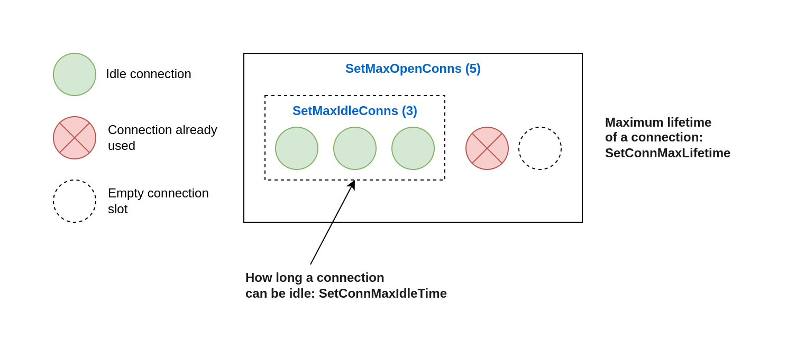

# 10. The standard library

## 75. Providing a wrong time duration

The standard library provides common functions and methods that accept a time.Duration. However, because time.Duration is an alias for the int64 type, newcommers to the language can get confused and provide a wrong duration.

```go
func main() {
	ticker := time.NewTicker(1000)
	for {
		select {
		case <-ticker.C:
			fmt.Println("Do something")
		}
	}
}
```

If we run this code, we notice that ticks aren't delivered every second; they are delivered every microsecond.

Because time.Duration is based on the int64 type, the previous code is correct since 1000 is a valid int64. But time.Duration represents the elapsed time between two instants in nanoseconds. Therefore, we provided NewTicker with a duration of 1000 nanoseconds = 1 microsecond.

This mistake happens frequently. Indeed, standard libraries in languages such as Java and Javascript sometimes ask developers to provide durations in milliseconds.

Futhermore, if we want to purposely create a time.Ticker with an interval of 1 microsecond, we shouldn't pass an int64 directly. We should instead always use the time.Duration API to avoid possible confusion:

```go
func main() {
	ticker := time.NewTicker(1000 * time.Millisecond)
	for {
		select {
		case <-ticker.C:
			fmt.Println("Do something")
		}
	}
}
```

This is not the most complex mistake in this book, but developers with a background in other languages can easily fall into the trap of believing that milliseconds are expected for the functions and methods in the time package. We must remember to use the time.Duration API and provide an int64 alongside a time unit.

## 76. time.After and memory leaks

time.After(time.Duration) is a convenient function that returns a channel and waits for a provided duration to elapse before sending a message to this channel. Usually, it's used in concurrent code; otherwise, if we want to sleep for a given duration, we can use time.Sleep(time.Duration). The advantage of time.After is that it can be used to implement scenarios such as "If i don't receive any message in this channel for 5 seconds, it will... " But codebases ofter include calls to time.After in a loop, which, as we describe in this section, may be a root cause of memory leaks.

Let's consider the following example. We will implement a function that repeatedly consumes messages from a channel. We also want to log a warning if we haven't received any messages for more than 1 hour. Here is a possible implementation:

```go
func consumer(ch <-chan Event) {
	for {
		select {
		case event := <-ch:
			fmt.Println("recv event: ", event)
		case <-time.After(time.Hour):
			fmt.Println("warning: no message received")
			return
		}
	}
}
```
Here, we use select in two cases: receiving a message from ch and after 1 hour without messages (time.After is evaluated during each iteration). At first sight, this code looks OK. However, it may lead to memory usage issues.

```go
func main() {
	ch := make(chan Event)
	go func() {
		for i := 0; ; i++ {
			ch <- Event{}
		}
	}()
	consumer(ch)
}

type Event struct{}

func consumer(ch <-chan Event) {
	for {
		printAlloc()
		select {
		case event := <-ch:
			fmt.Println("recv event: ", event)
		case <-time.After(time.Hour):
			fmt.Println("warning: no message received")
			return
		}
	}
}

func printAlloc() {
	var m runtime.MemStats
	runtime.ReadMemStats(&m)
	fmt.Printf("Alloc = %v MiB", bToMb(m.Alloc))
	fmt.Printf("\tTotalAlloc = %v MiB\n", bToMb(m.TotalAlloc))

}
func bToMb(b uint64) uint64 {
	return b / 1024 / 1024
}
```
If we run this program, we see that Alloc always incre. After a few minutes, Alloc memory will reach to GB. Application will OOM

```go
func consumer(ch <-chan Event) {
	for {
		printAlloc()
		select {
		case event := <-ch:
			fmt.Println("recv event: ", event)
		// case <-time.After(time.Hour):
		// 	fmt.Println("warning: no message received")
		// 	return
		}
	}
}
```
We comment <-time.After case, Alloc will be ~ 0 MiB. Why this happens? 

As we said, time.After returns a channel. We may expect this channel to be closed during each loop iteration, but this isn't the case. The resources created by time.After (including the channel) are released once the timeout expires and use memory until that happens. In Go 1.15, about 200 bytes of memory are used per call to time.After. If we receive a significant volume of messages, such as 5 million per hour, our application will consume 1 GB of memory to store the time.After resources.

Can we fix this issue by closing the channel programmatically during each iteration? No. The returned channel is a <- chan time.Time, meaning it is a receive-only channel that can't be closed.

We have several options to fix our example. The first is to use a context instead of time.After: 

```go
func consumer(ch <-chan Event) {
	for {
		printAlloc()

		ctx, cancel := context.WithTimeout(context.Background(), time.Hour)
		select {
		case event := <-ch:
			cancel()
			fmt.Println("recv event: ", event)
		case <-ctx.Done():
			cancel()
			fmt.Println("warning: no message received")
			return
		}
	}
}
```

The downside of this approach is that we have to re-create a context during every single loop iteration. Creating a context isn't the most lightweight operation in Go: for example, it requires creating a channel. Can we do better?

The second option comes from the time package:

time.NewTimer. This function creates a time.Timer struct that exports the following:

```go
type Timer struct {
    // which is the internal timer channel
	C            <-chan time.Time
	r runtimeTimer
}

// Method to reset the duration
func (Timer) Reset(d time.Duration) {} 

// Method to stop timer
func(Timer) Stop() {}
```

We should note that time.After also relies on time.Timer. However, it only returns the c field, so we don't have access to the Reset method:

```go
package time

func After(d Duration) <- chan Time {
    return NewTimer(d).C
}
```

```go
func main() {
	ch := make(chan Event)
	go func() {
		for i := 0; ; i++ {
			ch <- Event{}
		}
	}()
	consumer(ch)
}

type Event struct{}

func consumer(ch <-chan Event) {
	for {
		timerDuration := time.Hour
		timer := time.NewTimer(timerDuration)

		for {
			printAlloc()
			timer.Reset(timerDuration)
			select {
			case event := <-ch:
				fmt.Println("recv event: ", event)
			case <-timer.C:
				fmt.Println("warning: no message received")
				return
			}
		}
	}
}

func printAlloc() {
	var m runtime.MemStats
	runtime.ReadMemStats(&m)
	fmt.Printf("Alloc = %v MiB", bToMb(m.Alloc))
	fmt.Printf("\tTotalAlloc = %v MiB\n", bToMb(m.TotalAlloc))

}
func bToMb(b uint64) uint64 {
	return b / 1024 / 1024
}
```

In this implementation, we keep a recurring action during each loop iteration: calling the Reset method. However, calling Reset is less cumbersome than having to create a new context every time. It's faster and puts less pressure on the garbage collector because it doesn't require any new heap allocation. Therefore, using time.Timer is the best possible solution for our initial problem.

Using time.After is a loop isn't the only case that may lead to a peak in memory consumption. The problem relates to code that is repeatedly called. A loop is one case, but using time.After in an HTTP handler function can lead to the same issues because the function will be called multiple times.

In general, we should be cautions when using time.After. Remember that the resources created will only be released when the timer expires. When the call to time.After is repeated (for example, in a loop, a Kafka consumer function or an HTTP handler), it may lead to a peak in memory consumption.

## 77. Common JSON handling mistakes

### Unexpected behavior due to type embedding

Let's discuss another potential impact of type embedding that can lead to unexpected marshaling/unmarshaling results.

```go
type Event struct {
    ID int
    time.Time
}
```
Because time.Time is embedded, in the same way we described previously, we can access the time.Time methods directly at the Event level: for example, event .Second(). What are the possible impacts of embedded fields with JSON marshaling? Let's find out in the following example. 

```go
type Event struct {
	ID int
	time.Time
}

func main() {
	e := Event{
		ID:   1234,
		Time: time.Now(),
	}
	data, _ := json.Marshal(e)
	fmt.Println(string(data))
}
```

Output missing ID field. How can we explain this output? What happened to the ID field and the 1234 value? Because this field is exported, it should have been marshaled. To understand this problem, we have to highlight two points.

If an embedded field type implements an interface, the struct containing the embedded field will also implement this interface. Second, we can change the default marshaling behavior by marking a type implement the json.Marshaler interface. This interface contains a single MarshalJSON function:

```go
type Marshaler interface {
    MarshalJSON() ([]byte, error)
}
```

Here is an example with custom marshaling:

```go
type foo struct{}

func (foo) MarshalJSON() ([]byte, error) {
	return []byte(`"foo"`), nil
}

func main() {
	b, err := json.Marshal(foo{})
	if err != nil {
		panic(err)
	}
	fmt.Println(string(b))
}
```

Having clarified these two points, let's get back to the initial problem with the Event struct:

```go
type Event struct {
    ID int
    time.Time
}
```

We have to know that time.Time implements the json.Marshaler interface. Because time.Time is an embedded field of Event, the compiler promotes its methods. Therefore, Event also implements json.Marshaler.

Consequently, passing an Event to json.Marshal uses the marshaling behavior provided by time.Time instead of the default behavior. This is why marshaling an Event leads to ignoring the ID field.

To fix this issue, there are two main possibles. First, we can add a name so the time.Time field is no longer embedded:

```go
type Event struct {
    ID int
    Time time.Time
}
```

If we want to keep the time.Time field embedded, the other option is to make Event implement the json.Marshaler interface:

```go
func (e Event) MarshalJSON() ([]byte, error) {
    return json.Marshal(
        struct {
            ID int
            Time time.Time
        }{
            ID: e.ID,
            Time: e.Time,
        },
    )
}
```
We should be careful with embedded fields. While promoting the fields can convenient, it can also lead to subtle bugs because it can make the parent struct implement interfaces without a clear signal. Again, when using embedded fields, we should clearly understand the possible side effects.

When an built-in function receive an any argument. You need to check how to use this argument. json.MarshalJSON(v any) implement

```go
if t.Kind() != reflect.Pointer && allowAddr && reflect.PointerTo(t).Implements(marshalerType) {
    return newCondAddrEncoder(addrMarshalerEncoder, newTypeEncoder(t, false))
}
if t.Implements(marshalerType) {
    return marshalerEncoder
}
if t.Kind() != reflect.Pointer && allowAddr && reflect.PointerTo(t).Implements(textMarshalerType) {
    return newCondAddrEncoder(addrTextMarshalerEncoder, newTypeEncoder(t, false))
}
if t.Implements(textMarshalerType) {
    return textMarshalerEncoder
}
```

### JSON and the monotonic clock

An OS handles two different clock types: wall and manotonic.

```go
type Event struct {
	Time time.Time
}

func main() {
	t := time.Now()
	event1 := Event{
		Time: t,
	}
	b, err := json.Marshal(event1)
	if err != nil {
		log.Fatal(err)
	}
	var event2 Event
	err = json.Unmarshal(b, &event2)
	if err != nil {
		log.Fatal(err)
	}
	fmt.Println(event1, event2)

	fmt.Println(event1 == event2)
}
```

We instantiate an Event, marshal it into JSON, and unmarshal it into another struct. Then we compare both structs. Let's find out if the marshaling/unmarshaling process is always symmetric.

In Go, instead of splitting the two clocks into two different APIs, time.Time may contain both a wall clock and a monotonic time. When we get the local time using time.Now(), it returns a time.Time with both times.

```txt
2023-10-25 19:49:39.087777417 +0700 +07 m=+0.000022506
--------------------------------------- --------------
Wall time                               Monotonic time
```

Conversely, when we unmarshal the JSON, the time.Time field doesn't contain the monotonic time - only the wall time. Therefore, when we compare the structs, the result is false because of a monotonic time difference.

When we use the == operator to compare both time.Time fields, it compares all the struct fields, including the monotonic part. To avoid this, we can use the Equal method instead: 

```go
fmt.Println(event1.Time.Equal(event2.Time))
```

The Equal method doesn't consider monotonic time; therefore, this code prints true. But in this case, we only compare the time.Time fields, not the parent Event structs. 

In summary, the marshaling/unmarshaling process isn't always symmetric, and we faced this case with a struct containing a time.Time. We should keep this principle in mind so we don't, for example, write erroneous tests.

### Map of any

When unmarshaling data, we can provide a map instead of a struct. The rationale is that when the keys and values are uncertain, passing a map gives us some flexibility instead of a static struct. However, there's a rule to bear in mind to avoid wrong assumptions and possible goroutine panics.

Let's write an example that unmarshals a message into a map:

```go
func main() {
	p := Person{
		Name: "test",
		Age:  18,
	}

	var m map[string]any
	data, _ := json.Marshal(p)
	err := json.Unmarshal(data, &m)
	fmt.Println(m, err)
}
// map[Age:18 Name:test] <nil>
```

However, there's an important gotcha to remember if we use a map of any: any numeric value, regardless of whether it contains a decimal, is converted into a float64 type. We can observe this by printing the type of m["Age"]:

```go
fmt.Printf("%T\n", m["Age"]) // float64
```

We should be sure we don't make the wrong assumption and expect numeric values without decimals to be converted into integers by default. Making incorrect assumptions with type conversions could lead to goroutine panics.

## 78. Common SQL mistakes

The database/sql package provides a generic interface around SQL (or SQL-like) databases. It's also fairly common to see some patterns or mistakes while using this package.

### Forgetting that sql.Open doesn't necessarily establish connections to a database

When using sql.Open, one common misconception is expecting this function to establish connections to a database:

```go
db, err := sql.Open("mysql", dsn)
if err != nil {
    return err
}
```

Open may just validate its arguments without creating a connection to the database.

Actually, the behavior depends on the SQL driver used. For some drivers, sql.Open doesn't establish a connection: it's only preparation for later use (for example, with db.Query). Therefore, the first connection to the database may be establish lazily.

Why do we need to know about this behavior? For example, in some cases, we want to make a service ready only after we know that all the dependencies are correctly setup and reachable. If we don't know this, the service may accept traffic despite erroneous configuration.

If we want to ensure that the function that uses sql.Open also guarantees that the underlying database is reachable, we should use the Ping method:

```go
db, err := sql.Open("mysql", dsn)
if err != nil {
    return err
}

if err := db.Ping(); err != nil {
    return err
}
```

Ping forces the code to establish a connection that ensures that the data source name is valid and the database is reachable. Note that an alternative Ping is PingContext, which asks for an additional context conveying when the ping should be canceled or time out.

### Forgetting about connections pooling

Just as default HTTP client and server provide default behaviors that may not be effective in production. It's essential to understand how database connections are handled in Go. sql.Open returns an *sql.DB struct. This struct doesn't represent a single database connection; instead, it represents a pool of connections. This is worth noting so we're not tempted to implement it manually. A connection in the pool can have two states:

- Already used (for example, by another goroutine that triggers a query)
- Idle (already created but not in use for the time being)

It's also important to remember that remember that creating a pool leads to four available config parameters that we may want to override. Each of these parameters is an exported method of *sql.DB

- SetMaxOpenConns - Maximum number of open connections to the database (default value: unlimited)
- SetMaxIdleConns - Maximum number of idle connections (default value: 2)
- SetConnMaxIdleTime - Maximum amount of time a connection can be idle before it's closed
- SetConnMaxLifetime - Maximum amount of time a connection can be held open before it's closed (default value: unlimited)



With a maximum of five connections. It has four ongoing connections: three idle and one in use. Therefore, one slot remains available for an extra connection. If a new query comes in, it will pick one of the idle connections (if still available). If there are no more idle connections, the pool will create a new connection if an extra slot is available; otherwise, it will wait until a connection is available.

So, why should we tweak these config parameters?

- Setting SetMaxOpenConns is important for production-grade applications. Because the default value is unlimited, we should set it to make sure it fits what the underlying database can handle.
- The value of SetMaxIdleConns default 2 should be increased if our application generates a significant number of concurrent requests. Otherwise, the application may experience frequent reconnects. 
- Setting SetConnMaxIdleTime is important if our application may face a burst of requests. When the application returns to a more peaceful state, we want to make sure the connections created are eventually released.
- Setting SetMaxLifetime can be helpful if, for example, we connect to a load-balanced database server. In that case, we want to ensure that our application never uses a connection for too long.

For production-grade applications, we must consider these four parameters. We can also use multiple connection pools if an application faces different use cases.

### Not using prepared statements

A prepared statement is a feature implemented by many SQL databases to execute a repeated SQL statement. Internally, the SQL statement is precompiled and separated from the data provided. There are two main benefits:

- Efficiency - The statement doesn't have to be recompiled (compilation means parsing + optimization + translation).
- Security - This approach reduces the risks of SQL injection attacks.

Therefore, if statement is repeated, we should use prepared statements. We should also use prepared statements in untrusted contexts (such as exposing an endpoint on the internet, where the request is mapped to an SQL statement).

To use prepared statements, instead of calling the Query method of *sql.DB, we call Prepare:

```go
stmt, err := db.Prepare("SELECT * FROM ORDER WHERE ID = ?")
if err != nil {
    return err
}

rows, err := stmt.Query(id)
```

We prepare the statement and then execute it while providing the arguments. The first output of the Prepare method is *sql.Stmt, which can be reused and run concurrently. When the statement is no longer needed, it must be closed using the Close() method.

For efficiency and security, we need to remember to use prepared statements when it makes sense.

### Mishandling null values

```go
rows, err := db.Query("SELECT DEP, AGE FROM EMP WHERE ID = ?", id)
if err != nil {
    return err
}
// Defer closing rows

var (
    department string
    age int
)

for rows.Next() {
    err := rows.Scan(&department, &age)
    if err != nil {
        return err
    }
}
```

But what happen when column is NULL value.

If a column can be nullable, there are two options to prevent Scan from returning an error.

The first approach is to declare department as a string pointer:

```go
var (
    department *string
    age int
)

for rows.Next() {
    err := rows.Scan(&department, &age)
}
```

We provide scan with the address of a pointer, not the address of a string type directly. By doing so, if the value is NULL, department will be nil.

The other approach is to use one of the sql.NullXXX types, such as sql.NullString:

```go
var (
    department sql.NullString
    age int
)

for rows.Next() {
    err := rows.Scan(&department, &age)
}
```

sql.NullString is a wrapper on top of a string. It contains two exported fields: String contains the string value, and Valid conveys whether the string isn't NULL.

There's no effective difference. We thought people might want to use NullString because it is so common and perhaps expresses the intent more clearly than *string. But either will work.

```go
rows, _ := db.Query("SELECT name, address FROM persons WHERE id = 4000001")
defer rows.Close()
for rows.Next() {
    var name, address sql.NullString
    err := rows.Scan(&name, &address)
    if err != nil {
        log.Println(err)
    }
    log.Println(name, address)
}
```

### Not handling row iteration errors

Another common mistake is to miss possible errors from iterating over rows. Let's look at a function where error handling is misused:

```go
func get(ctx context.Context, db *sql.DB, id string) (string, int, error) {
    rows, err := db.QueryContext(ctx, "SELECT DEP, AGE FROM EMP WHERE ID = ?", id)
    if err != nil {
        return "", 0, err 
    }
    defer func() {
       if err := rows.Close(); err != nil {
            log.Printf("failed to close rows: %v\n", err)
        }
    }()

    var (
        department string
        age int
    )
    for rows.Next() {
        err := rows.Scan(&department, &age)
        if err != nil {
            return "", 0, err
        }
    }

    return department, age
}
```

In this function, we handle three errors: while executing the query, closing the rows, and scanning a row. But this isn't enough. We have to know that the for rows .Next() {} loop can break either when there are no more rows or when an error happens while preparing the next row. We should call rows.Err to distinguish between the two cases:

```go
for rows.Next() {
}

if err := rows.Err(); err != nil {
    return "", 0, err
}

return department, age, nil
```

This is the best practice to keep in mind: because rows.Next can stop either when we have iterated over all the rows or when an error happens while preparing the next row, we should check rows.Err following the iteration.

## 79. Not closing transient resources

Pretty frequently, developers work with transient (temporary) resources that must be closed at some point in the code: for example, to avoid leaks on disk or in memory. Structs can be generally implement the io.Closer interface to convey that a transient resource has to be closed. Let's look at three common examples of what happens when resources aren't correct closed and how to handle them properly.  

### HTTP body

First, let's discuss this problem in the context of HTTP. We will write a getBody method that makes an HTTP GET request and returns the HTTP body response.

```go
type handler struct {
    client http.Client
    url string
}

func (h handler) getBody() (string, error) {
    resp, err := h.client.Get(h.url)
    if err != nil {
        return "", err
    }

    body, err := io.ReadAll(resp.Body)
    if err != nil {
        return "", err
    }
    return string(body), nil
}
```

We use http.Get and parse the response using io.ReadAll. This method looks OK, and it correctly returns the HTTP response body. However, there's a resource leak.

resp is an *http.Response type. It contains a Body io.ReadCloser field (io.ReadCloser implements both io.Reader and io.Closer). This body must be closed if http.Get doesn't return an error; otherwise, it's a resource leak. In this case, our application will keep some memory allocated that is no longer needed but can't be reclaimed by the GC and may prevent clients from reusing the TCP connection in the worst cases.

The most convenient way to deal with body closure is to handle it as a defer statement this way:

```go
defer func() {
    err := resp.Body.Close()
    if err != nil {
        log.Printf("failed to close response: %v\n", err)
    }
}()
```

**NOTE** On the server side, while implementing on HTTP handler, we aren't required to close the request body because the server does this automatically.

We should also understand that a response body must be closed regardless of whether we read it. For example, if we are only interested in the HTTP status code adn not in the body, it has to be closed no matter what, to avoid a leak:

```go
func (h handler) getStatusCode(body io.Reader) (int, error) {
    resp, err := h.client.Post(h.url, "application/json", body)
    if err != nil {
        return 0, err
    }

    defer func() {
        err := resp.Body.Close()
        if err != nil {
            log.Printf("failed to close response: %v\n", err)
        }
    }()
}
```

Another essential thing to remember is that the behavior is different when we close the body, depending on whether we have read from it:

- If we close the body without a read, the default HTTP transport may close the connection (close in case have content, not close in case no-content).
- If we close the body following a read, the default HTTP transport won't close the connection; hence, it may be reused (can't verify this, i think in this case is the same) 

Therefore, if getStatusCode is called repeatedly and we want to use keep-alive connections, we should read the body even though we aren't interesting in it, or server side most return 204 (no-content):

```go
func (h handler) getStatusCode(body io.Reader) (int, error) {
    resp, err := h.client.Post(h.url, "application/json", body)
    if err != nil {
        return 0, err
    }
    
    // Close response body
    _, _ = io.Copy(io.Discard, resp.Body)

    return resp.StatusCode, nil
}
```

In this example, we read the body to keep the connection alive. Note that instead of using io.ReadAll implementation. This code read the body but discards it without any copy, making it more efficient than io.ReadAll.

**When to close the response body**

We should stick with the initial solution that closes the body in a defer function only if there is no error when call http.GET, POST...

### sql.Rows

sql.Rows is a struct used as a result of an SQL query. Because this struct implements io.Closer, it has to be closed.

```go
db, err := sql.Open("postgres", dataSourceName)
if err != nil {
    return err
}

rows, err := db.Query("SELECT * FROM customers")
if err != nil {
    return err
}

// Use rows

return nil
```

Forgetting to close the rows means a connection leak, which prevents the database connection from being put back into the connection pool.

We can handle the closure as a defer function following the if err != nil block:

```go
rows, err := db.Query("SELECT * FROM customers")
if err != nil {
    return err
}

defer func(){
    if err := rows.Close(); err != nil {
        log.Printf("failed to close rows: %v\n", err)
    }
}()
```

Following the Query call, we should eventually close rows to prevent a connection leak if if doesn't return an error. 

**NOTE** As discussed in the previous section, the db variable (*sql.DB type) represents a pool of connections. It also implements the io.Closer interface. But as the documentation suggests, it is rare to close an sql.DB because it's meant to be long-lived and shared among many goroutines.

### os.File

os.File represents an open file descriptor. Like sql.Rows, it must be closed eventually:

```go
f, err := os.OpenFile(filename, os.O_APPEND | os.O_WRONLY, os.ModeAppend)
if err != nil {
    return err
}

defer func() {
    if err := f.Close(); err != nil {
        log.Printf("failed to close file: %v\n", err)
    }
}()
```

If we don't close an os.File, it will not lead to a leak: the file will be closed automatically when os.File is garbage collected. However, it's better to call Close explicitly because we don't know when the next GC will be triggered (unless we manually run it).  

There's another benefit of calling Close explicitly: to actively monitor the error that is returned. For example, this should be the case with writable files.

Writing to a file descriptor isn't a synchronous operation. For performance concerns, data is buffered. The BSD manual page for close(2) mentions that a closure can lead to an erro in a previously uncommitted write (still living in a buffer) encountered during an I/O error. For that reason, if we want to write to a file, we should propagate any error that occurs while closing the file:

```go
func writeToFile(fileName string, content []byte) (err error) {
    // open file
    defer func() {
        closeErr := f.Close()
        if err == nil {
            err = closeErr
        }
    }()

    _, err = f.Write(content)
    return
}
```

Futhermore, success while closing a writable os.File doesn't guarantee that the file will be written on disk. The write can still alive in a buffer on the filesystem and not be flushed on disk. If durability is a critical factor, we can use the Sync() method to commit a change. In that case, errors comming from Close can be safely ignored:

```go
func writeToFile(filename string, content []byte) error {
    defer f.Close()

    // Sync commits the current contents of the file to stable storage.
    // Typically, this means flushing the file system's in-memory copy
    // of recently written data to disk
    return f.Sync()
}
```

This example is a synchronous write function. It ensures that the content is written to disk before returning. But its downside is an impact on performance.

To summarize this section, we've seen how important it is to close ephemeral resources and thus avoid leaks. Ephemeral resources must be closed at the right time and in specific situations. We should remmeber that if a struct implements the io.Closer interface, we must eventually call the Close method. Last but not least, it's essential to understand what to do if a closure fails: is it enough to log a message, or should we also propagate it?

## 80. Forgetting the return statement after replying to an HTTP request

While writing an HTTP handler, it's easy to forget the return statement after replying to an HTTP request. This may lead to an odd situation where we would have stopped a handler after an error, but we didn't.

```go
func handler(w http.ResponseWriter, req *http.Request) {
    err := foo(req)
    if err != nil {
        http.Error(w, "foo", http.StatusInternalServerError)
    }
}
```

If foo returns an error, we handle it using http.Error, which replies to the request which the foo error message and a 500 Internal Server Error. The problem with this code is that if we enter the if err != nil branch, the application will continue its execution, because http.Error doesn't stop the handler's execution.

In term of execution, the main impact would be to continue the execution of a function that should have been stopped. For example, if foo was returning a pointer in addition to the error, continuing execution would mean using this pointer, perhaps leading to a nil pointer dereference (and hence a goroutine panic).

The fix for this mistake is to keep thinking about adding the return statement following http.Error:

```go
func handler(w http.ResponseWriter, req *http.Request) {
    err := foo(req)
    if err != nil {
        http.Error(w, "foo", http.StatusInternalServerError)
        return
    }
}
```

This error is probably not the most complex of this book. Yet it's so easy to forget about it that this mistake occurs fairly frequently. We always need to remember that http.Error doesn't stop a handler execution and must be added manually. Such an issue can and should be caught during testing if we have decent coverage. 

## 81. Using the default HTTP client and server


