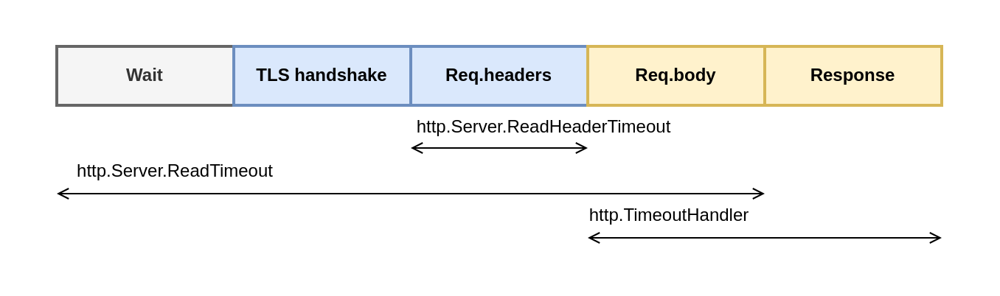

## 81. Using the default HTTP client and server

The http package provides HTTP client and server implementations. However, it's all too easy for developers to make a common mistake: replying on the default implementations in the context of applications that are eventually deployed in production. Let's look at the problems and how to overcome them. 

**HTTP client**

Let's define what default client means. We will use a GET request as an example. We can use the zero value of http.Client struct like so:

```go
client := &http.Client{}
resp, err := client.Get("https://golang.org/")
```

Or we can use the http.Get function:

```go
resp, err := http.Get("https://golang.org")
```

In the end, both approaches are the same. The http.Get function uses http.DefaultClient, which is also based on the zero value of http.Client:

```go
var DefaultClient = &Client{}
```

So, what's the problem using the default HTTP client?

First, the default client doesn't specify any timeouts. This absense of timeout is not something we want for production grade systems: it can lead to many issues, such as never-ending requests that could exhaust system resources.

Before delving into the available timeouts while making a request, let's review the five steps involved in an HTTP request:

1. Dial to establish a TCP connection.
2. TLS handshake (if enable).
3. Send the request.
4. Read the response headers.
5. Read the response body.


The four main timeouts are the following:

- net.Dialer.Timeout - Specifies the maximum amount of time a dial will wait for a connection to complete.
- http.Transport.TLSHandshakeTimeout - Specifies the maximum amount of time to wait for the TLS handshake.
- http.Trasport.ResponseHeaderTimeout - Specifies the amount of time to wait for a server's response headers.
- http.Client.Timeout - Specifies the time limit for a request. It includes all the steps, from step 1 (dial) to step 5 (read the response body).

**HTTP client timeout**

You may have encountered the following error when specifying http.Client.Timeout:

net/http: request canceled (Client.Timeout exceeded while awaiting headers)

This error means the endpoint failed to respond on time. We get this error about headers because reading them is the first step while waiting for a response.

Here's an example of an HTTP client that overrides these timeouts:

```go
httpclient := http.Client{
    Timeout: 5*time.Second,
    Transport: &http.Transport{
        DialContext: func(ctx context.Context, network, addr string) (net.Conn, error) {
            dialer := net.Dialer{
                Timeout: 2 * time.Second, // Dial timeout is set equal to 2*time.Second
            }
            return dialer.Dial(network, addr)
        },
        TLSHandshakeTimeout:   time.Second,
        ResponseHeaderTimeout: time.Millisecond * 500,
    },
    // Timeout: time.Second,
}
```
The second aspect to bear in mind about the default HTTP client is how connections are handled. By default, the HTTP client does connection pooling. The default client reuses connections (it can be disabled by setting http.Transport.DisableKeepAlives to true). There's an extra timeout to specify how long an idle connection kept in the pool: http.Transport.IdleConnTimeout. The default value is 90 seconds, which means the connection can be reused for other requests during this time. After that, if the connection hasn't been reused, it will be closed.

For production-grade systems, we probably want to override the default timeouts. And tweaking the parameters related to connection pooling can also have a significant impact on the latency. 

**HTTP server**

We should also be careful while implementing an HTTP server. Again, a default server can be created using the zero value of http.Server:

```go
server := &http.Server{}
server.Serve(listener)
```

Or we can use a function such as http.Serve, http.ListenAndServe or http.ListenAndServeTLS that also relies on the default http.Server.



- http.Server.ReadHeaderTimeout - A field that specifies the maximum amount of time to read the request headers.
- http.Server.ReadTimeout - A field that specifies the maximum amount of time to read the entire request.
- http.TimeoutHandler - A wrapper function that specifies the maximum amount of time for a handler to complete

**NOTE** We purposely ommited http.Server.WriteTimeout, which isn't necessary since http.TimeoutHandler was released (Go 1.8), http.Server.WriteTimeout has a few issue. First, its behavior depends on whether TLS is enable, making it more complex to understand and use. It also closes the TCP connection without returning a proper HTTP code if the timeout is reached. And it doesn't propagate the cancellation to handler context, so a handler may continue its execution without knowing that the TCP connection is already closed.

While exposing our endpoint to unstrusted clients, the best practice is to set at lest http.Server.ReadHeaderTimeout field and use the http.TimeoutHandler wrapper function. Otherwise, clients may exploit the flaw and, for example, create never-ending connections that can lead to exhaustion of system resources.

```go
httpserver := &http.Server{
  ReadHeaderTimeout: time.Millisecond*500,
  ReadTimeout: time.Second,
  Handler: http.TimeoutHandler(nil, time.Second, "server TimeoutHandler is reached"),
}
```

http.TimeoutHandler wraps the provided handler. Here, if handler fails to respond in 1 second, the server returns a 503 status code.

Just as we described regarding HTTP clients, on the server side we can configure the maximum amount of time for the next request when keep-alives are enable.

```go
s := &http.Server{
    IdleTimeout: time.Second
}
```
Note that if http.Server.IdleTimeout isn't set, the value of http.Server .ReadTimeout is used for the idle timeout. If neither is set, there won't be any timeouts, and connections will remain open until they are closed by clients.

For production-grade applications, we need to make sure not to use default HTTP clients and servers. Otherwise, requests may be stuck forever due to an absence of time - outs or even malicious clients that exploit the fact that our server doesn't have any timeouts.

## Summary
