# Optimizations

Before we begin this chapter, a disclaimer: in most contexts, writing readable, clear code is better than writing code that is optimized but more complex and difficult to understand. Optimization generally comes with a price, and we advocate that you follow this famous quote from software engineer Wes Dyer:

**Make it correct, make it clear, make it concise, make it fast, in that order.**

## 91. Not understanding CPU caches

You don't have to be an engineer to be a racing driver but you do have to have mechnical sympathy

### CPU architecture

Modern CPUs rely on caching to speed up memory access, in most cases via three caching levels: L1, L2 and L3. On the i5-7300, here are the sizes of these caches:

- L1: 64 KB
- L2: 256 KB
- L3: 4 MB

The i5-7300 has two physical cores but four logical cores (also called virtual cores or threads). In the Intel family, dividing a physical core into multiple logical cores is called Hyper-Threading.

Each physical core (core 0 and core 1) is divided into two logical cores (thread 0 and thread 1). The L1 cache is split into two sub-caches: L1D for data and L1L instructions (each 32 KB). Caching isn't solely related to data - when a CPU executes an application, it can also cache some instructions with the same rationale: to speed up overall execution.

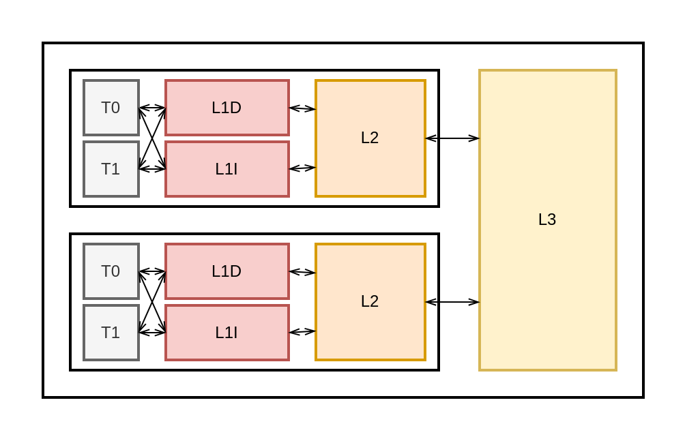

The physical location of the CPU caches can also explain these differences. L1 and L2 are called on-die, meaning they belong to the same piece of silicon as the rest of processor. Conversely, L3 is off-die, which partly explains the latency differences compared to L1 and L2.

For main memory (or RAM), average accesses are between 50 and 100 times slower than L1. We can access up to 100 variables stored on L1 for the price of a single access to the main memory. Therefore, as Go developers, one avenue for improvement is making sure our applications use CPU caches.

#### Cache line

The concept of cache lines is crucial to understand. But before presenting what they are, let's understand why we need them.

When a specific memory location is accessed (for example, by reading a variable), one of the following is likely to happen in the near future:

- The same location will be referenced again.
- Nearby memory locations will be referenced.

The former refers to temporal locality, and the latter referes to spatial locality. Both are part of a principle called locality of reference.

```go
func sum(s []int64) int64 {
	var total int64
	length := len(s)
	for i := 0; i < length; i++ {
		total += s[i]
	}
	return total
}
```

In this example, temporal locality applies to multiple variables: i, length, and total. Spatial locality applies to code instructions and the slice s. Because a slice is backed by an array allocated contiguously in memory, in this case, access a[0] means also accessing s[1], s[2], and so on.

Temporal locality is part of why we need CPU caches: to speed up repeated accesses to the same variables. However, because of spatial locality, the CPU copies what we call a cache line instead of copying a single variable from the main memory to a cache.

A cache line is a contiguously memory segment of a fixed size, usually 64 bytes (8 int64 variables). Whenever a CPU decides to cache a memory block from RAM, it copies the memory block to a cache line. Because memory is a hierarchy, when the CPU wants to access a specific memory location, it first checks in L1, then L2, then L3, and finally, if the location is not in those caches, in the main memory.

Let's illustrate fetching a memory block with a concrete example. We call the sum function with a slice of 16 int64 elements for the first time. When sum accesses s[0], this memory address isn't in the cache yet. If the CPU decides to cache this variable (we also discuss this decision later in the chapter), it copies the whole memory block. 

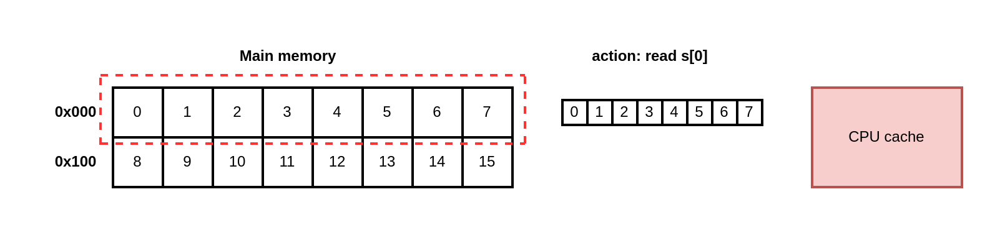

Access s[0] makes the CPU copy the 0x000 memory block.

At first, accessing s[0] results in a cache miss because the compulsory miss. However, if the CPU fetches the 0x000 memory block, accessing elements from 1 to 7 results in a cache hit.

**CPU caching strategies**

You may wonder about the exact strategy when a CPU copies a memory block. For example, will it copy a block to all the levels? Only to L1? In this case, what about L1 and L3?

We have to know that different strategies exist. Sometimes caches are inclusive (for example, L2 data is also present in L3), and sometimes caches are exclusive (for example, L3 is called a victim cache because it contains only data evicted from L2).

Let's keep discussing locality of reference and see a concrete example of using spatial locality. 

#### Slice of structs vs struct of slices 

This section looks at an example that compares the execution time of two functions. The first takes as an argument a slice of struct and sums all the a fields:

```go
type Foo struct {
	a int64
	b int64
}

func sumFoo(foos []Foo) int64 {
	var total int64
	for i := 0; i < len(foos); i++ {
		total += foos[i].a
	}

	return total
}

type Bar struct {
	a []int64
	b []int64
}

func sumBar(bar Bar) int64 {
	var total int64
	for i := 0; i < len(bar.a); i++ {
		total += bar.a[i]
	}
	return total
}
```

In the case of sumFoo, we receive a slice of structs containing two fields, a and b. Therefore, we have a succession of a and b in memory. Conversely, in the case of sumBar, we receive a struct containing two slices, a and b. Therefore, all the elements of a are allocated contiguously.

This difference doesn't lead to any memory compaction optimization. But the goal of both functions is to iterate over each a, and doing so requires four cache lines in one case and only two cache lines in the other.

If we benchmark these two functions, sumbar is faster (about 20% on my machine). The main reason is a better spatial locality that makes the CPU fetch fewer cache lines from memory.

This example demonstrates how spatial locality can have a substantial impact on performance. To optimize an application, we should organize data to get the most value out of each individual cache line.

```go
func Benchmark_sumOfSliceStruct(b *testing.B) {
	foos := make([]Foo, 1000)
	var i int64
	for i = 0; i < 1000; i++ {
		foos[i] = Foo{
			a: i,
			b: i,
		}
	}

	for i := 0; i < b.N; i++ {
		sumFoo(foos)
	}
}

func Benchmark_sumOfStructSlice(b *testing.B) {
	a := make([]int64, 1000)
	a1 := make([]int64, 1000)
	var i int64
	for i = 0; i < 1000; i++ {
		a[i] = i
		a1[i] = i
	}
	bar := Bar{
		a: a,
		b: a1,
	}

	for i := 0; i < b.N; i++ {
		sumBar(bar)
	}
}
```

However, is using spatial locality enough to help the CPU? We are still missing one crucial characteristic: predictability.

#### Predictability

Predictability refers to the ability of a CPU to anticipate what the application will do to speed up its execution. Let's see a concrete example where a lack of predictability negatively impacts application performance.

Again, let's look at two functions that sum a list of elements. The first iterates over a linked list and sums all the values:

```go
type node struct {
	next  *node
	value int64
}

func linkedlist(n *node) int64 {
	var total int64
	for n != nil {
		total += n.value
		n = n.next
	}
	return total
}
```

This function receives a linked list, iterates over it, and increments a total.

On the other side, let's again take the sum2 function that iterates over a slice, one element out of two:

```go
func sum2(s []int64) int64 {
	var total int64
	for i := 0; i < len(s); i++ {
		total += s[i]
	}
	return total
}
```

Let's assume that the linked list is allocated contiguously: for example, by a single function. On a 64-bit architecture, a world is 64 bits long. The two data structures that functions receive (linked list or slice); the darker bars represent the int64 elements we use to increment the total. In both examples, we face similar compaction. Because a linked list is a succession of values and 64-bit pointer elements, we increment the sum using one element out of two.

The two data structures have the same spatial locality, so we may expect a similar execution time for these two functions. But the function interating on the slice is significant faster (about 70% on my machine). What's the reason?

To understand this, we have to discuss the concept of striding. Striding relates to how CPUs work through data. There are three different types of strides:

- Unit stride: All the values we want to access are allocated contiguously: for example, a slice of int64 elements. This stride is predictable for a CPU and the most efficient because it requires a minimum number of cache lines to walk through the elements.

- Constant stride: Still predictable for the CPU: for example, a slice that iterates over every two elements. This stride requires more cache lines to walk through data, so it's less efficient than a unit stride.

- Non-unit stride: A stride the CPU can't predict: for example, a linked list or slice of pointers. Because the CPU doesn't know whether data is allocated contiguously, it won't fetch any cache lines.

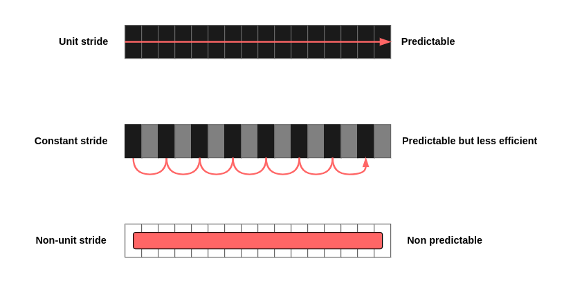
*The three types of strides*

For `sum2`, we face a constant stride. However, for the linked list, we face a non-unstride. Even though we know the data is allocated contiguously, the CPU doesn't known that. Therefore, it can't predict how to walk through the linked list.

Because the different stride and similar spatial locality, iterating over a linked list is significantly slower than a slice of values. We should generally favor unit strides over constant strides because of the better spatial locality. But a non-unit stride cannot be predicted by the CPU regardless of how the data is allocated, leading to negative performance impacts.

So far, we have discussed that CPU caches are fast but significantly smaller than the main memory. Therefore, a CPU needs a strategy to fetch a memory block to a cache line.

### Cache placement policy

```go
func calculateSum512(s [][512]int64) int64 {
	var sum int64
	for i := 0; i < len(s); i++ {
		for j := 0; j < 8; j++ {
			sum += s[i][j]
		}
	}

	return sum
}

func calculateSum513(s [][513]int64) int64 {
	var sum int64
	for i := 0; i < len(s); i++ {
		for j := 0; j < 8; j++ {
			sum += s[i][j]
		}
	}

	return sum
}
```

TODO: read again

## 92. Writing concurrent code that leads to false sharing

So far, we have dicussed the fundamental concepts of CPU caching. We have seen that some specific caches (typically L1 and L2) aren't shared among all the logical cores but are specific to a physical core. This specificity has some concrete impacts such as concurrency and the concept of false sharing, which can lead to significantly performance decrease. Let's look at what false sharing is via an example and then see how to prevent it.

```go
type Input struct {
    a int64
    b int64
}

type Result struct {
    sumA int64
    sumB int64
}
```

The goal is to implement a count function that receives a slice of Input and computes the following:

- The sum of all the Input.a fields into Result.sumA
- The sum of all the Input.b fields into Result.sumB

For the sake of the example, we implement a concurrent solution with one goroutine that computes sumA and another that computes sumB:

```go
func count(inputs []Input) Result {
	wg := sync.WaitGroup{}
	wg.Add(2)
	result := Result{}

	go func() {
		defer wg.Done()
		for i := 0; i < len(inputs); i++ {
			result.sumA += inputs[i].a
		}
	}()

	go func() {
		defer wg.Done()
		for i := 0; i < len(inputs); i++ {
			result.sumB += inputs[i].b
		}
	}()

	wg.Wait()
	return result
}
```

We spin up two goroutines: one that iterates over each a field and another that iterates over each b field. This example is fine from a concurrency perspective. For instance, it doesn't lead to a data race, because each goroutine increments its own variable. But this example illustrates the false sharing concept that degrades expected performance.

Because sumA and sumB are allocated contiguously, in most cases (seven out of eight), both variables are allocated to the same memory block.

Now, let's assume that the machine contains two cores. In most cases, we should eventually have two threads scheduled on different cores. So if the CPU decides to copy this memory block to a cache line, it is copied twice

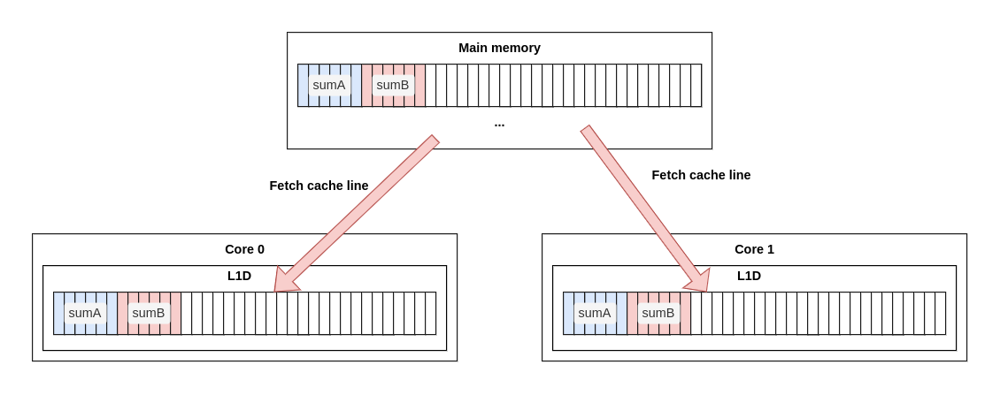
*Each block is copied to a cache line on both core 0 and core 1.*

Both cache lines are replicated because L1D (L1 data) is per core. Recall that in our example, each goroutine updates its own variable: sumA on one side, and sumB on the other side.

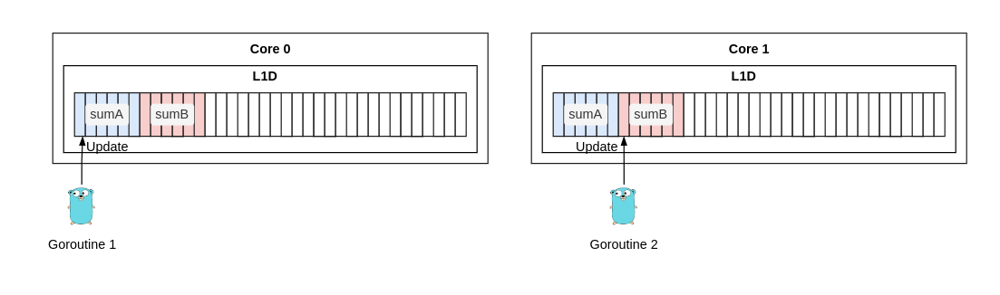
*Each goroutine updates its own variable.*

Because these cache lines are replicated, one of the goals of the CPU is to guarantee cache coherency. For example, if one goroutine updates sumA and another reads sumA (after some synchronization), we expect our application to get the latest value.

However, our example doesn't do exactly this. Both goroutines access their own variables, not a shared one. We might expect the CPU to know about this and understand that it isn't a conflict, but this isn't the case. When we write a variable that's in a cache, the granularity tracked by the CPU isn't the variable: it's the cache line. 

When a cache line is shared across multiple cores and at least one goroutine is a writer, the entire cache line is invalidated. This happens even if the updates are logically independent (for example, sumA and sumB). This is the problem of false sharing, and it degrades performance.

**NOTE** Internally, a CPU uses the MESI protocol to guarantee cache coherency. It tracks each cache line, marking it modified, exclusive, shared, or invalid (MESI).

One of the most important aspects to understand about memory and caching is that sharing memory across cores isn't real - it's an illusion. This understanding comes from the fact that we don't consider a machine a black box; instead, we try to have mechanical sympathy with underlying levels.

So how do we solve false sharing? There are two main solutions.

The first solution is to use the same approach we've shown but ensure that sumA and sumB aren't part of the same cache line. For example, we can update the Result struct to add padding between the fields. Padding is a technique to allocate extra memory. Because int64 requries 8-byte allocation and a cache line 64 bytes long, we need 64 - 8 = 56 bytes of paddings

```go
type Input struct {
	a int64
	b int64
}
type Result struct {
	sumA int64
	sumB int64
}
type Result2 struct {
	sumA int64
	_    [56]byte // padding
	sumB int64
}

func count1(inputs []Input) Result {
	wg := sync.WaitGroup{}
	wg.Add(2)
	result := Result{}

	go func() {
		defer wg.Done()
		for i := 0; i < len(inputs); i++ {
			result.sumA += inputs[i].a
		}
	}()

	go func() {
		defer wg.Done()
		for i := 0; i < len(inputs); i++ {
			result.sumB += inputs[i].b
		}
	}()

	wg.Wait()
	return result
}
func count2(inputs []Input) Result {
	wg := sync.WaitGroup{}
	wg.Add(2)
	chA, chB := make(chan int64, 1), make(chan int64, 1)

	go func() {
		defer wg.Done()
		var sumA int64
		for i := 0; i < len(inputs); i++ {
			sumA += inputs[i].a
		}
		chA <- sumA
	}()

	go func() {
		defer wg.Done()
		var sumB int64
		for i := 0; i < len(inputs); i++ {
			sumB += inputs[i].b
		}
		chB <- sumB
	}()

	wg.Wait()
	return Result{
		sumA: <-chA,
		sumB: <-chB,
	}
}

func count3(inputs []Input) Result2 {
	wg := sync.WaitGroup{}
	wg.Add(2)
	rs := Result2{}

	go func() {
		defer wg.Done()
		for i := 0; i < len(inputs); i++ {
			rs.sumA += inputs[i].a
		}
	}()

	go func() {
		defer wg.Done()
		for i := 0; i < len(inputs); i++ {
			rs.sumB += inputs[i].b
		}
	}()

	wg.Wait()
	return rs
}
```

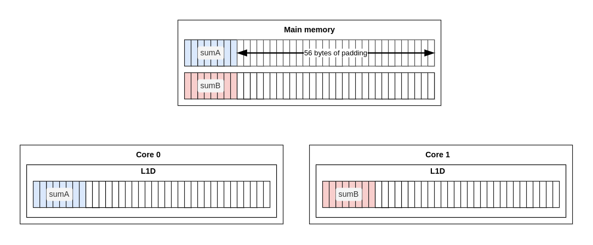
*A possible memory allocation. Using padding, sumA and sumB will always be part of different memory blocks and hence different cache lines.*

If we benchmark both solutions (with and without padding), we see that the padding solution is significantly faster (about 40% on my machine). This is an important improvement that results from the addition of padding between the two fields to prevent false sharing.

The second solution is to rework the structure of the algorithm. For example, instead of having both goroutines share the same struct, we can make them communicate their local result via channels. The result benchmark is roughly the same as with padding.

```go
goos: linux
goarch: amd64
pkg: go-learn
cpu: 12th Gen Intel(R) Core(TM) i7-1255U
Benchmark_count1
Benchmark_count1-12          889           1299806 ns/op
Benchmark_count2
Benchmark_count2-12         1130           1063815 ns/op
Benchmark_count3
Benchmark_count3-12         1130           1053121 ns/op
```

In summary, we must remember that sharing memory across goroutines is an illusion at the lowest memory levels. False sharing occurs when a cache line is shared across two cores when at least one goroutine is a writer. If we need to optimize an application that relies on concurrency, we should check whether false sharing applies because this pattern is known to degrade application performance. We can prevent false sharing with either padding or communication.

The following section discusses how CPUs can execute instructions in parallel and how to leverage that capability.

## 93. Not taking into account instruction-level parallelism

Instruction-level parallelism is another factor that can significantly impact performance. Before defining this concept, let's discuss a concrete example and how to optimize it.

We will write a function that receives an array of two int64 elements. This function will iterate a certain number of times (a constant). During each iteration, it will do the following:

- Increment the first element of the array.
- Increment the second element of the array if the first element is even.

Here's the Go version:

```go
func add(s [2]int64) [2]int64 {
	const n = 1_000_000
	for i := 0; i < n; i++ {
		s[0]++
		if s[0]%2 == 0 {
			s[1]++
		}
	}

	return s
}
```

The instructions executed an increment requires both a read and then a write. The sequence of instructions is sequential: first we increment s[0]; then, before incrementing s[1], we need to read s[0] again.

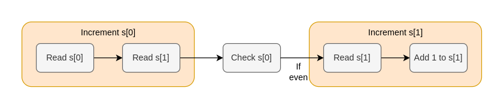
*Three main steps: increment, check, increment*

**NOTE** This sequence of instructions doesn't match the granularity of the assembly instructions. But for clarity throughout this section, we use a simplied view.

Let's take a moment to discuss the theory behind instruction-level parallelism (ILP). A few decades ago, CPU designers stopped focusing solely on clock speed to improve CPU performance. They developed multiple optimizations, including ILP, which allows developers to parallelize the execution of a sequence of instructions. A processor that implements ILP in a single virtual core is called a superscalar process. For example, a CPU executing an application consisting of three instructions, I1, I2 and I3. 

Executing a sequence of instructions requires different stages. In a nutshell, the CPU needs to decode the instructions and execute them. The execution is handled by the execution unit, which performs the various operations and calculations.

The CPU decided to execute the three instructions in parallel. Note that not all the instructions necessarily complete in a single clock cycle. For example, an instruction that reads a value already present in a register will finish in one clock cycle, but an instruction that reads an address that must be fetched from main memory may take dozens of clocks cycles to complete.

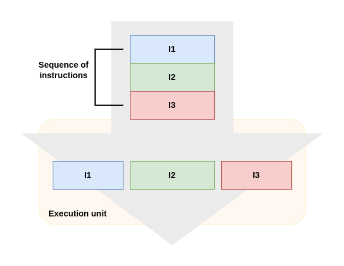

If executed sequentially, this sequence of instructions would have taken the following time (the function t(x) denotes the time the CPU takes to execute instruction x):

total time = t(I1) + t(I2) + t(I3)

Thanks to ILP, the total time is the following:

total time = max(t(I1), t(I2), t(I3))

ILP looks magic, theoretically. But it leads to a few challenges called hazards.

For example, what if I3 sets a variable to 42 but I2 is a conditional instruction (for example, if foo == 1)? In theory, this scenarios should prevent executing I2 and I3 in parallel. This is called a *control hazard or branching hazard*. In paractice, CPU designers solved control hazards using branch prediction.

For example, a CPU can count that the condition was true 99 of the last 100 times; therefore, it will execute both I2 and I3 in parallel. In case of a wrong predition (I2 happens to be false), CPU will flush its current execution pipeline, ensuring that there are no inconsistencies. This flush leads to a performance penalty of 10 to 20 clock cycles.

Other types of hazards can prevent executing instructions in parallel. As software engineers, we should be aware of that. For example, let's consider the two following instructions that update registers (temporary storage areas used to execute operations):

- I1 adds the numbers in registers A and B to C.
- I2 adds the numbers in registers C and D to D.

Because I2 depends on the outcome of I1 concerning the value of register C, the two instructions cannot the executed simultaneously. I1 must complete before I2. This is called a data hazard. To deal with data hazards, CPU designers have come up with a trick called forwarding that basically bypasses writing to a register.

**NOTE** There are also structural hazards, when at least two instructions in the pipeline need the same resource. As Go developers, we can't really impact these kinds of hazards, so we don't discuss them in this section.

Data hazards prevent instructions from being executed simultaneously. Let's look at the sequence of instruction.

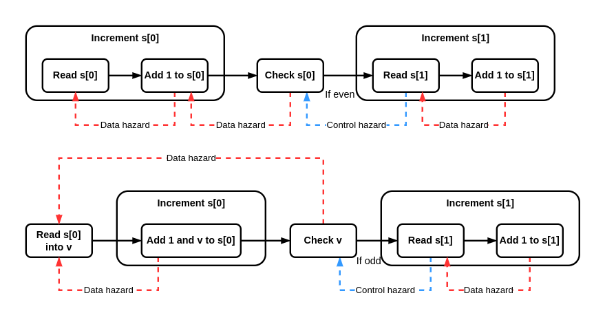

```go
func add(s [2]int64) [2]int64 {
	const n = 1_000_000
	for i := 0; i < n; i++ {
		s[0]++
		if s[0]%2 == 0 {
			s[1]++
		}
	}

	return s
}

func add2(s [2]int64) [2]int64 {
	const n = 1_000_000
	for i := 0; i < n; i++ {
		v := s[0]
		if v%2 != 0 {
			s[1]++
		}
		s[0] = v + 1
	}
	return s
}
```

Why does this matter? Because it allows the CPU to increase the level of parallelism.

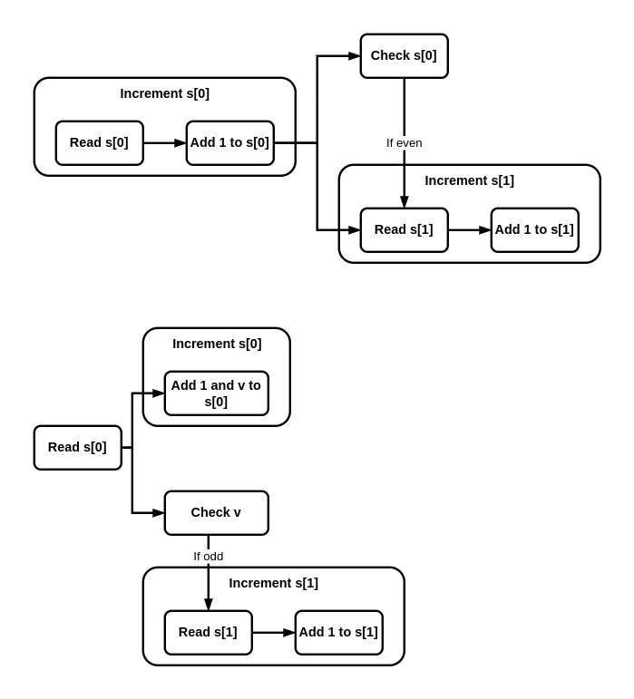

Despite having the same number of steps, the second version increases how many steps can be executed in parallel: three parallel routines instead of two. Meanwhile, the execution time should be optimized because the longest path has been reduced. If we benchmark these two functions, we see a significant speed improvement for the second version (about 20% on my machine), mainly because ILP.

Let's take a step back to conclude this section. We discussed how modern CPUs are parallelism to optimize the execution time of a set of instructions. We also looked at data hazards, which can prevent executing instructions in parallel. And we optimized a Go example a Go example by reducing the number of data hazards to increase the number of instructions that can be executed in parallel.

Let's also remember to remain cautions about such micro-optimizations. Because the Go compiler keeps evolving, an application's generated assembly may also change when the Go version is bumped.

## 94. Not being aware of data alignment

Data alignment is a way to arrange how data is allocated to speed up memory accesses by the CPU. Not being aware of this concept can lead to extra memory consumption and even degraded performance. This section discusses this concept, where it applies, and techniques to prevent under-optimized code.

To understand how data alignment works, let's first discuss what would happen without it. Suppose we allocate two variables, an int32 (32 bits) and a int64 (64 bits)

```go
var i int32
var j int64
```

Without data alignment, on a 64-bit architecture, these two variables could be allocated as shown in figure below.

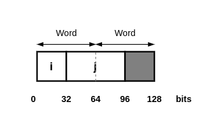

The j variable allocation could be spread over two words. If the CPU wanted to read j, it would require two memory accesses instead of one.

To prevent such a case, a variable's memory address should be a multiple of its own size. This is the concept of data alignment. In Go, the alignment guarantees are as follows:

- byte, uint8, int8: 1 byte
- uint16, int16: 2 bytes
- uint32, int32, float32: 4 bytes
- uint64, int64, float64, complex64: 8 bytes
- complex128: 16 bytes

All these types are guaranteed to be aligned: their addresses are a multiple of their size. For example, the address of any int32 variable is a multiple of 4.

Let's get back to the real world. Below figure shows two different cases where i and j are allocated in memory.

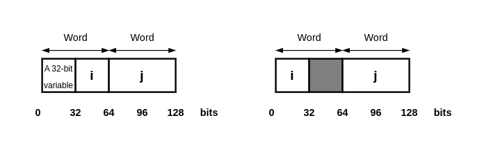

In the first case, a 32-bit variable was allocated just before i. Therefore, i and j were allocated contiguously. In the second case, the 32-bit variable wasn't allocated before i (for example, it was a 64-bit variable); so, i was allocated at the beginning of a word. To respect data alignment (an address that is a multiple of 64), j can't be allocated alongside i but to the next multiple of 64. The gray box represents 32 bits of padding.

Next, let's look at when padding can be an issue. We will consider the following struct containing three fields:

```go
type Foo struct {
    b1 byte
    i int64
    b2 byte
}
```

We have a byte type (1 byte), an int64 (8 bytes), and another byte type (1 byte). On a 64-bit architecture, the struct is allocated in memory as shown in figure below is allocated first. Because i is an int64, its address must be a multiple of 8. Therefore, it's impossible to allocate it alongside b1 at 0x01. What's the next address that is a multiple of 8? 0x08. b2 is allocated to the next available address that is multiple of 1: 0x10.

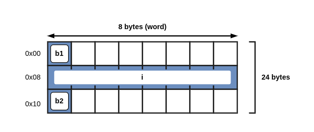

Because a struct's size must be a multiple of the word size (8 bytes), its address isn't 17 bytes but 24 bytes total.

```go
type Foo struct {
	b1 byte
	_  [7]byte // Added by compiler
	i  int64
	b2 byte
	_  [7]byte // Added by the compiler
}
```

Every time a Foo struct is created, it requires 24 bytes in memory, but only 10 bytes contain data - the remaining 14 bytes are padding. Because a struct is an atomic unit, it will never be reorganized, even after a GC; it will always occupy 24 bytes in memory. Note that the compiler doesn't rearrange the fields; it only adds padding to guarantee data alignment.

How can we reduce the amount of memory allocated? The rule of thumb is to reorganized a struct so that its fields are sorted by type size in descending order. In our case, the int64 type is first, followed by the two byte types:

```go
type Foo struct {
    i int64
    b1 byte
    b2 byte
}
```

Figure below shows how this new version of Foo is allocated in memory. i is allocated first and occupies a complete word. The main difference is that now b1 and b2 can live alongside each other in the same word.

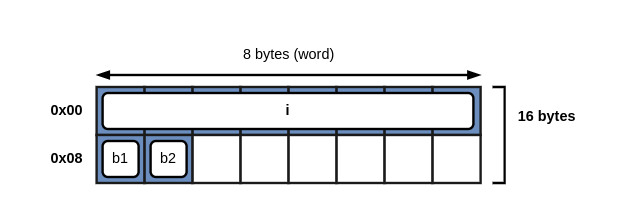

Again, the struct must be a multiple a multiple of the word size; but instead of occupying 24 bytes in memory, it occupies only 16 bytes. We saved 33% of the memory just by moving i to the first position.

What would be concrete impacts if we used the first version of the Foo struct (24bytes) instead of the compacted one? If the Foo structs were retained (for example, an in-memory Foo cache), our application would consume extra memory. But even if the Foo structs weren't retained, there would be other effects. For example, if we created Foo variables frequently, there would be other effects. For example, if we created Foo variables frequently and they were allocated to the heap, the result would be more frequent GCs, impacting overrall application performance.

Speaking of performance, there's another effect on spatial locality. For exmple, let's consider the following sum function that takes a slice of Foo structs as an argument. This function iterates over the slice and sums all the i fields (int64):

```go
func sum(foos []Foo) int64 {
    var s int64
    for i := 0; i < len(foo); i++ {
        s += foos[i].i
    }
    return s
}
```

Because a slice is backed by an array, it means a contiguous allocation of Foo structs. Let's discuss the backing array for two versions of Foo and check two cache lines of data (128 bytes). Each gray bar represents 8 bytes of data, and the darker bars are the i variables (the fields we want to sum). 

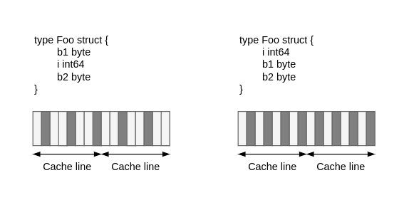

As we can see, with the latest version of Foo, each cache line is more useful because it contains average 33% more i variables. Therefore, iterating over a Foo slice to sum all the int64 elements is more efficient.

Let's be mindful of data alignment. As we have seen in this section, reorganizing the fields of a Go struct to sort them by size in descending order prevents padding. Preventing padding means allocating more compact struct, possibly leading to optimizations such as reducing the frequency of GCs and better spatial locality.

## 95. Not understanding stack vs. heap

## 96. Not knowing how to reduce allocations

Reducing allocations is a common optimization technique to speed up Go applications. This book has already covered a few approaches that reduce the number of heap allocations:

- Under-optimized string concatenation (mistake #39): using strings.Builder instead of the + operator to concatenation strings.
- Useless string conversions (mistake #40): whenever possible, avoid having to convert []byte into strings.
- Inefficient slice and map initialization (mistake #21 and #27): preallocate slices and maps if the length is already known.
- Better data struct alignment to reduce struct size (mistake #94)

As part of this section, we discuss three common approaches to reduce allocations:

- Changing our API
- Relying on compiler optimizations
- Using tools such as sync.Pool

### API changes

The first option is to work carefully on the API we provide. Let's take as a concrete example the io.Reader interface:

The first option is to work carefully on the API we provide. Let's take as a concrete example the io.Reader interface:

```go
type Reader interface {
    Read(p []byte)(n int, err error)
}
```

The Read method accepts a slice and returns the number of bytes read. Now, imagine if the io.Reader interface had been designed the other way around: passing an int representing how many bytes have to be read and returning a slice:

```go
type Reader interface {
    Read(n int) (p []byte, err error)
}
```

Semantically, there is nothing wrong with this. But the returned slice would automatically escape to the heap in this case. We would be in the sharing-up case described in the previous section.

The Go designers used the sharing-down approach to prevent automatically escaping the slice to the heap. Therefore, it's up to the caller to provide a slice. That doesn't necessarily mean thi won't be escaped: the compiler may have decided that this slice cannot stay on the stack. However, it's up to the caller to handle it, not a constraint caused by calling the Read method.

Sometimes even a slight change in an API can positively affect allocations. When designing an API, let's remain aware of the escape analysis rules described in the previous section and, if needed, use -gcflags to understand the compiler's decisions.

### Compiler optimizations

One of the goals of the Go compiler is to optimize our code if possible. Here's a concrete example regarding maps.

In Go, we can't define a map using a slice as a key type. In some cases, especially in application doing I/O, we may receive []byte data that we would like to use as a key. We are obliged to transform it into a string first.

```go
type cache struct {
    m map[string]int // Holds a map of strings
}

func (c *cache) get(bytes []byte) (v int, contains bool) {
    key := string(bytes) // Converts from []byte to string
    v, contains = c.m[key] // Queries the map using the string value
    return
}
```

Because the get function receives a []byte slice, we convert it to a key string to query the map.

However, the Go compiler implements a specific optimization if we query the map using string(bytes)

```go
func (c *cache) get(bytes []byte) (v int, contains bool) {
    v, contains = c.m[string(bytes)]
    return
}
```

```go
type cache struct {
	m map[string]int
}

func (c *cache) get(bytes []byte) (v int, contains bool) {
	key := string(bytes)
	v, contains = c.m[key]
	return
}

type cache1 struct {
	m map[string]int
}

func (c *cache1) get(bytes []byte) (v int, contains bool) {
	v, contains = c.m[string(bytes)]
	return
}

func Benchmark_get(b *testing.B) {
	c := cache{
		m: map[string]int{"tmp": 0},
	}
	for i := 0; i < b.N; i++ {
		c.get([]byte("tmp"))
	}
}

func Benchmark_get1(b *testing.B) {
	c := cache1{
		m: map[string]int{"tmp": 0},
	}
	for i := 0; i < b.N; i++ {
		c.get([]byte("tmp"))
	}
}
```

Despite this being almost the same code (we call string(bytes) directly instead of passing a variable), the compiler will avoid doing this bytes-to-string conversion. Hence, the second version is faster than the first.

This example illustrates that two versions of a function that look similar may result in different assembly code following the Go compiler's work. We should also be aware of the possible compiler optimizations to optimize an application. And we need to watch future Go releases to check whether new optimizations are added to the language.

### sync.Pool

Another avenue for improvement if we want to tackle the number of allocations is using sync.Pool. We should understand that sync.Pool isn't a cache: there's no fixed size or maximum capacity that we can set. Instead, it's a pool to reuse common objects.

Let's imagine we want to implement a write function that receives an io.Writer, calls a function to get a []byte slice, and then writes it to the io.Writer. Our code looks like this (we omit error handling for the sake of clarity):

```go
func write(w io.Writer) {
    b := getResponse()
    _, _ = w.Writer(b)
}
```

Here, getResposne returns a new []byte slice upon each call. What if we want to reduce the number of allocations by reusing this slice? We assume that all the responses have a max size of 1024 bytes. In this situation, we can use sync.Pool.

Creating a sync.Pool requires a func() any factory function;

- Get() any - Gets an object from the pool.
- Put(any) - Returns an object from the pool.

Using Get either creates a new object if the pool is empty or reuses an object, otherwise. Then, after using the object, we can put it back into the pool using Put.

When are objects drained from the pool? There's no specific method to do this: it relies on the GC. After each GC, objects from the pool are destroyed.

Back in our example, assuming that we can update the getResponse function to write data to a given slice instead of creating one, we can implement another version of the write method that relies on the pool.

```go
var pool = sync.Pool{
    New: func() any {
        return make([]byte, 1024)
    },
}
buffer := pool.Get().([]byte) // get a []byte from the pool or creates one
buffer = buffer[:0]           // resets the buffer
defer pool.Put(buffer)        // puts the buffer back into the pool

fmt.Println(len(buffer), cap(buffer))
```

We define a new pool using the sync.Pool struct and set the factory function to create a new []byte with a length of 1024 elements. In the write function, we try to retrieve one buffer from the pool. If the pool is empty, the function creates a new buffer, otherwise, it selects an arbitrary buffer from the pool and return it. One crucial step is to reset the buffer using buffer[:0], as this slice may already have been used. Then we defer the call to Put to put the slice back into the pool.

With this new version, calling write doesn't lead to creating a new []byte slice for every call. Instead, we can reuse existing allocated slices. In the worst-case scenario for example, after a GC - the function will create a new buffer; however, the amortized allocation cost is reduced.

In summary, if we frequently allocate many objects of the same type, we can consider using sync.Pool. It is a set of temporary objects that can help us prevent reallocating the same kind of data repeatedly. And sync.Pool is safe use by multiple goroutines simultaneously.

## 97. Not relying on inlining

Inlining refers to replacing a function call with the body of the function. Nowadays, inlining is done automatically by compilers. Understanding the fundamentals of inlining is done automatically by compilers.

```go
func main() {
    a := 3
    b := 2
    s := sum(a, b)
    println(s)
}

func sum(a int, b int) int {
    return a + b
}
```

```txt
$ go build -gcflags "-m=2"
./main.go:10:6: can inline sum with cost 4 as:
    func(int, int) int { return a + b }
./main.go:6:10: inlining call to sum func(int, int) int { return a + b }
```

The compiler decided to inline the call to sum. Hence, the previous code is replaced by the following:

```go
func main() {
    a := 3
    b := 2
    s := a + b
    println(s)
}
```

Inlining only works for functions with a certain complexity, also known as an inlining budget. Otherwise, the compiler will inform us that the function is too complex to be inlined:

```txt
./main.go:10:6: cannot inline foo: function too complex:
    const 84 exceeds budget 80
```

Inlining has two main benefits.

## 98. Not using Go diagnostics tooling

## 99. Not understanding how the GC works

The garbage collector (GC) is a critical piece of the Go language that simplifies the lives of the developers. It allows us to track and free heap allocations that are no longer needed. Because we can't replace every heap allocation with a stack allocation, understanding how the GC works should be part of the Go developer's toolset to optimize applications.

**1. Concepts**

A GC keeps a tree of object references. The Go GC is based on the mark-and-sweep algorithm, which relies on two stages:

- Mark stage: Traverses all the objects of the heap and marks whether they are still in use
- Sweep stage: Traverses the tree of references from the root and deallocates blocks of objects that are no longer referenced

When a GC runs, it first performs a set of actions that lead to stopping the world (two stop-the-worlds per GC, to be precise). That is, all the available CPU time is used to perform the GC, putting our application code on hold. Following these steps, it starts the world again, resumming our application but also running a concurrent phase. For that reason, the Go GC is called concurrent mark-and-sweep: it aims to reduce the number of stop-the-world operations per GC cycle and mostly run concurrently alongside our application.


**2. Examples**

## 100. Not understanding the impacts of running Go in Docker and Kubernetes
