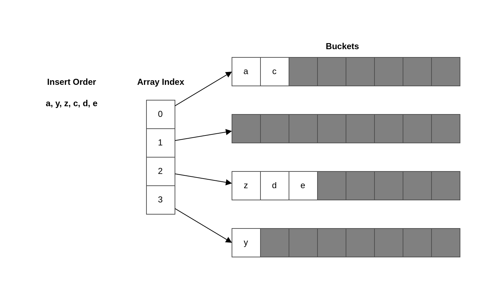

# Control structures

## 30. Ignoring the fact that elements are copied in range loops

### Value copy

Understanding how the value is handled during each iteration is critical for using a range loop effectively.

```go
type account struct {
	balance float32
}

func main() {
	accounts := []account{{100}, {200}, {300}}
	for _, ac := range accounts {
		ac.balance += 100
	}
	fmt.Println(accounts)
}
// 100, 200, 300
```

In Go, everything we assign is a copy:

- If we assign the result of a function returning a struct, it performs a copy of that struct.
- If we assign the result of a function returning a pointer, it performs a copy of the memory address (an address is 64 bits long on a 64-bit architecture).

When a range loop iterates over a data structure, it performs a copy of each element to the value variable (the second item)

Coming back to our example, iterating over each account element results in a struct copy being assigned to the value variable a. Therefore, incrementing the balance with ac.balance += 1000 mutates only the value variable (ac), not an element in the slice.

So, what if we want to update the slice elements? There are two main options. The first option is access the element using the slice index. This can be achieved with either a classic for loop or a range loop using the index instead of the value variable:

```go
for i := range accounts {
    accounts[i].balance += 1000
}
for i := 0; i < len(accounts); i++ {
    accounts[i].balance += 1000
}
```

Both iterations have the same effect: updating the elements in the accounts slice.

**Updating slice elements: A third option**

Another option is to keep the range loop and access the value but modify the slice type to a slice of account pointers:

```go
accounts := []*account{{100}, {200}, {300}}

for _, a := range accounts {
    a.balance += 1
}
```

In this case, as we mentioned, the a variable is a copy of the account pointer stored in the slice. But as both pointers reference the same struct, the a.balance += 1 statement updates the slice element.

However, this option has two main downsides. First, it requires updating the slice type, which may not always be possible. Second, it performance is important, we should note that iterating over a slice of pointers may be less efficient for a CPU because of the lack of predictability.

In general, we should remember that the value element in a range loop is a copy. Therefore, if the value is a struct we need to mutate, we will only update the copy, not the element itself, unless the value of field we modify is a pointer. The favored options are to access the element via the index using a range loop or a classic for loop.

## 31. Ignoring how arguments are evaluated in range loops

The range loop syntax requires an expression. For example, in for i, v := range exp, exp is the expression. As we have seen, it can be a string, an array, a pointer to an array, a slice, a map, or a channel. How is this expression evaluated? When using a range loop, this is an essential point to avoid common mistakes.

Do you belive the loop will terminate?
```go
s := []int{1, 2, 3}
for range s { // evaluate s only 1 time
    // manipulation on s
    s = append(s, -1)
}

fmt.Println(s)
```

To understand this question, we should know that when using a range loop, the provided expression is evaluated only once, before the beginning of the loop. In this context, "evaluated" means provided expression is copied to a temporary variable, an then range iterates over this variable.

```go
s := []int{1, 2, 3}
for i := 0; i < len(s); i++ { // len(s) expression is evaludated during each iteration
    s = append(s, -1)
}

fmt.Println(s)
```

```go
s := []int{1, 2, 3}
len := func(s []int) int {
    log.Println("re evaluate")
    return len(s)
}
for i := 0; i < len(s); i++ {
    s = append(s, -1)
}

fmt.Println(s)
```

```go
s := []int{1, 2, 3, 4, 5}
len := func(s []int) int {
    log.Println("re evaluate")
    return len(s)
}
for i := 0; i < len(s); i++ {
    s = []int{1, 2, 3}
}
```

The behavior is different with a classic for loop: The len(s) expression is evaluated during each iteration, and because we keep adding elements, we will never reach a termination state. It's essential to keep this difference in mind to use Go loops accurately.

Coming back to the range operator, we should know that the behavior we described (expression evaludated only once) also applies to all the data types provided.

### Channels

```go
ch1 := make(chan int, 3)
go func() {
    ch1 <- 0
    ch1 <- 1
    ch1 <- 2
    close(ch1)
}()

ch2 := make(chan int, 3)
go func() {
    ch2 <- 10
    ch2 <- 11
    ch2 <- 12
    close(ch2)
}()

ch := ch1
for v := range ch { // range is evaluate only once
    fmt.Println(v)
    ch = ch2
}
```
In this example, the same logic applies regarding how the range expression is evaluated. The expression provided to range is a ch channel pointing to ch1. Hence, range evaluates ch, performs a copy to a temporary variable, and iterates over elements from this channel. Despite the ch = ch2 statement, range keeps iterating over ch1, not ch2:

The ch = ch2 statement isn't without effect, though. Because we assigned ch to the second variable, if we call close(ch) following this code, it will close the second channel, not the first.

### Array

Because the range expression is evaluated is evaluated before the beginning of the loop, what is assigned to the temporary loop variable is a copy of the array.

```go
a := [3]int{0, 1, 2}
for i, v := range a {
    a[2] = 10
    if i == 2 {
        println(v)
    }
}
```

As we mentioned, the range operator creates a copy of the array. Meanwhile, the loop doesn't update the copy; it updates the original array: a. Therefore the value of v during the last iteration is 2, not 10. If we want to print the actual value of the last element, we can do so in two ways:

- By accessing the element from its index:

```go
a := [3]int{0, 1, 2}
for i := range a {
    a[2] = 10
    if i == 2{
        fmt.Println(a[2])
    }
}
```

Because we access the original array, this code prints 2 instead of 10.

- Using an array pointer

```go
a := [3]int{0, 1, 2}
for i, v := range &a {
    a[1] = 10
    if i == 1 {
        println(a[1], v)
    }
}
```

In summary, the range loop evaluates the provided expression only once, before the beginning of the loop, by doing a copy (regardless of the type). We should remember this behavior to avoid common mistakes that might, for example, lead us to access the wrong element.

## 32. Ignoring the impact of using pointer elements in range loops

This section looks at a specific mistakes when using a range loop with pointer elements. If we're not cautions enough, it can lead us to an issue where we reference the wrong elements. Let's clarify the rationale for using a slice or map of pointer elements. There are three main cases:

- In terms of sematics, storing data using pointer sematics implies sharing the element. For example, the following method holds the logic to insert an element into a cache:

```go
type Store struct {
    m map[string]*Foo
}

func (s Store) Put(id string, foo *Foo) {
    s.m[id] = foo
}
```

Here, using the pointer semantics implies that the Foo element is shared by both the caller of Put and the Store struct.

- Sometimes we already manipulate pointers. Hence, it can be handy to store pointers directly in our collection instead of values.

- If we store large struct, and these structs are frequently mutated, we can use pointers instead of avoid a copy and insertion for each mutation.

```go
func updateMapValue(mapValue map[string]LargeStruct, id string) {
    value := mapValue[id] // copy
    value.foo = "bar"
    mapValue[id] = value // insert
}

func updateMapPointer(mapPointer map[string]*LargeStruct, id string) {
    mapPointer[id].foo = "bar" // mutate
}
```

```go
type Customer struct {
    ID string
    Balance float64
}

type Store struct {
    m map[string]*Customer
}

func (s *Store) storeCustomers(customers []Customer) {
    for _, c := range customers {
        // c variable has a constant address, so we store in the map the same pointer
        s.m[c.ID] = &c // bug
    }
}
// key=1, value=&main.Customer{ID:"3", Balance:0}
// key=2, value=&main.Customer{ID:"3", Balance:0}
// key=3, value=&main.Customer{ID:"3", Balance:0}
```

Iterating over the customers slice using the range loop, regardless of the number of elements, creates a single customer variable with a fixed address. 

So, how to fix this problem? There are two main solutions. The first is similar to what we saw in mistake #1, "Unintended variable shadowing." It requires creating a local variable:

```go
func (s *Store) storeCustomers(customers []Customer) {
    for _, customer := range customers {
        current := customer
        s.m[current.ID] = &current
    }
}
```

In this example, we don't store a pointer referencing customer; instead, we store a pointer referencing current. current is a variable referencing a unique Customer during each iteration. Therefore, following the loop, we have stored different pointers referencing different Customer structs in the map. The other solution is to store a pointer referencing each element using the slice index:

```go
func (s *Store) storeCustomers(customers []Customer) {
    for i := range customers {
        customer := &customers[i]
        s.m[customer.ID] = customer
    }
}
```

In this solution, customer is now a pointer. Because it's initilized during each iteration, it has a unique address. Therefore, we store different pointers in the maps.

When iterating over a data struct using a range loop, we must recall that all values  are assigned to a unique variable with a single unique address. Therefore, if we store a pointer referencing this variable during each iteration, we will end up it a situation where we store the same pointer referencing the same element: the latest is one.

## 33. Making wrong assumptions during map iterations

### Ordering

We need to understand a few fundamental behaviors of the map data structure:

- It doesn't keep data stored by key (a map isn't based on a binary tree)
- It doesn't preserve the order in which the data was added. For example, if we insert pair A before pair B, we shouldn't make any assumptions based on this insertion order.

Furthermore, when iterating over a map, we shouldn't make any ordering assumptions at all.



```go
for k := range m {
    fmt.Print(k)
}
```

We mentioned that the data isn't sorted by key. Hence, we can't expect this code to print acdeyz. Meanwhile, we said the map doesn't preserve the insertion order. Hence, also can't expect the code to print ayzcde.

But we can at least expect the code to print the keys in the order in which they are currently stored in the map, aczdey? No, not even this. In Go, the iteration order over a map is not specified. There is also no guarantee that the order will be the same from one iteration to the next. We should keep these map behaviors in mind so we don't base our code on wrong assumptions.

The order can different from one iteration to another.

**NOTE** Although there is no guarantee about the iteration order, the iteration distribution isn't uniform. It's why the official Go specification states that the iteration is unspecified, not random.

So why does Go have such a surprising way to iterate over a map? It was a conscious choice by the language designers. They wants to add some form of randomness to make sure developers never rely on any ordering assumptions while working with maps.

Hence, as Go developers, we should never make assumptions regarding ordering while iterating over a map. However, let's note that using package from standard library or external libraries can lead to different behaviors. For example, when the encoding/json package marshals a map into JSON, it reorders the data alphabetically by keys, regardless of the iteration order. But this isn't a property of the Go map itself. If ordering is necessary, we should rely on other data structures such as a binary heap.

### Map insert during iteration

In Go, updating a map (inserting or deleting an element) during an iteration is allowed; it doesn't lead to a compilation error or run-time error. However, there's another aspect we should consider when adding an entry in a map during an iteration, to avoid non-deterministic results.

Let's check the following example that iterations on a map[int]bool. If the pair value is true, we add another element. Cau you guess what the output of this code will be?

```go
m := map[int]bool{
    0: true,
    1: false,
    2: true,
}
for k, v := range m {
    if v {
        m[10+k] = true
    }
}
fmt.Println(m)
```

The result of this code is unpredictable. Here are some examples of results if we run this code multiple times:

```txt
map[0:true 1:false 2:true 10:true 12:true 22:true 32:true 42:true 52:true 62:true]
map[0:true 1:false 2:true 10:true 12:true 20:true 22:true 30:true]
map[0:true 1:false 2:true 10:true 12:true]
```

To understand the reason, we have to read what the Go specification says about a new map entry during an iteration:

If a map entry is created during iteration, it may be produced during the iteration or skipped. The choice may vary from each entry created and from one iteration to the next.

Hence, when an element is added to a map during an iteration, it may be produced during a follow-up iteration, or it may not. As Go developers, we don't have any way to enforce the behavior. Is also may vary from one iteration to another.

It's essential to keep this behavior in mind to ensure that our code doesn't produce unpredictable outputs. If we want to update a map while iterating over it and make sure the added entries aren't part of the iteration, one solution is to work on a copy of the map:

```go
m := map[int]bool{
    0: true,
    1: false,
    2: true,
}
cpM := make(map[int]bool)
for k, v := range m {
    cpM[k] = v
    if v {
        cpM[10+k] = true
    }
}
fmt.Println(m, cpM)
```

To summarize, when we work with a map, we shouldn't rely on the following:

- The data being ordered by keys
- Preservation of insertion order
- A deterministic iteration order
- An element being produced during the same iteration in which it's added

Keeping these behaviors in mind should help us avoid common mistakes based on wrong assumptions.

# 34.  Ignoring how the break statement works
