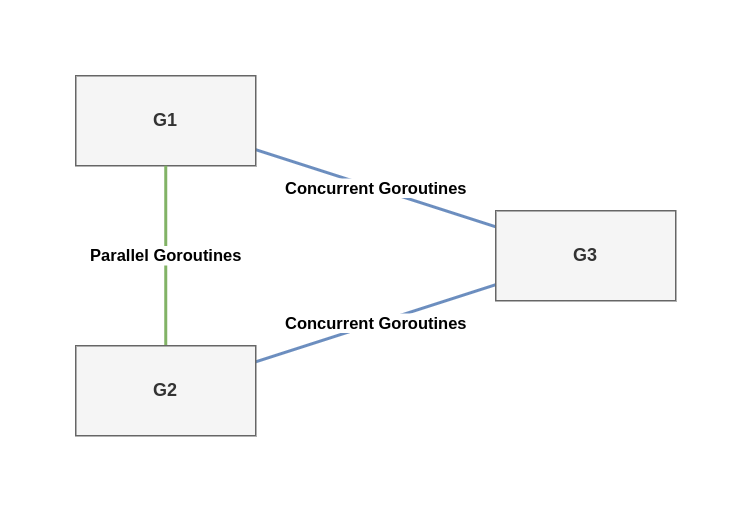

# Concurrency Foundations

## 55. Mixing up concurrency and parallelism

Even after years of concurrent programming, developers may not clearly understand the differences between concurrency and parallelism. Before delving into Go-specific topics, it's first essential to understand these concepts so we share a common vocabulary.

Concurrency enables parallelism. Indeed, concurrency provides a structure to solve a problem with parts that may be parallelized.

Concurrency is about dealing with a lot of things at once. Parallelism is about doing lots of things at once.

In summary, concurrency and parallelism are different. Concurrency is about structure, and we can change a sequential implementation into a concurrent one by introduction different steps that separate concurrent threads can tackle. Meanwhile, parallelism is about execution, and we can use it at the step level by adding more parallel threads.

## 56. Thinking concurrency is always faster

A misconception among many developers is believing that a concurrent solution is always faster than a sequential one. This couldn't be more wrong. The overall performance of a solution depends on many factors, such as the efficiency of our structure (concurrency), which parts can be tackled in parallel and the level of contention among the computation units.

### Go scheduling

A thread is the smallest unit of processing that an OS can perform. If a process wants to execute multiple actions simultaneously, it spins up multiple threads. These threads can be
- Concurrent: Two or more threads can start, run and complete in overlapping time periods, like the waiter thread and the coffee machine thread in the previous section
- Parallel: The same task can be executed in multiple times at once, like multiple waiter threads.

The OS is responsible for scheduling the thread's processes optimally so that
- All the threads can consume CPU cycles without being starved for too much time.
- The workload is distributed as evenly as possible among the different CPU cores.

**NOTE** The word thread can also have a different meaning at a CPU level. Each physical core can be composed of multiple logical cores (the concept of hyperthreading), and a logical core is also called a thread. When we use the word thread, we mean the unit of processing, not a logical core. 

A CPU core executes different threads. When it switches from one thread to another, it executes an operation called context switching. The active thread consuming CPU cycles was in an executing state and moves to runnable state, meaning it's ready to be executed pending an available core. Context switching is considered an expensive operation because the OS needs to save the current execution state of a thread before the switch (such as the current register values). 

As Go developers, we can't create threads directly, but we can create goroutines, which can be thought of as application-level threads. However, whereas an OS thread is context-switched on and off a CPU core by the OS, a goroutine is context-switched on and off by the Go runtime. Also, compared to an OS thread, a goroutine has a smaller memory footprint: 2KB for goroutines from Go 1.4. An OS thread depends on the OS, the defautl size is 2MB. Having smaller size makes context switching faster. 

**NOTE** Context switching a goroutine versus a thread is about 80% to 90% faster, depending on the architecture.

Internally, the Go scheduler uses the following terminology

- G - Goroutine
- M - OS thread (stands for machine)
- P - CPU core (stands for processor)

Each OS thread (M) is assigned to a CPU core (P) by the OS scheduler. Then each goroutine (G) runs on an M. The GOMAXPROCS variable defines the limit of Ms in charge of executing user-level code simultaneously. But if a thread is blocked in a system call (I/O), the scheduler can spin up more Ms. As of Go 1.5, GOMAXPROCS is by default equal to the number of available CPU cores.

A goroutine has a simpler lifecycle than an OS thread. It can be doing one of the following:

- Executing - The goroutine is scheduled on an M and executing its instructions.
- Runnable - The goroutine is waiting to be an executing state.
- Waiting - The goroutine is stopped and pending something completing, such as a system call or a synchronization operating (such as acquiring a mutex)

There's one last stage to understand about the implementation of Go scheduling: when a goroutine is created but cannot be executed yet; for example, all the other Ms are already executing a G. In this scenarios, what will the Go runtime do about it? The answer is queuing. The Go runtime handles two kinds of queues: one local queue per P and a global queue shared among all the Ps.

TODO: readmore

### Parallel merge sort

## 57. Being puzzled about when to use channels of mutexes

It may not always be clear whether we can implement a solution using channels or mutexes. Because Go promotes sharing memory by communication, one mistake could be always force the use of channels, regardless of the use case.

First, a brief reminder about channels in Go: channels are a communication mechanism. Internally, a channel is a pipe we can use to send and receive values and that allows us to connect concurrent goroutines. A channel can be either of the following:
- Unbuffed - The sender goroutine blocks until the receiver goroutine is ready.
- Buffered - The sender goroutine blocks only when the buffer is full.

Let's get back to our initial problem. When should we use channels or mutexes? Our example has three different goroutines:



- G1 and G2 are parallel goroutines. They may be two goroutines executing the same function that keeps receiving message from a channel, or perhaps two goroutines executing the same HTTP handler at the same time. 
- On the other hand, G1 and G3 are concurrent goroutines, as are G2 and G3. All the goroutines are part of an overall concurrent structure, but G1 and G3 perform the first step, whereas G3 does the next step.

In general, parallel goroutines have to synchronize: for example, when they need to access or mutate a shared resource such as a slice. Synchronization is enforced with mutexes but not with any channel types (not with buffered channels). Hence, in general, synchronization between parallel goroutines should be achieved via mutexes.

Conversely, in general, concurrent goroutines have to coordinate and orchestrate. For example, if G3 need to aggregate results from both G1 and G2, G1 and G2 need to signal to G3 that a new intermediate result is available. This coordinate falls under the scope of communication - therefore, channels.

Regarding concurrent goroutines, there's also the case where we want to transfer the ownership of a resource from one step (G1 and G2) to another (G3); for example, if G1 and G2 are enriching a shared resource and at some point; we consider this job as complete. Here, we should use channels to signal that a specific resource is ready and handle the ownership transfer.

Mutexes and channels have different semantics. Whenever we want to share a state or access a shared resource, mutexes ensure exclusive access to this resource. Conversely, channels are mechanic for signaling with or without data (chan struct{} or not). Coordination or ownership transfer should be achived via channels. It's important to know whether goroutines are parallel or concurrent because, in general, we need mutexes for parallel goroutines and channels if concurrent ones.

## 58. Not understand race problems

Race problems can be among the hardest and most insidious bugs a programmer can face. As Go developers, we must understand crucial aspects such as data races and race considitions, their possible impacts, and how to avoid them. We will go through these topics by first dicussing data races versus race conditions and then examining the Go memory model and why it matters.

### Data races vs race conditions

Let's first focus on data races. A data race occurs when two or more goroutines simultaneously access the same memory location and at least one is writing.

```go
i := 0

go func(){
    i++
}()

go func(){
    i++
}()
```

If we run this code using the Go race detector (-race option), it warns us that a data race has occurred:

```txt
WARNING: DATA RACE
Read at 0x00c0000b8018 by goroutine 7:
  main.main.func1()
      main.go:14 +0x30

Previous write at 0x00c0000b8018 by goroutine 8:
  main.main.func2()
      main.go:17 +0x44
```

The final value of i is also unpredictable.

The i++ statement can be decomposed into three operations:

```txt
1. Read i.
2. Increment the value.
3. Write back to i.
```

This is a possible impact of a data race. If two goroutines simultaneously access the same memory location with at least one writing to that memory location, the result can be hazardous.

How can we prevent a data race from happening? Let's look at some different techniques. The scope here isn't to present all the possible options.

The first option is to make the increment operation atomic, meaning it's done in a single operation. This prevents entangled running operations. Atomic operations can be done in Go using the sync/atomic package. Here's an example of how we can increment atomically an int64: 

```go
var i int64

go func(){
    atomic.AddInt64(&i, 1)
}()

go func(){
    atomic.AddInt64(&i, 1)
}()
```

Another option is to synchronize the two goroutines with an ad hoc data structure like a mutex. Mutex stands for mutual exclusion; a mutex ensures that at most one goroutine accesses a so-called critical section. 

```go
i := 0
m := sync.Mutex{}

go func() { 
    m.Lock() // start of critical session
    i++
    m.Unlock() // end of critical session
}()

go func() {
    m.Lock()
    i++
    m.Unlock()
}()
```

Which approach works best? The boundary is pretty straightforward. As we mentioned, the sync/atomic package works only with specific types. If we want something else (for example, slices, maps, and structs), we can't rely on sync/atomic. 

Another possible option is to prevent sharing the same memory location and instead favor communication across goroutines.

```go
i := 0
ch := make(chan int)
go func() {
    ch <- 1
}()
go func() {
    ch <- 1
}()

i += <- ch
i += <- ch
```

Let's sum up what we have seen so far. Data races occur when multiple goroutines access the same memory location simultaneously (for example, the same variable) and at least one of them is writing. We have also seen how to prevent this issue with three synchronization approaches:

- Using atomic operations.
- Protecting a critical section with a mutex.
- Using communication and channels to ensure that a variable is updated by only one goroutine.

With these three approaches, the value of i will eventually be set to 2, regardless of the execution order of the two goroutines. But depending on the operation we want to perform, does a data-race-free application necessarily mena a deterministic result?

Instead of having two goroutines increment a shared variable, now each one makes an assignment. We will follow the approach of using a mutex to prevent data races:

```go
i := 0
m := sync.Mutex{}

go func() {
    m.Lock()
    defer m.Unlock()
    i = 1
}()

go func(){
    m.Lock()
    defer m.Unlock()
    i = 2
}()
```

The first goroutine assgins 1 to i, whereas the second one assigns to 2. This example doesn't lead to a data race. But it has a race condition. A race condition occurs when the behavior depends on the sequence or the timing of events that can't be controlled. Here, the timing of events is the goroutine's execution order.

Ensuring a specific execution sequence among goroutines is a question of coordination and orchestration. If we want to ensure that we first go from state 0 to state 1, and then from state 1 to state 2, we should find a way to guarantee that the goroutines are executed in order. Channels can be a way to solve this problem. Coordinating and orchestrating can also ensure that a particular section is accessed by only one goroutine, which can also mean removing the mutex in the previous example.

In summary, when we work in concurrent applications, it's essential to understand that a data race is different from a race condition. A data race occurs when multiple goroutines simultaneously access the same memory location and at least one of them is writing. A data race means unexpected behavior. However, a data-race-free application doesn't necessarily mean deterministic results. An application can be free of data races but still have behavior that depends on uncontrolled events (such as goroutine execution, how fast a message is published to a channel, or how long a call to a database lasts); this is a race condition. Understanding both concepts is crucial to becoming proficient in designing concurrent applications.
