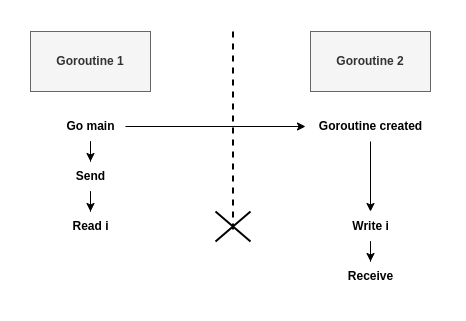
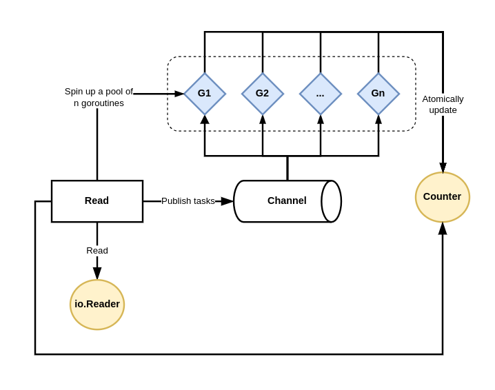
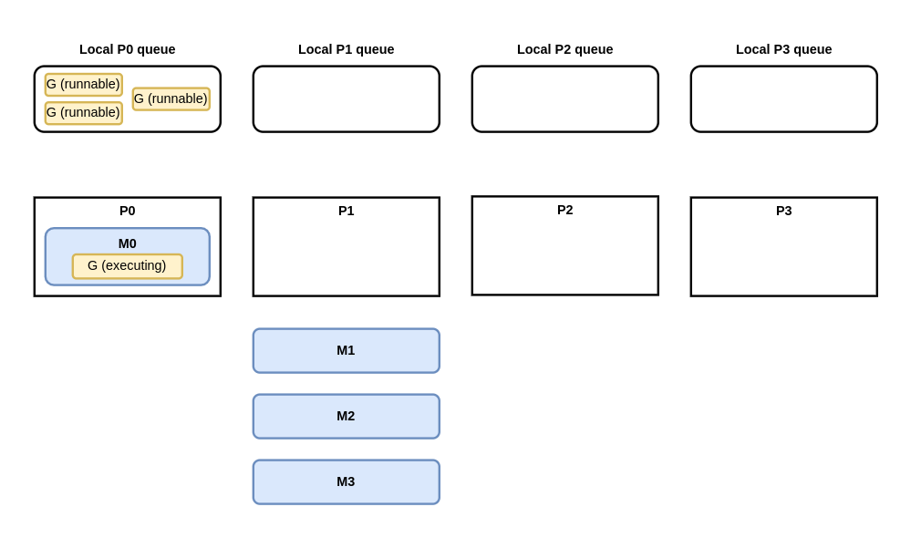

# Concurrency Foundations

In recent decades, CPU vendors have stopped focusing only on clock speed. Instead, modern CPUs are designed with multiple cores and hyperthreading (multiple logical cores on the same physical core). Therefore, to leverage these architectures, concurrency has become critical for software developers. Even though Go provides simple primitives, this doesn't necessarily mean that writing concurrent code has doesn't necessarily mean that writing concurrent code has become easy.

## 55. Mixing up concurrency and parallelism

Even after years of concurrent programming, developers may not clearly understand the differences between concurrency and parallelism. Before delving into Go-specific topics, it's first essential to understand these concepts so we share a common vocabulary.

Concurrency enables parallelism. Indeed, concurrency provides a structure to solve a problem with parts that may be parallelized.

Concurrency is about dealing with a lot of things at once. Parallelism is about doing lots of things at once.

In summary, concurrency and parallelism are different. Concurrency is about structure, and we can change a sequential implementation into a concurrent one by introduction different steps that separate concurrent threads can tackle. Meanwhile, parallelism is about execution, and we can use it at the step level by adding more parallel threads.

## 56. Thinking concurrency is always faster

A misconception among many developers is believing that a concurrent solution is always faster than a sequential one. This couldn't be more wrong. The overall performance of a solution depends on many factors, such as the efficiency of our structure (concurrency), which parts can be tackled in parallel and the level of contention among the computation units.

### Go scheduling

A thread is the smallest unit of processing that an OS can perform. If a process wants to execute multiple actions simultaneously, it spins up multiple threads. These threads can be
- Concurrent: Two or more threads can start, run and complete in overlapping time periods, like the waiter thread and the coffee machine thread in the previous section
- Parallel: The same task can be executed in multiple times at once, like multiple waiter threads.

The OS is responsible for scheduling the thread's processes optimally so that
- All the threads can consume CPU cycles without being starved for too much time.
- The workload is distributed as evenly as possible among the different CPU cores.

**NOTE** The word thread can also have a different meaning at a CPU level. Each physical core can be composed of multiple logical cores (the concept of hyperthreading), and a logical core is also called a thread. When we use the word thread, we mean the unit of processing, not a logical core. 

A CPU core executes different threads. When it switches from one thread to another, it executes an operation called context switching. The active thread consuming CPU cycles was in an executing state and moves to runnable state, meaning it's ready to be executed pending an available core. Context switching is considered an expensive operation because the OS needs to save the current execution state of a thread before the switch (such as the current register values). 

As Go developers, we can't create threads directly, but we can create goroutines, which can be thought of as application-level threads. However, whereas an OS thread is context-switched on and off a CPU core by the OS, a goroutine is context-switched on and off by the Go runtime. Also, compared to an OS thread, a goroutine has a smaller memory footprint: 2KB for goroutines from Go 1.4. An OS thread depends on the OS, the defautl size is 2MB. Having smaller size makes context switching faster. 

**NOTE** Context switching a goroutine versus a thread is about 80% to 90% faster, depending on the architecture.

Internally, the Go scheduler uses the following terminology

- G - Goroutine
- M - OS thread (stands for machine)
- P - CPU core (stands for processor)

Each OS thread (M) is assigned to a CPU core (P) by the OS scheduler. Then each goroutine (G) runs on an M. The GOMAXPROCS variable defines the limit of Ms in charge of executing user-level code simultaneously. But if a thread is blocked in a system call (I/O), the scheduler can spin up more Ms. As of Go 1.5, GOMAXPROCS is by default equal to the number of available CPU cores.

A goroutine has a simpler lifecycle than an OS thread. It can be doing one of the following:

- Executing - The goroutine is scheduled on an M and executing its instructions.
- Runnable - The goroutine is waiting to be an executing state.
- Waiting - The goroutine is stopped and pending something completing, such as a system call or a synchronization operating (such as acquiring a mutex)

There's one last stage to understand about the implementation of Go scheduling: when a goroutine is created but cannot be executed yet; for example, all the other Ms are already executing a G. In this scenarios, what will the Go runtime do about it? The answer is queuing. The Go runtime handles two kinds of queues: one local queue per P and a global queue shared among all the Ps.

TODO: readmore

### Parallel merge sort

## 57. Being puzzled about when to use channels of mutexes

It may not always be clear whether we can implement a solution using channels or mutexes. Because Go promotes sharing memory by communication, one mistake could be always force the use of channels, regardless of the use case.

First, a brief reminder about channels in Go: channels are a communication mechanism. Internally, a channel is a pipe we can use to send and receive values and that allows us to connect concurrent goroutines. A channel can be either of the following:
- Unbuffed - The sender goroutine blocks until the receiver goroutine is ready.
- Buffered - The sender goroutine blocks only when the buffer is full.

Let's get back to our initial problem. When should we use channels or mutexes? Our example has three different goroutines:


- G1 and G2 are parallel goroutines. They may be two goroutines executing the same function that keeps receiving message from a channel, or perhaps two goroutines executing the same HTTP handler at the same time. 
- On the other hand, G1 and G3 are concurrent goroutines, as are G2 and G3. All the goroutines are part of an overall concurrent structure, but G1 and G3 perform the first step, whereas G3 does the next step.

In general, parallel goroutines have to synchronize: for example, when they need to access or mutate a shared resource such as a slice. Synchronization is enforced with mutexes but not with any channel types (not with buffered channels). Hence, in general, synchronization between parallel goroutines should be achieved via mutexes.

Conversely, in general, concurrent goroutines have to coordinate and orchestrate. For example, if G3 need to aggregate results from both G1 and G2, G1 and G2 need to signal to G3 that a new intermediate result is available. This coordinate falls under the scope of communication - therefore, channels.

Regarding concurrent goroutines, there's also the case where we want to transfer the ownership of a resource from one step (G1 and G2) to another (G3); for example, if G1 and G2 are enriching a shared resource and at some point; we consider this job as complete. Here, we should use channels to signal that a specific resource is ready and handle the ownership transfer.

Mutexes and channels have different semantics. Whenever we want to share a state or access a shared resource, mutexes ensure exclusive access to this resource. Conversely, channels are mechanic for signaling with or without data (chan struct{} or not). Coordination or ownership transfer should be achived via channels. It's important to know whether goroutines are parallel or concurrent because, in general, we need mutexes for parallel goroutines and channels if concurrent ones.

## 58. Not understand race problems

Race problems can be among the hardest and most insidious bugs a programmer can face. As Go developers, we must understand crucial aspects such as data races and race considitions, their possible impacts, and how to avoid them. We will go through these topics by first dicussing data races versus race conditions and then examining the Go memory model and why it matters.

### Data races vs race conditions

Let's first focus on data races. A data race occurs when two or more goroutines simultaneously access the same memory location and at least one is writing.

```go
i := 0

go func(){
    i++
}()

go func(){
    i++
}()
```

If we run this code using the Go race detector (-race option), it warns us that a data race has occurred:

```txt
WARNING: DATA RACE
Read at 0x00c0000b8018 by goroutine 7:
  main.main.func1()
      main.go:14 +0x30

Previous write at 0x00c0000b8018 by goroutine 8:
  main.main.func2()
      main.go:17 +0x44
```

The final value of i is also unpredictable.

The i++ statement can be decomposed into three operations:

```txt
1. Read i.
2. Increment the value.
3. Write back to i.
```

This is a possible impact of a data race. If two goroutines simultaneously access the same memory location with at least one writing to that memory location, the result can be hazardous.

How can we prevent a data race from happening? Let's look at some different techniques. The scope here isn't to present all the possible options.

The first option is to make the increment operation atomic, meaning it's done in a single operation. This prevents entangled running operations. Atomic operations can be done in Go using the sync/atomic package. Here's an example of how we can increment atomically an int64: 

```go
var i int64

go func(){
    atomic.AddInt64(&i, 1)
}()

go func(){
    atomic.AddInt64(&i, 1)
}()
```

Another option is to synchronize the two goroutines with an ad hoc data structure like a mutex. Mutex stands for mutual exclusion; a mutex ensures that at most one goroutine accesses a so-called critical section. 

```go
i := 0
m := sync.Mutex{}

go func() { 
    m.Lock() // start of critical session
    i++
    m.Unlock() // end of critical session
}()

go func() {
    m.Lock()
    i++
    m.Unlock()
}()
```

Which approach works best? The boundary is pretty straightforward. As we mentioned, the sync/atomic package works only with specific types. If we want something else (for example, slices, maps, and structs), we can't rely on sync/atomic. 

Another possible option is to prevent sharing the same memory location and instead favor communication across goroutines.

```go
i := 0
ch := make(chan int)
go func() {
    ch <- 1
}()
go func() {
    ch <- 1
}()

i += <- ch
i += <- ch
```

Let's sum up what we have seen so far. Data races occur when multiple goroutines access the same memory location simultaneously (for example, the same variable) and at least one of them is writing. We have also seen how to prevent this issue with three synchronization approaches:

- Using atomic operations.
- Protecting a critical section with a mutex.
- Using communication and channels to ensure that a variable is updated by only one goroutine.

With these three approaches, the value of i will eventually be set to 2, regardless of the execution order of the two goroutines. But depending on the operation we want to perform, does a data-race-free application necessarily mena a deterministic result?

Instead of having two goroutines increment a shared variable, now each one makes an assignment. We will follow the approach of using a mutex to prevent data races:

```go
i := 0
m := sync.Mutex{}

go func() {
    m.Lock()
    defer m.Unlock()
    i = 1
}()

go func(){
    m.Lock()
    defer m.Unlock()
    i = 2
}()
```

The first goroutine assgins 1 to i, whereas the second one assigns to 2. This example doesn't lead to a data race. But it has a race condition. A race condition occurs when the behavior depends on the sequence or the timing of events that can't be controlled. Here, the timing of events is the goroutine's execution order.

Ensuring a specific execution sequence among goroutines is a question of coordination and orchestration. If we want to ensure that we first go from state 0 to state 1, and then from state 1 to state 2, we should find a way to guarantee that the goroutines are executed in order. Channels can be a way to solve this problem. Coordinating and orchestrating can also ensure that a particular section is accessed by only one goroutine, which can also mean removing the mutex in the previous example.

In summary, when we work in concurrent applications, it's essential to understand that a data race is different from a race condition. A data race occurs when multiple goroutines simultaneously access the same memory location and at least one of them is writing. A data race means unexpected behavior. However, a data-race-free application doesn't necessarily mean deterministic results. An application can be free of data races but still have behavior that depends on uncontrolled events (such as goroutine execution, how fast a message is published to a channel, or how long a call to a database lasts); this is a race condition. Understanding both concepts is crucial to becoming proficient in designing concurrent applications.

### The Go memory model

The previous section discussed three main techniques to synchronize goroutines: atomic operations, mutexes, and channels. However, there are some core principles we should be aware of as Go developers. For example, buffered and unbuffered channels offer differ guarantees. To avoid unexpected races caused by a lack of understanding of the core specifications of the language.

The Go memory model specifies the conditions under which reads of a variable in one goroutine can be guaranteed to observe values produced by writes to the same variable in a different goroutine.

**Advice**

Programs that modify data being simultaneously accessed by multiple goroutines must serialize such access.

To serialize access, protect the data with channel operations or other synchronization primitives such as those in the sync and sync/atomic packages.

If you must read the rest of this document to understand the behavior of your program, you are being too clever.

Don't be clever

**Informal Overview**

A data race is defined as a write to a memory location happening concurrently with another read or write to that same location, unless all the accesses involved are atomic data accesses as provided by the sync/atomic package. As noted already, programers are strongly encouraged to used appropriate synchronization to avoid data races. In the absense of the data races, Go programs behave as if all the goroutines were multiplexed onto a single processor. This property is sometimes referred to as DRF-SC: data-race-free programs execute in a sequentially consistent manner.

**Memory Model**

The memory model describes the requirements on program executions, which are made up of goroutine executions, which in turn are made up of memory operations.

A memory operation is modeled by four details:

- its kind, indicating whether it is an ordinary data read, an ordinary data write, or a synchronization operation such as an atomic data access, a mutex operation, or a channel operation.
- its location in the program
- the memory location or variable being accessed
- the values read or written by the operation

Some memory operations are read-like, including read, atomic read, mutex lock, and channel receive. Other memory operations are write-like, including write, atomic write, mutex unlock, channel send, and channel close. Some, such as atomic compare-and-swap, are both read-like and write-like.

A goroutine execution is modeled as a set of memory operations executed by a single goroutine.

**Requirement 1:** The memory operations in each goroutine must correspond to a correct sequential execution of that goroutine, given the values read from and written to memory. That execution must be consistent with the sequenced before relation, defined as the partial order requirements set out by the Go.

...

Within multiple goroutines, we should bear in mind some of these guarantees. We will use the notation A < B to denote that even A happens before event B. Let's examine these guarantees (some copied from the Go memory model):

- Creating a goroutine happens before the goroutine's execution begins. Therefore, reading a variable and then spinning up a new goroutine that writes to this variable doesn't lead to a data race:

```go
i := 0
go func(){
    i++
}()
```

- Conversely, the exit of a goroutine isn't guaranteed to happen before any event. Thus, the following example has a data race:

```go
i := 0
go func(){
    i++
}()
fmt.Println(i)
```

- A send on a channel happens before the corresponding receive from that channel completes. In the next example, a parent goroutine increments a variable before a send, while another goroutine reads it after a channel read:

```go
i := 0
ch := make(chan struct{})
go func() {
    <-ch
    fmt.Println(i)
}()
i++
ch <- struct{}{}
```

We can ensure that accesses to i are synchronized and hence free from data races.

- Closing a channel happens before a receive of this closure. The next example is similar to the previous one, except that instead of sending a message, we close the channel:

```go
i := 0
ch := make(chan struct{})
go func(){
    <-ch
    fmt.Println(i)
}()
i++
close(ch)
```

- The last guarantee regarding channels may be counterintuitive at first right: a receive from an unbuffered channel happens before the send on that channel completes.

First, let's look at an example with a buffered channel instead of an unbuffered channel. We have two goroutines, and the parent sends a message and reads a variable while the child updates this variable and receives from the channel:

```go
i := 0
ch := make(chan struct{}, 1)
go func(){
    i = 1
    <-ch
}()
ch <- struct{}{}
fmt.Println(i)
```

This example leads to a data race. We can see in figure that both the read and write to i may occur simultaneously; therefore, i isn't synchronized.



Now, let's change the channel to an unbuffered one to illustrate the memory model guarantee:

```go
i := 0
ch := make(chan struct{})
go func(){
    i = 1
    <-ch
}()
ch <- struct{}{}
fmt.Println(i)
```


Changing the channel type makes this example data-race-free. Here we can see the main difference: the write is guaranteed to happen before the read. Note that the arrows don't represent causality (of course, a receive is caused by a send); the represent the ordering guarantees of the Go memory model. Because a receive from an unbuffered channel happens before a send, the write to i will always occur before the read.

We have covered the main guarantees of the Go memory model. Understanding these guarantees should be part of our code knowledge when writing concurrent code and can prevent us from marking wrong assumptions that can lead to data races and/or race conditions.

## 59. Not understanding the concurrency impacts of a workload type

This section looks at the impacts of a workload type in a concurrent implementation. Depending on whether a workload is CPU - or I/O bound, we may need to tackle the problem differently. Let's first define these concepts and then discuss the impacts.

- The speed of the CPU - For example, running a merge sort algorithm. The work load is called CPU-bound. 
- The speed of I/O - For example, making a REST call or a database query. The workload is called I/O-bound.
- The amount of available memory - The workload is called memory-bound.

**NOTE** The last is the rarest nowadays, given that memory has become very cheap in recent decades. Hence, this section focuses on the two first workload types: CPU and I/O-bound.
Why is it important to classify a workload in the context of a concurrent application? Let's understand this alongside one concurrency pattern: worker pooling.

The following example implements a read function that accepts an io.Reader and reads 1024 bytes from it repeatedly. We pass these 1024 bytes to a task function that performs some tasks (we will see what kind of tasks later). This task function returns an integer, and we have to return the sum of all the results. Here's sequential implementation:

```go
func read(r io.Reader) (int, error) {
    count := 0
    for {
        b := make([]byte, 1024)
        _, err := r.Read(b) // reads 1024 bytes
        if err != nil {
            if err == io.EOF { // stops the loop when we reach the end
                break
            }
            return 0, err
        }
        count += task(b) // increments count based on the result of the task function
    }
    return count, nil
}
```

This functions creates a count variable, reads from the io.Reader input, calls task, and increments count. Now, what if we want to run all the task functions in a parallel manner?

One option is use to the so-called worker-pooling pattern. Doing so involves creating workers (goroutines) of a fixed size that poll tasks a common channel.


*Each goroutine from the fixed pool receives from a shared channel.*

First, we spin up a fixed pool of goroutines (we'll discuss how many afterward). Then we create a shared channel to which we publish tasks after each read to the io.Reader. Each goroutine from the pool receives from this channel, performs its work, and then atomatically updates a shared counter.

Here is a possible way to write this in Go, with a pool size of 10 goroutines. Each goroutine atomically updates a shared counter:

```go
func read(r io.Reader) (int, error) {
    var count int64
    wg := sync.WaitGroup{}
    var n = 10

    ch := make(chan []byte, n)
    wg.Add(n)
    for i := 0; i < n; i++ {
        go func(){
            defer wg.Done()
            for b := range ch {
                v := task(b)
                atomic.AddInt64(&count, int64(v))
            }
        }()
    }
    for {
        b := make([]byte, 1024)
        // Read from r to b
        ch <- b // Publishes a new task to the channel after every read
    }
    close(ch)
    wg.Wait() // Waits for the wait group to complete before returning

    return int(count), nil
}
```

In this example, we use n to define the pool size. We create a channel with the same capacity as the pool and a wait group with a delta of n. This way, we reduce potential contention in the parent goroutine while publishing messages. We iterate n times to create a new goroutine that receives from the shared channel. Each message received is handled by executing task and incrementing the shared counter atomically. After reading from the channel, each goroutine decrements the wait group.

In parent goroutine, we keep reading from io.Reader and publish each task to the channel. Last but not least, we close the channel and wait for the wait group to complete (meaning all the child goroutines have completed their jobs) before returning.

Having a fixed number of goroutines limits the downsides we discussed; it narrows the resource's impact and prevents an external system from being flooded. Now the golden question: what should be the value of the pool size? The answer depends on the workload type.

If the workload is I/O-bound, the answer mainly depends on the external system. How many concurrent accesses can the system cope with if we want to maximize throughput?

If the workload is CPU-bound, a best practice is to rely on GOMAXPROCS. GOMAXPROCS is a variable that sets the number of OS threds allocated to running goroutines. By default, this value is set to the number of logicals CPUs.

**Using runtime.GOMAXPROCS**

We can use the runtime.GOMAXPROCS(int) function to update the value of GOMAXPROCS. Calling it with 0 as an argument doesn't change the value; it just returns the current value:

n := runtime.GOMAXPROCS(0)


*At most one goroutine is running.*

Eventually, given the work-stealing concept we already described, P1 may steal goroutines from the local P0 queue.

**NOTE** If, given particular conditions, we want the number of goroutines to be bound to the number of CPU cores, why not rely on runtime.NumCPU(), which returns the number of logical CPU cores? As we mentioned, GOMAXPROCS can be changed and be less than the number of CPU cores. In the case of a CPU-bound workload, if the number of cores is four but we have only three threads, we should spin up three goroutines, not four.  Otherwise, a thread will share its execution time among two goroutines, increasing the number of context switches.

When implementing the worker-pooling pattern, we have seen that the optimal number of goroutines in the pool depends on the workload type. If the workload executed by the workers is I/O-bound, the value mainly depends on the external system. Conversely, if the workload is CPU-bound, the optimal number of goroutines is close to the number of available threads. Knowing the workload type (I/O or CPU) is crucial when designing concurrent applications.

Last but not least, let's bear in mind that we should validate our assumptions via benchmarks in most cases. Concurrency isn't straightforward, and it can be pretty easy to make hasty assumptions that turn out to be invalid.

## 60. Misunderstanding Go contexts

Developers sometimes misunderstand the context.Context type despite it being one of key concepts of the language and a foundation of concurrent code in Go.

A Context carries a deadline, a cancellation signal, and other values across API boundaries. 

### Deadline

A deadline refers to a specific point in time determined with one of the following:

- A time.Duration from now 

#### Context values

The last use case for Go contexts is to carry a key-value list.

A context conveying values can be created this way:

```go
ctx = context.WithValue(parentCtx, "key", "value")
```

Just like context.WithTimeout, context.WithDeadline, and context.WithCancel, context.WithValue is created from a parent context. In this case, we create a new ctx context containing the same characteristics as parentCtx but also conveying a key and a value.

We can access the value using the Value method:

```go
ctx := context.WithValue(context.Background(), "key", "value")
fmt.Println(ctx.Value("key"))
```

Two functions from different packages could use the same string value as a key. Hence, the latter would override the former value. Consequently, a best practice while handling context key is to create an unexported custom type.

```go
type key string

const myCustomKey key = "key"
func f(ctx context.Context) {
    ctx = context.WithValue(ctx, myCustomKey, "foo")
}
```

The myCustomKey constant is unexported. Hence, there's no risk that another package using the same context could override the value that is already set. Even if another package creates the same myCustomKey based on a key type as well, it will be a different key.

#### Catching a context cancellation

The context.Context type exports a Done method that returns a receive-only notification channel: <- chan struct{}. This channel is closed when the work associated with the context should be canceled.


- The Done channel related to a context created with context.WithCancel is closed when the cancel function is called.
- The Done channel related to a context with context.WithDeadline is closed when the deadline has expired.

One thing to note is that the internal channel should be closed when a context is canceled or has met a deadline, instead of when it receives a specific value, because the closure of a channel is the only channel action that all the consumer goroutines will receive. This way, all the consumers will be notified once a context is canceled or a deadline is reached.

Furthermore, context.Context exports an Err method that returns nil if the Done channel isn't yet closed. Otherwise, it returns a non-nil error explaining why the Done channel was closed:

- A context.Canceled error if the channel was canceled 
```go
func main() {
	ctx, cancel := context.WithTimeout(context.Background(), time.Second*1)
	cancel()
	cancelCtx(ctx)
}

func cancelCtx(ctx context.Context) {
	fmt.Printf("ctx.Err() %v\n", ctx.Err())
	select {
	case <-ctx.Done():
		fmt.Println("<-ctx.Done()")
	}
}
```

- A context.DeadlineExceeded error if the context's deadline passed
```go
func main() {
	ctx, cancel := context.WithTimeout(context.Background(), time.Second*1)
	defer cancel()
	time.Sleep(time.Second * 2)
	cancelCtx(ctx)
}

func cancelCtx(ctx context.Context) {
	fmt.Printf("ctx.Err() %v\n", ctx.Err())
	select {
	case <-ctx.Done():
		fmt.Println("<-ctx.Done()")
	}
}
```

Let's see a concrete example in which we want to keep receiving messages from a channel. Meanwhile, our implementation should be context aware and return if the provided context is done:

```go
func handler(ctx context.Context, ch chan Message) error {
    for {
        select {
            case msg := <- ch:
                // Do something with msg
            case <- ctx.Done():
                return ctx.Err() 
        }
    }
}
```

We create a for loop and use select with two cases: receiving messages from ch or receiving a signal that the context is done and we have to stop our job. While dealing with channels, this is an example of how to make a function context aware.

**Implement a function that receives a context**

With a function that receives a context conveying a possible cancellation or timeout, the action of receiving or sending a message to a channel shouldn't be done in a blocking way.

```go
func f(ctx context.Context) error {
    ch1 <- struct{}{}

    v := <- ch2
}
```

The problem with this function is that if the context is canceled or times out, we may have to wait until a message is sent or received, without benefit. Instead, we should use select to either wait for the channel actions to complete or wait for the context cancellation:

```go
func f(ctx context.Context) error {
    select {
        case <- ctx.Done(): 
            return ctx.Err()
        case ch1 <- struct{}{}:
    }
    select {
        case <- ctx.Done(): 
        case v := <-ch2:
    }
}
```

With this new version, if ctx is canceled or timeout, we return immediately, without blocking the channel send or receive.

In Go, context.Context is everywhere in the standard library and external libraries. As we mentioned, a context allows us to carry a deadline, a cancellation signal, and/or a list of keys-values. In general, a function that users wait for should take a context, as doing so allows upstream callers to decide when calling this function should be aborted.

Finally, let's note that the available contexts in the standard library are all safe for concurrent use by multiple goroutines.

### Summary

- Understanding the fundamental differences between concurrency and parallelism is a cornerstone of the Go developer's knowledge. Concurrency is about structure, whereas parallelism is about execution.
- To be a proficient developer, you must acknowledge that concurrency isn't always faster. Solutions involving parallelization of minimal workloads may not necessarily be faster than a sequential versus concurrent solutions should be the way to validate assumptions.
- Being aware of goroutine interactions can also be helpful when deciding between channels and mutexes. In general, parallel goroutines require synchronization and hence mutexes. Conversely, concurrent goroutines generally require coordination and orchestration and hence channels.
- Being proficient in concurrency also means understanding that data races and race conditions are different concepts. Data races occur when multiple goroutines simultaneously access the same memory location and at least one of them is writing. Meanwhile, being data-race-free doesn't necessarily mean deterministic execution. When a behavior depends on the sequence or the timing of events that can't be controlled, this is a race condition.
- Understanding the Go memory model and the underlying guarantees in terms of ordering and synchronization is essential to prevent possible data races and/or race conditions.
- When creating a certain number of goroutines, consider the workload type. Creating CPU-bound goroutines means bounding this number to the GOMAXPROCS variable (based by default on the number of CPU cores on the host). Creating I/O-bound goroutines depends on other factors, such as the external system.
- Go contexts are also one of the cornerstones of concurrency in Go. A context allows you to carry a deadline, a cancellation signal, and/or a list of keys-values.

- A time.Time

The semantics of a deadline convey that an ongoing activity should be stopped if this deadline is met. An activity is, for example, an I/O request or a goroutine waiting to receive a message from a channel.

```go
type publisher interface {
	Publish(ctx context.Context, position int) error
}

type publishHandler struct {
	pub publisher
}

func (h publishHandler) publishPosition(position int) error {
	ctx, cancel := context.WithTimeout(context.Background(), 4*time.Second)
    // ! Ever confirm yet
	// What's the rationale for calling the cancel function as a defer function?
	// Internally, context.WithTimeout creates a goroutine that will be retained in memory for 4 seconds or until cancel
	// is called. Therefore, calling cancel as a defer function means that when we exit the parent function, the context will
	// be canceled, and the goroutine created will be stopped. It's a safeguard so that when we return, we don't leave retianed
	// objects in memory.
	defer cancel()

	return h.pub.Publish(ctx, position)
}
```

### Cancellation signals
