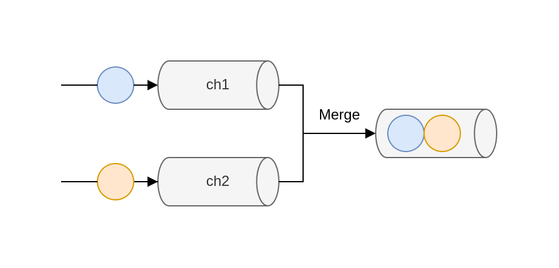

# Concurrency: Practice

This chapter covers

- Preventing common mistakes with goroutines and channels
- Understanding the impacts of using standard data structures alongside concurrent code
- Using the standard library and some extensions
- Avoiding data races and deadlocks

## Propagating an inappropriate context

Contexts are omnipresent when working with concurrency in Go, and in many situations, it may be recommended to propagate them. However, context  propagation can sometimes lead to subtle bugs, preventing subfunction from being correctly executed.

Let's consider the following example. We expose an HTTP handler that performs some tasks and returns a response. But just before returning the response, we also want to send it to a Kafka topic. We don't want to penalize the HTTP consumer latency-wide, so we want the publish action to be handled asynchronously wihtin a new goroutine. We assume that we have at our disposal a publish function that accepts a context so the action of publishing a message can be interrupted if the context is canceled.

```go
func handler(w http.ResponseWriter, r *http.Request) {
    response, err := doSomeTask(r.Context(), r)
    if err != nil {
        return
    }

    go func() {
        err := publish(r.Context(), response)
    }()

    writeResponse(response)
}
```

We have to know that the context attached to an HTTP request can be cancel in different conditions:

- When the client's connection closes
```go
func main() {
	http.HandleFunc("/", func(w http.ResponseWriter, r *http.Request) {
		ctx := r.Context()
		go func() {
			select {
			case <-ctx.Done():
				fmt.Printf("ctx.Err() %s\n", ctx.Err())
            default:
                publish("msg")
			}
		}()
		time.Sleep(time.Second * 5)

		w.Write([]byte("OK"))
	})
	http.ListenAndServe(":8080", nil)
}
```

- In the case of HTTP/2 request, when the request is canceled.
- When the response has been written back to the client.

```go
func main() {
	http.HandleFunc("/", func(w http.ResponseWriter, r *http.Request) {
		ctx := r.Context()
		go func() {
			select {
			case <-ctx.Done():
				fmt.Printf("ctx.Err() %s\n", ctx.Err())
			}
            default:
                publish("msg")
		}()

		w.Write([]byte("OK"))
	})
	http.ListenAndServe(":8080", nil)
}
```

In the first two cases, we probably handle things correctly. For example, if we get a response from doSomeTask but the client has closed the connection, it's probably OK to call publish with a context already canceled so the message isn't published. But what about the last case?

When the response has been written to the client, the context associated with the request will be canceled. Therefore, we are facing a race condition:

- If the response is written after the Kafka publication, we both return a response and publish a message successfully
- However, if the response is written before or during the Kafka publication, the message shouldn't be published.

In the latter case, calling publish will return an error because we returned the HTTP response quickly.

How can we fix this issue? One idea is to propagate the parent context. Instead, we would call publish with an empty context:

```go
// uses an empty context instead of the HTTP request context
err := publish(context.Background(), response)
```

Here, that would work. Regardless of how long it takes to write back the HTTP response, we can call publish.

But what if the context contained useful values? For example, if the context contained a correlation ID used for distributed tracing, we could correlate the HTTP request and the Kafka publication. Ideally, we would like to have a new context that is detached from the potential parent cancellation but still conveys the values.

The standard package doesn't provide an immediate solution to this problem. Hence, a possible solution is to implement our own Go context similar to the context provided, except that it doesn't carry the cancellation signal.

```go
type Context interface {
    Deadline() (deadline time.Time, ok bool)
    Done() <-chan struct{}
    Err() error
    Value(key any) any
}
```
The context's deadline is managed by the Deadline method and the Cancellation signal is managed via the Done and Err methods. 

```go
type detactContext struct {
	context.Context
}

func (d detactContext) Deadline() (time.Time, bool) {
	return time.Time{}, false
}

func (d detactContext) Done() <-chan struct{} {
	return nil
}

func (d detactContext) Err() error {
	return nil
}
```

Except for the Value method that calls the parent context to retrieve a value, the other methods return a default value so the context is never consider expired or canceled.

```go
err := publish(detach{ctx: r.Context()})
```

Now the context passed to publish will never expire or be canceled, but it will carry the parent context's values.

In summary, propagating a context should be done cautionsly. We illustrated that in this section with an example of handling an asynchronous action based on a context associated with an HTTP request. Because the context is canceled once we return the response, the asynchronous action also be stopped unexpectedly. Let's bear in mind the impacts of propagating a given context and, if necessary, that is always of propagation a given context and, if necessary, that it is always possible to create a custom context for a specific action.

## 62. Starting a goroutine without knowing when to stop it

Goroutines are easy and cheap to start, so easy and cheap that we may not necessarily have a plan for when to stop a new goroutine, which can lead to leaks. Not knowing when to stop a goroutine is a design issue and a common concurrency mistake in Go.

In terms of memory, a goroutine starts with a minimum stack size of 2 KB, which can grow and shrink as needed (the maximum stack size is 1 GB on 64-bit and 250 MB on 32-bit). Memory-wise, a goroutine can also hold variable references allocated to the heap. Meanwhile, a goroutine can hold resources such as HTTP or database connections, open files, and network sockets that should eventually be closed gracefully.

If goroutine is leaked, these kinds of resources will also be leaked.

Let's look at an example in which the point where a goroutine stops is unclear. Here, a parent goroutine calls a function that returns a channel and then creates a new goroutine that will keep receiving messages from this channel:

```go
ch := foo()
go func() {
    for v := range ch {
        // ...
    }
}()
```

The created goroutine will exit when ch is closed. But do we know exactly when this channel will be closed? It may not be evident, because ch is created by the foo function. If the channel is never closed, it's a leak. So, we should always be cautions about the exit points of a goroutine and make sure one is eventually reached.

```go
func main() {
    newWatcher()
}

type watcher struct {} 

func newWatcher() {
    w := watcher{}
    go w.Watch()
}
```

The problem with this code is that when the main goroutine exits (perhaps because of an OS signal or because it has a finite workload), the application is stopped. Hence, the resources created by watcher aren't closed gracefully. How can we prevent this from happening?

One option could be pass to newWatcher a context that will be canceled when main returns:

```go
func main() {
    ctx, cancel := context.WithCancel()
    defer cancel()

    newWatcher(ctx)
}

func newWatcher(ctx context.Context) {
    w := watcher{}
    go w.watch(ctx)
}
```

We propagate the context created to the watch method. When the context is canceled, the watcher struct should close its resources. However, can we guarantee that watch will have time to do so? Absolutely not - and that's a design flaw.

The problem is that we used signaling to convey that a goroutine had to be stopped. We didn't block the parent goroutine until the resources had been closed.

```go
func main() {
    w := newWatcher()
    defer w.Close()

    // Run the application
}

func newWatcher() watcher {
    w := watcher{}
    go w.watch()
    return w
}

func (w watcher) close() {
    // close the resources
}
```
Watcher has a new method: close. Instead of signaling watcher that it's time to close its resources, we now call this close method, using defer to guarantee that the resources are closed before the application exits.

In summary, let's be mindful that a goroutine is a resource like any other that must eventually be closed to free memory or other resources. Starting a goroutine without knowing when to stop it is a design issue. Whenever a goroutine is started, we should have a clear plain about when it will stop. Last but not least, if a goroutine creates resources and its lifetime is bound to the lifetime of the application, it's probably safer to wait for this goroutine to complete before existing the application. This way, we can ensure that the resources can be freed.

## 63. Not being careful with goroutines and loop variables

Mishandling goroutines and loop variables is probably one of the most common mistakes by Go developers when writing concurrent applications.

```go
s := []int{1, 2, 3}

for _, i := range s {
    go func() {
        fmt.Print(i)
    }()
}
```

The output of this code isn't deterministic. For example, sometimes it print 233 and other times 333. What's the reason?

In this example, we create new goroutines from a clousure. As a reminder, a closure is a function value that references variables from outside its body: here, the i variable. We have to know that when a closure goroutine is executed, it doesn't capture the values when the goroutine is created. Instead, all the goroutines refer to the exact same variable. When a goroutines runs, it prints the value of i at the time fmt.Print is execute. Hence, i may have been modified since the goroutine was launched.

What are the solutions if we want each closure to access the value of i when the goroutine is created? The first option, if we want to keep using a closure, involves creating a new variale:

```go
for _, i := range s {
    val := i
    go func() {
        fmt.Print(val)
    }()
}
```

The second option no longer relies on a closure and instead uses an actual function

```go
for _, i := range {
    go func(val int) {
        fmt.Println(val)
    }(i)
}
```

We still execute an anonymous function within a new a goroutine (we don't run go f(i)), but this time it isn't a closure. The function doesn't reference val as a variable from outside its body; val is now part of the function input.

## 64. Expecting deterministic behavior using select and channels

One common mistake made by Go developers while working with channels is to make wrong assumption about how select behaves with multiple channels. A false assumption can lead us to subtle bugs that may be hard to identify and reproduce.

Let's imagine that we want to implement a goroutine that needs to receive from two channels:

- messageCh for new messages to be processed.
- disconnectCh to receive notifications conveying disconnections. In that case, we want to return from the parent function.

Of these two channels, we want to prioritize messageCh. For example, if a disconnection occurs, we want to ensure that we have received all the messages before returning.

```go
for {
    select {
        case v := <- messageCh:
            fmt.Println(v)
        case <- disconnectCh:
            fmt.Println("disconnect", "return")
            return
    }
}
```

```go
func main() {
	messageCh := make(chan int, 10)
	for i := 0; i < 10; i++ {
		messageCh <- i
	}

	disconnectCh := make(chan int, 1)
	disconnectCh <- 1

	for {
		select {
		case msg := <-messageCh:
			fmt.Println("receive message:", msg)
		case abortMsg := <-disconnectCh:
			fmt.Println("abort message:", abortMsg)
            return
		}
	}
}
```

If one or more of the communications can proceed, a single one that can proceed is chosen via a uniform pseudo-random selection.

Unlike a switch statement, where the first case with a match wins, the select statment selects randomly if multiple options are possible.

This behavior might look odd at first, but there's a good reason for it: to prevent possible starvation. Suppose the first possible communication chosen is based on the source order. In that case, we may fall into a situation where, for example, we only receive from one channel because of a fast sender. To prevent this, the language designers decided to use a random selection.

Coming back to our example, even though case v := <- messageCh is first in source order, if there's a message in both messageCh and disconnectCh, there is no guarantee about which case will be chosen.  For that reason, the example's behavior isn't deterministic. We may receive 0 messages, or 5, or 10.

How can we overcome this situation? There are different possibilities if we want to receive all the messages before returning in case of a disconnection.

If there's single producer goroutine, we have two options:

- Make messageCh an unbuffered channel instead of a buffered channel. Because the sender goroutine blocks until the receiver goroutine is ready, this approach guarantees that all the messages from messageCh are received before the disconnection from disconnectCh.

```go
func main() {
	messageCh := make(chan int)
	disconnectCh := make(chan int, 1)
	go func() {
		for i := 0; i < 10; i++ {
			messageCh <- i
		}

		disconnectCh <- 1
	}()

	for {
		select {
		case msg := <-messageCh:
			fmt.Println("receive message:", msg)
		case abortMsg := <-disconnectCh:
			fmt.Println("abort message:", abortMsg)
			return
		}
	}
}
```

- Use a single channel instead of two channels. For example, we can define a struct that conveys either a new message or a disconnection. Channels guarantee that the order for the messages sent is the same as for the messages received, so we can ensure that the disconnection is received last.

```go
func main() {
	messageCh := make(chan message)
	go func() {
		for i := 0; i < 10; i++ {
			if i == 9 {
				messageCh <- message{
					disconnect: true,
				}
			} else {
				messageCh <- message{
					data:       i,
					disconnect: false,
				}
			}
		}
	}()

	for {
		select {
		case msg := <-messageCh:
			if msg.disconnect {
				fmt.Println("disconnected")
				return
			}
			fmt.Println("receive message:", msg)
		}
	}
}
```

If we fall into the case where we have multiple producer goroutines, it may be impossible to guarantee which one writes first. Hence, whether we have an unbuffered messageCh channel, it will lead to a race condition among the producer goroutines. In that case, we can implement the following solution:

1. Receive from either messageCh or disconnectCh.
2. If a disconnection is received

- Read all the existing messages in messageCh, if any.
- Then return.

```go
func main() {
	messageCh := make(chan int, 10)
	disconnectCh := make(chan int)

	go func() {
		for i := 0; i < 10; i++ {
			messageCh <- i
		}
		disconnectCh <- 10
	}()

	for {
		select {
		case v := <-messageCh:
			fmt.Printf("Message: %d\n", v)
		case <-disconnectCh:
			for {
				select {
				case v := <-messageCh:
					fmt.Printf("Message: %d\n", v)
				default:
					fmt.Println("Disconnect")
					return
				}
			}
		}
	}
}
```

This solution uses an inner for/select with two cases: one on messageCh and a default case. Using default in a select statement is chosen only if none of the other cases match. In this case, it means we will return only after we have received all the remaining messages in messageCh.

This is a way to ensure that we receive all the remaining messages from a channel with a receiver on multiple channels. Of course, if a messageCh is sent after the goroutine has returned (for example, if we have multiple producer goroutines), we will miss this message.

When using select with multiple channels, we must remember that if multiple options are possible, the first case in the source order does not automatically win. Instead, Go selects randomly, so there's no guarantee about which option will be chosen. To overcome this behavior, in the case of a single producer goroutine, we can use either unbuffered channels or a single channel. In the case of multiple producer goroutines, we can use inner selects and default to handle prioritizations.

## 65. Not using notification channels

Channels are a mechanism for communication across goroutines via signaling. A signal can be either with or without data. But for Go programmers, it's not always straightforward how to tackle latter case.

We will create a channel that will notify us whenever a certain disconnection occurs.

```go
disconnectCh := make(chan book)
```

Because it's a channel of Booleans, we can receive either true or false messages. It's probably clear what true conveys. But what does false mean? Does it mean we haven't been disconnected? And in this case, how frequently will we receive such a signal? Does it mean we have reconnected?

If that's the case, meaning we don't need a specific value to convey some information, we need a channel without data. The idiomatic way to handle it is a channel of empty structs: chan struct{}.

In Go, an empty struct is a struct without any fields. Regardless of the architecture, it occupies zero bytes of storage, as we can verify using unsafe.Sizeof:

```go
var s struct{}
fmt.Println(unsafe.Sizeof(s))
0
```

**NOTE** Why not use an empty interface (var i interface{})? Because an empty interface isn't free; it occupies 8 bytes on 32-bit architecture and 16 bytes on 64 bits architecture.

An empty struct is a de facto standard to convey an absense of meaning. For example, if we need a hash set structure (a collection of unique elements), we should use an empty struct as a value: map[K]struct{}.

A channel can be with or without data. If we want to design an idiomatic API in regard to Go standards, let's remember that a channel without data should be expressed with a chan struct{} type. This way, it clarifies for receivers that they shouldn't expect any meaning from a message's content only the fact that they have received a message. In Go, such channels are called notification channels.

## 66. Not using nil channels

A common mistake while working with Go and channels is forgetting that nil channels can sometimes be helpful. So what are nil channels, any why should we care about them? That is the scope of this section.

Let's start with a goroutine that creates a nil channel and waits to receive a message. What should this code do?

```go
var ch chan int
<-ch
```

ch is a chan int type. The zero value of a channel being nil, ch is nil. The goroutine won't panic; however, it will block forever.

The principle is the same if we send a message to a nil channel. This goroutine blocks forever:

```go
var ch chan int
ch <- 0
```

**Send or receive from nil channel will block forever**

Then what's the purpose of Go allowing messages to be received from or sent to a nil channel? We will discuss this question with a concrete example.

We will implement a func merge(ch1, ch2 <- chan int) <- chan int function to merge two channels into a single channel. By merging them, we mean each message received in either ch1 or ch2 will be sent to the channel returned.



Let's first write a naive implementation that spins up a goroutine and receives from both channels (the resulting channel will be a buffered channel with one element):

```go
func merge(ch1, ch2 <-chan int) <-chan int {
	ch := make(chan int, 1)
	go func() {
		for v := range ch1 {
			ch <- v
		}
		for v := range ch2 {
			ch <- v
		}
		close(ch)
	}()

	return ch
}
```
The main issue within this first version is that we receive from ch1 and then we receive from ch2. It means we won't receive from ch2 until ch1 is closed. This doesn't fit our use case, as ch1 may be open forever, so we want to receive from both channels simultaneously.

Let's write an improved version with concurrent receivers using select:

```go
func merge(ch1, ch2 <-chan int) <-chan int {
	ch := make(chan int, 1)
	go func() {
		for {
			select {
			case v := <-ch1:
				ch <- v
			case v := <-ch2:
				ch <- v
			}
		}
		close(ch)
	}()

	return ch
}
```

The select statement lets a goroutine wait on multiple operations at the same time. Because we wrap it inside a for loop, we should repeatedly receive messages from one or the other channel, correct? But does this code even work?

One problem is that the close(ch) statement is unreachable. Looping over a channel using the range operator breaks when the channel is closed. However, the way we implemented a for/select doesn't catch when either ch1 or ch2 is closed. Even worse, if at some point ch1 or ch2 is closed, here's what a receiver of the merged channel will receive when logging the value:

```txt
0
0
0
```

So a receiver will repeatedly receive an integer equal to zero. Why? Receiving from a closed channel is a non-blocking operation:

```go
func main() {
	ch1 := make(chan int, 1)
	close(ch1)
	ch2 := make(chan int, 1)
	close(ch2)
	println(<-ch1, <-ch2)
}
```
Whereas we may expect this code to either panic or block, instead it runs and prints 0 0. What we catch here is the closure event, not an actual message. To check whether we receive a message or a closure signal, we must do it this way:

```go
func main() {
	ch1 := make(chan int, 1)
	close(ch1)
   v, open := <-ch1
   println(v, open)
}
```

Using the open Boolean, we can now see whether ch1 is still open:

```txt
0 false
```

Meanwhile, we also assign 0 to v because it's the zero value of an integer.

Let's take a step back and see what the best way would be to deal with this problem. We have to receive from both channels. Then, either: 

- ch1 is closed first, so we have to receive from ch2 until it is closed.
- ch2 is closed first, so we have to receive from ch1 until it is closed. 

```go
func merge(ch1, ch2 <-chan int) <-chan int {
	ch := make(chan int, 1)
	ch1Closed, ch2Closed := false, false
	go func() {
		for {
			select {
			case v, open := <-ch1:
				if !open {
					ch1Closed = true
					break // break select
				}
				ch <- v
			case v, open := <-ch2:
				if !open {
					ch2Closed = true
					break // break select
				}
				ch <- v
			}
			if ch1Closed && ch2Closed {
				close(ch)
				return
			}
		}
	}()

	return ch
}
```

We define two Booleans ch1Closed and ch2Closed. Once we receive a message from a channel, we check whether it's a closure signal. If so, we handle it by making the channel as closed. After both channels are closed, we close the merged channel and stop the goroutoinen

We define two Booleans ch1Closed and ch2Closed. Once we receive a message from a channel, we check whether it's a closure signal. If so, we handle it by making the channel as closed. After both channels are closed, we close the merged channel and stop the goroutine.

What is the problem with this code, apart from the fact that it's starting to get complex? There is one major issue: when one of the two channels is closed, the for loop will act as a busy-waiting loop, meaning it will keep looping even though no new message is received in the other channel. We have to keep in mind the behavior of the select statement in our example. This will lead to wasting CPU cycles and must be avoided. Therefore, our solution isn't viable.

It's the right time to come back to nil channels. As we mentioned, receiving from a nil channel will block forever. How about using this idea in our solution? Instead of setting a Boolean after a channel is closed, we will assign this channel to nil.

```go
func main() {
	ch1 := make(chan int, 5)
	for i := 0; i < 5; i++ {
		ch1 <- i
	}
	close(ch1)
	ch2 := make(chan int, 5)
	for i := 0; i < 5; i++ {
		ch2 <- i
	}
	close(ch2)
	ch := merge(ch1, ch2)
	for v := range ch {
		print(v, "\t")
	}
}

func merge(ch1, ch2 <-chan int) <-chan int {
	ch := make(chan int, 1)
	go func() {
		for ch1 != nil || ch2 != nil {
			select {
			case v, open := <-ch1:
				if !open {
					ch1 = nil
					break // break select
				}
				ch <- v
			case v, open := <-ch2:
				if !open {
					ch2 = nil
					break // break select
				}
				ch <- v
			}
		}
		close(ch)
	}()

	return ch
}
```

This is the implementation we've been waiting for. We cover all the different cases, and it doesn't require a busy loop that will waste CPU cycles.

In summary, we have seen that waiting or sending to a nil channel is a blocking action, and this behavior isn't useless. As we have seen throughout the example of merging two channels, we can use nil channels to implement an elegant state machine that will remove one case from a select statement. Let's keep this idea in mind: nil channels are useful in some conditions and should be part of the Go developer's toolset when dealing with concurrent code.

## 67. Being puzzled about channel size

When we create a channel using the make built-in function, the channel can be either unbuffered or buffered. Related to this topic, two mistakes happen fairly frequently: being confused about when to use one or the other; and, if we use a buffered channel, what size to use. Let's examine these ponits.

First, let's remember the core concepts. An unbuffered channel is a channel without any capacity. It can be created by either omitting the size or providing a 0 size:

```go
ch1 := make(chan int)
ch2 := make(chan int, 0)
```

Using an unbuffered channle (sometimes called a synchronous channel), the sender will block until the receiver receives data from the channel.

Conversely, a buffered channel has a capacity, and it must be created with a size greater than or equal to 1:

```go
ch3 := make(chan int, 1)
```

With a buffered channel, a sender can send messages while the channel isn't full. Once the channel is full, it will block until a receiver goroutine receives a message.

```go
ch3 := make(chan int, 1)
ch3 <- 1
ch3 <- 2 // blocking
```
Let's take a step back and dicuss the fundamental differences between these two channel types. Channels are a concurrency abstraction to enable communication among goroutines. But what about synchronization? In concurrency, synchronization means we can guarantee that multiple goroutines will be in a known state at some point. For example, a mutex provides synchronization because it ensures that only one goroutine can be in a critical section at the same time. Regarding channels:

- An unbuffered channel enables synchronization. We have the guarantee that two goroutines will be in a known state: one receiving and another send a message.
- A buffered channel doesn't provide any strong synchronization. Indeed, a producer goroutine can send a message and then continue its execution if the channel isn't full. The only guarantee is that a goroutine won't receive a message before it is sent. But this is only a guarantee because of causality (you don't drink coffee before you prepare it).

It's essential to keep in mind this fundamental distinction. Both channel types enable communication, but only one provides synchronization. If we need synchronization, we must use unbuffered channels. Unbuffered channels may also be easier to reason about: buffered channels can lead to obscure deadlocks that would be immediately apparent with unbuffered channels. 

There are other cases where unbuffered channels are preferable: for example, in the case of a notification channel where the notification is handled via a channel closure (close(ch)).

But what if we need a buffered channel? What size should we provide? The default value we should use for buffered channels is its minimum: 1. So, we may approach the problem from this standpoint: is there any good reason not to use a value of 1?

- While using a worker polling-like pattern, meaning spinning a fixed number of goroutines that need to send data to a shared channel. In that case, we can tie the channel size to the number of goroutines created.
- When using channels for rate-limiting problems. For example, if we need to enforce resource utilization by bounding the number of requests, we should set up the channel size according to the limit.

If we are outside of these cases, using a different channel size should be done cautionsly. It's pretty common to see a codebase using magic numbers for setting a channel size:

```go
ch := make(chan int, 40)
```

Why 40? What's the rationale? Why not 50 or even 1000? Setting such a value should be done for a good reason. Perhaps it was decided following a benchmark or performance tests. In many cases, it's probably a good idea to comment on the rationale for such a value. 

Let's bear in mind that deciding about an accurate queue size isn't an easy problem. First, it's a balance between CPU and memory. The smaller the value, the more CPU contention we can face. But the bigger the value, the more memory will need to be allocated.

Queues are typically always close to full or close to empty due to the differences in pace between consumers and producers. They very rarely operate in a balanced middle ground where the rate of production and consumption is evenly matched.

## 68. Forgetting about possible side effects with string formatting

### etcd data race

etcd is a distributed key-value store implemented in Go. It is used in many projects, including K8s, to store all cluster data. It provides an API to interace with a cluster. The Watcher interface is used to be notified of data changes:

```go
type Watcher interface {
    Watch(ctx context.Context, key string, opts ...OpOption) WatchChan
    Close() error
    // streams hold all active gRPC streams keyed by ctx value
}

type watcher struct {
    streams map[string]*watchGrpcStream
}
```

A potentially mutable value is a context can introduce additional complexity to prevent data races. This is probably a design decision to be considered with care.

This example illustrates that we have to careful about the side effects of string formatting in concurrent applications - in this case, a data race.

### Deadlock
