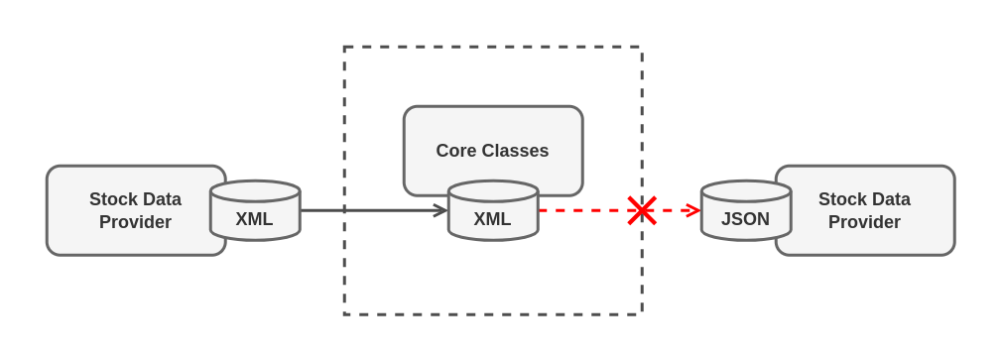

# Adapter

Adapter is a structural design pattern that allows objects with incompatible interfaces to to collaborate.

## Problem

Imagine that you're creating a stock market monitoring app. The app downloads the stock data from multiple sources in XML format and then displays nice-looking charts and diagrams for the user.

At some point, you decide to improve the app by integrating a smart 3-rd party analytics library. But there's a catch: the analytics library only works with data in JSON format.

*You can't use the analytics library "as is" because it expects the data in a format that's incompatible with your app*

You could change the library to work with XML. However, this might break some existing code that relies on the library. And worse, you might not have access to the library's source code in the first place, making this approach impossible.

## Solution

You can create an adapter. This is a special object that converts the interface of one object so that another object can understand it.

An adapter wraps one the objects to hide the complexity of conversion happening behind the scenes. The wrapped object isn't even aware of the adapter. For example, you can wrap an object that operates in meters and kilometers with an adapter that converts all of the data to imperial units such as feet and miles. 

Adapters can not only convert data into various formats but can also help objects with different interfaces collaborate. Here's how it works:

1. The adapter gets an interface, compatible with one of the existing objects.
2. Using this interface, the existing object can safely the adapter's methods.
3. Upon receiving a call, the adapter passes the request to the second object, but in a format and order that the second object expects.

Sometimes it's even possible to create a two-way adapter that can convert the calls in both directions.

## Real-World Analogy

When you travel from the US to Europe for the frist time, you may get a surprise when trying to charge your laptop. The power plug and sockets standards are different in different countries. That's why your US plug won't fit the German socket. The problem can be solved by using a power plug adapter that has American-style socket and the European-style plug.

## Structure
