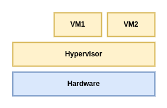
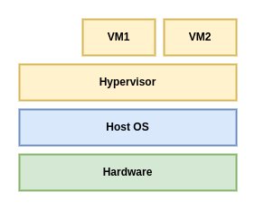

# Understanding Linux Virtualization

Virtualization is the technology that started a big technology shift toward IT consolidation, which provides more efficient use of resources and the cloud as more integrated, automated, and orchestration version of virtualization with a focus on not only virtual machines but also additional services. 

## Linux virtualization and how it all started

// FEAT: xzy
Virtualization is a concept that creates virtualized resources and maps them to physical resources. This process can be done using specific hardware functionality (partitioning, via some kind of partition controller) or software functionality (hypervisor). So, as an example, if you have a physical PC-based server with 16 cores running a hypervisor, you can easily create one or more virtual machines with two cores each and start them up. Limits regarding how many virtual machines you can start is something that's vendor-based. In any case, hypervisor is going to be go-to guy that's going to try to manage that as efficiently as possible so that all of the virtual machine workloads get as much time on the CPU as possible.  

```go
type virtualizedResources struct{}
type physicalResources struct{}

type virtualizationConcept map[virtualizedResources]physicalResources

func newVirtualization(processsType string) virtualization {
	switch processsType {
	case "using hardware functionality":
		// partitioning, partition controller
		var virtualized virtualization
		return virtualized

	case "software functionality":
		// hypervisor
		var virtualized virtualization
		return virtualized
	}

	return nil
}
```

Specifically, I remember thinking about the possibilities - how cool it would be to run an OS, and then another couple of OSes on top of that. Working in the publishing industry, you might imagine how many advantages that would offer to anyone's workflow, and it remeber really getting excited about it.

Virtualization solutions - Red Hat with KVM, Microsoft with Hyper-V, VMWare with ESXi, Oracle with Oracle VM,... This led to the development of various cloud solutions such as EC2, AWS, Office 365, Azure, vCloud...

Going back to October 2003, with all of the changes that were happening in the IT industry, there was one that was really important for this book and virtualization for Linux in general: the introduction of the first open source Hypervisor for x86 architecture, called Xen. 

Technically speaking, KVM uses a different, modular approach that transforms Linux kernels into fully function hypervisors for supported CPU architectures. When we say supported CPU architectures, we're talking about the basic requirement for KVM virtualization - CPUs need to support hardware virtualization extensions, known as AMD-V or Intel VT. To make things a bit easier, let's just say that you're really going to have to try very hard to find a modern CPU that doesn't support these extensions.

## Types of virtualization

There are various types of virtualization solutions, all of which are aimed at different use cases and are dependent on the fact that we've virtualization a different piece of the hardware or software stack. There are different types of virtualization in terms of how you're virtualizing - by partitioning, full virtualization, paravirtualization, hybrid virtualization, or container-based virtualization.

So, let's first cover the five different types of virtualization in today's IT based on what you're virtualizing:

**Desktop virtualization (Virtual Desktop Infrastructure (VDI))**

This is used by a lot of enterprise companies and offers huge advantages for a lot of scenarios because of the fact that users aren't dependent on a specific device that they're using to access their desktop system. They can connect from a mobile phone, tablet, or a computer, and the can usually connect to their virtualized desktop from anywhere as if they're sitting at their workplace and using a hardware computer. Benefits include easier, centralized management and monitoring much more simplified update workflows (you can update the base image for hundreds of virtual machines in a VDI solution)

https://youtu.be/weII6qT59mQ

**Server virtualization**

This is used by a vast majority of IT companies today. It offers good consolidation of server virtual machines versus physical servers, while offering many other operational advantages over regular, physical servers - easier to backup, more energy efficient, more freedom in terms of moving workloads from server to server, and more.

**Application virtualization**

This is usually implemented using some kind of streaming/remote protocol technology such as Microsoft App-V, or some solution that can package applications into volumes that can be mounted to the virtual machine and profiled for consistent settings and delivery options, such as VMWare App Volumes.

**Networking virtualization**

More broader, cloud-based concept called Software-Defined Networking (SDN): This is a technology that creates virtula networks that are independent of the physical networking devices, such as switches. SDN is an extension of the network virtualization idea that can span across multiple sites, locations, or data centers. In terms of the concept of SDN, entire network configuration configuration is done in software, without you necessarily of network virtualization is how easy it is for you to manage complex networks that span multiple locations without having to do massive, physical network reconfiguration for all the physical devices on the network data path.

**Storage virtualization (Software-Defined Storage)**

This is a technology that creates virtual storage devices out of pooled, physical storage devices that we can centrally manage as a single storage device. This means that we're creating some sort of abstraction layer that's going to isolate the internal functionality of storage devices from computers, applications, and other types of resources. SDS, as an extensions of that, decouples the storage software stack from the hardware it's running on by abstracting control and management planes from the underlying hardware, as well as offering different types of storage resources to virtual machines and applications 

If you take a look at these virtualization solutions and scale them up massively, that's when you realize that you're going to need various tools and solutions to efficiently manage the ever-growing infrastructure, hence the development of various automatization and orchestration tools.


If we're talking about how we're virtualizing a virtual machine as an object, there are different types of virtualization;

**- Partitioning:** This is type of virtualization in which a CPU is divided into different parts, and each part works as an individual system. This type of virtualization solution isolates a server into partitions, each of which can run a separate OS

**- Full virtualization:** In full virtualization, a virtual machine is used to simulate regular hardware while not being aware of the fact that it's virtualized. This is done for compatibility reasons - we don't have to modify the guest OS that we're going to run in a virtual machine. We can use a software - and hardware-based approach for this:

- Software-based: Used binary translation to virtualize the execution  of sensitive instruction sets while emulating hardware using software, which increases overhead and impacts scalability.

- Hardware-based: Removes binary translation from the equation while interfacing with a CPU's virtualization features (AMD-V, Intel V-T), which, in turn, mean that instruction sets are being executed directly on the host CPU. This is what KVM does.

**- Paravirtualization**

This is a type of virtualization in which the guest OS understands the fact that it's being virtualized and needs to be modifed, along with its drives, so that it can run on top of the virtualization solution.

**- Hybrid virtualization**

**- Container-based virtualization:** This is a type of application virtualization that use containers. A container is an object that packages an application and all its dependencies so that the application can be scaled out and rapidly deployed without needing a virtual machine or a hypervisor. Keep in mind that there are technologies that can operate as both a hypervisor and a container host at the same time.

## Using the hypervisor/virtual machine manager

As its name suggests, the Virtual Machine Manager (VMM) or hypervisor is a piece of software that is responsible for monitoring and controlling virtual machines or guess OSes. The hypervisor/VMM is responsible for ensuring different virtulization management tasks, such as providing virtual hardware, virtual machine life cycle management, migrating virtual machines, allocating resources in real time, defining policies for virtual machine management, and so on. The system hardware, such as the processor, memory and so on, must be allocated to these guest OSes according to their configuration, and the VMM can take care of this task. Due to this, the VMM is a critical component in a virtualization environment.

In terms of types, we can categorize hypervisors as either type 1 and type 2.

### Type 1 and type 2 hypervisors

Hypervisors are mainly categorized as either type 1 or type 2 hypervisors, based on where they reside in the system or, in other terms, whether the underlying OS is present in the system or not. But there is no clear or standard definition of type 1 and type 2 hypervisors. If the VMM/hypervisor runs directly on top of the hardware, its generally considered to be a type 1 hypervisor. If there is an OS present, and if the VMM/hypervisor operates as a separate layer, it will be considered as type 2 hypervisor. Once again, this concept is open to debate and there is no standard definition for this. A type 1 hypervisor directly interacts with the system hardware; it does not need any host OS. You can directly install it on a bare-metal system and make it ready to host virtual machines. Type 1 hypervisors are also called bare-metal, embedded, or native hypervisors. oVirt-node, VMware ESXi/vSphere, and Red Hat Enterprise Virtualization Hypervisors (RHEV-H) are examples of type 1 Linux hypervisor.



Here are the advantages of type 1 hypervisors:

- Easy to install and configure.
- Small in size; optimized to give most of the physical resources to the hosted guest (vm).
- Generates less overhead as it comes with only the applications needed to run virtual machines.
- More secure, because problems in one guest system do not affect the other guest systems running on the hypervisor.

However, a type 1 hypervisor doesn't favor customization. Generally, there will be some restrictions when you try to install and third-party applications or drivers on it.

On the other hand, a type 2 hypervisor resides on top of the OS, allowing you to do numerous customizations. Type 2 hypervisors are also known as hosted hypervisors that are dependent on the host OS for their operations. The main advantage of type 2 hypervisors is the wide range of hardware support, because the underlying host OS controls hardware access. The following diagram provides an illustration of the type 2 hypervisor design concept:



When do we use type 1 and type 2 hypervisors? It primarily depends on whether we already have an OS running on a server where we want to deploy virtual machines. For example, if we're already running a Linux desktop on our workstation, we're probably not going to format our workstation and install a hypervisor - it just wouldn't make any sense. That's a good example of type 2 hypervisor use case. Well-known type 2 hypervisors include VMware Player, Workstation, Fusion, and Oracle VirtualBox. On the other hand, if we're specifically aiming to create a serever that we're going to use to host virtual machines, then that's type 1 hypervisor territory.

## Open source virtualization projects

### KVM

KVM represents the lastest generation of open source virtualization. The goal of the project was to create a modern hypervisor that builds on the experience of previous generations of technologies and leverage that builds on the experience of previous generations of technologies and leverages the modern hardware available today (VT-x, AMD-V and so on).

KVM simply turns the Linux kernel into a hypervisor when you install the KVM kernel module. However, as the standard Linux kernel is the hypervisor, it benefits from the changes that were made to standard kernel (memory support, scheduler, and so on). For I/O emulations, KVM uses a userland software, QEMU; this is a userland program that does hardware emulation.

QEMU emulates the processor and a long list of peripheral devices such as the disk, network, VGA, PCI, USB serial/parallel ports and so on to build a complete piece of virtual hardware that the guest OS can be installed on. This emulation is powered by KVM.

## What Linux virtualization offers you in the cloud

In term of the Infrastructure-as-a-Service (IaaS) cloud models, these are the biggest IaaS cloud providers now, although there are others. If you go through this list, you'll soon realize that most of these cloud platforms are based on Linux (just as an example, Amazone uses Xen and KVM, while Google Cloud uses KVM virtualization).

Currently, there are three main open source cloud projects that use Linux Virtualization to build IaaS solutions for the private and/or hybird cloud:

- OpenStack: A fully open source cloud OS that consists of several open source sub projects that provide all the building blocks to create an IaaS cloud. KVM is the most used hypervisor in OpenStack deployments. 

- CloudStack: This is another open source Apache Software Foundation controlled cloud project used to build and manage highly scalable multitenant IaaS clouds and is fully compatible with EC2/S3 APIs. Although it supports all top-level Linux Hypervisors, most CloudStack users choose Xen as it tighly integrated with CloudStack.

## Summary

In this chapter, we covered the basic of virtualization and its different types. Keeping in mind the importance of virtualization in today's large-scale IT world is beneficial as it's good to know how these concepts can be tied together to create a bigger picture

## Questions

1. Which types of hypervisors exist?

Type 1 hypervisor, Type 2 hypervisor

2. What are containers?

3. What is container-based virtualization?

4. What is OpenStack?
