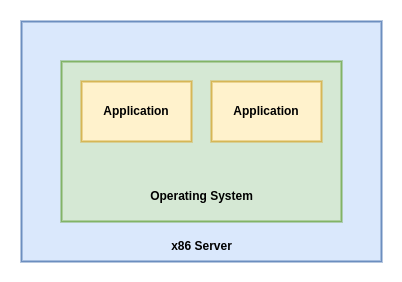
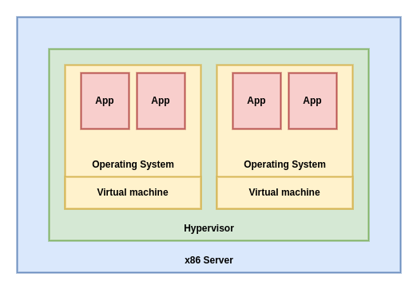

# KVM as a Virtualization Solution

Implement libvirt, QEMU, and KVM.

In this chapter, we will cover the following topics:

- Virtualization as a concept.
- The internal workings of libvirt, QEMU, and KVM.
- How all these communicate with each other to provide virtualization.

## Virtualization as a concept

Virtualization is a computing approach that decouples hardware from software. It provides a better, more efficient, and programmatic approach to resource splitting and sharing between various workloads - virtual machines running OSes, and applications on top of them.

If we were to compare traditional, physical computing of the past with virtualization, we can say that by virtualizing, we get the possibility to run multiple guest OSes (multiple virtual servers) on the same piece of hardware (same physical server). If we're using a type 1 hypervisor, this means that the hypervisor is going to be in charge of letting the virtual servers access physical hardware. This is because there is more than one virtual server using the same hardware as the other virtual servers on the same physical server. This is usually supported by some kind of scheduling algorithm that's implemented programmatically in hypervisors so that we can get more efficiency from the same physical server. This is usually supported by some kind of scheduling algorithm that's implemented programmatically in hypervisor so that we can get more efficency from the same physical server.

### Virtualized versus physical environments

Let's try to visualize these two approaches - physical and virtual. In a physical server, we're installing an OS right on top of the server hardware and running applications on top of that OS. 

In a virtualized world, we're running a hypervisor (such as KVM), and virtual machines on top of that hypervisor. Inside these virtual machines, we're running the same OS and application, just like in the physical server. The virtualized application is shown in the following diagram:

There are still various scenarios in which the physical approach is going to be needed. For example, there are still thousands of applications on physical servers all over the world because these servers can't be virtualized. These can different reasons why they can't be virtualized. For example, the most common reason is actually the simplest reason - maybe these applications are being run on an OS that's not on the supported OS list run by the virtualization software vendor. That can mean that you can't virtualize that OS/application combination because that OS doesn't support some virtualized hardware.

### Why is virtualization so important?

### Hardware requirements for virtualization

### Software requirements for virtualization
