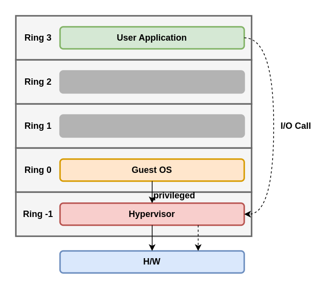

# KVM as a Virtualization Solution

Implement libvirt, QEMU, and KVM.

In this chapter, we will cover the following topics:

- Virtualization as a concept.
- The internal workings of libvirt, QEMU, and KVM.
- How all these communicate with each other to provide virtualization.

## Virtualization as a concept

Virtualization is a computing approach that decouples hardware from software. It provides a better, more efficient, and programmatic approach to resource splitting and sharing between various workloads - virtual machines running OSes, and applications on top of them.

If we were to compare traditional, physical computing of the past with virtualization, we can say that by virtualizing, we get the possibility to run multiple guest OSes (multiple virtual servers) on the same piece of hardware (same physical server). If we're using a type 1 hypervisor, this means that the hypervisor is going to be in charge of letting the virtual servers access physical hardware. This is because there is more than one virtual server using the same hardware as the other virtual servers on the same physical server. This is usually supported by some kind of scheduling algorithm that's implemented programmatically in hypervisors so that we can get more efficiency from the same physical server. This is usually supported by some kind of scheduling algorithm that's implemented programmatically in hypervisor so that we can get more efficency from the same physical server.

### Virtualized versus physical environments

Let's try to visualize these two approaches - physical and virtual. In a physical server, we're installing an OS right on top of the server hardware and running applications on top of that OS. 

In a virtualized world, we're running a hypervisor (such as KVM), and virtual machines on top of that hypervisor. Inside these virtual machines, we're running the same OS and application, just like in the physical server. The virtualized application is shown in the following diagram:

There are still various scenarios in which the physical approach is going to be needed. For example, there are still thousands of applications on physical servers all over the world because these servers can't be virtualized. These can different reasons why they can't be virtualized. For example, the most common reason is actually the simplest reason - maybe these applications are being run on an OS that's not on the supported OS list run by the virtualization software vendor. That can mean that you can't virtualize that OS/application combination because that OS doesn't support some virtualized hardware, most commonly a network or a storage adapter. The same general idea applies to the cloud as well moving things to the cloud isn't always the best idea, as we will describe later in this book. 

### Why is virtualization so important?

A lot of applications that we run today don't scale up well (adding more CPU, memory, or other resources) - they just aren't programmed that way or can't seriously parallelized. That means that if an application can't use all the resources as it disposal, a server is going to have a lot of slack space - and this time, we're not talking about disk slack space; we're actually referring to compute slack space, so slack space at CPU and memory levels. This means that we're underutilizing the capabilities of the server that we paid for - with the intention for it to be used fully, not partially.

In conclusion, for PC-based servers, looking from the CPU perspective, switching to multi-core CPUs was an opportune moment to start working toward virtualization as the concept that we know and love today.

### Hardware requirements for virtualization

After the introduction of software-based virtualization on PCs, a lot of development was made, both on the hardware sides. The end results - as we mentioned in the previous chapter - was a CPU that had an awful features and power. This led to a big push toward hardware - assisted virtualization, which - on paper - looked like the faster and more advanced way to go. Just as an example, there were a whold bunch of CPUs that didn't support hardware-assisted virtualization in the 2003-2006 timeframe, such as the Intel Pentium 4, Pentium D, the intial AMD Athlons, ... It took both Intel and AMD until 2006 to have hardware-assisted virtualization as a feature that's more widely available on their respective CPUs. Furthermore, it took some time to have 64-bit CPUs, and there was little or no interest in running hardware-assisted virtualization on 32-bit architectures. The primary reason for this was the fact that you couldn't allocate more than 4 GB of memory, which severely limited the scope of using virtualization as a concept.

Keeping all of this in mind, these are the requirements that we have to comply with today so that we can run modern-day hypervisors with full hardware-assisted virtualization support. 

**- Second-Level Address Translation, Rapid Virtualization Indexing, Extended Page Tables (SLAT/RVI/EPT) support:** This is the CPU technology that a hypervisor uses so that it can have a map of virtual-to-physical memory addresses. Virtual machines operate in a virtual memory space that can be scattered all over the physical memory, so by using additional map such as SLAT/EPT, (implemented via an additional Transaction Lookaside Buffer, or TLB), you're reducing latency for memory access to the computer memory's physical addresses, which would be messy, insecure, and latency-pronce.

**Intel VT or AMD-V support:** If an Intel CPU has VT (or an AMD CPU has AMD-V) that means that is supports hardware virtualization extensions and full virtualization.

**Long mode support** which means that the CPU has 64-bit support. Without a 64-bit architecture, virtualization would be basically useless because you'd have only 4GB of memory to give virtual machines (which is a limitation of the 32-bit architecture). By using a 64-bit architecture, we can allocate much more memory (depending on the CPU that we're using), which means more opportunities to feed virtual machines with memory. 

**The possibility of having input/output memory management unit (IOMMU) virtualization (such as AMD-Vi, Intel VT-d, and stage 2 tables on ARM)** which means that we allow virtual machines to access peripheral haraware directly (graphics cards, storage controllers, network devices, and so on). This functionality must be enabled both on the CPU and motherboard chipset/firmware side.

**The possibility to do Single Root Input Output Virtualization (SR/IOV)** 

**The possibility to do PCI passthrough**

**Trusted Platform Module (TPM) support**

### Software requirements for virtualization

Let's move on to the software aspect of virtualization. To do that, we must cover some jargon in computer science. That being said, let's start with something called protection rings. There are the mechanisms that protect data or faults based on the security that's enforced when accessing the resources in a computer system. These protection domains contribute to the security of a computer system. By imagining these protection rings as instruction zones, we can represent them via the following diagram:

Ring 0 is the with the most priviledge and interacts directly with physical hardware, such as the CPU and memory. The resources, such as the CPU and memory. The resources, such as memory, I/O ports, and CPU instructions, are protected via these priviledged rings. Rings 1 and 2 are mostly unused. Most general-purpose systems use only two rings, even if the hardware they run on provides more CPU modes than that. The two main CPU modes are the kernel mode and the user mode, which are related to the way processors are executed. From an OS's point of view, that ring 0 is called kernel mode/supervisor mode and ring 3 is the user mode. As you may have assumed, applications run in ring 3.

OSes such as Linux and Windows use supervisor/kernel and user mode. This mode can do almost thing to the outside world without calling on the kernel or without its help due to its restricted access to memory, CPU and I/O ports. The kernels can run in privileged mode, which means that they can run on ring 0. To perform specilized functions, the user-mode code (all the applications that run in ring 3) must perform a system call to the supervisor mode or even to the kernel space, where the trusted code of the OS will perform the needed task and return the execution back to the userspace. In short, the OS runs in ring 0 in a normal environment. It needs the most privileged level to do resource managment and provide access to the hardware.

NOTE: important

The rings above 0 run instruction in a processor mode called unprotected. The hypervisor/Virtual Machine Monitor (VMM) needs to access the memory, CPU, and I/O devices of the host. Since only the code running in ring 0 is allowed to perform these operations, it needs to run in the most privileged ring, which is ring 0, and has to be placed next to the kernel. Without specific hardware virtualization support, the hypervisor runs in ring 0; this basically blocks the virtual machine's OS in ring 0. So, the virtual machine's OS must reside in ring 1. An OS installed in a virtual machine is also expected to access all the resources as it's unaware of the virtualization layer; to achieve this, it has to run in ring 0, similar to the hypervisor. Due to the fact that only one kernel can run in ring 0 at a time, the guest OSes have to run in another ring with fewer privileges or have to be modified to run in user mode.  

This has resulted in the introduction of a couple of virtualization methods called full virtualization and paravirtualization, which we mentioned earlier.

#### Full virtualization

- https://youtu.be/CLR0pq9dy4g

In full virtualization, privileged instructions are emulated to overcome the limitations that arise from the guest OS running in ring 1 and the VMM running in ring 0. In relies on techniques such as binary translation to trap and virtualize the execution of certain sensitive and non-virtualizable instructions. This being said, in binary translation, some system calls are interpreted and dynamically rewritten. The following diagram depicts how the guest OS accesses the host computer hardware through ring 1 for priviledged instructions and how unprivileged instructions are executed without the involvement of ring 1:

With this approach, the critical instructions are descovered (statically or dynamically at runtime) and replaced with traps in the VMM that are to be emulated in software. A binary translation can incur a large performance in comparison to a virtual machine running on natively virtualized architectures. This can be seen in the following diagram:

However, as shown in the preceding diagram, when we use full virtualization, we can use the unmodified guest OSes. This means that we don't have to alter the guest kernel so that it runs on a VMM. When the guest kernel executes priviledged operations, the VMM provides the CPU emulation to handle and modify the protected CPU operations. However, as we mentioned earier, this causes performance overhead compared to the other mode of virtualization, called paravirtualization.

#### Paravirtualization

In paravirtualization, the guest OS needs to be modified to allow those instructions to access ring 0. In other words, the OS needs to be modified to communicate between the VMM/hypervisor and the guest through the backend (hypercalls) path:

Paravirtualization is a technique in which the hypervisor provides an API, and the OS of the guest virtual machine calls that API, which requires host OS modifications. Priviledged instruction calls ere exchanged with the API functions provided by the VMM. In this case, the modified guest OS can run in ring 0.

As you can see, under this technique, the guest kernel is modified to run on the VMM. In other words, the guest kernel knows that it's been virtualized. The priviledged instructions/operations that are supposed to run in ring 0 have been replaced with calls known as hypercalls, which talk to the VMM. These hypercalls invoke the VMM so that it performs the task on behalf of the guest kernel. Since the guest kernel can communicate directly with the VMM via hypercalls, this technique results in greater performance compared to full virtualization. However, this requires a specialized guest kernel that is aware of paravirtualization and comes with needed software support.

The concepts of paravirtualization and full virtualization used to be a common way to do virtualization but not in the best possible, manageable way. That's where hardware-assisted virtualization comes into play, as we will describe in the following section.

#### Hardware-assisted virtualization

Intel and AMD realized that full virtualization and paravirtualization are the major challenges of virtualization on the x86 architecture (since the scope of this book is limited to x86 architectures, we will mainly discuss the evolution of this architecture here) due to the performance overhead and complexity of designing and maintaining the solution. Intel and AMD independently created new processor extensions of the x86 architectures, called Intel VT-x and AMD-V, respectively. Hardware-assisted virtualization is a platform virtualization method designed to efficiently use full virtualization with the hardware capabilities. Various vendors call this technology by differents names, including accelerated virtualization, hardware virtual machine, and native virtualization.

For better support for virtualization, Intel and AMD introduced Virtualization Technology (VT) and Secure Virtualization Machine (SVM), respectively, as extensions of the IA-32 instruction set. These extensions allow the VMM/hypervisor to run a guest OS that expects to run in kernel mode, in lower priviledged rings. Hardware-assisted virtualization not only proposes new instructions but also introduces a new priviledged access level, called ring -1, where hypervisor/VMM can run. Hence, guest virtual machines can run in ring 0. With hardware-assisted virtualization, the OS has direct access to resources without any emulation or OS modification. The hypervisor or VMM can now run at the newly introduced privilege level, ring -1, with the guest OSes running on ring 0. Also, with hardware-assited virtualization, the VMM/hypervisor is relaxed and needs to perform less work compared to the other techniques mentioned, which reduces the performance overhead. This capability to run directly in ring -1 can be described with the following diagram:

In simple terms, this virtualization-aware hardware provides use with support to build the VNM and also ensures the isolation of a guest OS. This help us achieve better performance and avoid the complexity of designing a virtualization solution. Modern virtualization techniques make use of this feature to provide virtualization.

Now that we've covered the hardware and software aspects of virtualization, let's see how all of this applies to KVM as a virtualization technology.

## The internal workings of libvirt, QEMU, and KVM

The interaction of libvirt, QEMU, and KVM is something that gives us the full virtualization capabilities that are covered in this book. They are the most important pieces in the Linux Virtualization puzzle, as each has a role to play.

### libvirt

When working with KVM, you're most likely to first interface with its main Application Programming Interface (API), called libvirt. But libvirt has other functionalities - it's also a daemon and a management tool for different hypervisors, some of which we mentioned earlier. One of the most common tools used to interface with libvirt is called virt-manager, a  Gnome-based graphical utility that you can use to manage various aspects of your local and remote hypervisors, if you choose. libvirt's CLi utility is called virsh. Keep in mind that you can manage remove hypervisors via libvirt, so you're not restricted to a local hypervisor only. That's why virt-manager has an additional parameter called --connect. libvirt is also part of various other KVM management tools, such as oVirt.

The goal of libvirt library is to provide a common and stable layer for managing virtual machines running on a hypervisor. In short, a management layer, it is responsible fo providing the API that performs management tasks such as virtual machine provision, creation, modification, monitoring, control, migration, and so on. In Linux, you will have noticed that some of the processes are deamonzied. The libvirt process is also daemonized, and it is called libvirtd. As with many other daemon process, libvirtd provides services to its clients upon request. Let's try to understand what exactly happens when a libvirt client such as virsh or virt-manager requests a service from libvirtd. Based on the connection URI by the client, libvirtd opens a connection to the hypervisor. This is how the client's virsh or virt-manager asks libvirtd to start talking to the hypervisor. 

### QEMU

### QEMU - KVM internals

### Data structures

### Threading models in QEMU

### KVM

### Data structures
