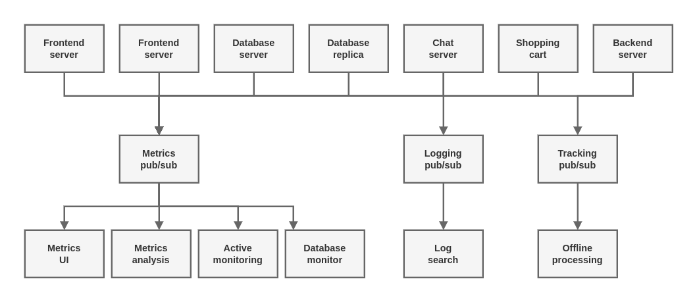

# Publish/Subscribe Messaging

Publish/subscribe (pub/sub) messaging is a pattern that is characterized by the sender (publisher) of a piece of data (message) not specifically directing it to a receiver. Instead, the publisher classifier the message somehow, and that receiver (subscriber) subscribes to receive certain classes of messages. Pub/sub systems often have a broker, a central point where messages are publishes, to facilitate this pattern.

## How It Starts

## Individual Queue Systems

