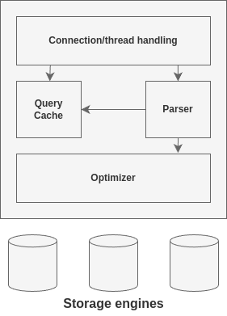

[[_TOC]]

# Chapter 1. MySQL Architecture and History

MySQL can power embedded applications, data warehouses, content indexing and delivery software, highly available redundant systems, online transaction processing (OLTP), and much more.

## MySQL's Logical Architecture

A good mental picture of how MySQL's components work together will help you understand the server.

The topmost layer contains the services that aren't unique to MySQL. They're services most network-based client/server tools or servers need: connection handling, authentication, security, and so forth.

The second layer is where things get interesting. Much of MySQL's brains are here, including the code for query parsing, analysis, optimization, caching, and  all the built-in functions (dates, times, math, and encryption). Any functionality provided across storage engines lives at this level: stored producers, triggers, and views.

The third layer contains the storage engines. They are responsible for storing and retrieving all data stored "in" MySQL. The server communicates with them through the storage engine API. This interface hides differences between storage engines and makes them largely transparent at the query layer. The API contains a couple of dozen low-level functions that perform operations such as "begin a transaction" or "fetch the row that has this primary key". The storage engines don't parse SQL or communicate with each other; the simple response to request from server. One exception is InnoDB, which does parse foreign key definitions, because the MySQL server doesn't yet implement them itself.

### Connection Management and Security

Each client connection gets its own thread within the server process. The connection's queries execute within that single thread, which in turn resides on one core or CPU.

=> If a query is too large, you can divide it into multiple queries, and then merge the results in the application. This approach creates opportunities to handle large queries more effectively and enables parallel execution.

The server cache threads, so they don't need to be created and destroyed for each new connection.

When clients (applications) connect to the MySQL server, the server needs to authenticate them. Authentication is based on username, originating host, and password.

### Optimization and Execution

MySQL parses queries to create an internal structure (the parse tree), and then applies a variety of optimizations. These can include rewriting

## Concurrency Control

## Transactions

## Multiversion Concurrency Control

## MySQL's Storage Engines

## A MySQL Timeline

## MySQL's Development Model

## Summary

# Chapter 2. Benchmarking MySQL
