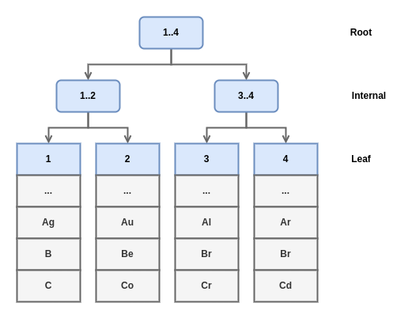
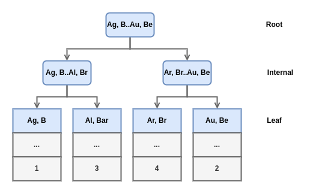
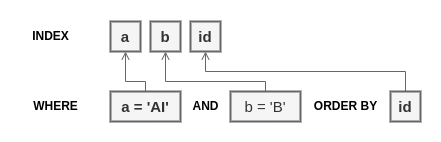

# Efficient MySQL Performance

[Chapter 4. Access Pattern](#chapter-4.-access-patterns)

## Chapter 1. Query Response Time

**Performance is query response time.**

Query response time is how long it takes MySQL to execute a query. Synonymous terms are: response time, query time, execution time, and (inaccurately) query latency. Timing starts when MySQL receives the query and ends when it has sent the result set to the client. Query response time comprises many stages and waits (lock waits, I/O waits, and so on), but a complete and detailed breakdown is neither possible nor necessary.

Performance increases as query response time decreases. Improving query response time is synonymous with reducing query response time.

This chapter is the foundation.

### A True Story of False Performance

The state of the art for "fixing" MySQL performance problems was "sell the customer more RAM." For sales and management in always worked, but for MySQL the results were inconsistent.

One night I decided not to sell the customer more RAM and, instead, to do a technical deep dive to find and fix the true root cause of their MySQL performance problem.

### North Star

Between shipping features and putting out fires, who has time for MySQL performance? And when MySQL performance is poor - or worse: when it suddenly becomes poor - they way forward can be difficult to see because there are many considerations: where do we begin? Do we need more RAM? Faster CPU? More storage IOPS? Is the problem a recent code change?

As an engineer whose expertise is the application, not MySQL that situation can be overwhelming. To move forward condifently, start by looking at query response time because it is meaningful and actionable.

**Meaningful**

Query response time is the only metric anyone truly cares about because, let's be honest, when the database is fast, nobody looks at it or asks questions. Why? Because query response time is the only metric we experience. When a query takes 7.5 seconds to execute, we experience 7.5 seconds of impatience. That same query might examine a million rows, but we don't experience a million rows examined. Our time is precious.

**Actionable**

Query response time is directly actionable because you own the code, so you can change the queries. Even if you don't own the code (or have access to it), you can still indirectly optimize query response time.

### Query Reporting

Query metrics provide invaluable insights into query execution: response time, lock time, rows examined, and so on.

**Source**

Query metrics originate from the slow query log.

*MySQL*

As of MySQL 8.0.14 enable system variable `log_slow_extra` and the slow query log provides six of the nine metrics in Query Metrics, lacking only Rows_affected, Select_scan, and Select_full_join. It's still a good source, but use the Performance Schema if possible.

Before MySQL 8.0.14, which includes MySQL 5.7, the slow query log is bare bones, providing only Query_time, Lock_time, Rows_sent, Rows_examined. You can still analyze queries with only these four metrics, but the analysis is much less insightful. Consequently, avoid the slow query log before MySQL 8.0.14 and instead use the Performance Schema.

**Aggregation**

Query metrics are grouped and aggregated by query.

```sql
SELECT col FROM tbl WHERE id = 1; (1)

SELECT `col` FROM `tbl` WHERE `id` = ?; (2)

f49d50dfab1c364e622d1e1ff54bb12df436be5d44c464a4e25a1ebb80fc2f13 (3)
```

(1) SQL statement (sample)

(2) Digest text (normalized SQL statement)

(3) Digest hash (SHA-256 of digest text)

**Reporting**

*Query profile*

A query profile shows slow queries.

Slow is relative to the sort metric: the aggregate value of a query metric by which queries are ordered.

### Query Analysis

The goal of query analysis is understanding query execution, not solving slow response time.

#### Query Metrics 

**Query time**

Query time is the most important metric - you knew that already. What you may not know is that query time includes another metric: lock time.

Lock time is an inherent part of query time, so it's not surprising that the later includes the former. What's surprising is that query time and lock time are the only two time-based query metrics. Using the Performance Schema, you can see many (but not all) parts of query execution. This is off-topic and beyond the scope of this book.

*Transactions* Transactions are the top-level event because every query executes in a transaction.

*Statements* Statements are queries, to which query metrics apply.

*Stages* Stages are "steps during the statement-execution process, such as parsing a statement, opening a table, or performing a filesort operation."

*Waits* Waits are "events that take time."

**Lock time**

TODO

Lock time is time spent acquiring locks during query execution. Ideally, lock time is a minuscule percentage of query time, but values are relative.

There are table locks and row locks. The server (MySQL) manages tables and table locks. Tables are created using a storage engine (InnoDB by default) but are storage engine agnostic, meaning you can convert a table from one storage engine to another. Row-level locking is managed by the storage engine if supported.

There are metadata locks managed by the server that control access to schemas, tables, stored programs, and more. Whereas table locks and row locks control access to table data, metadata locks control access to table structures (columns, indexes, and so on) to prevent changes while queries are accessing the tables. Every query acquires a metadata lock on every table that it accesses. Metadata locks are released at the end of the transaction, not the query.

By constrast, lock time from the slow query log includes all lock waits: metadata, table, and row. Lock time from either source does not indicate which type of lock wait. From the Performace Schema, it's certainly metadata lock wait; and from the slow query log, it's probably row lock wait, but metadata lock wait is possibility too.

Locks are primarily used for writes (INSERT, UPDATE, DELETE, REPLACE) because rows must be locked before the can be written. Response time for writes depends, in part, on lock time. The amount of time needed to accquire row locks depends on concurrency: how many queries are accessing the same (or nearby) rows at the same time.

For reads (SELECT), there are nonlocking and locking reads. The distinction is easy because there are only two locking reads: SELECT ... FOR UPDATE and SELECT ... FOR SHARE. If not one of those two, then SELECT is nonlocking, which is the normal case.

Locking reads should be avoided, especially SELCT ... FOR UPDATE, because they don't scale, they tend to cause problems, and there is usually a nonlocking solution to achieve the same result. With respect to lock time, a locking read is like a write: it depends on concurrency.

For nonlocking reads, even though row locks are not required, lock time will not be zero because metadata and table locks are required. But acquiring these two should be very fast: less than 1 millisecond.

Nonlocking read does not mean non-blocking. SELECT queries must acquire shared metadata locks (MDL) on all tables accessed. As usual with blocks, shared MDL are compatible with other shared MDL, but on exclusive MDL blocks all other MDL. ALTER TABLE is the common operation that acquires an exclusive MDL. Even using ALTER TABLE ... ALGORITHM=INPLACE, LOCK=NONE or third-party online schema change tools like pt-online-schema-change and gh-ost, an exclusive MDL must be acquired at the end to swap the old table structure for the new one. Although the table swap is very quick, it can cause a noticeable disruption when MySQL is heavily loaded when all table access is blocked while the exclusive MDL is held.

Locking might be the most complex and nuanced aspect of MySQL.

- Lock time can be significantly greater than innodb_lock_wait_timeout because this system variable applies to each row lock.
- Locking and transaction isolation levels are related.
- InnoDB locks every row it accesses including rows it does not write.
- Locks are released on transaction commit or rollback, and sometimes during query execution
- InnoDB has different types of locks: records, gap,  next-key, and more.

**Rows examined**

Rows examined is the number of rows that MySQL accessed to find matching rows.

**Rows sent**

Rows sent is the number of rows returned to the client.

**Rows affected**

Rows affected is the number of rows inserted, updated, or deleted. Engineers are very careful to affect only the correct rows.

**Select scan**

Select scan is the number of full table scans on the first table accessed. This usually bad for performance because it means the query isn't using an index. 

**Select full join**

Select full join is the number of full table scans on tables joined. Select full join should always be zero; if not, query optimization is practially required.

**Created tmp disk tables**

Created tmp disk tables is the number of temporary tables created on disk. It's normal for queries to create temporary tables in memory; but when an in-memory temporary table becomes too large, MySQL writes it to disk. That can affect response time because disk access is orders of magnitude slower than memory access.

However, temporary tables on disk is not a common problem because MySQL tries to avoid them. Excessive "tmp disk tables" indicates a query that can be optimized, or (perhaps) the system variable tmp_table_size is too small. Always optimize queries first. Change system variables as a last resort - especially ones that affect memory allocation.

**Query count**

Query count is the number of query executions

#### Metadata and the Application

There's more to query analysis than query metrics: metadata. In fact, you can't complete a query analysis without at least two pieces of metadata: the EXPLAIN plan, and the table structure for each table.

#### Relative Values

#### Average, Percentile and Maximum

It's standard to talk about query response time as if it's single value, but it's not.

- Average is overly optimistic
- Percentile is an assumption
- Maximum is the best representation

**Average**

Don't be fooled by the average: if query count is small, a few very large or small values can skew the average response time (or any metric). Moreover, without knowing the distribution of values, we cannot know what percentage of values the average represents. For example, if the average equals the median, then the average represents the bottom 50% of values, which are the better (faster) response times.

**Percentile**

Percentile solve the problem of averages. Without going into a full explanation of percentile, P95 is the value that 95% of samples are less than or equal to. P95 represents 95% of values, which is objectively more representative - and less optimistic - than the average.

The best percentile is P999 (99.9%) because discarding 0.1% of values is an acceptable tradeoff between assuming that they're outliers and the reality that outliers do exist.

**Maximum**

Maximum query time solves the problem of percentiles: don't discard any values. The maximum value is not a myth or statistical apparition like the average. Somewhere in the world, some application user experienced the maximum query response time - or gave up after a few seconds and left.

### Improving Query Response Time

To make improving query response time journey efficient - not a waste of time and effort - there are two parts: direct query optimization and indirect query optimization. 

#### Direct Query Optimization

Direct query optimization is changes to queries and indexes. These changes solve a lot of performance problems, which is why the journey begins with direct query optimization. And because these changes are so powerful, the journey often ends here, too.

#### Indirect Query Optimization

Indirect query optimization is changes to data and access patterns. Instead of changing a query, you change what the query accesss and how: its data and access patterns.

A greater level of effort is why indirect query optimization is part two of the journey. If direct query optimization solves the problem, then stop - be efficient. If it doesn't and you're certain the query cannot be further optimized, then it's time to change data and access patterns.

### When to Optimize Queries

#### Performance Affects Customers

When performance affects customers, it is the duty of engineers to optimize queries. As long as query metrics are always on and at the ready, this is an objectively good time to optimize queries because the need for better performance is as real as your customers.

#### Before and After Code Changes

Most engineers don't argue against prioritizing query optimization before and after code changes, but my experience is that they don't do it. 

#### Once a Month

Even if your code and queries do not change, at least two things around them are changing: data and access patterns. Query response time changes over time as data and access patterns change. Fortunately, these changes are relatively slow, usually on the order of weeks or months. 

### MySQL: Go Faster

There is no magic or secret to make MySQL significantly faster without changing queries or the application.

An engineer on the team asked me to help increase MySQL throughput (QPS). I asked, "By how much?" She said, "By 100x". I said, "Sure. Do you have a year and a willingness to rearchitect the application?" She said, "No, we have one day."

### Summary

This chapter expounded query time so that, in subsequent chapters, you can learn how to improve it.

- Performance is query response time: how long it takes MySQL to execute a query.
- Query response time is the North Star of MySQL performance because it is meaningful and actionable.
- Query metrics originate from the slow query log or the Performance Schema.
- Query metrics are grouped and aggregated by digest: normalized SQL statements.  
- A query profile shows slow queries; slow is relative to the sort metric.
- A query report shows all available information for one query; it's used for query analysis.
- The goal of query analysis is understand query execution, not solving slow response time.
- Query analysis uses query metrics (as reported), metadata (EXPLAIN plans, table structures, and so on)
- Nine query metrics are essential to every query analysis: query time, lock time, rows examined, rows sent, row affected, select scan, select full join, created tmp disk tables, and query count.
- Improving query response time (query optimization) is a two-part journey: direct query optimization, then indirect query optimization. 
- At the very least, review the query profile and optimize slow queries when performance affects customers, before and after code changes, and once a month.
- To make MySQL go faster, you must decrease response time (free time to do more work) or increase load (push MySQL to work harder).

## Chapter 2. Indexes and Indexing

Many factors determine MySQL performance, but indexes are special because perforamance cannot be achieved without them.

MySQL leverages hardware, optimizations, and indexes to achieve performance when accessing data. Hardware is an obvious leverage because MySQL runs on hardware: the faster hardware, the better the performance. Less obvious and perhaps more surprising is that hardware provides the least leverage.

### Red Herrings of Performance

Red herring is an idiom that refers to a distraction from a goal. When tracking down solutions to improve MySQL performance, two read herrings commony distract engineers: faster hardware and MySQL tuning.

#### Better, Faster Hardware!

When MySQL performance isn't acceptable, do not begin by scaling up (using better, faster hardware).

Scaling up to improve MySQL performance happens last. Experts agree: first optimize queries, data, access patterns, and the application. If all those optimizations do not yield sufficient performance, then scale up.

#### MySQL Tuning

**Tuning**

**Configuring**

**Optimizing**

### MySQL Indexes: A Visual Introduction

#### InnoDB Tables Are Indexes



InnoDB tables are B-tree indexes organized by the primary key. Rows are index records stored in leaf nodes of the index structure. Each index record has metadata (denoted by "...") used for row locking, transaction, isolation, and so on.



Secondary indexes are B-tree indexes, too, but leaf nodes store primary key values. When MySQL uses a secondary index to find a row, it does a second lookup on the primary key to read the full row.

#### Table Access Method

Access method (aka table access method, access type and join type)

There are three access methods: index lookup, index scan, and table scan. For an index lookup, there are several access types: ref, eq_ref, range, and so forth.

**Index lookup**

An index lookup finds specific rows - or ranges of rows - by leveraging the ordered structure and algorithm access of an index. This is the fastest access method because it's precisely what indexes are designed for: fast and efficient access to large amount of data. 

**Index scan**

When an index lookup is not possible, MySQL must use brute force to find rows: read all rows and filter out non-matching ones. Before MySQL resorts to reading every row using the primary key, it tries to read rows using a secondary index. This is called an index scan.

There are two types of index scan. The first is a full index scan, meaning MySQL reads all rows in index order. Reading all rows is usually terrible for performance, but reading them in index order can avoid sorting when the index order matches the query ORDER BY.

Scanning the secondary index in order might be sequential reads, but the primary key lookups are almost certainly random reads. Accessing rows in index order does not guarantee sequential reads. (sequential access (reads and write) is faster than random access.)

The second type of index scan is an index-only scan: MySQL reads column values (not full rows) from the index. It should be faster than a full index scan because it doesn't require primary key lookups to read full rows; it only reads column values from the secondary index, which is why it requires a covering index.

Don't optimize for an index scan unless the only alternative is a full table scan. Otherwise, avoid index scans.

**Table scan**

A (full) table scan reads all rows in **primary key order**. When MySQL cannot do an index lookup or index scan, a table scan is the only option. This is usually terrible for performance, but it's also usually easy to fix.

#### Leftmost Prefix Requirement

The primary key is appended to every secondary index: (S, P) where S are secondary index columns and P are primary key columns.

#### EXPLAIN: Query Execution Plan

To illustrate index usage, the next six sections explain queries for each case that MySQL can use an index:

- Find matching rows: WHERE
- Group rows: GROUP BY
- Sort rows: ORDER BY
- Avoid reading rows: Covering indexes
- Join tables: Join Tables
- MIN(), MAX()

#### WHERE

#### GROUP BY

MySQL can use an index to optimize GROUP BY because values are implicitly grouped by index order.

There is a lot more to learn about GROUP BY with respect to indexes and query optimizations, but these examples are the fundamentals. 

#### ORDER BY

Unsurprisingly, MySQL can use an ordered index to optimize ORDER BY. This optimization avoids sorting rows, which takes a little more time, by accessing rows in order. Without this optimization, MySQL reads all matching rows, sorts them, then returns the sorted result set. When MySQL sorts rows, it prints "Using filesort" in the Extra field of the EXPLAIN plan. Filesort means sort rows.

There are three ways to use an index to optimize ORDER BY. The first and simplest way is using a leftmost prefix of an index for the ORDER BY clause. For table element, that means:

- ORDER BY id
- ORDER BY a
- ORDER BY a, b

The second way is to hold a leftmost part of the index constant and order by the next index columns.

```sql
WHERE a = 'Ar' GROUP BY b
```

The third way is a special case of the second.

```sql
SELECT * FROM el WHERE a = 'Al' and b = 'B' ORDER BY id\G
```



The new optimization is "Using index condition", which is called index condition pushdown. Index condition pushdown means the storage engine uses an index to matches rows for WHERE conditions. Normally, storage engines only read and write rows, and MySQL handles the logic of matching rows. This is a clean separation of concerns (which is a virtue for software design), but it's inefficient when rows don't match: both MySQL and the storage engine waste time reading non-matching rows. 

There's an important detail that affects all ORDER BY optimizations: index order is ascending by default, and ORDER BY col implies ascending: ORDER BY col ASC. Optimizing ORDER BY works only one direction for all columns: ASC (ascending) or DESC (descending). ORDER BY a, b DESC does not work because column a is an implicit ASC sort, which is different than b DESC.

Why does filesort have a reputation for being slow? Because MySQL use temporary files on disk when sorting data exceeds the sort_buffer_size, and hard drives are orders of magnitude slower than memory.

#### Covering indexes

A covering index includes all columns referenced in a query.

Covering indexes are glamorous but rarely practical because realistic queries have too many columns, conditions, and clauses for one index to cover. Do not spend time trying to create covering indexes. When designing or analyzing simple queries that use very few columns, take a moment to see if a covering index might work. If it does, then congratulations. If not, that's okay; no one expects covering indexes.

#### Join Tables

### Indexing: How to Think Like MySQL

#### Know the Query

Start by gathering the following metadata for each table:

- SHOW CREATE TABLE
- SHOW TABLE STATUS
- SHOW INDEXES

**Query**

- How many rows should the query access?
- How many rows should the query return?
- Which columns are selected (returned)?
- What are the GROUP BY, ORDER BY, and LIMIT clauses (if any)?
- Are there subqueries? (If yes, repeat the process for each.)

**Table access (per-table)**

- What are the table conditions?
- Which index should the query use?
- What other indexes could the query use? 
- What is the cardinality of each index?
- How long is the table - data size and row count?

Those questions help you mentally parse the query because that's what MySQL does

#### Understand with EXPLAIN

Always EXPLAIN the query. Make this a habit because direct query optimization is not possible without EXPLAIN.

The query and its response time are a puzzle, but you have all the pieces: execution plan, table conditions, table structures, table sizes, index cardinalities, and query metrics.

#### Optimize the Query

The third step is direct query optimization: change the query, its indexes, or both.

The same result can be achieved with different methods. A query has a result - literally, a result set - and a method of obtaining that result. These two are closely related but independent. Knowing that is tremedously helpful when considering how to modify a query. Start by clarifying the intended result of the query. A clear result allows you to explorer new ways of writing the query that achieve the same result.

#### Deploy and Verify

### It was a Good Index Until...

#### Queries Changed

When queries change - and they often do - the leftmost prefix requirement can be lost. The worst case is when there no other indexes that MySQL can use, so it reverts to brute force: a full table scan.

#### Excessive, Duplicate, and Unused

Indexes are necessary for performance, but sometimes engineers go overboard with them, which results in too many indexes, duplicate indexes (dupes), and unused indexes.

More indexes use more RAM which, ironically, decreases the RAM available for each index. The second problem is a decrease in write performance because, when MySQL writes data, it must check, update, and potentially reorganize every index. An inordinate number of indexes can severely degrade write performance.

Be careful when dropping an index. As of MySQL 8.0, use invisible indexes to verify that an index is not used or needed before dropping it: make the index invisible, wait and verify that performance is not affected, then drop the index. 

#### Extreme Selectivity

Cardinality is the number of unique values in an index.

An index with extremely low selectivity provides little leverage because each unique value could match a large number of rows. A classic example is an index on a column with only two possible values: yes or no, true or false, coffee or tea, on so on. If the table has 100,000 rows, then selectivity is practially zero: 2 / 100,000 = 0.00002. It's an index, but not a good one because each value could match many rows. That presumes values are evenly distributed, but what if 99,999 rows have values coffee and only 1 row has value tea? Then the index works great for tea but terribly for coffee.

#### It's a Trap! (When MySQL Chooses Another Index)

In very rare cases, MySQL chooses the wrong index. This is rare enough that it should be your last suspicion if MySQL is using an index but query response time is inexplicably slow. The index itself is never inaccurate; it's only the index statistic that are inaccurate.

Index statistics are estimates about how values are distributed in the index. MySQL does random dives into the index to sample pages. (A page is a 16KB unit of logical storage. Almost everything is stored in pages). If index values are evenly distributed, then a few random dives accurately represent the whole index.

MySQL updates index statistics for a table when:

- The table is first opened
- ANALYZE TABLE is run
- 1/16th of the table has been modified since the last update

Running ANALYZE TABLE is safe and usually very fast, but be careful on a busy server: it requires a flush lock that can block all queries accessing the table.

### Table Join Algorithms

Using the NLJ algorithm, MySQL begins by using some_index to find matching rows in the outermost table: t1. For each matching row in table t1, MySQL joins table t2 by using an index on the join column, index_on_B, to lookup rows matching t1.A. For each matching row in table t2, MySQL joins table t3 using the same process, but - just for fun - let's say there's no index on the join column, t3.C: the result is a full join.

When no more rows in t3 match the join column value from table t2, the next matching row from t2 is used. When no more rows in t2 match the join column value from table t1, the next matching row from t1 is used. When no more rows in t1 match, the query completes.

The nested-loop join algorithm is simple and effective, but there's one problem: the innermost table is accessed very frequently, and the full join makes that access very slow. The *block nested-loop* join algorithm addresses this problem. Join column values from matching rows in t1 and t2 are saved in a join buffer.

As of MySQL 8.0.20, the hash join algorithm replaces the block nested-loop join algorithm. Hash join creates an in-memory hash table of join tables. MySQL uses the hash table to look up rows in the join table, which is extremely fast because a hash table lookup is a constant time operation.

EXPLAIN indicates a hash join by printing "Using join buffer (hash join)" in the Extra field.

### Summary

- Indexes provide the most and the best leverage for MySQL performance.
- Do not scale up hardware to improve performance until exhausting other options.
- Tuning MySQL is not necessary to improve performance with a reasonable configuration.
- An InnoDB table is a B-tree index organized by the primary key.
- MySQL accesses a table by index lookup, index scan, or full table scan - index lookup is the best access method.
- To use an index, a query must use a leftmost prefix of the index - the leftmost prefix requirement.
- MySQL uses an index to find rows matching WHERE, group rows for GROUP BY, sort rows for ORDER BY, avoid reading rows (covering index), and join tables.
- EXPLAIN prints a query execution plan (or EXPLAIN plan) that details how MySQL executes a query.
- Indexing requires thinking like MySQL to understand the query execution plan.
- Good indexes can lose effectiveness for a variety of reasons.
- MySQL uses three algorithms to join tables: NLJ, block nested-loop, and hash join.

## Chapter 3. Data

This chapter begins the second part of the journey: indirect query optimization.

Imagine that your job is to move rocks, and you have three piles of different sized rocks. The first pile contains pebbles: very light, no larger than your thumbnail. The second pile contains cobbles: heavy but light enough to pick up, no larger than your head. The third pile contains boulders: too large and heavy to pick up; you need leverage or a machine to move them. Your job is to move one pile from the bottom of a hil to the top. Which pile do you choose?

I presume that you choose the pebbles because they're light and easy to move. But there's a critical detail that might change your decision: weight. The pile of pebbles weighs two metric tons. The pile of cobbles weighs one metric ton. Now which pile do you choose?

On the one hand, the pebbles are still a lot easier to move.

Data is analogous to a pile of rocks, and executing queries is analogous to moving the rock uphill. When data size is small, direct query optimization is usually sufficient because the data is trivial to handle - like walking. But as data size increases, indirect query optimization becomes increasingly important.

Less data is more performance. The full statement is: you can improve performance by reducing data because less data requires fewer system resources (CPU, memory, storage, and so on).

### Three Secrets

#### Indexes May Not Help

First, indexes are the key to performance, but a query can be slow even with a good index. Second, after learning about indexes and indexing, engineers become so good at avoiding index scans and table scans that only index lookups remain, which is a good problem but ironic nonetheless.

**Index scan**

An index scan provides diminishing leverage as a table grows because the index also grows: more table rows, more index values.

**Finding rows**

When I optimize a slow query that uses an index lookup, the first query metric I check is rows examined.

The access types listed below match at most one row

- system
- const
- eq_ref
- unique_subqueryo

If the type field in an EXPLAIN plan is not one of the access type listed above then pay close attention to the rows field and the query metric rows examined. Examining a very large number of rows is slow regardless of the index lookup.

Remember that index selectivity is a function of cardinality and the number of rows in the table. If cardinality remains constant but the number of rows increases, then selectivity decreases.

**Joining tables**

MySQL, can join tables in almost any order. Use this to your advantage: sometimes the solution to a poor is a better index on another table that allows MySQL to change the join ordero.

**Working set size**

Indexes are only useful when they're in memory. If the index values that a query looks up are not in memory, then MySQL reads them from disk. (More accurately, the B-tree nodes that constitute the index are stored in 16 KB pages, and MySQL swaps pages between memory and disk as needed.) Reading from disk is orders of magnitude slower than reading from memory, which is one problem, but the main problem is that indexes compete for memory.

If memory is limited but indexes are numerous and frequently used to look up a large percentage of values (relative to the table size), then index usage can increase storage I/O and MySQL attempts to keep frequently used index values in memory. This is possible but rare for two reasons. First, MySQL is exceptionally good at keeping frequently used index values in memory. Second, frequently used index values and the primary key rows to which they refer are called the working set, and it's usually a small pertentage of the table size. DBA commonly allocate memory for only 10% of total data size, usually rounded to standard memory values (64GB, 128GB, and so forth). 10% of 500 GB is 50 GB => 64GB.

#### Less Data Is Better

Data size is dramatically reduced because less data is better. Better for what? Everything: performance, management, cost, and so on. It's simply a lot faster, easier, and cheaper to deal with 100 GB of data than 100 TB on a single MySQL instance. The former is so small that a smartphone can handle it.

#### Less QPS Is Better

### Principle of Least Data

I define the principle of least data as: store and access only needed data. That sounds obvious in theory, but it's far from the norm in practice. It's also deceptively simple which is why the next two sections may fine details.

Common sense is not so common.

#### Data Access

Do not access more data than needed. Access refers to all the work that MySQL does to execute a query: find matching rows, process matching rows, and return the result set - for both reads (SELECT) and writes.

**Efficient data access checklist**

- Return only needed columns
- Reduce query complexity
- Limit row access
- Limit the result set
- Avoid sorting rows

To be fair and balanced, ignoring a single checklist item is unlikely to affect performance.

**Return only needed columns**

Queries should return only needed columns.

Do not SELECT *. This is especially important if the table has any BLOB, TEXT, or JSON columns.

**Reduce query complexity**  

Queries should be as simple as possible.

Complex queries are a problem for engineers, not MySQL. The more complex a query, the more difficult it is to analyze and optimize. If you're lucky, a complex query works well and never shows up as a slow query.

With respect to data access, simple queries tend to access less data because they have fewer tables, conditions, and SQL clauses - less work for MySQL.

**Limit row access**

Queries should access as few rows as possible.

Accessing too many rows usually comes as a surprise; it's not something engineers do intentionlly. Data growth over time is a common cause: a fast query starts by accessing a few rows, but years and gigabytes later, it becomes a slow query because it accesses too many rows. At the intersection of data growth and simple mistakes is the most important cause: not limiting ranges and a lists. AN open-ended range like col > 75 can access countless rows if MySQL does a be aware that row access is virtually unbounded as the table grows, especially if the index on col is nonunique.

A LIMIT clause does not limit row access because LIMIT applies to the result set after matching rows. The exception is the ORDER BY ... LIMIT optimization: if MySQL can access rows in index order, then it stops reading rows when the LIMIT number of matching rows are found. But here's the fun fact: EXPLAIN does not report when this optimization is used. You must infer the optimization from what an EXPLAIN does and does not report.

Limiting row access is critical because, generally speaking, InnoDB locks every row that it accesses before it updates matching rows. InnoDB can lock more rows than you might expect.

**Limit the result set**

Queries should return as few rows as possible.

This is more involved than putting a LIMIT clause on a query, although that certainly helps. If refers to the application not using the entire result set: the rows returned by a query.

The first variation occurs when the application uses some rows, but not all. This can be done intentionlly or unintentionally. Unintentionally, it indicates that the WHERE clause needs better (or more) conditions to match only needed rows. You can spot this in application code that filters rows instead of using WHERE conditions. If you spot this, talk with your team to make sure it's not intentional. Intentionlly, an application might select more rows to avoid a complex query by shifting row matching from MySQL to the application.

The second variation occurs when a query has an ORDER BY clause and the application uses an ordered subset of rows. Row order doesn't matter for the first variation, but it's the defining characteristic of the second variation. For example, a query returns 1000 rows but the application only uses the first 20 rows in order. In this case, the solution might be as simple as adding a LIMIT 20 clause to the query. 

The third variation occurs when the application only aggregates the result set. If the application aggregates the result set and uses the individual rows, that's acceptable.

**Avoid sorting rows**

Queries should avoid sorting rows.

#### Data Storage

- Only needed rows are stored
- Every column is used
- Every column is compact and practical
- Every value is compact and practical
- Every secondary index is used and not a duplicate
- Only needed rows are kept

### Delete or Archieve Data

#### Tools 

The critical important part is throttling the loop that executes SQL statements. Never do this:

```go
for {
    rowsDeleted = execute("DELETE FROM table LIMIT 1000000")
    if rowsDeleted == 0 {
        break
    }
}
```

The LIMIT 1000000 clause is probably too large, and the for loop has no delay between statements.

#### Batch Size

It's safe to manually delete 1000 rows or less in a single DELETE statement if the rows are small (no BLOB, TEXT, or JSON columns) and MySQL is not heavily loaded. Manually means that you execute each DELETE statement in series, not in parallel. Do not write a program to execute the DELETE statements.

Batch size is calibrated to an execution time; 500 milliseconds is a good starting point. This means that each DELETE statement should take no longer than 500ms to execute. This is critically important for two reasons:

- Replication lag
Execution time on a source MySQL instance creates replication lag on replica MySQL instances. If a DELETE statement takes 500 ms to execute on the source, then it also takes 500 ms to execute on a replica, which creates 500 ms of replication lag. You cannot avoid replication lag, but you must minimize it because replication lag is data loss.

- Throttling
In some cases, it's safe to execute DELETE statements with no delay - no throttling - because the calibrated batch size limits query execution time, which limits QPS. A query that take 500ms to execute can only execute at 2 QPS in series. But these are no ordinary queries: they're purpose-built to access and write (delete) as many rows as possible. Without throttling, bulk writes can disrupt other queries and impact the application.

Throttling is paramount when deleting data: always begin with a delay between DELETE statements, and monitor replication lag.

#### Row Lock Contention

For write-heavy workloads, bulk operations can cause elevated row lock contention: queries waiting to acquire row locks on the same (or nearby) rows. This problem mainly affects INSERT and UPDATE statements, but DELETE statements could be affected, too, if deleted rows are interspersed with kept rows. The problem is that the batch size is too large even though it executes within the calibrated time. For example, MySQL might be able to delete 100,000 rows in 500ms, but if the locks for those rows overlap with rows that the application is updating, then it causes row lock contention.

The solution is to reduce the batch size by calibrating for a much smaller execution time - 100ms, for example.

#### Space and Time

Deleting data does not free disk space. Row deletes are logical, not physical, which is a common performance optimization in many databases. When you delete 500GB of data, you don't get 500 GB of disk space, you get 500 GB of free pages. Internal details are more complex and beyond the scope of this book, but the general idea is correct: deleting data yields free pages, not free disk space.

Free pages do not affect performance, and InnoDB reuses free pages when new rows are inserted. If deleted rows will soon be replaced by new rows, and disk space isn't limited, then free pages and unclaimed disk space are not a concern. But please mindful of your colleagues: if your company runs its own hardware and MySQL for your application shares disk space with MySQL for other applications, then don't waste disk space that can be used by other applications. In the cloud, storage costs money, so don't waste money: reclaim the disk space. 

It takes time to delete rows, and it takes additional time to reclaim the disk space.

#### The Binary Log Paradox

Deleting data creates data. This paradox happens because data changes are written to the binary logs. Binary logging can be disabled, but it never is in production because the binary logs are required for replication, and no sane production system runs without replicas.

If the table contains large BLOG, TEXT, or JSON columns, then binary log size could increase dramatically because the MySQL system variable `binlog_row_image` default to full. That variable determines how row images are written to the binary logs; it has three settings:

full<br>
    Write the value of every column (the full row).

minimal<br>
    Write the value of columns that changes and columns required to identify the row.

noblob<br>
    Write the value of every column except BLOB and TEXT columns that aren't required.

It's both safe and recommended to use minimal (or noblob) if there are no external services that rely on full row images in the binary logs - for example, a data pipeline service that stream changes to a data lake or big data store. 

When deleting a lot of data, disk usage will increase because of binary logging and the fact that deleting data does not free disk space.

Paradoxically, you must ensure that the server has enough free disk space to delete data and rebuild the table.

### Summary

This chapter examined data with respect to performance and argued that reducing data access and storage is a technique - an indirect query optimization - for improving performance. The primary takeaway points are:

- Less data yields better performance.
- Less QPS is better because it's a liability, not an asset.
- Indexes are necessary for maximum MySQL performance, but there are cases when indexes may not help.
- The principle of least data means: store and access only needed data.
- Ensure that queries access a few rows as possible.
- The principle of least data means: store and access only needed data.
- Ensure that queries access as few rows as possible.
- Do not store more data than needed: data is valuable to you, but it's dead weight to MySQL.
- Deleting or archiving data is important and improves performance.


## Chapter 4. Access Patterns 

<a href="#efficient-mysql-performance" 
   style="position: fixed; 
   bottom: 10px; right: 10px;">
    
</a>


