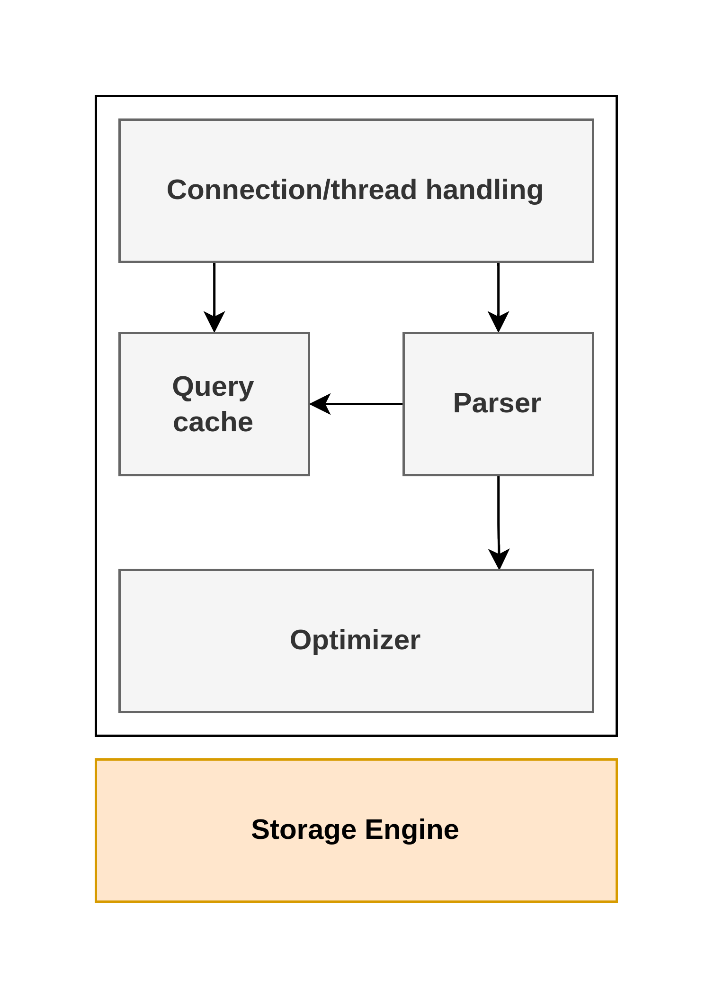

# MySQL Architecture and History

The topmost layer is Connection/thread handling. They're services most network-based client/server tools or servers need: connection handling, authentication, security, and so forth.

The second layer is where things get interesting. Much of MySQL's brains are here, including the code for query parsing, analysis, optimization, caching, and all the built-in functions. Any functionality provided across storage engines lives in this level: stored procedures, triggers, and views for example.

The third layer contains the storage engines. They are responsible for storing and retrieving all data stored "in" MySQL. Like the various file systems available for GNU/Linux, each storage engine has its own benefits and drawbacks.The server communicates with them through the storage engine API. This interface hides differences between storage engines and makes them largely transparent at the query layer.

The API contains a couple of dozen low-level functions that perform operations such as "being a transaction" or "fetch the row that has this primary key". The storage engines don't parse SQL (exception is InnoDB, which does parse foreign key definitions, because the MySQL server doesn't yet implement them itself) or communicate with each other; they simply respond to requests from the server.

## Connection Management and Security

Each client connection gets its own thread within the server process. The connection's queries execute within that single thread, which in turn resided on one core or CPU. The server caches threads, so the don't need to be created and destroyed for each new connection.

MySQL 5.5 and newer versions support an API that can accept thread-pooling plugins,so a small pool of threads can service many connections.

## Optimization and Execution

MySQL parses queries to create an internal structure (the parse tree), and then applies a variety of optimizations. These can include rewriting the query, determining the order in which it will read tables, choosing which indexes to use, and so on.
 
The optimizer does not really care what storage engine a particular table uses, but the storage engine does affect how the server optimizes the query. The optimizer asks the storage engine about some of its capabilities and the cost of certain operations, and for statistics on the table data. For instance, some storage engines support index types that can be helpful to certain queries.

Before even parsing the query, though, the server consults the query cache, which can store only SELECT statements, along with their result sets. If any one issues a query that's identical to one already in the cache, the server doesn't need to parse, optimize, or execute the query at all.
