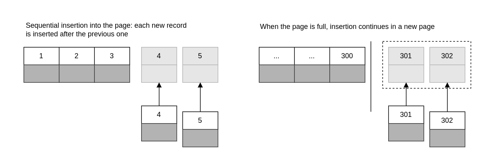

# Indexing Basics

An index contains values from one or more columns in a table. If you index more than one column, the column order is very important, because MySQL can only search efficiently on a leftmost prefix of the index. Creating an index on two columns is not the same as creating two separate single-column indexes.

## Types of indexes

Indexes are implemented in the storage engine layer, not the server layer. Thus, they are not standardized: indexing works slightly differently in each engine, and not all engines support all types of indexes. Even when multiple engines support the same index type, they might implement it differently under the hood.

### B-Tree indexes

Storage engines use B-Tree indexes in various ways, which can affect performance. For instance, MyISAM uses a prefix compression technique that makes indexes smaller, but InnoDB leaves values uncompressed in its indexes. Many storage engine actually use a B+ Tree index, in which each leaf node contains a link to the next for fast range traversals through nodes.

A B-Tree index speeds up data access because the storage engine doesn't have to scan the whole table to find the desired data. Instead, it starts at the root node. The slots in the root hold pointers to child nodes, and the storage engine follows these pointers. It finds the right pointer by looking at the values in the node pages, which define the upper and lower bounds of the values in the child nodes. Eventually, the storage engine either determines that the desired value doesn't exist or successfully reaches a leaf page.

Leaf pages are special, because they have pointers to the indexed data instead of pointers to other pages. (Different storage engines have different types of "pointers" to the data). 

B-Trees store the indexed columns in order, they're useful for seaching for ranges of data.

```sql
CREATE TABLE people (
    last_name VARCHAR(50) NOT NULL,
    first_name VARCHAR(50) NOT NULL,
    dob DATE NOT NULL,
    gender ENUM('m', 'f') NOT NULL,
    key (last_name, first_name, dob)
)
```

Notice that the index sorts the values according to the order of the columns given in the index in the CREATE TABLE statement. Look at the last two entries: there are two people with the same name but differnt birth dates, and they're sorted by birth date.

### Types of queries that can use a B-Tree index

B-Tree indexes work well for lookups by the **full key value, a key range, or a key prefix**. They are useful only if the lookup uses a leftmost prefix of the index.

**- Match the full value:** A match on the full key value specifies values for all columns in the index. For example, this index can help you find a person named Cuba Allen who was born on 1960-01-01.

**- Match a leftmost prefix (compound index):** This index can help you find all people with the last name Allen. This uses only the first column in the index.

**- Match a column prefix:** You can match on the first part of a column's value. This index can help you find all people whose last names begin with J. This uses only the first column in the index.

**- Match a range of values:** This index can help you find people whose last names are between Allen and Barymore. This also uses only the first column.

**- Match one part exactly and match a range on another part:** This index can help you find everyone whose last name is Allen and whose first name starts with the letter K. This is an exact match on last_name and a range query on first_name.

**- Index-only queries:** B-Tree indexes can normally support index-only queries, which are queries that access only the index, not the row storage.

Because the tree's nodes are sorted, they can be used for both lookups (finding values) and ORDERED BY queries. In general, if a B-Tree can help you find a row in a particular way, it can help you sort rows by the same criteria.

### Some limitations of B-Tree indexes:

- They are not useful if the lookup does not start from the leftmost side of the indexed columns.

```go
// this index (first_name, last_name, dob) won't help you find all people named Bill or all people born on a certain date
db.Select(&rs, "SELECT * FROM people WHERE last_name = ? OR dob = ?", "name", "2006-01-01")

// use can't use index to find people whose last name ends with a particular letter
db.Select(&rs, "SELECT * FROM people WHERE last_name like ?", "%1000")
```

- You can't skip columns in the index. That is you won't be able to find all people whose last name is Smith and who were born on a particular date. If you don't specify a value for the first_name column, MySQL can use only the first column of the index.

```go
// only use the first column of the index: last_name
db.SELECT(&rs, "SELECT * FROM people WHERE last_name = ? AND dob = ?", "name", "2006-01-01")
```

- The storage engine can't optimize access with any columns to the right of the first range condition. For example, if your query is WHERE last_name="Smith" AND first_name LIKE 'J%' AND dob='1976-12-23', the index access will use only the first two columns in the index, because the LIKE is a range condition. For a column that has a limited number of values, you can often work around this by specifying equality conditions instead of range conditions.

```go
// because the LIKE is a range condition, index access will use only the first two columns
db.SELECT(&rs, "SELECT * FROM people WHERE last_name = ? AND first_name LIKE ? AND dob = ?", "Smith", "J%", "2006-01-01")
```

Column order is extremely important: these limitations are all related to column ordering. For optimal performance, you might need to create indexes with the same columns in different orders to satisfy your queries.

### Hash indexes

Useful only for exact lookups that use every column in the index. Storage engine computes a hash code of the indexed columns, which is small value that will probably differ from the hash codes computed for other rows with different key values. It stores the hash codes in the index and stores a pointer to each row in a hash table.

In MySQL, only the Memory storage engine supports explicit hash indexes. They are the default index type for Memory tables, though Memory tables can have B-Tree indexes too. The Memory engine supports nonunique hash indexes, which is usually in the database world. If multiple values have the same hash code, the index will store their row pointers in the same hash code, the index will store their row pointers in the same hash table entry, using a linked list.

```sql
CREATE TABLE testhash(
    fname VARCHAR(50),
    lname VARCHAR(50),
    KEY USING HASH(fname)
) ENGINE=MEMORY;
```

Now suppose the index uses an imaginary hash function call f(), which returns the following values

```go
f("Arjen") = 2323
f("Baron") = 7437
f("Peter") = 8784
```

The index's data structure will look like this:

| Slot | Value            |
| ---- | ---------------- |
| 2323 | Pointer to row 1 |
| 2458 | Pointer to row 4 |
| 7437 | Pointer to row 2 |
| 8784 | Pointer to row 3 |

Because the indexes themselves store only short hash values, hash indexes are very compact. As a result, lookups are usually lightning fast. However, hash indexes have some limitations:

**Hash indexes have some limitations**

- Because the index contains only hash codes and row pointers rather than the values themselves, MySQL can't use the values in the index to avoid reading the rows.
- MySQL can't use hash indexes for sorting because they don't store rows in sorted order.
- Hash indexes don't support partial key matching, because they compute the hash from the entire indexed value. That is if you have an index on (A,B) and your query's WHERE clause refers only to A, the index won't help.
- Hash indexes support only equality comparisons that use the =, IN() and <=> operators (note that <> and <=> are not the same operator). They can't speed up range queries, such as WHERE price > 100.
- Accessing data in a hash index is very quickly, unless there are many collisions. When there are collisions, the storage engine must follow each row pointer in the linked list and compare their values to the lookup value to find the right row(s).
- Some index maintenance operations can be slow if there are many hash collisions.

The InnoDB storage engine hash a special feature called adaptive hash indexes. When InnoDB notices that some index values are being accessed very frequently, it builds a hash index for them in memory on top of B-Tree indexes. This gives its B-Tree process is completely automatic, and you can' control or configure it.

**Building your hash indexes**
If your storage engine doesn't support hash indexes, you can emulate them yourself in a manner similar to that InnoDB uses. This will give you access to some of the desirable properties of hash indexes, such as a very small index size for very long keys.

The idea is simple: create a pseudohash index on top of a standard B-Tree index. It will not be exactly the same thing as a real hash index, because it will still use the B-Tree index for lookups. However, it will use the key's hash values for lookups, instead of the keys themselves. All you need to do is specify the hash function manually in the query's WHERE clause.

An example of when this approach works well is for URL lookups. URLs generally cause B-Tree indexs to become huge, because they're very long.

```sql
SELECT id FROM url WHERE url="http://www.mysql.com"
```

But if you remove the index on the url column and add an indexed url_crc column to the table, you can use a query like this:

```sql
SELECT id FROM url WHERE url="http://www.mysq.com"
    AND url_crc=CRC32("http://ww.mysql.com")
```

This works well because MySQL query optimizer notices there's a small, highly selective index on the url_crc column and does an index lookup for entries with that value. Even if several rows have the same url_crc value, it's very easy to find these rows with a fast integer comparision and the examine the to find that matches the full URL exactly. The alternatively is to index the full URL as a string, what is much slower.

One drawback to this approach is the ned to maintain the hash values. You can do this manually or, in MySQL 5.0 and newer, you can use triggers.

```sql
CREATE TABLE pseudohash (
    id int unsigned NOT NULL auto_increment,
    url VARCHAR(255) NOT NULL,
    url_crc INT unsigned NOT NULL DEFAULT 0,
    PRIMARY KEY(id)
);
```

```sql
DELIMITER //

CREATE TRIGGER pseudohash_crc_ins BEFORE INSERT ON pseudohash FOR EACH ROW BEGIN
SET NEW.url_crc=crc32(NEW.url);
END;

//
CREATE TRIGGER pseudohash_crc_udp BEFORE UPDATE ON pseudohash FOR EACH ROW BEGIN
SET NEW.url_crc=crc32(NEW.url);
END;

DELIMITER;
```

If you use this approach, you should not use SHA1() or MD5() hash functions. These return very long strings, which waste a lot of space and result in slower comparisons. They are cryptographically strong functions designed to virtually eliminate collisions. Simple hash functions can offer acceptable collisions rates with better performance

If your table has many rows and CRC32() gives you too many collisions, implement your own 64-bit hash function. Make sure you use a function that returns an integer, not a string. One way to implement a 64-bit hash function is to use just part of the value returned by MD5(). This is probably less efficient that writing your own routine as a user-defined function.

**Handling hash collisions**

```sql
SELECT id FROM url WHERE url_crc=CRC32("http://www.mysql.com") AND url="http://www.mysql.com";
```

The query will not work correctly, because if another URL has the same CRC32() value, the query will return both rows:

```sql
SELECT id FROM url WHERE url_crc=CRC32("http://www.mysql.com")
```

```sql
SELECT word, crc FROM words WHERE crc = CRC32("gnu")
```

| word    | crc        |
| ------- | ---------- |
| codding | 1774765869 |
| gnu     | 1774765869 |

The correct query is as follow

```sql
SELECT word, crc FROM words WHERE crc = CRC32('gnu') AND word = 'gnu';
```

| word | crc        |
| ---- | ---------- |
| gnu  | 1774765869 |

To avoid problems with collisions, you must specify both conditions in the WHERE clause. If collisions aren't a problem - for example, because you're doing statistical queries and you dont need exact results - you can simplify, and gain some efficiency, by using only the CRC32() value in the WHERE clause.

### Spatial (R-Tree) indexes

### Full-text indexes

FULLTEXT is a special type of index that finds keywords in the text instead of comparing values directly to the values in the index. Full-text searching is completely different from other types of matching. It is much more analogous to what a search engine does that to simple WHERE parameter matching.

Having a full-text index on a column does not eliminate that value of a B-Tree index on the same column.. Full-text indexes are for MATCH AGAINST operations, not ordinary WHERE clause operations.

### Other types of index

### Benefits of Indexes

Indexes enable the server to navigate quickly to a desired position in the table, but that's not all they're good for. As you've probably gathered by now, indexes have several additional benefits, based on the properties of the data structures used to create them.

B-Tree indexes, which are the most common type you'll use, function by storing the data in sorted order, and MySQL can exploit that for queries with clauses such as ORDER BY and GROUP BY. Because the data is presorted, a B-Tree index also stores related values close together. Finally, the index actually stores a copy of the values, so some queries can be satisfied from the index alone.

1. Indexes reduce the amount of data the server has to examine
2. Indexes help the server avoid sorting and temporary tables
3. Indexes turn random I/O into sequential I/O

**Is an Index the Best Solution**

An index isn't always the right tool. For very small tables, it is often more effective to simply read all the rows in the table. For medium to large tables, indexes can be very effective. For enormous tables, the overhead of indexing, as well as the work required to actually use the indexes, can start to add up. In such cases you might need to choose a technique that identifies groups of rows that are interesting to the query, instead of individual rows. You can use partitioning for this purpose.

## Indexing Strategies for High Performance

### Isolation the column

We commonly see queries that defeat indexes or prevent MySQL from using the available indexes. MySQL generally can't use indexes on columns unless that columns are isolated in the query. "Isolating" the column means it should not be part of an expression or be inside a function in the query.

For example, here's a query that can't use the index on actor_id

```sql
SELECT actor_id FROM sakila.actor WHERE actor_id + 1 = 5;
```

WHERE clause is equivalent to actor_id = 4, but MySQL can't solve the equation for actor_id. So the indexed column is alone on one side of the comparison operator.

```sql
SELECT ... WHERE TO_DAYS(CURRENT_DATE) - TO_DAYS(date_col) <= 10;
```

### Prefix Indexes and Index Selectivity

Sometimes you need to index very long character columns, which makes indexes large and slow. One strategy is to simulate a hash index, as we shoed earlier in this chapter. But sometimes that isn't good enough. What you can do?

You can often save space and get good performance by indexing the first few characters instead of the whose value. This makes your indexes use less space, but it also makes them less selective.A highly selective index is good because it lets MySQL filter out more rows when it looks for matches. A unique index has selectivity of 1, which is as good as it gets.

A prefix of the column is often selective enough to give good performance. If you're indexing BLOG or TEXT columns, or very long VARCHAR columns, you must define prefix indexes, because MySQL disallows indexing their full length.

The trick is to choose a prefix that's long enough to give good selectivity, but short enough to save space. The prefix should be long enough to make the index nearly as useful as it would be if you'd indexed the whole column.

To determine a good prefix length, find the most frequent values and compare that list to a list of the most frequent prefixes.

```sql
CREATE TABLE city_demo (
    city VARCHAR(50) NOT NULL
)
```

Prefix indexes can be a great way to make indexes smaller and faster, but they have downsides too: MySQL cannot use prefix indexes for ORDER BY or GROUP BY queries, nor can it use them as covering indexes.

Sometimes suffix indexes make sense (e.g., for finding all email address from a certain domain). MySQL does not support reversed indexes natively, but you can store a reversed string and index a prefix of it.

### Multicolumn Indexes

The index merge strategy sometimes works very well, but it's more common for it to actually be an indication of poorly indexed table:

- When the server intersects indexes (usually for AND conditions), it usually means that you need a single index with all the relevant columns, not multiple indexes that have to be combined.
- When the server unions indexes (usually for OR condition), sometimes the algorithm's buffering, sorting, and merging operations use lots of CPU and memory resources. This is especially true if not all of the indexes are very selective, so the scans return lots of rows to the merge operation.
- Recall that the optimizer doesn't account for this cost - it optimizers just the number of random page reads. This can make it "underprice" the query, which might in fact run more slowly than a plain table scan. The intensive memory and CPU usage also tends to impact concurrent queries, but you won't see this effect when you run the query in isolation.

When you see an index merge in EXPLAIN, you should examine the query and table structure to see if this really the best you can get. You can disable index merges with the optimizer_switch option or variable.

### Choosing a Good Column Order

### Clustered Indexes

Clustered indexes aren't a separate type of index. Rather, they're an approach to data storage. The exact details vary between implementations, but InnoDB's clustered indexes actually store a B-Tree index and the rows together in the same structure.

When a table has a clustered index, its rows are actually stored in the index's leaf pages. The term "clustered" refers to the fact that rows with adjacent key values are stored close to each other. You can have only one clustered index per table, because you can't store the rows in two places at once.

Because storage engines are responsible for implementing indexes, not all storage engines support clustered indexes. We focus on InnoDB in this section, but the principles we dicuss are likely to be at least partially true for any storage engine that supports clustered indexes now or in the future.

If you don't define a primary key, InnoDB will try to use a unique nonnullable index instead. If there's no such index, InnoDB will define a hidden primary key for you and then cluster on that. InnoDB clusters records together only within a page. Pages with adjacent key values might be distant from each other.

A clustering primary key can help performance, but it can also cause serious performance problems. Thus, you should think carefully about clustering, especially when you change a table's storage engine from InnoDB to something else (or vice versa). 

Clustering data has some very important advantages:

- You can keep related data close together. For example, when implementing a mailbox, you can cluster by user_id, so you can retrieve all of a single user's messages by fetching only a few pages from disk. If you didn't use clustering, each message might requires its own disk I/O.
- Data access is fast. A clustered index holds both the index and the data together in one B-Tree, so retrieving rows from a clustered index is normally faster than a comparable lookup in a nonclustered index.
- Queries that use covering indexes can use the primary key values contained at the leaf node.

These benefits can boost performance tremedously if you design your tables and queries to take advantage of them. However, clustered indexes also have disadvantages:

- Secondary (nonclustered) indexes can be larger than you might expect, because their leaf nodes contain the primary key columns of the referenced rows. 
- Secondary index accesses require two index lookups instead of one.

The last point can be a bit confusing. Why would a secondary index require two index lookups? The answer lies in the nature of the "row pointers" the secondary index stores. Remember, a leaf node doesn't store a pointer to the referenced row's physical location: rather, it stores the row's primary key values.

That means that to find a row from a secondary index, the storage engine first finds to the leaf node in the secondary index and then uses the primary key values stored there to navigate the primary key and find the row. That's double work: two B-Tree navigations instead of one.

InnoDB's non-leaf B-Tree nodes each contain the indexed column(s), plus a pointer to the next-deeper node (which might be either another non-leaf node or a leaf node).

#### Inserting rows in primary key order with InnoDB

If you're using InnoDB and don't need any particular clustering, it can be a good idea to define a surrogate key, which is a primary key whose value is not derived from your application's data. The easiest way to do this is usually with an AUTO_INCREMENT column. This will ensure that rows are inserted in sequential order and will offer better performance for joins using primary keys.

It is best to avoid random (nonsequential and distributed over a large set of values) clustered keys, especially for I/O-bound workloads. For example, using UUID values is a poor choice from a performance standpoint: it makes clustered index insertion random, which is a worst-case scenario, and does not give you any helpful data clustering.

```sql
CREATE TABLE userinfo (
    id int unsigned NOT NULL AUTO_INCREMENT
)

CREATE TABLE userinfo_uuid (
    uuid varchar(36) NOT NULL
)
```

We benhmarked both table designs. First, we inserted a million records into both tables on a server with enough memory to hold the indexes. Next, we inserted three million rows into the same tables, which made the indexes bigger than the server's memory.

|Table|Rows|Time(sec)|Index size (MB)|
|-|-|-|-|
|userinfo|1_000_000|137|342|
|userinfo_uuid|1_000_000|180|544|
|userinfo|3_000_000|1233|1036|
|userinfo_uuid|3_000_000|4525|1707|

Notice that not only does it take longer to insert the rows with the UUID primary key, but the resulting indexes are quite a bit bigger. Some of that is due to the larger primary key, but some of it is undoubtedly due to page splits and resultant fragmentation as well.



Because the primary key values are sequential. When the page reaches its maximum fill factor (InnoDB's initial fill factor is only 15/16 full, to leave room for modifications later), the next record goes into a new page. Once the data has been loaded in this sequential fashion, the primary key pages are packed nearly full with in-order records, which is highly desirable.

Constrast that with what happened when we inserted the data into the second table with the UUID clustered index.

Because each new row doesn't necessarily have a larger primary key value than the previous one, InnoDB cannot always place the new row at the end of the index. It has to find the appropriate place for the row - on average, somewhere near the middle of the existing data. This causes a lot of extra work and results in a suboptimal data layout. Here's summary of the drawbacks:

- The destination page might have been flushed to disk and removed from the caches, or might not have ever been placed into the caches, in which case InnoDB will have to find it and read it from the disk before it can insert the new row. This causes a lot of random I/O. 
- When insertions are done out of order, InnoDB has to split pages frequently to make room for new rows. This requires moving around a lot of data, and modifying at least three pages instead of one.
- Pages become sparsely and irregularly filled because of splitting, so the final data is fragmented.

**When Primary Key Order Is Worse**

For high-concurrency workloads, inserting in primary key order can actually create points of contention in InnoDB. The upper end of the primary key is one hot spot. Because all inserts take place there, concurrent inserts might fight over next-key locks. Another hot spot is the AUTO_INCREMENT locking mechanism; if you experience problems with that, you might be able to redesign your table or application. 

### Covering index 

Covering indexes can be a very powerful tool and can dramatically improve performance.

- Index entries are usually much smaller than the full row size, so MySQL can access significantly less data if it reads only the index. This is very important for cached workloads, where much of the response time comes from copying the data. It is also helpful for I/O-bound workloads, because the indexes are smaller than the data and fit in memory better.
- Indexes are sorted by their index values (at least within the page), so I/O - bound range accesses will need to do less I/O compared to fetching each row from a random disk location.
- Covering indexes are especially helpful for InnoDB tables, because of InnoDB's clustered indexes. InnoDB's secondary indexes hold the row's primary key values at their leaf nodes. Thus, a secondary index that covers a query avoids another index lookup in the primary key.

A covering index can't be just any kind of index. The index must store the values from the columns it contains.

### Using Index Scans for Sorts

MySQL has two ways to produce ordered results: it can use a sort operation, or it can scan an index in order.

Scanning the index itself is fast, because it simply requires moving from one index entry to the next. However, if MySQL isn't using the index to cover the query, it will have to lookup each row it finds in the index. This is basically random I/O, so reading data in index order is usually much slower than a sequential table scan, especially for I/O - bound workloads.

Ordering the results by the index works only when the index's order is exactly the same as the ORDER BY clause and all columns are sorted in the same direction (ascending or descending). If the query joins multiple tables, it works only when all columns in then ORDER BY clause refer to the first table.

One of the most important uses for ordering by an index is query that has both an ORDER BY and a LIMIT clause. We explore this in more detail later.

### Packed (Prefix-Compressed) Indexes

### Redundant and Duplicate Indexes

### Unused Indexes

### Indexes and Locking

Indexes permit queries to lock fewer rows. If your queries never touch rows they don't need, they'll lock fewer rows, and that's better for performance for two reasons. First even though InnoDB's row locks are very efficient and use very little memory, there's still some overhead involved in row locking. Secondly, locking more rows than needed increases lock contention and reduces concurrency.

InnoDB locks rows only when it accesses them, and an index can reduce the number of rows InnoDB accesses and therefore locks. However, this works only if InnoDB can filter out the undesired rows at the storage engine level. If the index doesn't permit InnoDB to do that, they MySQL server will have to apply a WHERE clause after InnoDB retrieves the rows and returns them to the server level. At this point, it's too late to avoid locking the rows: InnoDB will already have locked them, and they will remain locked for some period of time.

As this example shows, InnoDB can lock rows it doesn't really need even when it uses an index. The problem is even worse when it can't use an index to find and lock the rows: if there's no index for the query, MySQL will do a full table scan and lock every row, whether it "needs" it or not. 

Here's a little-known detail about InnoDB, indexes, and locking: InnoDB can place shared (read) locks on secondary indexes, but exclusive (write) locks require access to the primary key.

## An indexing Case Study

The easiest way to understand how to apply indexing concepts is with an illustration, so we've prepared a case study in indexing.

Suppose we need to design an online dating site with user profiles that have many different columns, such as the user's country, state/region, city, sex, age, eye color, and so on. The site must also let the user sort and limit results by the last time the profile's owner was online, ratings from other memebers, etc.

### Supporting Many Kinds of Filtering

Now we need to look at which columns have many distinct values and which columns appear in WHERE clause most often. Indexes on columns with many distinct values with be very selective.

The country column might not be selective but it'll probably be in most queries anyway. The sex column is certainly not selective, but it'll probably be in every query. With this in mind, we create a series of indexes for many different combinations of columns, prefixed with (sex, country).

The traditional wisdom is that it's useless to index columns with very low selectivity. So why would we place a nonselective column at the beginning of every index? Are we out of our minds?

We have two reasons for doing this. The first reason is that, as stated earlier, almost every query will use sex. We might even design the site such that users can choose to search for only one sex at a time. But more importantly, there's not much of a downside to adding the column, because we have a trick up our selves.We have two reasons for doing this. The first reason is that, as stated earlier, almost every query will use sex. We might even design the site such that users can choose to search for only one sex at a time. But more importantly, there's not much of a downside to adding the column, because we have a trick up our selves.We have two reasons for doing this. The first reason is that, as stated earlier, almost every query will use sex. We might even design the site such that users can choose to search for only one sex at a time. But more importantly, there's not much of a downside to adding the column, because we have a trick up our selves.We have two reasons for doing this. The first reason is that, as stated earlier, almost every query will use sex. We might even design the site such that users can choose to search for only one sex at a time. But more importantly, there's not much of a downside to adding the column, because we have a trick up our sleeves.

Here's the trick: even if a query that doesn't restrict the results by sex is issued we can ensure that the index is usable anyway by adding AND sex IN('m', 'f') to the WHERE clause. This won't actually filter out any rows, so it's functionally the same as not including the sex column in the WHERE clause at all. However, we need to include this column, because it'll let MySQL use a  larger prefix of the index. This trick is useful in situations like this one, but if the column had many distinct values, it wouldn't work well because the IN() list would get too large.

This case illustrates a general principle: keep all options on the table. When you're designing indexes, don't just think about the kinds of indexes you need for existing queries, but consider optimizing the queries, too. If you see the need for an index but you think some queries might suffer because of it, ask yourself whether you can change the queries. You should optimize queries and indexes together to find the best compromise; you don't have to design the perfect indexing scheme.

Next, we need to think about what other combinations of WHERE conditions we're likely to see and consider which of those combinations would be slow without proper indexes. An index on (sex, country, age) is an obvious choice, and we'll probably also need indexes on (sex, country, region, age) and (sex, country, region, city, age).

That's getting to be a lot of indexes. If we want to reuse indexes and it won't generate too many combinations of conditions, we can use the IN() trick and scrap the (sex, country, age) and (sex, country, region, age) indexes. If they're not specified in the search form, we can ensure index prefix has equality constraints by specifying a list of all countries, or all regions for the country. (Combined lists of all countries, all regions, and all sexes would probably too large).

These indexes will satify the most frequently specified search queries, but how can we design indexes for less common options, such as has_pictures, eye_color, hair_color, and education? If these columns are not very selective and are not used a lot, we can simply skip them and let MySQL scan a few extra rows. Alternatively, we can all them before the age column and use the IN() technique described earlier to handle the case where they are not specified.
 
You might have noticed that we're keeping the age column at the end of the index. What makes this column so special, and why should it be at the end of the index? We're trying to make sure that MySQL uses as many columns of the index as possible, because it uses only the leftmost prefix, up to and including the first condition that specifies a range of values. All the other columns we've mentioned can use equality conditions in the WHERE clause, but age is almost certain to be a range (e.g, age BETWEEN 18 AND 25).

We could convert this to an IN() list, such as age IN(18, 19, 20, 21), but this won't always be possible for this type of query. The general principle we're trying to illustrate is to keep the range criterion at the end of the index, so the optimizer will use as much of the index as possible.

Consider the following WHERE clause:

```sql
WHERE eye_color IN ('brown', 'blue', 'hazel')
    AND hair_color IN ('black', 'red', 'blonde', 'brown')
    AND sex IN ('M', 'F')
```

The optimizer will convert this into 4*3*2 = 24 combinations, and the WHERE clause will then have to check for each of them. Twenty-four is not an extreme number of combinations, but be careful if the number approaches thousands. Older MySQL versions had more problems with large numbers of IN() combinations: query optimization could take longer than execution and consume a lot of memory. Newer MySQL versions stop evaluating combinations if the number of combinations gets too large. 

### Avoiding Multiple Range Conditions

Let's we have a last_online column and we want to be able to show the users who were online during the previous week:

```sql
WHERE eye_color     IN ('brown', 'blue', 'hazel')
    AND hair_color  IN ('black', 'red', 'blonde', 'brown')
    AND sex         IN ('M', 'F')
    AND last_online >   DATE_SUB(NOW(), INTERVAL 7 DAY)
    AND age         BETWEEN 18 AND 25
```

EXPLAIN's output can sometimes make it hard to tell whether MySQL is really looking for a range of values, or for a list of values. EXPLAIN uses the term, "range", to indicate both. For example, MySQL calls the following a "range" query, as you can see in the type column:

```sql
EXPLAIN SELECT actor_id FROM sakila.actor
WHERE actor_id > 45;

******* 1. row ********
id: 1
select_type: SIMPLE
table: actor
type: range
```

But what about this one?

```sql
EXPLAIN SELECT actor_id FROM sakila.actor
WHERE actor_id IN (1, 4, 99);

******* 1. row ********
id: 1
select_type: SIMPLE
table: actor
type: range
```

There's no way to tell the difference by looking at EXPLAIN, but we draw a distinction between ranges of values and multiple equality conditions. The second query is a multiple equality condition, in our terminology.

We're not just being picky: these two kinds of index accesses perform differently. The range condition makes MySQL ignore any futher columns in the index, but the multiple equality condition doesn't have that limination.

There's a problem with this query: it has two range conditions. MySQL can use either the last_online criterion or the age criterion, but not both.

This is a case where optimizer changes can really affect the optimal indexing strategy. If a future version of MySQL can do a true loose index scan, it should be able to use multiple range conditions on a single index, so we won't need the IN() lists for the kinds of queries we're considering here.

### Optimizing Sorts

The last issue we want to cover in this case study is sorting. Sorting small results sets with filesorts is fast, but what if millions of rows match a query? For example, an index on (sex, rating) can be used for the following query:

```sql
SELECT cols FROM profiles WHERE sex='M' ORDER BY rating LIMIT 10;
```

This query has both ORDER BY and LIMIT clauses, and it would be very slow without the index.

Even with the index, the query can be slow if the user interface is paginated and someone requests a page that's not near beginning. This case creates a bad combination of ORDER BY and LIMIT with an offset:

```sql
SELECT cols FROM profiles WHERE sex = 'M' ORDER BY rating LIMIT 100000, 10;
```

Such queries can be a serious problem no matter how they're indexed, because the high offset requires them to spend most of their time scanning a lot of data that they will then throw away.

Another good strategy for optimizing such queries is to use a deferred join, which again is our term for using a covering index to retrieve just the primary key columns of the rows you'll eventually retrieve. You can then join this back to the table to retrieve all desired columns. This helps minimize the amount of work MySQL must do gathering data that it will only throw away.

```sql
SELECT col FROM profiles INNER JOIN (
    SELECT pk FROM profiles
    WHERE x.sex = 'M' ORDER BY rating LIMIT 10000, 10
) AS x USING(pk);
```

## Index and Table Maintenance

The three main goals of table maintenance are finding and fixing corruption, maintaining accurate index statistics, and reducing fragmentation.

### Finding and Repairing Table Corruption
