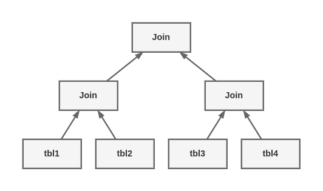

# Query Execution Basics

If you need to get high performance from your MySQL server, one of the best ways to invest time is in learning how MySQL optimizes and executes queries. Once you understand this, much of query optimization is a master of reasoning from principles, and query optimization becomes a very logical process.

What happens when you send MySQL a query:

1. The client sends the SQL statement to the server
2. The server checks the query cache. If there's a hit, it returns the stored result from the cache; otherwise, it passes the SQL statement to the next step
3. The server parses, preprocesses, and optimizes the SQL into a query execution plan
4. The query execution engine executes the plan by making calls to the storage engine API
5. The server sends the result to the client

Each of these steps has some extra complexity, which we discuss in the following sections. We also explain which states the query will be in during each step. The query optimization process is particularly complex and important to understand. There are also exceptions or special cases, such as the difference in execution path when you use prepared statements; we discuss that in the next chapter.

## The MySQL Client/Server protocol

The protocol is half-duplex, which means that at any given time the MySQL server can be either sending or receive mesages, but not both. This protocol makes MySQL communication simple and fast, but it limits it in some ways too. For one thing, it means there's no flow control; once one side sends a message, the other side must fetch the entire message before responding. It's like a game of tossing a ball back and forth: only one side has the ball at any instant, and you can't toss the ball (send a message) unless you have it.

The client sends a query to the server as a single packet of data. This is why the `max_allowed_packet` configuration variable is important if you have large queries. Once the client sends the query, it doesn't have the ball anymore; it can only wait for results.


In constrast, the response from the server usually consists of many packet of data. When the server responds, the client has to receive the entire result set. It cannot simply fetch a few rows and then ask the server not to bother sending the test. If the client needs only the first new rows that are returned, it either has to want for all of the server's packets to arrive and then discard the ones it doesn't need, or disconnect ungracefully. Neither is a good idea, which is why appropriate LIMIT clauses are so important.

Here's another way to think about this: when a client fetchs rows from the server, it thinks it's pulling them. But the truth is, the MySQL server is pushing the rows as it generates them. The client is only receiving the pushed rows; there is no way for it to tell the server to stop sending rows. The client is "drinking fromt he fire hose".    

Most libraries that connection to MySQL let you either fetch the whole result set and buffer it in memory, or fetch each row as you need it. The default behavior is generally to fetch the whole result and buffer it in memory. This is important because until all the rows have been fetched, the MySQL server will not release the locks and other resources required by the query. The query will be in the "Sending data" state. When the client library fetches results all at once, it reduces the amount of work the server needs to do: the server can finish and clean up the query as quickly as possible.

Most client libraries let you treat the result set as though you're fetching it from the server, although in fact you're just fetching it from the buffer in the library's memory. This works fine most of the time, but it's not a good idea for huge result sets that might take a long time to fetch and use a lot of memory. You can use less memory, and start working on the result sooner, if you instruct the library not to buffer the result. The downside is that the locks and other resource on the sever will remain open while your application is interacting with the library.

```php
<?php
$link = mysql_connect('localhost', 'user', 'p4assword');
$result = mysql_query('SELECT * FROM HUGE_TABLE', $link);
while ($row = mysql_fetch_array($result)) {
    // Do something with result
}
```

The code seems to indicate that you fetch rows only when you need them, in the while loop. However, the code actually fetches the entire result into a buffer with the mysql_query() function call. The while loop simple iterates through the buffer. In contrast, the following code doesn't buffer the results, because it uses mysql_unbuf fered_query() instead of mysql_query():

```php
<?php
$link = mysql_connect('localhost', 'user', 'p4assword');
$result = mysql_unbuffered_query('SELECT * FROM HUGE_TABLE', $link);
while ($row = mysql_fetch_array($result)) {
    // Do something with result
}
```

### Query states

Each MySQL connection, or thread, has a state that shows what it is doing at any given time. There are several ways to view these states, but the easiest is to use the SHOW FULL PROCESSLIST command.

- Sleep: The thread is waiting for a new query from the client
- Query: The thread is either executing the query or sending the result back to the client
- Locked: The thread is waiting for a table lock to be granted at the server level. Locks that are implemented by the storage engine, such as InnoDB's row locks, do not cause the thread to enter the Locked state.
- Analyzing and statistics: The thread is checking storage engine statistics and optimizing the query.
- Copying to tmp table [on disk]: The thread is processing the query and copying results to a temporary table, probably for a GROUP BY, for a filesort, or to satify a UNION. If the state ends with "on disk", MySQL is converting an in-memory table to an on-disk table.
- Sorting result: The thread is sorting a result set
- Sending data: This can mean several things: the thread might be sending data between stages of the query, generating the result set, or returning the result set to the client.

### The Query Cache

Before even parsing a query, MySQL checks for it in the query cache, if the cache is enabled. This operation is cace-sensitive hash lookup. If the query differs from a similar query in the cache by even a single byte, it won't match, and the query processing will go to the next stage.

If MySQL does find a match in the query cache, it must check privileges before returning the cached query. This is possible without parsing the query, because MySQL stores table infromation with the cached query. If the privileges are OK, MySQL retrieves the stored result from the query cache and sends it to the client, bypassing every other stage in query execution.

## The query optimization process

The next step turns a SQL query into an execution plan for the query execution engine. It has several substeps: parsing, preprocessing, and optimization. Errors can be rasied at any point in the process.

### The parser and the preprocessor

To begin, MySQL's parser breaks the query into tokens and builds a "parse tree" from them. The parser uses MySQL's SQL grammar to interpret and validate the query. For instance, it ensures that the tokens in the query are valid and in the proper order, and it checks for mistakes such as quoted strings that aren't terminated.

The preprocessor then checks the resulting parse tree for additional semantics that the parser can't resolve. For example, it checks that tables and columns exist, and it resolves names and aliases to ensure that column references aren't ambiguous.

Next, the preprocessor check privileges. This is normally very fast unless your server has large numbers of privileges.

### The query optimizer

The parse tree is now valid and ready for the optimizer to turn it into a query execution plan. A query can often be executed many different ways and produce the same result. The optimizer's job is to find the best option.

MySQL uses a cost-based optimizer, which means it tries to predict the cost of varios execution plans and choose the least expensive. The unit of cost was originally a single random 4KB data page read. You can see how expensive the optimizer estimated a query to be by running the query, then in-specting the Last_query_cost session variable:

```sql
SELECT SQL_NO_CACHE_COUNT(*) FROM film_actors;
SHOW STATUS LIKE 'Last_query_cost';

SHOW STATUS LIKE 'Last_query_cost';
+-----------------+-----------+
| Variable_name   | Value     |
+-----------------+-----------+
| Last_query_cost | 47.099000 |
+-----------------+-----------+
```

The result means that the optimizer estimated it would need to do about 47 random data page reads to execute the query. It bases the estimate on statistics: the number of pages per table or index, the cardinality (number of distinct values) of the indexes, the length of the rows and keys, and the key distribution. The optimizer does not include the effects of any type of caching in its estimates - it assumes every read will result it a disk I/O operation.

The optimizer might not always choose the best plan, for many reasons:

- The statistics could be wrong.
- The cost metric is not exactly equivalent to the true cost of running the query, so even when the statistics are accurate, the query might be more or less expensive than MySQL's approximation.
- MySQL's idea of 'optimal' might not match yours. You probably want the fastest execution time, but MySQL doesn't really try to make queries fast; it tries to minimize their cost, and as we've seen, determining cost is not an exact science.
- MySQL doesn't consider other queries that are running concurently, which can affect how quickly the query run.
- MySQL doesn't always do cost-based optimization.
- ...

MySQL's query optimizer is a highly complex piece of software, and it uses many optimizations to transform the query into an execution plan. There are two basic types of optimizations, which we call static and dynamic. Static optimizations can be performed simply by inspecting the parse tree. For example, the optimizer can transform the WHERE clause into an equivalent form by applying algebraic rules. You can think of these as "compile-time optimizations"

Dynamic optimizations are based on context and depend on many factors, such as which value is in a WHERE clause or how many rows are in an index. The must be re-evaluated each time the query is executed. You can think of these as "runtime optimizations."

The different is important when executing prepared statements or stored procedures. MySQL can do static optimizations once, but it must re-evaluated dynamic optimizations every time it executes a query.

Here are some types of optimizations MySQL knows how to do:

*For example, the range check query plan re-evaluated indexes for each row in a JOIN. You can see this query plan by looking for "range checked for each record" in the Extra column in EXPLAIN.*

**Reordering joins**
Tables dont always have to be joined in the order you specify in the query. Determining the best join order is an important optimization.

**Converting OUTER JOINs to INNER JOINs**
An OUTER JOIN doesn't necessarily have to be executed as an OUTER JOIN. Some factors, such as the WHERE clause and table schema, can actually cause an OUTER JOIN to be equivalent to an INNER JOIN.

**Applying algebraic equivalent rules**
MySQL applies algebraic transformations to simplify and canonicalize expressions. It can also fold and reduce constants, elimicating impossible contraints and constant conditions. For example, the term (5=5 AND a > 5) will reduce to just a > 5. a<b AND b=c AND a=5 becomes b>5 AND b=c AND a=5. These rules are very useful for writing conditional queries, which we discuss later in this chapter.

**COUNT(), MIN(), and MAX() optimizations**
To find the minimum value of a column that's leftmost in a B-Tree index, MySQL can just request the first row in the index. In can even do this in the query optimization stage, and treat the value as a constant for the rest of the query. Similarly, to find the maximum value in a B-Tree index, the server reads the last row. If the server uses this optimization.

Likewise, COUNT(\*) queries without a WHERE clause can often be optimized away on some storage engines (such as MyISAM, which keeps an exact count of rows in the table at all times).

**Evaluating and reducing constant expressions**
When MySQL detects that an expression can be reduced to a constant, it will do so during optimization phase. One example is a MIN() on an index. This can even be extended to a constant lookup on a primary key or unique index. If a WHERE clause applies a constant condition to such an index, the optimizer knows MySQL can look up the value at the beginning of the query. It will then treat the value as a constant in the rest of the query. It will then treat the value as a constant in the rest of the query.

```sql
EXPLAIN SELECT film.film_id, film_actor.actor_id
FROM sakila.film
    INNER JOIN sakila.film_actor USING(film_id)
WHERE film.film_id = 1;

+----+-------------+------------+-------+----------------+-------+------+
| id | select_type | table      | type  | key            | ref   | rows |
+----+-------------+------------+-------+----------------+-------+------+
| 1  | SIMPLE      | film       | const | PRIMARY        | const | 1    |
| 1  | SIMPLE      | film_actor | ref | idx_fk_film_id   | const | 10   |
+----+-------------+------------+-------+----------------+-------+------+
```
MySQL executes this query in two steps, which correspond to the two rows in the output. The first step is to find the desired row in the film table. MySQL's optimizer knows there is only one row, because there's a primary key on the film_id column, and it has already consulted the index using the query optimization stage to see how many rows it will find. Because the query optimizer has a known quantity (the value is the `WHERE` clause) to use in the loopup, this table's ref type is const.

In the second step, MySQL treats the film_id column from the row found in the first step as a known quantity. It can do this because the optimizer knowns that by the time the query reaches the second step, it will know all the values from the first step. Notice that the film_actor table's ref type is const, just as the film table's was.

Another way you'll see constant conditions applied is by propagating a value's constant-ness from one place to another if there is a `WHERE`, `USING`, or `ON` clause that restricts the values to being equal. In this example, the optimizer knows that the `USING` clause forces film_id to have the same value everywhere in the query - it must be equal to the constant value given in the `WHERE` clause.

**Covering indexes**
MySQL can sometimes use an index to avoid reading row data, when the index contains all the columns the query needs.

**Subquery optimization**
MySQL can convert some types of subqueries into more efficient alternatives forms, reducing them to index lookups instead of separate queries.

**Early termination**
MySQL can stop processing a query (or a step in a query) as soon as it filfills the query or step. The obvious case is a LIMIT clause, but there are several other kinds of early termination. For instance, if MySQL detects an impossible condition, it can about the entire query.

```sql
EXPLAIN SELECT film.film_id FROM film WHERE film_id = -1;
+----+-----------------------------------------------------+
| id | Extra |                                             |
+----+-----------------------------------------------------+
| 1 | Impossible WHERE noticed after reading const tables  |
+----+-----------------------------------------------------+
```

This query stopped during the optimization step, but MySQL can also terminate execution early in some other cases. The server can use this optimization when the query execution engine recognizes the need to retrieve distinct values, or to stop when a value doesn't exist.

**Equality propagation**

MySQL recognizes when a query holds two columns as equal - for example, in a JOIN condition - and propagates WHERE clauses across equivalent columns. For instance

```sql
SELECT film.film_id
FROM sakila.film
    INNER JOIN sakila.film_actor USING(film_id)
WHERE film.film_id > 500;
```

MySQL knows that the `WHERE` clause applies not only to the film table but to the film_actor table as well, because the `USING` clause forces the two columns to match.

If you're used to another database server that can't do this, you might have been advised to "help the optimizer" by manually specifying the `WHERE` clause for both tables like this:

```sql
WHERE film.film_id > 500 AND film_actor.film_id > 500;
```

**IN() list comparisons**

In many database servers, IN() is just a synonym for multiple OR clauses, because the two are logically equivalent. Not so in MySQL, which sorts the values in the IN() list and uses a fast binary search to see whether a value is in the list. This is O(logn) in the size of the list, whereas an equivalent series of OR clauses is O(n) in the size of the list.

The preceding list is woefully incomplete, because MySQL performs more optimizations than we could fit into this entire chapter, but it should give you an idea of the optimizer's complexity and intelligence. If there's one thing you should take away from this discussion, it's don't try to outsmart the optimizer. You might end up just defeating it, or marking your queries more complicated and harder to maintain for zero benefit. 

Of course, as smart as the optimizer is, there is times when it doesn't give the best result. Sometimes you might know something about the data that the optimizer doesn't such as a fact that's guaranteed to be true because of application logic. Also, sometimes the optimizer doesn't have the necessary functionality, such as hash indexes.

If you know the optimizer isn't giving a good result, and you know why, you can help it. Some of the options are to add a hint to the query, rewrite the query, redesign your schema, or add indexes.

### Table an index statistics

Recall the various layers in the MySQL server architecture, which we illustrated. The server layer, which contains the query optimizer, doesn't store statistics on data and indexes. That's a job for the storage engines, because each storage engine might keep different kinds of statistics (or keep them in a different way). Some engines, such as Archive, don't keep statistics at all!

Because the server doesn't store statistics, the MySQL query optimizer has to ask the engines for statistics on the table in a query. The engines provide the optimizer with statistics such as the number of pages per table or index, the cardinality of tables and indexes, the length of rows and keys, and key distribution information. The optimizer can use this information to help it decide on the best execution plan. We see how these statistics influence the optimizer's choices in later sections.

### MySQL's join execution strategy

MySQL uses the term "join" more broadly than you might be used to. In sum, it considers every query a join - not just every query that matches rows from two tables, but every query, period (including subqueries, and even a `SELECT` against a single table). Consequently, it's very important to understand how MySQL executes joins.

Consider the example of a UNION query. MySQL executes a UNION as a series of single queries whose results are spooled into a temporary table, then read out again. Each of the individual queries is a join, in MySQL terminology - and so is the act of reading from the resulting temporary table.

At the moment, MySQL's join execution strategy is simple: it treats every join as a nested-loop join. This means MySQL runs a loop to find a row from a table, then runs a nested-loop join to find a matching row in the next table. It continues until it has found a matching row in each table in the join. It then builds and returns a row from the columns named in the SELECT list. It tries to build the next row by looking for more matching rows in the last table. If it doesn't find any, it backtracks one table and looks for more rows there. It keeps backtracking until it finds another row in some table, at which point it looks for a matching row in the next table, and so on.  

```sql
SELECT tbl1.col1, tbl2.col2
FROM tbl1 INNER JOIN tbl2 USING(col3)
WHERE tbl1.col1 IN (5,6);
```

Assuming MySQL decides to join the tables in the order shown in the query, the following pseudocode shows how MySQL might execute the query:  

```go
outer_iter = iterator over tbl1 where col1 IN(5, 6)
outer_row = outer_iter.next
while outer_row
    inner_iter = iterator over tbl2 where col3 = outer_row.col3
    inner_row = inner_iter.next
    while inner_row
        output [ outer_row.col1, inner_row.col2 ]
        inner_row = inner_iter.next
    end
    outer_row = outer_row.next
end
```

This query execution plan applies as easily to single-table query as it does to a many table query, which is why even.

```sql
SELECT tbl1.col1, tbl2.col2
FROM tbl1 LEFT OUTER JOIN tbl2 USING(col3)
WHERE tbl1.col1 IN (5, 6);
```

MySQL executes every kind of query in essentially the same way. For example, it handles a subquery in the `FROM` clause by executing it first, putting the results into a temporary table, and then treating that table just like an ordinary table (hence the name "derived table"). MySQL executes UNION queries with temporary tables too, and it rewrites of MySQL coerce every kind of query into this execution plan.

It's not possible to execute every legal SQL query this way, however. For example, a FULL OUTER JOIN can't be executed with nested loops and backtracking as soon as a table with no matching row is found, because it might begin with a table that has no matching rows. This explain why MySQL doesn't support FULL OUTER JOIN. Still other queries can be executed with nested loops, but perform very badly as a result.

**There are no indexes on the temporary table, which is something you should keep in mind when writing complex joins against subqueries in the `FROM` clause. This applies to `UNION` queries, too.**

**There are significant changes in MySQL 5.6 and in MariaDB, which introduce more sophisticated execution paths.**

**The server generates the output from the execution plan. It thus haas the same semantics as the original query, but not necessarily the same text.**

### The execution plan

MySQL doesn't generate byte-code to execution a query, as many other database products do. Instead, the query execution plan is actually a tree of instructions that the query execution engine follows to produce the query results. The final plan contains enough information to reconstruct the original query. 

Any multitable query conceptually be represented as a tree. For example, it might be possible to execute a four-table join:



This is what computer scientists call a balanced tree. This is not how MySQL executes the query, though. As we described in the previous section, MySQL always begins with one table and finds matching rows in the next table.


### The join optimizer

The most important part of the MySQL query optimizer is the join optimizer, which decides the best order of execution for multitable queries. It is often possible to join the tables in several different orders and get the same results. The join optimizer estimates the cost for various plans and tries to choose the least expensive one that gives the same result. 

Here's a query whose tables can be joined in different orders without changing the results.

```sql
SELECT film.film_id, film.title, film.release_year, actor.actor_id, actor.first_name, actor.last_name
FROM sakila.film
INNER JOIN sakila.film_actor USING(film_id)
INNER JOIN sakila.actor USING(actor_id);
```

You can probably think of a few different query plans. For example, MySQL could begin with the film table, use the index on film_id in the film_actor table to find actor_id values, and then look up rows in the actor table's primary key. Oracle users might phrase this as "The film table is the driver table into the film_actor table, which is the driver for the actor table." This should be efficient, right? Now let's use EXPLAIN to see how MySQL wants to execute the query:

```sql
***1.row***
id           : 1
select_type  : SIMPLE
table        : actor
type         : ALL
possible_keys: PRIMARY
key          : NULL
key_len      : NULL
ref          : NULL
rows         : 200
Extra        :

***2.row***
id           : 1
select_type  : SIMPLE
table        : film_actor
type         : ref
possible_keys: PRIMARY, idx_fk_film_id
key          : PRIMARY
key_len      : 2
ref          : sakila.actor.actor_id
rows         : 1
Extra        : Using index

***3.row***
id           : 1
select_type  : SIMPLE
table        : film
type         : eq_ref
possible_keys: PRIMARY
key          : PRIMARY
key_len      : 2
ref          : sakila.film_actor.film_id
rows         : 1
Extra        :
```

This is quite a different plan from the one suggested in the previous paragraph. MySQL wants to start with the actor table (we know this because it's listed first in the EXPLAIN output) and go in the reverse order. Is this really more efficient? Let's find out. The STRAIGHT_JOIN keyword forces the join to proceed in the order specified in the query. Here's the EXPLAIN output for the revised query:

```sql
EXPLAIN SELECT STRAIGHT_JOIN film.film_id...\G

***1.row***
id           : 1
select_type  : SIMPLE
table        : film
type         : ALL
possible_keys: PRIMARY
key          : NULL
key_len      : NULL
ref          : NULL
rows         : 951
Extra        :

***2.row***
id           : 1
select_type  : SIMPLE
table        : film_actor
type         : ref
possible_keys: PRIMARY, idx_fk_film_id
key          : idx_fk_film_id
key_len      : 2
ref          : sakila.film.film_id
rows         : 1
Extra        : Using index

***3.row***
id           : 1
select_type  : SIMPLE
table        : actor
type         : eq_ref
possible_keys: PRIMARY
key          : PRIMARY
key_len      : 2
ref          : sakila.film_actor.actor_id
rows         : 1
```

This shows why MySQL wants to reverse the join order: doing so will enable it to examine fewer rows in the first table. In both cases, it will be able to perform fast indexed lookups in the second and third tables. The difference is how many of these indexed lookups it will have to do:

- Placing film first will require about 951 probes into film_actor and actor, one for each row in the first table.
- If the server scans the actor table first, it will have to do only 200 index lookups into later tables.

In other words, the reversed join order will require less backtracking and rereading. To double-check the optimizer's choice, we executed the two query versions and looked at the `Last_query_cost` variable for each. The reordered query had an estimated cost of 241, while the estimated cost of forcing the join order was 1154.

This is a simple example of how MySQL's join optimizer can reorder queries to make them less expensive to execute. Reordering joins is usually a very effective optimization. There are times when it won't result in an optimal plan, though, and for those times you can use STRAIGHT_JOIN and write the query in the order you think is best - but such times are rare. In most cases, the join optimizer will outperformance a human. There are times when it won't result in an optimal plan, though, and for those times you can use STRAIGHT_JOIN and write in the order you think is best - but such times are rare. In most cases, the join optimizer will outperform a human.

The join optimizer tries to produce a query execution plan tree with the lowest archievable cost. When possible, it examines all potential combinations of subtrees, begining with all one-table plans.

Unfortunately, a join over n tables will have n-factorial combinations of join orders to examine. This is called the search space of all possible query plans, and it grows very quickly - a 10 table join can be executed up to 3,628,800 different ways! When the search page grows too large, it can take far too long to optimize the query, so the server stops doing a full analysis. Instead, it resorts to shortcuts such as "greedy" searches when the number of tables exceeds the limit specified by the `optimizer_search_depth` variable (which you can change if necessary).

MySQL has many heuristics, accumulated through years of reasearch and experimentation, that it uses to speed up the optimization stage. This can be beneficial, but it can also mean that MySQL might (on rare occasions) miss an optimal plan and choose a less optimal one because it's trying not to examine every possible query plan.

Sometimes queries can't be reordered, and the join optimizer can use this fact to reduce the search space by eliminating choices. A LEFT JOIN is a good example, as are correlated subqueries (more about subqueries later). This is because the results for one table depend on data retrieved from another table. These dependencies help the join optimizer reduce the search space by eliminating choices.

### Sort optimizations

Sorting results can be a costly operation, so you can often improve performance by avoiding sorts or by avoiding sorts or by performing them on fewer rows.

We showed you how to use indexes for sorting. When MySQL can't use an index to produce a sorted result, it must sort the rows itself. It can do this in memory or on disk, but it always calls this process a filesort, even if it doesn't actually use a file.

If the values to be sorted will fit into the sort buffer, MySQL can perform the sort entirely in memory with a quicksort. If MySQL can't do the sort in memory, it performs it on disk by sorting the values in chunks. It uses a quicksort to sort each chunk and then merges the sorted chunks into the results.

There are two filesort algorithms:

**Two passes(old)**

Reads row pointers and ORDER BY columns, sorts them, and then scans the sorted list and rereads the rows for output.

The two-pass algorithm can be quite expensive, because it reads the rows from the table twice, and the second read causes a lot of random I/O. This is especially expensive for MyISAM. On the other hand, it stores a minimal amount of data during the sort, so if the rows to be sorted are completely in memory, it can be cheaper to store less data reread the rows to generate the final result.

**Single pass(new)**

Reads all the columns needed for the query, sorts them by the ORDER BY columns, and then scans the sorted list and outputs the specified columns.

This algorithm is available only in MySQL 4.1 and newer. It can be much more efficient, especially on large I/O-bound datasets, because it avoids reading the rows from the table twice and trades random I/O for more sequential I/O. However, it has the potential to use a lot of more space, because it holds all the desired columns from each row, not just use a lot more space, because it holds all the desired column from each row, not just the columns needed to sort the rows. This means fewer tuples will fit into the sort buffer, and the filesort will have to perform more sort merge passes.

When sorting a join, MySQL might perform the filesort at two stages during the query execution. If the ORDER BY clause refers only to columns from the first table in the join order, MySQL can filesort this table and then process with the join. If this happens, EXPLAIN shows "Using filesort" in the Extra column. In all other circumtances - such as a sort against a table that's not first in the join order, or when the ORDER BY clause contains columns from more than one table - MySQL must store the query's results into a temporary table and then filesort the temporary table after the join finishes. In this case, EXPLAIN shows "Using temporary; Using filesort" in the Extra column. If there's a LIMIT, it is applied after the filesort, so the temporary table and the filesort can be very large. 

## The Query Execution Engine

The parsing and optimizing stage outputs a query execution plan, which MySQL's query execution engine uses to process the query. The plan is a data structure; it is not executable byte-code, which is how many other databases execute queries.

In constrast to the optimization stage, the execution stage is usually not all that complex: MySQL simply follows the instructions given in the query execution plan. Many of the operations in the plan invoke methods implemented by the storage engine interface, also known as the handler API. Each table in the query in the query is represented by an instance of a handler.

The storage engine interface has lots of functionality, but it needs only a dozen or so "building-block" operations to execute most queries. For example, there's an operation to read the first row in an index, and one to read the next row in an index.

Many of the operations in the plan invoke methods implemented by the storage engine interface, also known as the handler API. Each table in the query is represented by an instance of a handler. If a table appears three times in the query, for example, the server creates three handler instances. Though we glossed over this before, MySQL actually creates the handler instances early in the optimization stage.

The storage engine interface has lots of functionality, but it needs only a dozen or so "building-block" operations to execute most queries. For example, there's an operation to read the first row in an index, and one to read the next row in an index.

Not everything is a handler operation. For example, the server manages table locks. The handler might implement its own lower-level locking, as InnoDB does with row-level locks, but this does not replace the server's own locking impl.

### Returning Results to the Client

The final step in executing a query is to reply to the client. Event queries that don't return a result set still reply to the client connection with information about the query, such as how many rows it affected.

If the query is cacheable, MySQL will also place the results into the query cache at this stage.

The server generates and sends results incrementally. Think back to the single-sweep multijoin method we mentioned earlier. As soon as MySQL processes the last table and generates one row successfully, it can and should send that row to the client.

This has two benefits: it lets the server avoid holding the row in memory, and it means the client starts getting the results as soon as possible.

Each row in the result set is sent in a separate packet in the MySQL client/server protocol, although protocol packets can be bufffered and sent together at the TCP protocol layer.

## Limitations of MySQL Query Optimizer

MySQL's "everything is a nested-loop join" approach to query execution isn't ideal for optimizing every kind of query. Fortunately, there are only a limited number of cases where the MySQL query optimizer does a poor job, and it's usually possible to rewrite such queries more efficiently.

### Correlated Subqueries

MySQL sometimes optimizes subqueries very badly. The worst offenders are IN() subqueries in the `WHERE` clause. As an example, let's find all films in the Sakila sample database's.

It's tempting to think that MySQL will execute this query from the inside out, by finding a list of actor_id values and substituting them into the IN() list. We said an IN() list is generally very fast, so you might expect the query to be optimized to something like this:

```sql
SELECT * FROM sakila.film
WHERE film_id
IN (1,23,25,106,140,166,277,361,438)
```

Unfortunately, exactly the opposite happens. MySQL tries to "help" the subquery by pushing a correlation into it from the outer table, which is thinks will let the subquery find rows more efficiently. It rewrites the query as follows:

```sql
SELECT * FROM sakila.film
WHERE EXISTS (
    SELECT * FROM sakila.film_actor WHERE actor_id = 1
    AND film_actor.film_id = film.film_id
)
```

Now the subquery requires the film_id from the outer film table and can't executed first. EXPLAIN shows the result as DEPENDENT SUBQUERY.

```txt
+----+--------------------+------------+--------+------------------------+
| id | select_type        | table      | type   | possible_keys          |
+----+--------------------+------------+--------+------------------------+
| 1  | PRIMARY            | film       | ALL    | NULL                   |
| 2  | DEPENDENT SUBQUERY | film_actor | eq_ref | PRIMARY,idx_fk_film_id |
+----+--------------------+------------+--------+------------------------+
```

According to the EXPLAIN output, MySQL will table-scan the film table and execute the subquery for each row it finds. This won't cause a noticeable performance hit on small tables, but if the outer table is very large, the performance will be extremely bad. Fortunately, it's easy to rewrite such a query as a JOIN:

```sql
SELECT film.* FROM sakila.film
    INNER JOIN sakila.film_actor USING(film_id)
WHERE actor_id = 1;
```

Another good optimization is to manually generate the IN() list by executing the sub-query as a separate query with GROUP_CONCAT(). Sometimes this can be faster than a JOIN. And finally, although IN() subqueries work poorly in many cases, EXISTS() or equality subqueries sometimes work much better. Here is another way to retrive our IN() subquery example:

```sql
SELECT * FROM sakila.film
WHERE EXISTS (
    SELECT * FROM sakila.film_actor WHERE actor_id = 1
        AND film_actor.film_id = film.film_id;
)
```

### When a correlated subquery is good

MySQL doesn't always optimize correlated subqueries badly. Some-times a correlated subquery is a perfectly reasonable, or even optimal, way to get a result.

TODO: read again

## UNION Limitations

MySQL sometimes can't "push down" conditions from the outside of a UNION to the inside, where they could used to limit results or enable additional optimizations.

If you think any of the individual queries inside a UNION would benefit from a LIMIT, or if you know they'll be subject to an ORDER BY clause once combined with other queries, you need to put those clauses inside each part of the UNION. For example, if you UNION together two tables and LIMIT the result to the first 20 rows, MySQL will store both tables into a temporary table and then retrieve just 20 rows from it:

```sql
(SELECT first_name, last_name FROM sakila.actor ORDER BY last_name)
UNION ALL
(SELECT first_name, last_name FROM sakila.customer ORDER BY last_name)
LIMIT 20;
```

This query will store 200 rows from the actor table, and 599 from the customer table, into a temporary table and then fetch the first 20 rows from that temporary table. You can avoid this by adding LIMIT 20 redundantly to each query inside the UNION:

```sql
(SELECT first_name, last_name
 FROM sakila.actor
 ORDER BY last_name
 LIMIT 20)
UNION ALL
(SELECT first_name, last_name
 FROM sakila.customer
 ORDER BY last_name
 LIMIT 20)
LIMIT 20;
```

Now the temporary table will contain only 40 rows. In addition to the performance improvement, you'll probably need to correct the query: the order in which the rows are retrieved from the temporary table is undefined, so there should be an overall ORDER BY just before the final LIMIT.

### Index Merge Optimizations

MySQL can access several indexes from a single table and union or intersect the results to locate rows when there are complex filtering conditions in the WHERE clause.

#### Equality Propagation

Equality propagation can have unexpected costs sometimes. For example, consider a huge IN() list on a column the optimizer knows will be equal to some columns on other tables, due to a WHERE, ON or USING clause that sets the columns equal to each other.

The optimizer will "share" the list by copying it to the corresponding columns in all related tables. This is normally helpful, because it gives the query optimizer and execution engine more options for where to actually execute the IN() check. But when the list is very large, it can result in slower optimization and execution.

#### Parallel Execution

MySQL can't execute a single query in parallel on many CPUs. This is feature offered by some other database servers, but not MySQL.

#### Hash Joins

MySQL can't do true hash joins at the time of this writing - everything is a nested-loop join. However, you can emulate hash joins using hash indexes, too.

#### Loose Index Scans

#### MIN() and MAX()

#### SELECT and UPDATE on the Same Table

## Query Optimizer Hints

## Optimizing Specific Types of Queries

### Optimizing COUNT() Queries

The COUNT() aggregate function, and how to optimize queries that use it, is probably one of the top 10 most-misunderstood topics in MySQL. You can do a web search and find more misinformation, it's important that you understand what COUNT() really does.

#### What COUNT() does

COUNT() is a special function that works in two very different ways: it counts values and rows. A value is a non-null expression (NULL is the absence of a value). If you specify a column name or other expression inside the parentheses, COUNT() counts how many times that expression has a value. This is confusing for many people, in part because values and NULL are confusing. If you need to learn how this works in SQL, we suggest a good book on SQL fundamentals.

One of the most common mistakes we see is specifying column names inside the parentheses then you want to count rows. When you want to know the number of rows in the result, you should always use COUNT(*).

#### Using an approximation

Sometimes you don't need an accurate count, so you can just use an approximation. The optimizer's estimated rows in EXPLAIN often serves well for this. Just execute an EXPLAIN query instead of the real query.

#### More complex optimizations

In general, COUNT() queries are hard to optimize because they usually need to count a lot of rows (i.e., access a lot of data). Your only other option for optimizing within MySQL itself is to use a covering index. If that doesn't help enough, you need to make changes to your application architecture. Consider summary tables, and possibly an external caching system such as memcached. You'll probably find yourself faced with the familar dilemma, "fast, accurate, and simple: pick any two."

### Optimizing JOIN Queries

This topic is actually spread thoughout most of the book, but we'll mention a few highlights:

- Make sure there are indexes on the columns in the ON or USING clauses. Consider the join order when adding indexes. If you're joining tables A and B on column c and the query optimizer decides to join the tables in the order B, A, you don't need to index the column on table B. Unused indexes are extra overhead. In generally, you need to add indexes only on the second table in the join order, unless they're needed for some other reason.
- Try to ensure that any GROUP BY or ORDER BY expression refers only to column from a single table, so MySQL can try to use an index for that operation.
- Be careful when upgrading MySQL, because the join syntax, operator precedence and other behaviors have changed at various times. What used to be normal join can sometimes become a cross product, a different kind of join that returns different results.

### Optimizing Subqueries

The most important advice we can give on subqueries is that you should usually perfer a join where possible, at least in current versions of MySQL. We covered this topic extensively earlier in this chapter. However, "prefer a join" is not future-proof advice.

### Optimizing GROUP BY and DISTINCT

MySQL optimizes these two kinds of queries similarly in many cases, and in fact converts between them as needed internally during the optimization process. Both types of queries benefit from indexes as usual, and that's the single most important way to optimiz them. 

TODO: read more

### Optimizing LIMIT and OFFSET

## Case Studies

Sometimes it's not about query optimization, schema optimization, index optimization, or application design optimization - it's about all of these practices put together. The case studies in this section illustrate how to approach some design challenges that frequently cause problems for users.

### Bulding a Queue Table in MySQL

Building a queue in MySQL is tricky, and most designs we've seen don't work well when the system experiences high traffic and lots of concurrency. The typical pattern is to have a table that contains several types of rows: rows that haves been processed, rows in process, and finished rows. One or more worker processes look for unprocessed rows, update them to "claim" them, and then perform the work and update them to mark them as finished. 

There are two broad reasons why this doesn't work well. First, the table tends to grow very large, and searching for the unprocessed rows becomes slow when the table is large and the indexes are many levels deep. You can slove this by splitting the queue into two tables and moving the completed rows to the archieve or history table.  

## Summary
