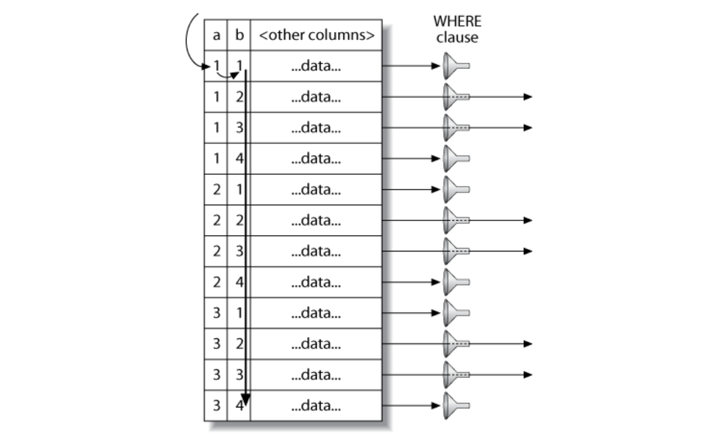
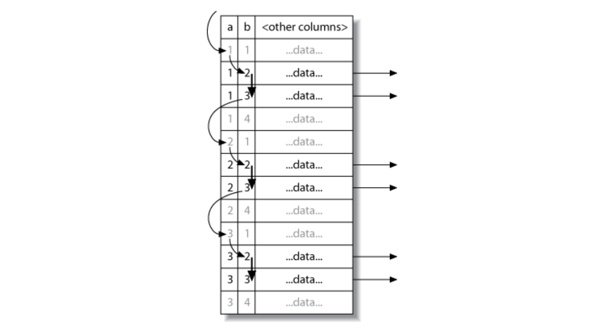

# Limitations of the MySQL Query Optimizer

MySQL's "everything is nested-loop join" approach to query execution isn't ideal for optimizing every kind of query. Fortunately, there are only a limited number of cases where the MySQL query optimizer does a poor job, and it's usually possible to rewrite such queries more efficiently.

## Correlated Subqueries

MySQL sometimes optimizes subqueries very badly. The worst offenders are IN() sub-queries in the WHERE clause in the WHERE clause.

```sql
SELECT * FROM sakila.film
WHERE film_id IN (
    SELECT film_id FROM sakila.film_actor WHERE actor_id = 1;
)
```

It's tempting to think that MySQL will execute this query from the inside out, by finding a list of id values and substituting them into the IN() list. We said an IN() list is generally very fast, so you might expect the query to be optimized to something like this:

```sql
SELECT * FROM sakila.film
WHERE film_id
IN (1,2,3,4)
```

Unfortunately, exactly the opposite happens. MySQL tries to "help" the subquery by pushing a correlation into it from the outer table, which is thinks will let the subquery find rows more efficiently. It rewrites the query as follows:

```sql
SELECT * FROM sakila.film
WHERE EXISTS (
    SELECT * FROM sakila.film_actor WHERE actor_id = 1
    AND film_actor.film_id = film.film_id);
```

Now the subquery requires the film_id from the outer film table and can't be executed first. EXPLAIN shows the result as DEPENDENCT SUBQUERY (you can use EXPLAIN EXTENDED to see exactly how the query is rewritten):

```sql
EXPLAIN SELECT * FROM sakila.film ...;
+----+--------------------+------------+--------+------------------------+
| id | select_type        | table      | type   | possible_keys          |
+----+--------------------+------------+--------+------------------------+
| 1  | PRIMARY            | film       | ALL    | NULL                   |
| 2  | DEPENDENT SUBQUERY | film_actor | eq_ref | PRIMARY,idx_fk_film_id |
+----+--------------------+------------+--------+------------------------+
```

According to the EXPLAIN output, MySQL will table-scan the film table and execute the subquery for each row it finds. This won't cause a noticeable performance hit on a small tables, but if the outer table is very large, the performance will be extremely bad. Fortunately, it's easy to rewrite such a query as a JOIN:

```sql
SELECT film.* FROM sakila.film
    INNER JOIN sakila.film_actor USING(film_id)
WHERE actor_id = 1;
```

Another good optimazation is to manually generate the IN() list by executing the sub-query as a separate query with GROUP_CONCAT(). Sometimes this can be faster that a JOIN. And finally, although IN() subqueries work poorly in many cases, EXISTS() or equality subqueries somtimes work much better. Here is another way to rewrite our IN() subquery example:

```sql
SELECT * FROM sakila.film
WHERE EXISTS (
    SELECT * FROM sakila.film_actor WHERE actor_id = 1
        AND film_actor.film_id = film.film_id
);
```

## When a correlated subquery is good

MySQL doesn't always optimize correlated subqueries badly. If you hear advice to always avoid them, don't listen! Instead, measure and make your own decision. 

```sql
EXPLAIN SELECT film_id, language_id from sakila.film
WHERE NOT EXISTS(
    SELECT * FROM sakila.film_actor
    WHERE film_actor.film_id = film.film_id
)
```

The standard advice for this query is to write it as a `LEFT OUTER JOIN` instead of using a subquery. In theory, MySQL's execution plan will be essentially the same either way.

```sql
EXPLAIN SELECT film.film_id, film.language_id
FROM sakila.film
    LEFT OUTER JOIN sakila.film_actor USING(film_id)
WHERE film_actor.film_id IS NULL\G
```

So, in theory, MySQL will execute the queries almost identically. In reality, measuring is the only way to tell which approach is really faster.

However, this isn't always the case. Sometimes a subquery can be faster. For example, it can work well when you just want to see rows from one table that match rows in another table. Although that sounds like it describes a join perfectly, it's not always the same thing.

```sql
SELECT film.film_id FROM sakila.film
    INNER JOIN sakila.film_actor USING(film_id);

SELECT DISTINCT film.film_id FROM sakila.film
    INNER JOIN sakila.film_actor USING(film_id);
```

### Union Limitations

MySQL sometimes can't "push down" conditions from the outside of a UNION to the inside, where they could be used to limit results or enable additional optimizations.

If you think any of the individual queries inside a UNION would benefit from a LIMIT, of if you know they'll be subject to an ORDER BY clause once combined with other queries, you need to put those clauses inside each part of the UNION. For example, if you UNION together two tables and LIMIT the result to the first 20 rows. MySQL will store both tables into a temporary table and then retrieve just 20 rows from it:

```sql
(SELECT first_name, last_name 
FROM sakila.actor
ORDER BY last_name)
UNION ALL
(SELECT first_name, last_name
FROM sakila.customer
ORDER BY last_name)
LIMIT 20;
```

This query will store 200 rows from the actor table, and 599 from the customer table, into a temporary table and then fetch the first 20 rows from that temporary table. You can avoid this by adding LIMIT 20 redundantly to each query inside the UNION:

```sql
(SELECT first_name, last_name
FROM sakila.actor
ORDER BY last_name
LIMIT 20)
UNION ALL
(SELECT first_name, last_name
FROM sakila.customer
ORDER BY last_name
LIMIT 20)
LIMIT 20;
```
### Index Merge Optimizations

### Equality Propagation

### Parallel Execution

MySQL can't execute a single query in parallel on many CPUs. This is a feature offered by some other databases servers, but not MySQL. We mention it so that you won't spend a lot of time trying to figure out how to get parallel query execution on MySQL!

### Hash Joins

MySQL can't do true hash joins at the time of this writing - everything is a nested-loop join. However, you can emulate hash joins using hash indexes. If you aren't using the Memory storage engine, you'll have to emulate the hash indexes, too.  

### Loose Index Scans

MySQL has historially been unable to do loose index scans, which can noncontiguous ranges of an index. MySQL's index scans generally require a defined start point and a defined end point in the index, even if only a few noncontiguous rows in the middle are really desired for the query. MySQL will scan the entire range of rows within these end points. 

An example will help clarify this. Suppose we have a table with an index on columns (a, b), and we want to run the following query: 

```sql
SELECT * FROM tbl WHERE b BETWEEN 2 AND 3;
```

Because the index begins with a column a, but the query's WHERE clause doesn't specify column a, MySQL will do a table scan and eliminate the nonmatching rows with a WHERE clause.



It's easy to see that there's a faster way to execute this query. This index's structure (but not MySQL's storage engine API) lets you seek to the beginning of each range of values scan util the end of the range, and then backtrack and jump ahead to the start of the next range, and then backtrack and jump ahead to the start of the next range.



Notice that absence of a `WHERE` clause, which isn't needed because the index alone lets us skip over the unwanted rows.

This is admittedly a simplistic example, and we could easily optimize the query we've shown by adding a different index. However, there are many cases where adding an other index can't solve the problem. One example is a query that has a range condition on the index's first column and an equality condition on the second column.

Until MySQL supports general-purpose loose index scans, the workaround is to supply a constant or list of constants for the leading columns of the index. We showed several examples of how to get good performance with these types of queries in our indexing case study in the previous chapter.

In MySQL 5.6 some limitations on loose index scans will be fixed with an optimizer technique called "index condition pushdown".

### MIN() and MAX()

MySQL doesn't optimize certain MIN() and MAX() queries very well. Here's an example:

```sql
SELECT MIN(actor_id) FROM sakila.actor WHERE first_name = 'PENELOPE';
```

Because there's no index on first_name, this query performs a table scan. If MySQL scans the primary key, it can theoretically stop after reading the first matching row, because the primary key is strictly ascending and any subsequent row will have a greater actor_id. However, in this case MySQL will scan the whole table, which you can verify by looking at SHOW STATUS counters. The workaround is to remove the MIN() and rewrite the query with a LIMIT, as follows:

```sql
SELECT actor_id FROM sakila.actor USE INDEX(PRIMARY)
WHERE first_name = 'PENELOPE' LIMIT 1;
```

### SELECT and UPDATE on the Same Table

## Query Optimizer Hints

