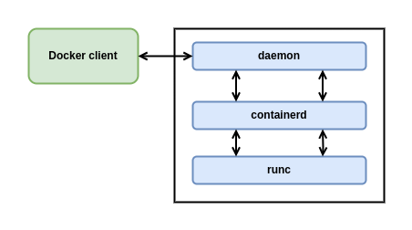
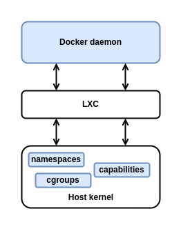
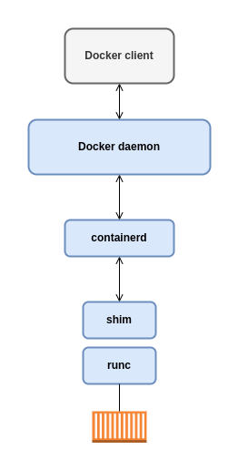

# The Docker Engine

In this chapter, we'll take a quick look under the hood of the Docker Engine.

## Docker Engine - The TLDR

The Docker engine is the core software that runs and manages containers. We often refer to simply as Docker, or the Docker platform. If you know a thing or two about VMware, it might be useful to think of it as being like ESXi in the VMware world.



## Docker Engine - The Deep Dive

When Docker was first released, the Docker engine had two major components:

- The Docker daemon
- LXC

The Docker daemon was a monolithic binary. It contains all of the code for the Docker client, the Docker API, the container runtime, image builds, and much more.

The LXC component provided the daemon with access to the fundamental building-blocks of containers such as kernel namespaces and control groups (cgroups).



## Getting rid of LXC

The reliance on LXC was an issue from the start.

Frist up, LXC is Linux-specific. This was a problem for a project that had aspirations of being multi-platform.

Second up, being reliant on an external tool for something so core to the project was a huge risk that could hinder development.

As a result, Docker. Inc. developed their own tool called libcontainer as a replacement for LXC. The goal of libcontainer was to be a platform-agnostic tool that provided Docker with access to the fundamental container building-blocks that exist inside the OS.

Libcontainer replaced LXC as the default execution driver in Docker 0.9.

## Getting rid of the monolithic Docker daemon

Over time, the monolithic nature of the Docker daemon become more and more problematic: 

1. It's hard to innovate on.
2. It got slower.
3. It wasn't what the ecosystem.

Docker, Inc. was aware of these challenges, and began a huge effort to break apart the monolithic daemon and modularize it. The aim of this work is to break out as much of the functionality as possible from the daemon, and re-implement it in smaller specialized tools. These specialized tools can be swapped out, as well as easily used by third parties to build other tools. This plan follows the tried-and-tested Unix philosophy of building small specialized tools that can be pieced together into larger tools.

## The influence of the Open Container Initiative (OCI)

While Docker, Inc. was breaking the daemon apart and refactoring code, the OCI was in the process of defining two container-related standards:

1. Image spec
2. Container runtime spec

The Docker engine implements the OCI specifications as closely as possible. For example, the Docker daemon no longer contains any container runtime code - all container runtime code is implemented in a separate OCI-compliant layer. By default, Docker uses a tool called runc for this. runc is the reference implementation of the OCI container-runtime-spec, and a goal of the runc project keep runc in lockstep with the OCI spec.

## runc

As previously mentioned, runc is the reference implementation of the OCI container-runtime-spec. Docker, Inc. was heavily involved in defining the spec and developing runc.

runc is small. It's effectively a lightweight CLI that wraps around libcontainer. It has a single purpose in life - to create containers. And it's damn good at it. And fast!

We often refer to runc as a container runtime.

## containerd

In order to use runc, the Docker engine needed something to act as a bridge between the daemon and runc. This is where containered comes into the picture.

containerd implements the execution logic that was pulled out of the Docker daemon. This logic was obviously refactored and tuned when it was re-written as containerd.

It's helpful to think of containerd as a container supervisor - the component that is responsible for container lifecycle operations such as; starting and stopping containers, pausing and un-pausing them, and destroying them.

Like runc, containerd is small, lightweight, and designed for a single task in life - containerd is only interested containerd lifecycle operations.

## Starting a new container

```bash
docker container run --name ctr1 -it alpine:latest sh
```

When you type commands like this into the Docker CLI, the Docker client converts them into appropriate API payload and POSTs them to the correct API endpoint.

The API is implemented in the daemon. It is the same rich, versioned, REST API that has become a hallmark of Docker and it accepted in the industry as the de facto container API.

Once the daemon receives the command to create a new container, it makes a call to containerd. Remember that the daemon no-longer contains any code to create containers!

The daemon communicates with containerd via a CRUD-style API over gRPC.

Despite its name, containerd cannot actually create containers. It uses runc to do that. It converts the required Docker image into an OCI bundle and tells runc to use this to create a new container.

runc interfaces with the OS kernel to pull together all of the constructs necessary to create a container (in Linux these include namespaces and cgroups). The container process is started as a child-process of runc.



## One huge benefit of this model

Having all of the logic and code to start and manage containers removed from the daemon means that the entire container runtime is decoupled from the Docker daemon. It makes it possible to perform maintenance and upgrades on the Docker daemon without impacting running containers.

In the old model, where all of container runtime logic was implemented in the daemon, starting and stopping the daemon would kill all running containers on the host.

## What's this shim all about?

We mentioned eariler that containerd uses runc to create new containers. In fact, it forks a new instance of runc for every container it creates. However, once each container is created, its parent run process exists. This means we can hundreds of containers without having to run hundreds of runc instances.

Once a container's parent runc process exits, the associated containerd-shim process becomes the container's parent process. Some of the responsibilities the shim performs as container's parent include:

- Keeping any STDIN and STDOUT streams open so that when the daemon is restarted, the container doesn't terminate due to pipes being closed etc.
- Reports the container's exit status back to the daemon.

## How it's implemented on Linux

On a Linux system, the components we've discussed are implemented as separate binaries as follows: dockerd (the Docker daemon) - docker-containerd (containerd) - docker-containerd-shim (shim) - docker-runc (runc).

## So what's the point of the daemon

With all the execution and runtime code stripped out of the daemon you might be asking the question: "what is left in the daemon?".

Obviously, the answer to this question will change over time as more and more functionality is stripped out and modularized. However, at the time of writing, some of the major functionality that sill exists in the daemon includes; image management, image builds, the REST API, authentication, security, core networking, and orchestration. 
