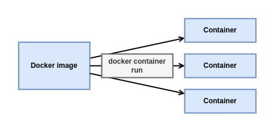
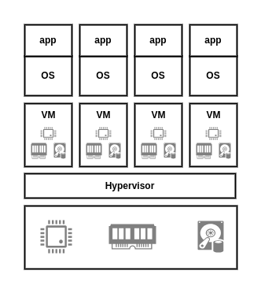
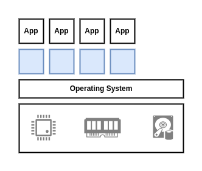

# Containers

## Docker containers - The TLDR

A container is the runtime instance of an image. In the same way that we can start a virtual machine (VM) from a virtual machine template, we start one or more containers from a single image. The big difference between a VM and a container is that containers are faster and more lightweight - instead of running a full-blown OS like a VM, containers share the OS/kernel with the host they're running on.  



The simplest way to start a container is with the docker container run command. The command can take a lot of arguments, but in its most basic form you tell it an image to use and a command to run:

```bash
docker container run <image> <command>
```

The -it flags used in the commands above will connect your current terminal window to the container's shell.

You can manually stop a container with the docker container stop command, and then restart it with docker container start. To get rid of a container forever you have to explicitly delete it using docker container rm.

That's the elevator pitch! Now let's get into the detail ...

## Docker containers - The deep dive

### Containers vs VMs

Containers and VMs both need a host to run on. We'll assume a single physical server that we need to run 4 business applications on.

In the VM model, the physical server is powered on and the hypervisor boots. Once the hypervisor boots it lays claim to all physical resources on the system such as CPU, RAM, storage, and NICs. The hypervisor then carves these hardware resources into virtual versions that look smell and feel exactly like the real thing. It then packages them into a software construct called virtual machine (VM). We then take those VMs and  install an os and application on each one. We said we had a single physical server and needed to run 4 applications, so we'd create 4 VMs, install 4 os, and then install 4 applications.



Things are a bit different in the container model.

When the server is powered on, your chosen OS boots. In the Docker world this can be Linux or a modern version of Windows that has support for the container primitives in its kernel.



containers perform OS virtualization - they carve up OS resources into virtual versions.

## The VM tax
