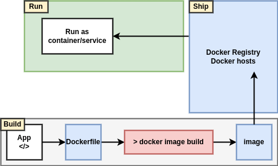

# Containerizing an App

Docker is all about taking applications and running them in containers.

The process of taking an application and configuring it to run as a container is called "containerizing". Sometimes we call it "Dockerizing".

## Containerizing an App - The TLDR

Containers are all about apps! In particular, they're about making apps simple to **build**, **ship**, and **run**.

The process of containerizing an app looks like this:

1. Start with your application code.
2. Create a Dockerfile that describes your app, its dependencies, and how to run it.
3. Feed this Dockerfile into the docker image build command.
4. Sit back while Docker builds your application into a Docker image.

Once your app is containerized (made into a Docker image), you're ready to ship it and it as a container.



## Containerizing an App - The deep dive

The rest of this chapter will walk you through the process of containerizing a simple Linux-based Node.js web app.

We'll complete the following high-level steps: Get the app code - Inspect the Dockerfile - Containerizing the app - Run the app - Test the app - Look a bit Closer - Move to production with Multi-stage Builds.

### Inspecting the Dockerfile

Notice that repo has a file called Dockerfile. This is the file that describes the application and tells Docker how to build an image from it.

The directory that contains your application code is referred to as the build context. It's a common practice to keep your Dockerfile in the root directory of the build context. It's also important that Dockerfile starts with a capital "D" and is all one world. "dockerfile" and "Docker file" are not valid.

```txt
# Start with the alpine image
FROM alpine 
# Add admin@gmail.com as the maintainer
LABEL maintainer="admin@gmail.com"
# Install nodejs and NPM
RUN apk add --update nodejs nodejs-npm
# Copy in the application code, set the working directory, install dependencies
COPY . /src
WORKDIR /src
RUN npm install
# Expose a network port
EXPOSE 8080
# Set app.js as the default application to run
ENTRYPOINT ["node", "./app.js"]
```

The Dockerfile has two main purposes:

1. To describe the application
2. To tell Docker how to containerize the application (create an image with the app inside).

Do not underestimate the impact of the Dockerfile from a documentation perspective. It has the ability to bridge the gap between dev and ops! It also has the power to speed up on-boarding of new developers etc. This is because the file accurately describes the application and its dependencies in an easy-to-read format.

All Dockerfiles start with the FROM instruction. This will be the base layer of the image, and the rest of the app will be added on top as additional layers. This particular application is a Linux app, so it important that the FROM instruction refers to a Linux-based image. If you are containerizing a Windows application, you will need to specify the appropriate Windows base image - such as microsoft/aspnetcore-build.

The application exposes a web service on TCP port 8080, so the Dockerfile documents this with the EXPOSE 8080 instruction. This is added as image metadata and not an image layer.

Finally, the ENTRYPOINT instruction is used to set the main application that the image (container) should run. This is also added as metadata and not an image layer.

### Containerizing the app/build the image

Now that we have the application code and the Dockerfile, let's build the image!

### Run the app

The example application that we've containerized is a simple web server that listens on TCP port 8080. You can verify this in main.go file.

The following command will start a new container called c1 based on the web:latest image we just created. It maps port 80 on the Docker host, to port 8080 inside the container. This means that you will be able to point a web browser at the DNS name or IP address of the Docker host and access the app.

```sh
docker container run -d --name c1 \
-p 8080:8080 \
web:latest
```

The -d flag runs the container in the background, and the -p 8080:8080 flag maps port 8080 on the host to port 8080 inside the running container.

### Looking a bit closer

Now that the application is containerized, let's take a closer look at how some of the machinery works.

All non-comment lines are Instructions. Instructions take the format INSTRUCTION argument. Instruction names are not case sensitive, but it is normal practice to write them in UPPERCASE. This makes reading the Dockerfile easier.

The docker image build command parses the Dockerfile one-line-at-a-time starting from the top.

Examples of instructions that create new layers are FROM, RUN, and COPY. Examples of instructions that create metadata include EXPOSE, WORKDIR, ENV, and ENTRYPOINT. The basic premise is this - if an instruction is adding content such as files and programs to the image, it will create a new layer. If it is adding instructions on how to build the image and run the application, it will create metadata.

```txt
code docker image history web:latest
IMAGE          CREATED       CREATED BY                                      SIZE      COMMENT
e47ad39e604b   3 hours ago   CMD ["/app/main"]                               0B        buildkit.dockerfile.v0
<missing>      3 hours ago   EXPOSE map[8080/tcp:{}]                         0B        buildkit.dockerfile.v0
<missing>      3 hours ago   RUN /bin/sh -c go build -o main . # buildkit    67.7MB    buildkit.dockerfile.v0
<missing>      3 hours ago   COPY . . # buildkit                             396kB     buildkit.dockerfile.v0
<missing>      5 days ago    WORKDIR /app                                    0B        buildkit.dockerfile.v0
<missing>      4 weeks ago   /bin/sh -c #(nop) WORKDIR /go                   0B
<missing>      4 weeks ago   /bin/sh -c mkdir -p "$GOPATH/src" "$GOPATH/b…   0B
<missing>      4 weeks ago   /bin/sh -c #(nop)  ENV PATH=/go/bin:/usr/loc…   0B
<missing>      4 weeks ago   /bin/sh -c #(nop)  ENV GOPATH=/go               0B
<missing>      4 weeks ago   /bin/sh -c set -eux;  apk add --no-cache --v…   247MB
<missing>      4 weeks ago   /bin/sh -c #(nop)  ENV GOLANG_VERSION=1.20.12   0B
<missing>      4 weeks ago   /bin/sh -c #(nop)  ENV PATH=/usr/local/go/bi…   0B
<missing>      4 weeks ago   /bin/sh -c apk add --no-cache ca-certificates   517kB
<missing>      4 weeks ago   /bin/sh -c #(nop)  CMD ["/bin/sh"]              0B
<missing>      4 weeks ago   /bin/sh -c #(nop) ADD file:1f4eb46669b5b6275…   7.38MB
```

First, each line in the output corresponds to an instruction in the Dockerfile. The CREATED BY column even lists the exact instruction that was executed.

Second, only 5 of the image layers displayed in the output contain any data (the ones with non-zero values in the SIZE column). These corresponds to the FROM, RUN and COPY instructions in the Dockerfile. Although the other instructions look like they create layers, they actually create metadata instead of layers. The reason that docker image history output makes it looks like instructions create layers is like way Docker builds used to work. 

### Moving to production with Multi-stage Builds

When it comes to Docker images, big is bad!

Big means slow. Big means hard to work with. And big means a large attack surface!

For these reasons, Docker images should be small. The aim of the game is to only ship production images containing the stuff needed to run your app in production.

The problem is... keeping images small was hard work.

For example, the way you write your Dockerfiles has a huge impact on the size of your images. A common example is that every RUN instruction adds a new layer. As a result, it's usually considered a best practice to include multiple commands as part of a single RUN instruction.

Another issue is that we don't clean up after ourselves. We'll RUN a command against an image that pulls some build-time tools, and we'll leave all those tools in the image when we ship it to production. Not ideal!

The builder pattern required you to have at least two Dockerfiles - one for development and one for production. You'd write your Dockerfile.dev to start from a large base image, pull it any additional build tools required, and build your app. You'd then build an image from the Dockerfile.dev and create a container from it. You'd then use your Dockerfile.prod to build a new image from a smaller base image, and copy over the application form the container you just created from the build image. And everything needed to be glued together with a script.

This approach was doable, but at the expensive of complexity.

Multi-stage builds to the rescue!

Multi-stage builds are all about optimizing builds without adding complexity. And they deliver on the promise!

With multi-stage builds, we have a single Dockerfile containing multiple FROM instructions. Each FROM instruction is a new build stage that can easily COPY artefacts from previous stages.


