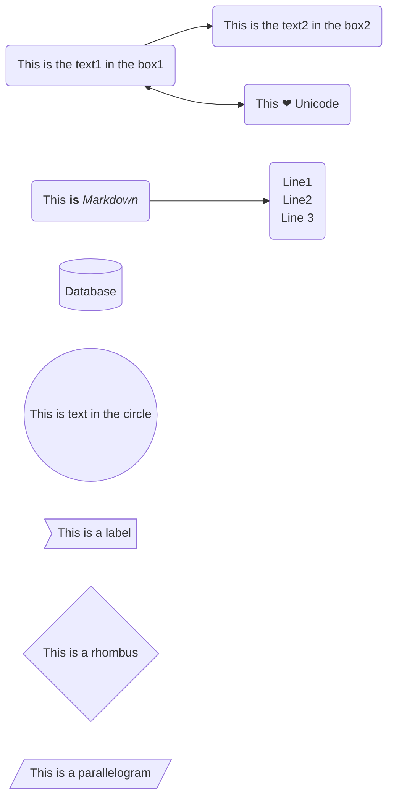
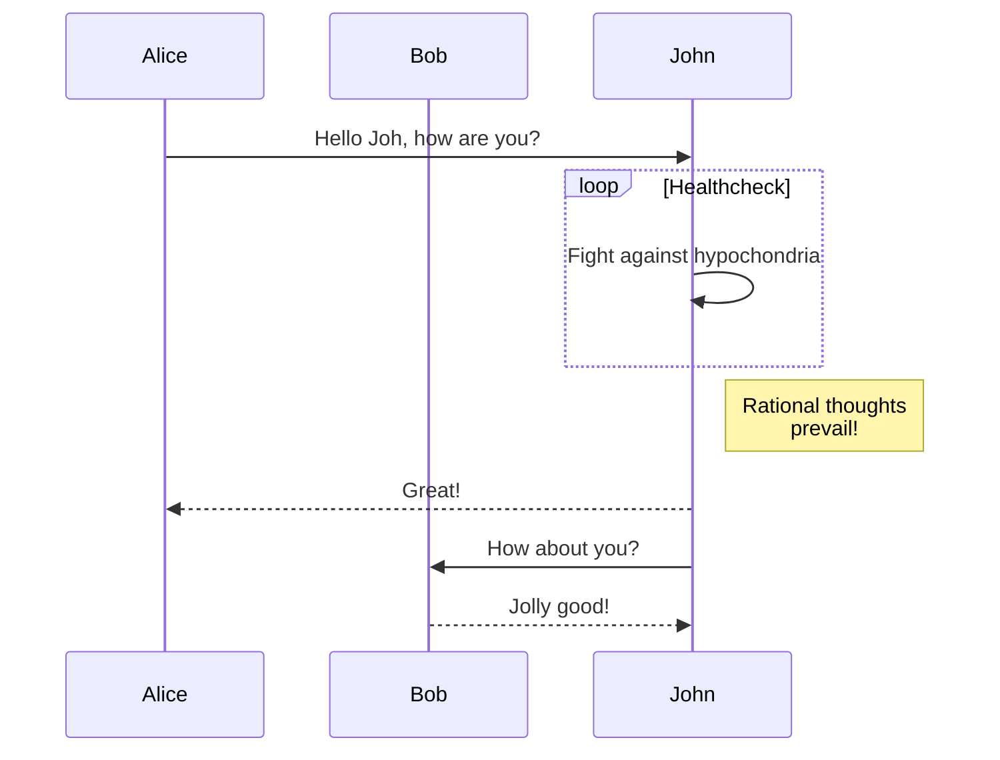

# Mermaid

## Flowchart

```mermaid
flowchart LR;
    id1(This is the text1 in the box1) --> id2(This is the text2 in the box2)
    id1 <--> id3("This ❤ Unicode")

    markdown("`This **is** _Markdown_`")
    newLines("`Line1
    Line2
    Line 3`")
    markdown --> newLines

    database[(Database)]
    circle((This is text in the circle))
    label>This is a label]
    rhombus{This is a rhombus}
    parallelogram[/This is a parallelogram/]
```

## Sequence diagram

```mermaid
sequenceDiagram
    participant Alice
    participant Bob
    Alice ->> John: Hello Joh, how are you?
    loop Healthcheck
        John ->> John: Fight against hypochondria
    end
    Note right of John: Rational thoughts <br/> prevail!
    John -->> Alice: Great!
    John ->> Bob: How about you?
    Bob -->> John: Jolly good!
```