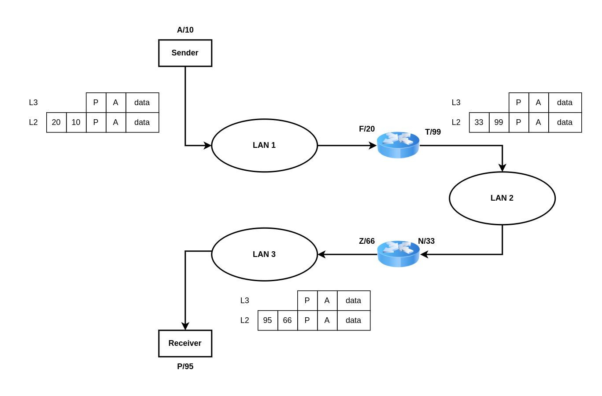
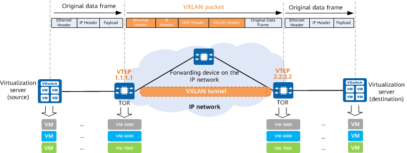
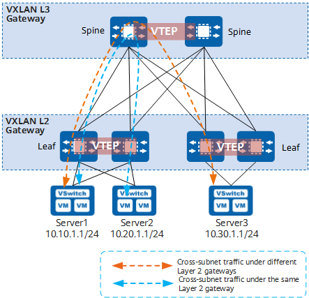
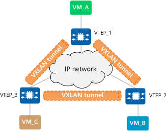

[[_TOC_]]

# Introduction to Computer Networks

## Chapter 1. Fundermentals

### Computer Networks - Basic Characteristics

A computer network is a set of **nodes** connected by **communication links**.

- A node can be a computer, printer or any other device capable of sending/receiving data generated by other nodes in the network.

Example of nodes: Computer, Server, Printer, Switches, Bridges, Routers etc...

- A communication link can be a wired link or wireless link.

**Outcomes**

Upon the completion of this lecture, the learner will be able to:

- Understand "What is computer network?".
- Identify end devices and intermediately devices.

### Network Protocols & Communications (Part 1)

**Outcomes**

Upon the completion of this session, the learner will be able to

- Know "What is Data Communication?"
- Understand data flow
- Understand the importance of protocols in computer network
- Know the elements of protocol

#### Data Communication

- Data communications are the exchange of data between two nodes via some form of links (transimission medium) such as a cable.

#### Data Flow

Data flow means the data is going to flow from one node to another node.

- Simplex

Communication is always unidirectional <br>
One device can transmit <br>
Example: Keyboards, Trandition monitors <br>

- Half Duplex

Communication is in both directions but not at the same time.<br>
If one device is sending, the other can only receive, and vice versa.<br>

- Full Duplex
Communication is in both directions simultaneously.<br>
Device can send and receive at the same time.<br>
Example: Telephone line.<br>

**Protocols**

All communication schemes will have the following things in common:

- Source or sender
- Destination or receiver
- Channel or media

Rules or protocols govern all methods of communication.

Protocol=Rule

It is a set of rules that govern data communication.

Protocol determines:
- What is communicated?
- How it is communicated?
- When it is communicated?

Protocols used in network communications also define:

- Message encoding
- Message formatting and encapsulation
- Message timing
- Message size
- Message delivery options

**Elements of a Protocol**

1. Message encoding
2. Message formatting and encapsulation
3. Message timing
4. Message size
5. Message delivery options

### Network Protocols & Communications (Part 2)

**Outcomes**

Upon the completion of this session, the learner will be able to

- Understand protocols and its role in computer networks.
- Understand Peer-to-Peer networks and Client-server networks.

#### Elements Of Protocol In Computer Network

#### Peer-to-Peer Network

- No Centralized administration.
- All peers are equal.
- Simple sharing applications.
- Not scalable.

#### Client Server Network

- Centralized administration.
- Request-Response model.
- Scalable.
- Server may be overloaded.


#### Components Of A Computer Network

**Outcomes**

- Understand nodes in computer network.
- Understand different media in computer network.
- Understand various services offered by computer network.

**1. Nodes**

End nodes (End devices).<br>
Intermediate nodes.<br>

**2. Media**

Wired Medium<br>
Wireless Medium<br>

**Wired Media**

- Ethernet straight-through cable
Connect two different devices: (Computer - Switch)

- Ethernet crossover cable<
Connect two same devices: (Switch - Switch)

Fiber Optic cable<br>
Coaxial cable<br>
USB cable<br>

**Wireless Media**

Infrared (Example: short range communication - TV remote control)<br>
Radio (Example: Bluetooth, Wi-Fi)<br>
Microwaves (Example: Cellular System)<br>
Satellite (Example: Long rang communication - GPS)<br>

**3. Services**

e-Mail, Storage services, File sharing...

### Classification of Computer Networks

**Outcomes**

- Understand LAN, MAN, and WAN.
- Know various devices involved in LAN, MAC and WAN.
- Know the new trends in computer networks.

1. Local Area Network (LAN)

A Local Area Network (LAN) is a computer network that interconnects computers within a limited area such as a residense, school,...

**LAN-DEVICES**

- Wired LAN (Example: Ethernet - Hub, Switch)
- Wireless LAN (Example: Wi-Fi)

2. Metropolitan Area Network (MAN)

3. Wide Area Network (WAN)

### Network Topology

**Outcomes**

Upon the complete of this session, the learner will be able to

- Understand various network topologies such as bus, start, ring, mesh and hybrid.
- Understand the advantages and disadvantages of each topology.

#### Physical Topology And Logical Topology

Physical Topology - Placement of various nodes.<br>
Logical Topology - Deals with the data flow in the network.<br>

**Network Topology**

- Bus, Ring, Star, Mesh, Hybrid

|Topology|No of nodes|No of cables|No of posts/device|No of ports in the network|
|-|-|-|-|-|
|Ring|N|N|2|2*N|
|Start|N|N|1|2*N|

### Basic Of IP Addressing

**Outcomes**

Upon the completion of this session, the learner will be able to

- Understand the basics of IP addressing.
- Know how to see the IP address in real device.
- Identify valid and invalid IP addresses.

##### IP Address

- IP stands for Internet Protocol.
- Every node in the computer network is identified with the help of IP address.
- Logical address.
- Can change based on the location of the device. 
- Assigned by manually or dynamically.
- Represented in decimal and it has 4 octets (x.x.x.x)
- 32 bits

### Basic of MAC

- MAC stand for Media Access Control.
- Every node in the LAN is identified with the help of MAC address.
- Unique.
- Cannot be changed.
- Assigned by the manufacturer.
- IP address = Location of a person.
- MAC Address = Name of the person.
- Every node in the LAN is identified with the help of MAc address.

|IP Address|MAC Address|
|-|-|
|Needed for communication|Needed for communication|
|32 bits|48 bits|
|Represented in Decimal|Represented in hexadecimal|
|Router needs IP address to forward data|Switches needs MAC address to forward data|

### Basic of Port Addressing

**Derivations from analogy**

Reaching our city = Reaching our network (IP Address)<br>
Reaching our Apartment = Reaching the host (MAC Address)<br>
Reaching the right person = Reaching the right process (Port Address)<br>

**Port Address Or Port Number**

- In a node, many process will be running.
- Data which are sent/received must reach the right process.
- Every process in a node in uniquely identified using port number.
- Port = Communication endpoint.
- Fixed port numbers and dynamic port numbers (0 - 65535)

**3 Key Points To Ponder**

Before sending the data, any node must

- Attach source IP address and destination IP address.
- Attach MAC address and destination MAC address.
- Attach source port number and destination port number.

**Outcomes**

Upon the completion of this session, the learner will be able to

- Understand the basic Port addressing (Port Number).
- Know three key points to ponder.
- See port number in real devices.

### Switching Techniques

**Outcomes**

Upon the completion of this session, the leaner will be able to

- Understand switching.
- Understand various switching techniques such as circuit switching message switching and packet switching.

**Switching**

- Switching in computer network helps in deciding the best route for data transimission if there are multiple paths in a large network.
- One-to-one connection.

**Switching Techniques**

Switching techniques 

- Circuit Switching
    - A dedicated path is established between the sender and receiver.
    - Before data transfer, connection will be established first.

- Message Switching
    - Store and forward mechanism
    - Message is transferred as a complete unit and forwarded using store and forward mechanism at the intermediary node.
    - Not suited for streaming and real-time applications.
- Packet Switching
    - Datagram Approach
    - Virtual Circuit Approach

**Packet Switching**

- The internet is a packet switched network.
- Message is broken into individual chunks called as packets.
- Each packet is sent individually.
- Each packet will have source and destination IP address with sequence number.
- Sequence numbers will help the receiver to
    - Reorder the packets
    - Detect missing packets and
    - Send acks

1. Datagram approach

- Datagram Packet Switching is also known as connectionless switching. 
- Each independent entity is called as datagram.
- Datagrams contain destination information and the intermediary devices uses this information to forward datagrams to right destination.
- In Datagram Packet Switching approach, the path is not fixed.
- Intermediate nodes take the routing decisions to forward the packets.

2. Virtual Circuit Approach

- Virtual Circuit Switching is also known as connection-oriented switching.
- In the case of VCA, a preplanned route is established before the message are sent.
- Call request and call accept packets are used to establish the connection between sender and receiver.
- In this approach, the path is fixed for the duration of a logical connection.

### Layering in Computer Networking

**Outcomes**

- Understand layering in computer network.
- Understand the benefits of layering.
- Know the introduction of OSI reference model and TCP/IP model.

**Layering**

Layering means decomposing the problem into more manageable components (Layers).

### The OSI Reference Model (Part 1)

**Outcomes**

- Understand the OSI reference model.
- List various layers in the OSI reference model.
- Understand how each layers interact with other layers.

**Layering - a recap**

- Layering means decomposing the problem of build a network into more manageable components (Layers).
- More modular design and easy to troubleshoot.

**The OSI model**

- The purpose of the OSI model is to facilitate communication between different systems without requiring changes to the logica of the underlying hardware and software.

Application Layer -> Presentation Layer -> Session Layer -> Transport Layer -> Network Layer -> Data Link Layer -> Physical Layer

### The OSI Reference Model (Part 2)

**Outcomes**

- Understand the services offered by Application Layer.
- Understand the services offered by Presentation Layer.
- Understand the services offered by Session Layer.

Application: My Password is secret, it enable user to access the network resources.

Presentation: modify/convert (data), it is concerned with the syntax and semantcs of the information exchanged between two systems, translation, encryption, compression.

Session: result or modify/convert (data), it establishs, maintains and sync the interaction among communicating devices.

### The OSI Reference Model (Part 3)

**Outcomes**

- Understand the services offered by Transport Layer
- Understand the services offered by Network Layer
- Understand the services offered by Data Link Layer
- Understand the services offered by Physical Layer

**Transport Layer**

It is responsible for process to process delivery of the entire messaage.

Services provided by transport layer: Port addressing, segmentation and reassembly, connection control, end-to-end flow control, error control

**Network Layer**

- It is responsible for delivery of data from the original source to the destination network.

Services provided by network layer: Logical addressing, routing.

**Data Link Layer**

It is responsible for moving data(frames) from one node to another node.

### Addressing in Networking

**Outcomes**

- Understand the role of Port Addressing, IP addressing and MAC addressing in Computer Network with examples.



### The TCP/IP Protocol Suite

Application Layer - Data
Transport Layer - Segment
Network Layer - Packet
Data Link Layer - Frame
Physical Layer - Bits

### Basic Networking Command

### Basic of cisco packet tracer

#### Hub

- Hub works at the physical layer of the OSI model.
- Used to set up LAN.
- Has multile ports.
- Star topology.
- When a packet arrives at one port, it is copied to the other ports so that all segments of the LAN can see packets.

**Pros**

- Cheaper than switches.
- Works good for smaller network.

**Cons**

- Issues with broadcast.
- No memory.
- Normally runs in half duplex mode.

#### Switch

**Outcomes**

- Learn the Cisco Packet Tracer using switch.
- Simulate LAN using switch.
- Understand the difference between hub and switch.

**Definition**

- A switch is a network hardware that connects devices on a computer network to establish a local area network.
- Unlike hub, switch has memory.
- Stores MAC address table.
- Layer 2 device for setting up LAN.

|Mac address|Interface port|
|-|-|
|AA-AA-AA-AA-AA-AA|1|
|BB-BB-BB-BB-BB-BB|19|

**Hub versus switch**

|Hub|Switch|
|-|-|
|Layer 1 device|Layer 2 device|
|Works at physical layer|Works at Data Link Layer|
|Has no memory|Has memory and stores MAC Address Table|
|No an intelligent device|Intelligent device|
|Floods the network due to broadcasting|Can do unicasting, multicasting, and broadcasting|
|Security risks are high|Security risks are low|
|Less efficient|More efficient|
|Half Duplex|Full Duplex|

### Basic of Router

**Outcomes**

- Know the basics of routers.
- Understand how to connect two different LAN using router theoretically.
- Understand the different between switch and router.

**Routers**

- A router is a networking device that forwards data packets between computer networks.
- A router is connected to at least two networks, commonly two LANs or WANs or a LAN and its ISP's network.
- It is a layer 3 (Network layer) device.

|Switch|Router|
|-|-|
|A network switch is a computer networking device that is used to connect many devices together on a computer network|A router is a networking device that connectes a local network to other local networks.|
|Operates at Data Link Layer (Layer 2 Devices)|Operates at network layer (Layer 3 Device)|
|Has memory and stores MAC Address Table|Has memory and stores Routing table|
|Decisions are token based on MAC address|Decisions are token based on IP address|
|Half/Full Duplex|Full Duplex|
|LAN|LAN, MAN, and WAN|

### Repeater

- The data signals generally become too weak or corrupted if they tend travel a long distance.
- Repeater regenerates the signal over the same network.
- It operates at the physical layer.
- The do not amplify the signal.
- It is 2 port device.

### Basics of Bridge

**Outcomes**

Upon the completion of this session, the learner will be able to

- Understand the basics of bridge.
- Know the types of bridge.
- Understand the working of bridge.

**Bridge**

- Bridge = Repeater + Functionality of reading MAC address.
- It is a layer 2 device.
- It is also used for interconnecting two LANs on the same protocol.
- It is also a two port device.

**Types Of Bridges**

- Transparent Bridges
    - These are the bridge in which the stations are completely unaware of the bridge's existence.
    - Reconfiguration of the stations is unnecessary even if bridge is added or removed from network.

- Source Routing Bridges
    - In these bridges, routing operation is performed by source station and the frame specifies which route to follow.

**Working of Bridge**

Lan1 -> Bridge -> Lan2

A very important point to note about bridge that two network running the same protocol.

If bridge can connect to LAN, router also can connected to LAN. Then what is the different between them.

Router connect two different LAN.

### Network Devices

**List Of Various Network Devices**

- Repeater
- Hub
- Switch
- Bridge
- Router
- Multi-layer switch (Layer 3 Switch)
- Brouter
- Modem
- Firewall 

### Physical Layer and Media (Part 1)

## Chapter 2. Data Link Layer

### Link Layer Services

**Outcomes**

- Know the various services offered by data link layer
- Understand the services offered by data link layer

When network layer create the packet it give that packet to data link layer in order to add header and trailer. After adding header and trailer => call packet is frame.

Data link layer is responsible for moving data (frames) from one node to another node.

**Services provided by data link layer**

- Framing
- Physical Addressing
- Flow Control
- Error Control
- Access Control

**Framing**

- The data link layer needs to pack bits into frames, so that each frame is distinguishable from another.
- Our postal system practices a type of framing.
- The simple act of inserting a letter into an envelop separates one piece of information from another; the envelop serves as the delimiter.

**Physical Addressing**

- A frame is the encapsulation of the header and trailer information with the packet.
- In the header, the source and the destination MAC address are dealt.

**Flow control**

- Flow control is one of the duties of data link layer sublayer.
...

**Access control**

- Media Access Control

**Error control**

- Error detection
- Error correction

### Sublayers of the Data Link Layer

**Outcomes**

- Understand the sublayers of data link layer
- Know the responsibilities of LLC or DLC
- Know the responsibiilties of MAC sublayer

**Data Link Layer**

- LLC (Logical Link Control) or DLC (Data Link Control) sublayer
- MAC sublayer
    - Constitutes the lower sublayer of the data link layer.
    - Implemented by hardware, typically in the computer NIC.
    - Two primary responsibilities: Data encapsulation, Media access control.

### Framing (Part 1)

**Outcomes**

- Understand framing
- Understand framing error

### Network Performance

**Outcomes**

- Know the importance of network performance
- Understand bandwidth
- Understand throughput
- Know latency (delay) and its components

**Network Performance**

One important issue in networking is the performance of the network how good is it?

- Bandwidth: Maximum amount of data that can be transmitted per second.
- Throughput: Actual amount of data that passes through the medium.
- Latency

### Ethernet

- Know the Ethernet protocol.
- Know the evolution of Etherent.
- Understand the frame format of Ethernet.
- Known the minimum and maximum length of Ethernet frames.
- Understand the Ethernet address.

**Ethernet**

- One of the most widely used Wired LAN technologies.
- Operates in the data link layer and the physical layer.

### Virtual LAN (VLAN)

- Know the need of VLAN
- Working of VLAN
- Benifits of VLAN
- Types of VLAN
- VLAN Frame Tagging

**VLAN**

- A VLAN is a logical partition of a Layer 2 network.
- Multiple partitions can be created, allowing for multiple VLANs to co-exist.
- Each VLAN is a broadcast domain, usually with its own IP network.
- VLANs are mutually isolated and packets can only pass between them via a router.
- The partition of the Layer 2 network takes place inside a Layer 2 device, usually via a switch.
- The hosts grouped within a VLAN are unaware of the VLAN's existence.

**Benefit**

- Security
- Cost reduction
- Better performance
- Shrink broadcast domains
- Improved IT staff efficiency

**Types of VLAN**

- Data VLAN
- Default VLAN
- Native VLAN
- Management VLAN
- Voice VLAN

**VLAN Tagging**

Dst Mac, Src Mac, Tag, Type/Length, Data, FCS

Tag include: Ethernet Type, Pri, C, VLAN Identifier (12 bit => 4096 VLAN)

**VLAN Frame Tagging**

- Frame tagging is the process of adding a VLAN identification header to the frame.
- It is used to properly transmit multiple VLAN frames through a trunk link.
- Switches tag frames to identify the VLAN to that they belong. Different tagging protocols exist.
- The protocol defines the structure of the tagging header added to the frame.
- Switches add VLAN tags to the frames before placing them into trunk links and remove the tags before forwarding frames through non-trunk ports.

### Spanning Tree Protocol (STP)

## Chapter 3. Logical Addressing & Subnetting

### IPv4 Address

**Outcomes**

- Understand IPv4 address in detail.
- Notation of IPv4 address.

**IP address**

- An IPv4 address is a 32-bit address that uniquely and universally defines the connection of a device (for example, a computer or a router) to the internet.
- Two devices on the internet can never have the same address at the same time.

**Classful Addressing (Part 1)**

- Understand various classes of IPv4 Address
- Identify the class of IP address (Activity)

|Class|First byte|Second byte|Third byte|Fourth byte|
|-|-|-|-|-|
|Class A|0xxxxxxx|-|-|-|
|Class B|10xxxxxx|0|-|-|
|Class C|110xxxxx|0|0|-|
|Class D|1110xxxx|-|-|-|
|Class E|1111xxxx|-|-|-|

**Classful Addressing (Part 2)**

- Recall various classes of IPv4 Address.
- Understand the purpose of subnet mask.
- Identify whether the nodes belonging to same network or different network.

**Subnet mask (Slash notation)**

|Class|Subnet Mask (in Decimal)|Subnet mask (in Binary)|Slash Notation|
|-|-|-|-|
|A|255.0.0.0|11111111.0.0.0|/8|
|B|255.255.0.0|1111111.1111111.0.0|/16|
|C|255.255.255.0|1111111.1111111.11111111.0|/24|

**Classful Addressing (Part 3)**

- Identify whether the nodes belonging to same network or different network with examples.

**Subnet Mask**

- To define the network and host portions of an address, a devices use a separate 32-bit pattern called a subnet mask.
- The subnet mask does not actually contain the network or host portion of an IPv4 address, it just says where to look for these portions in a given IPv4 address.

### Classful Addressing (Cisco Packet Tracer - Activity)

### IPv4 Unicast, Multicast, Broadcast

- Understand the different ways host can communicate using IPv4 address.

**Unicast transmission**

Unicast Transmission: The process of sending a packet from one host to an individual host.

**Broadcast transmission**

Broadcast Transmission: the process of sending a packet from one host to all hosts in the network.

- Limited Broadcast:

Destination: 255.255.255.255, when a computer sending the broadcast, every one in LAN will be receiving the broadcast, including the default gateway. But the gw will not forward broadcast anymore. Routers do not forward a limited broadcast!

- Directed broadcast:

**Multicast Transmission (class D)**

- Multicast Transmission: The process of sending a packet from one host to a selected group of hosts, possibly in different networks.
- The Multicast Address range 224.0.0.0 to 239.255.255.255
- Link local - 224.0.0.0 to 224.0.0.255 (Example: routing information exchanged by routing protocols)

### Classful Addressing

- A host in a class C network has been assigned an IP address 192.168.17.9. Find the number of addresses in the block, the first address, and the last address.

```txt
Class C Network
N.N.N.H (255.255.255.0 or /24)
192.168.17.9
This network: 192.168.17.0 - 192.168.17.255
Number of host: 255 - 2 = 253
First Address: 192.168.17.0 (Network Address)
Last Address: 192.168.17.255 (Broadcast Address)
```

### Public and Private IP Addresses

**Outcomes**

- Know about the public and private IP addresses.
- Know the special use IPv4 addresses.

**Private IP Addresses**

- Early network design, when global end-to-end connectivity was envisioned for communications with all Internet hosts, intended that IP addresses be globally unique. However, it was found that this was not always necessary as private networks developed and public address space needed to be conserved.
- Computers not connected to the Internet, such as factory machines that communicate only with each other via TCP/IP, need not have globally unique IP addresses. Today, such private networks are widely used and typically connect to the Internet with network address translation (NAT), when needed.

- Host that do not require to access from internet can use private address
   - 10.0.0.0 to 10.255.255.255 (10.0.0.0/8) 
   - 172.16.0.0 to 172.31.255.255 (172.16.0.0/12)
   - 192.168.0.0 to 192.168.255.255 (192.168.0.0/16)

- The aforementioned are the three non-overlapping ranges of IPv4 addresses for private networks are reserved.

- Loopback address: 127.0.0.1 a specical address that hosts use to direct traffic to themselves (addresses 127.0.0.0 to 127.255.255.255 are reserved).
- Link-local address: 168.254.0.0 to 169.254.255.255 (192.254.0.0/16) address can be automatically assigned to the localhost.

**In va nutshell**

Private IP address is used to communicate within the same network. Using private IP data or information can be sent or received within the same network.

Public IP address is used to communicate outside the network. Public IP address is basically assigned by the ISP.

### Classless Addressing (Part 1)

**Outcomes**

Upon the completion of this session, the learn will be able to

- Know the drawbacks of classful addressing
- Understand the need for classless addressing

**Drawbacks of classful addressing**

- **Lack of internal address flexibility:** Big organizations are assigned large "monolithic" blocks of addresses that don't match well structure of their underlying internal networks.
- **Inefficient Use of Address Space**

### Classless Addressing (Part 2)

**Outcomes**

- Understand the need for classless addressing.
- Identify valid and invalid subnet mask.

**Classless Addressing**

- Formal name is Classless Inter-Domain Routing (CIDR).
- Created a new set of standards that allowed server providers to allocate IPv4 addresses on any address bit boundary (prefix length) instead of only by a class A, B, C address.
- Classless addressing is possible with the help of subnetting.

### Subnetting

**Outcomes**

Upon the completion of this session, the learner will be able to

- Understand subnetting.
- Know the procedure to subnet a network.

**Subnetting**

- A subnetwork or subnet is a logical subdivision of an IP network
- The practice of dividing a network into two or more networks is called subnetting.
- Computes that belong to a subnet are addressed with an identical most-signicant bit-group in their IP addresses.

A class C network without sub-netting:

Network (192.168.14.0) -> hosts: 192.168.14.1 -> 192.168.14.254

Network (192.168.14.0) 
+ Sub-net 1: 192.168.14.0 -> hosts: 192.168.14.1 -> 192.168.14.126
+ Sub-net 2: 192.168.14.128 -> hosts: 192.168.14.192 -> 129.168.14.254

**Subnetting - 5 Steps**

1. Identify the class of the IP address and note the Default Subnet Mask.
2. Convert the Default Subnet Mask into Binary.
3. Note the number of hosts required per subnet and find the Subnet Generator (SG) and octet application.
4. Generate the new subnet mask.
5. Use the SG and generate the network ranges (subnets) in the appropriate octent position.

### Subnetting (Solved Problem 1)

**Outcomes**

Upon the completion of this session, the learner will be able to

- Subnet the given network based on the host requirement. 

**Question**

Subnet the IP address 216.21.5.0 into 30 hosts in each subnet.

1. Class C - Default Subnet Mask: 255.255.255
2. 11111111.11111111.1111111.00000000
3. No.of hosts/subnet: 30 (11110) - 5 bits, SG: 32, Octen Position 4
11111111.11111111.11111111.11100000
4. Net subnet mask: 255.255.255.224 or /27
5. Network Ranges (Subnets)

216.21.5.0 - 216.21.5.31
216.21.5.32 - 216.21.5.63
...

### Subnetting (Solved problem 2)

**Outcomes**

- Subnet the given network based on host requirements.
- Find the number of networks (Subnets)
- Find the number of hosts per network (Subnet).

### VxLAN

#### VxLAN | Part 1 - How VxLAN works

VxLAN helps simplify the underlying network and reduces the need for spanning-tree, trunking, and stretching VLANs. Virtual Machines can move between hosts on different VLANs, all without the need to fiddle with different IP addresses.

**VNI's and VLANs**

Every VLAN has a VLAN ID. This ID is added to a frame to keep traffic unique. The VLAN ID is 12-bits long, allowing around 4095 unique VLANs.

VxLAN is quite similar. Each VxLAN segment also has an identifier, called VNI is 24-bits long, which gives us around 16M segments. It is enough to give VLAN some sort of interiority complex.

Just as with VLANs, traffic in one VNI, traffic in one VNI is kept separate from every other VNI. If you want to mix the traffic, you need to use a router. You may think though, "4000 VLANs should be enough for anybody".

**Overlay and underlay**

VxLAN creates virtual networks on top of the existing infrastructure. This makes an overlay technology. The infrastructure it runs on is called the underlay. The underlay network is all layer-3. All ports in the underlay are routed, so there is no need for trunking or spanning-tree. Dynamic routing

VxLAN itself is the overlay network. Each VNI is a separate virtual network that runs over the underlay. Each of these VNI's are called a bridge domain.

**VTEP and encapsulation**

Switches and routers that participate in VxLAN has a special interface called a VTEP. The VTEP provides the connection between the overlay and the underlay. Each VTEP has an IP address in the underlay network. It also has one or more VNI's.

To deliver traffic from one host to another, a source and destination VTEP will create a stateless tunnel. These tunnels exist only long enough to deliver the VxLAN frame.

When a frame for a remote host reaches a switch, the frame is encapsulated in IP and UDP headers.

The switch then forwards the traffic over the underlay. But how does the switch know which destination VTEP to send the traffic to? How does it even find the other VTEPS? We'll investigate these questions and more in part 4 of this series.

**Hosts and Gateway**

VxLAN can be supported on hardware or software. An advantage of this is that it can run on a hypervisor like ESX or Hyper-V. This is the host-based method. The vSwitch on the host has a VTEP, which encapsulates traffic from VM's before it touches any physical switches. The physical switches just see IP traffic and are unaware of VxLAN. The advantage of this is simplified physical network, which can simply focus on transport. The VTEPs could also be on physical switches or routers. An example of this is configuring VxLAN on a Nexus switch. This is called a VxLAN gateway. The VMs send traffic, and the vSwitches pass the traffic as normal. When the traffic arrives on the physical switch, the VTEP encapsulates the frames. The advantage is that VxLAN may be implemented in hardware, improving performance. Not all platforms support VxLAN in hardware.

#### VxLAN | Part 2 - Header Format and Encapsulation

VxLAN creates virtual segments, called VNI's. VNI's run on the top of layer-3 network. VxLAN switches use a special interface called VTEP. This bridges VNIs to the layer-3 network. When traffic comes in, the VTEP encapsulates (UDP + IP) the traffic, and sends it to a destination VTEP where it is decapsulated.

**Encapsulation**

We start with an ordinary ethernet frame that a host would send. We call this the inner MAC frame. This includes data, MAC address information and other ethernet fields. It also may have a VLAN tag included.

VTEP -> IP underlay -> VTEP

In our example, traffic will stay within the VNI, so there is no routing required.

The host sends the frame to the switch. The switch adds a VxLAN header, which contains the VNI. The VTEP now adds several additional headers preserving the inner frame. VxLAN uses UDP for transport.

UDP | VxLAN | Frame

IP | UDP | VxLAN | Frame

Ethernet | IP | UDP | VxLAN | Frame

As normal, the source and destination MAC addresses change with each device they pass through. When the traffic arrives at the destination VTEP, the headers are removed, leaving the original frame, which can now be delivered to the host.

**VxLAN header**

There are four parts to the VxLAN header. 

+ 8 bits are reserved for future use. This is set to zero, and ignored by the receiving VTEP.
+ VNI 24-bits; the VxLAN ID
+ Reserved 24-bits
+ Flags: 8-bits, Bit-3 shows VNI is valid.

So, there's a lot of unused space in the VxLAN header. It will be very interesting to see how this is used in future.

VxLAN: 8 bytes, UDP: 8 bytes, IP: 20 bytes (IPv4), 40 bytes (IPv6), Ethernet: 18 bytes.

#### VxLAN | Part 3 - Spine Leaf Topology

#### VxLAN | Part 4 - Address learning

We know that VxLAN is an overlay technology. It creates tunnels over an IP underlay network. The ingress VTEP encapsulates the traffic and sends it to the egress VTEP. The egress VTEP decapsulates the traffic, so it can be delivered to its ultimate destination. But have you wondered, how does the ingress VTEP find the egress VTEP? There could be many VTEPs. How deos the switch find the right one? Also, how does it learn that the destination MAC address are?

There's two ways to approach address learning. The first is called Data Plane Learning. This is the traditional method for learning about addresses. It's similar to traditional ethernet in many ways. The other is control plane learning, which is a newer and more sophisticated approach. This method uses BGP to share MAC address information. This is similar to the way BGP learns and shares routes.

**BUM traffic**

BUM is actually an acronym, which stands for Broadcast, Unknown unicast, and Multicast. Collectively, these are traffic types that need special handling. Simply put, it's any traffic that goes to more than one destination. ARP is an example of BUM traffic. 

There are two possible ways that VxLAN can handle BUM traffic. These are Multicast and Head and replication.

Multicast is probably the most common solution. Each VNI is mapped to a single multicast group.

|VNI|Mcast group|
|-|-|
|1701|224.0.17.1|
|9000100|244.0.0.100|
|16, 4457|224.0.44.57|

Each multicast group may map to one or more VNI's. 

When a VTEP comes online, it uses IGMP to join the multicast groups for the VNI's that is uses. If there is a VNI that the VTEP does not use, it does not need to join that.

When a VTEP needs to send BUM traffic, it will send it only to the relevant multicast group. This is one method of VTEP discovery.

Head end replication  is an alternatiev to multicast. But, only it is only available if you use BGP EVPN. When BUM traffic arrives, the VTEP creates several unicast packets and sends one to each remote VTEP that supports the VNI, and certainly doesn't scale as well. However, it's much simpler if you don't have to multicast infrastructure.

**Data plane learning**

In the early days, VxLAN relied on data plane learning. This is also known as flood and learn, and is very similar to regular ethernet.

VxLAN Data plane learing is very similar. It's a little better, as flooding only occurs to multicast group members. However, data plane learning has a serious limitation. This is no built in support for routing. It is only used for 'bridging' devices at layer-2. To reach the outside world, you will need an external router as your gateway.

If you want to route between VNI's you also need an external router, which will cause traffic to hairpin.

From a security perspective, keep in mind that VTEPs are not authenticated. There's nothing built-in to prevent a rogue VTEP in the network. In most cases, control plane learning is recommended. Data plane learning is still worth investigating, as its simpler to understand.

**Control plane learning**

Control plane learning means that switches learn MAC addresses before they're needed. This works in the same way as a routing protocol. Switches peer with each other using BGP, and share the addresses that they know about.

## VLAN VXLAN

### What is VXLAN?

VXLAN, or Virtual Extensible LAN, is a network virtualization technology widely used on large Layer 2 networks. VXLAN establishes a logical tunnel between the source and destination network devices, through which it uses MAC-in-UDP encapsulation for packets.

Source <-tunnel-> Destination.

Specifically, it encapsulates original Ethernet frames sent by VM into UDP packets. It then encapsulates the UDP packets with the IP header and Ethernet header of the physical network as outer headers, enabling these packets to be routed across the network like common IP packets. This frees VMs on the Layer 2 network from the structural limitations of the layer 2 and layer 3 networks.

### Why do we need VXLAN?

Why do we need VXLAN? Under the trend of server virtualization, dynamic VM migration occurs, which requires IP address and MAC address to remain unchanged before and after migration. Server virtualization also leads to a sharp increase in the number of tenants, **which network needs to effectively isolate.** 

**Dynamic VM Migration**

Traditional server virtualization works by virtualizing a physical server into multiple servers knowns as VMs. Server virtualization is an effective way of improving server efficiency while reducing energy consumption and operational costs. Such advantages account for its wide use.

Since server virtualization was widely adopted dynamic VM migration has become increasingly common. To ensure service continuity during the migration of a VM, the VM's IP address and running status (for example, the TCP session status) must remain unchanged. Therefore, VMs can only be migrated in the same Layer 2 domain.

As shown in the following figure, the traditional three-layer network architecture limits the dynamic VM migration scope. VMs can only migrate within a limited scope, greatly restriction application.

Traditional three-layer network architecture limiting the dynamic VM migration scope.

To enable smooth VM migration over a large scope or even between regions, all involved servers must be deployed in a large Layer 2 domain.

A Layer 2 switch can support Layer 2 communication between servers connected to the switch. When a server is migrated from one port of the Layer 2 switch to another port, the IP address of the server can remain unchanged. This meets the requirements for dynamic VM migration. It is this concept that inspired the design of VXLAN.

VXLAN provides a methodology for creating a virtual tunnel on the IP network to transparently forward user data when communication is required between a source and destination node on the IP network. Any two nodes can communicate through VXLAN tunnel, regardless of the underlying network structure and other details. For servers, VXLAN virtualizes the entire infrastructure network into a large "Layer 2 virtual switch", with all servers connecting to this switch. Servers do not need to be aware of how data is forwarded within this large switch.

VXLAN virtualizing the entire infrastructure network into a large "Layer 2 virtual switch"

Similar to how a physical server behaves when switched from one port to another port of a physical switch, a VM also does not need to changes its IP address when it is migrated from one port of the "Layer 2 virtual switch" to another port.

**Sharp Increase in Tenants Raises Demand for Network Isolation**

According to standards, a traditional VLAN network supports a maximum of about 4000 VLANs. After server virtualization, a physical server hosts multiple VMs, and each of which has an independent IP address and MAC address. This equivalent to the number of servers being multiplied. For example, public clouds or other large virtualized cloud data centers needto accommodate tens of thousands of tenants or even more. In this case, VLAN cannot meet these requirements.

How does VXLAN meet these requirements? VXLAN adds 24-bit VXLAN network identifier (VNI) that is equivalent to a VLAN ID to a VXLAN header. Theoretically, a maximum of 16M VXLAN segments are supported, meeting the requirements for identification and isolation of vast quantities of tenants. 

### What are the differences between VXLAN and VLAN?

VLAN is a traditional network isolation technology. According to standards, a VLAN network supports a maximum of about 4000 VLANs, failing to meet the requirement for tenant isolation on a large Layer 2 network. In addition, each VLAN is a mall an fixed Layer 2 domain, and as such is not suitable for large-scale dynamic VM migration.

VLAN overcomes these shortfalls of VLAN. In terms of scale, VXLAN uses the 24-bit VNI field to identify up to 16M tenants, far higher than that supported by VLAN (about 4000 tenants). And in terms of flexible migration, VXLAN establishes a virtual tunnel between "Layer 2 switch" (large Layer 2 network) to meed the requirement for large-scale dynamic VM migration.

Although VXLAN is an extension to VLAN, VXLAN is quite different from VLAN in terms of virtula tunnel establishment.

The following describes what the VXLAN packet looks like.

+ 14 bytes Outer MAC Header: 

```txt
{
    "Dst.MAC Addr": 48,
    "Src.MAC Addr": 48,
    "VLAN Type": 16,
    "VLANID Tag": 16,
    "Ethernet Type": 16
}
```

+ 20 bytes Outer IP Header: 

```txt
{
    "IP header Misc Data": 72,
    "Protocol": 8,
    "Header Checksum": 16,
    "Outer Src.IP": 32,
    "Outer Dst.IP": 32
}
```

+ UDP Header

```txt
{
    "UDP Src.Port": 16,
    "UDP Dst.Port = VXLAN Port": 16,
    "UDP Length": 16,
    "Checksum": 16
}
```

+ VXLAN

```txt
{
    "VXLAN Flags": 8,
    "Reserved": 24,
    "VNI": 24,
    "Reserved": 8
}
```

VXLAN packet format (outer IPv4 header used as an example)

As shown in the preceding figure, a VXLAN tunnel endpoint (VTEP) encapsulates the following headers into the original Ethernet frame (original L2 frame) sent by a VM:

- VXLAN header
A VXLAN header (8 bytes) contains a 24-bit VNI field, which is used to define different tenants on the VXLAN network. It also contains a VXLAN Flags field (8 bits, set to 00001000) and two reserved fields (24 bits and 8 bits).

- UDP header
The VXLAN header and the original Ethernet frame are used as UDP data. In the UDP header, the dst port number (VXLAN Port) is fixed 4789, and the source port number (UDP Src.Port) is calculated using a hash algorithm based on the original Ethernet frame.

- Outer IP header

In the outer IP header, the source IP address (Outer Src.IP) is the IP address of the VTEP connected to the source VM, and the destination IP address (Outer Dst.IP) is the IP address of the VTEP connected to the destination VM.

- Outer MAC header

The outer MAC header is also called the outer Ethernet header. In this header, the source MAC address (Src. MAC Addr), it the MAC address of the VTEP connected to the source VM, and the destination MAC address (Dst. MAC address) is the MAC address of the next hop along the path to the destination VTEP.

### How Does VXLAN Work?

This section describes how a VXLAN tunnel is establised to help better understand how VXLAN works.

**VTEP and VNI in VXLAN**

Before understanding how a VXLAN tunnel is established, it is important to be familiar with the common concepts in the VXLAN network model. The following figure shows two servers communicating through a VXLAN network. A VXLAN tunnel is established between two top of rack (TOR) switches to encapsulate the original data frames sent by the source server into VXLAN packets, thereby enabling the original data frames to be transmitted on the bearer network (such as an IP network). When the VXLAN packets arrive at the TOR switch connected to the destination server, the TOR switch decapsulates these packets into the original frames before finally forwarding these frames to the destination server.



VXLAN networks introduce some new elements, such as VTEPs and VNIs. What are their functions? The following introduces these new elements.

**What Is a VTEP?**

A VTEP is an edge device on a VXLAN network and the start or endpoint of a VXLAN tunnel. The source VTEP encapsulates the original data frames sent by the source server into VXLAN packets and transmits them to the destination VTEP on the IP network. The destination VTEP then decapsulates the VXLAN packets into the original data frames and forwards the frames to the destination server. 

**What is a VNI?**

A VNI is a user identifier similar to VLAN ID. A VNI identifies a tenant. VMs with different VNIs cannot communicate at Layer 2.

VNIs can be classified into Layer 2 VNIs and Layer 3 VNIs, which have different functions. A Layer 2 VNI is a common VNI used for intra-subnet VXLAN packet forwarding, whereas a Layer 3 VNI is bound to a VPN instance for inter-subnet VXLAN packet forwarding.

**VXLAN Gateway**

Similar to in VLANs, hosts with different VNIs or those on VXLAN and non-VXLAN networks should be unable to directly communicate with each other. To meet these communication requirements, VXLAN introduces VXLAN gateways. VXLAN gateways are classified into Layer 2 gateways and Layer 3 gateways. A Layer 2 VXLAN gateway connects terminals to a VXLAN network and enables intra-subnet communication on a VXLAN network. A Layer 3 VXLAN gateway enables inter-subnet communication on a VXLAN network as well as external network access.

Layer 3 VXLAN gateways can be further categorized into centralized and distributed gateways.

**Centralized VXLAN Gateway**

In centralized VXLAN gateway networking, the Layer 3 gateway is deployed only one device. All traffic sent across subnets is forwarded through this Layer gateway, implementing centralized traffic management.



Centralized VXLAN gateway networking

Centralized VXLAN gateway deployment has the following advantages and disadvantages:

- Advantages: Inter-subnet traffic can be centrally managed, and gateway deployment and management are simplified.
- Disadvantages:
    - Forwarding paths are not optimal. Inter-subnet Layer 3 traffic with the same Layer 2 gateway must be transmitted to centralized Layer 3 gateway for forwarding
    - The ARP entry specification is a bottleneck. ARP entries must be generated for all terminals attached to the Layer 3 gateway. Howver, the Layer 3 gateway can have only a limited number of ARP entries configured, impeding network expansion.

**Distributed VXLAN Gateway**

Deploying distributed VXLAN gateways addresses the problems that arise as a result of centralized VXLAN gateway networking. In the spine-leaf networking, leaf nodes function as VTEPs to established VXLAN tunnels and each can be used as a Layer 3 VXLAN gateway (also a Layer 2 VXLAN gateway). Spine nodes are unaware of the VXLAN tunnels and only forward VXLAN packets between leaf nodes. In the following figure, Server1 and Server2 are on different subnets but connect to the same leaf node.

...

### Which VTEPs Need to Establish VXLAN Tunnels?

The large Layer 2 network overcomes physical boundaries, allowing VMs on the same large Layer 2 network to communicate with each other. VXLAN tunnels must be established between all VTEPs on the same large Layer 2 network. Assuming that VMs connected to VTEP_1, VTEP_2, and VTEP_3 require large Layer 2 communication on the network shown in the following figure, then VTEP_1, VTEP_2,and VTEP_3 need to establish VXLAN tunnels with each other. 



**VXLAN Tunnel Establishment**

A VXLAN tunnel is identifier by a pair of VTEP IP addresses. During VXLAN tunnel establishment, the local and remote VTEPs attempt to obtain each other's IP addresses.

As long as the VTEP IP addresses are reachable to each other at Layer 3, a VXLAN tunnel can be established.

VXLAN tunnels can be established in either static or dynamic mode.

### What is Virtual Local Area Network (VLAN)

Virtual Local Area Network (VLAN) technology logically divides a physical LAN into multiple broadcast domains, each of which is called a VLAN.

Each VLAN functions as a separate broadcast domain, with devices in the same VLAN able to directly communicate with one another, while those in different VLANs cannot. As a result, broadcast packets are confined within a single VLAN. 

**Why Do We Need VLAN**

Early Ethernet allows data communication over shared media through Carrier Sense Multiple Access/Collision Detection (CSMA/CD). When an Ethernet network has a large number of hosts, collision becomes a serious problem and can lead to broadcast storms. This degrades network performance or even causes a complete breakdown. Using layer 2 devices to connect LANs can restrict data transmission within a LAN. However, this resolves only the conflicts.

This is where VLAN technology comes in. VLAN technology allows a physical LAN to be divided into multiple logical LANs. Each VLAN functions as a separate broadcast domain, with hosts in the same VLAN able to directly communicate with one another, while those in different VLANs cannot. As a result, broadcast packets are confined within a single VLAN. The following figure shows an example.

**- Confines each broadcast domain to a single VLAN**

This conserves bandwidth and improves network processing capabilities.

**- Enhances LAN security**

Frames in different VLANs are separately transmitted, so that hosts in a VLAN cannot directly communicate with those in another VLAN.

**Improves network robustness**

A fault in one VLAN does not affect hosts in another VLAN.

**Allows for flexible virtual groups**

VLAN technology allows hosts in different geographical locations to be added to different groups, simplifying network construction and maintenance.

#### VLAN vs Subnet

A network can be divided into multiple subnets to conserve IP address space and support flexible IP addressing.

Similar to a VLAN, a subnet can also isolate hosts. Hosts in different subnets cannot communicate with each other. The following figure shows the comparison between VLANs and subnets.

**Difference**

- VLAN:
    - It is used to divide Layer 2 networks.
    - Uses in different VLANs can communicate with each other after VLANIF interfaces are configured for routing.
    - A maximum of 4094 VLANs can be divided and the number of devices in a VLAN is not limited.
    - A maximum of 4094 VLANs can be divided, and the number of devices in a VLANs is not limited.

- Subnet
    - It is used to divide Layer 3 networks.
    - Users on different subnets can communicate with each other as long as they have reachable routes.
    - The total number of subnets affects the maximum number of devices in each subnet.

#### VLAN Tag and VLAN ID
