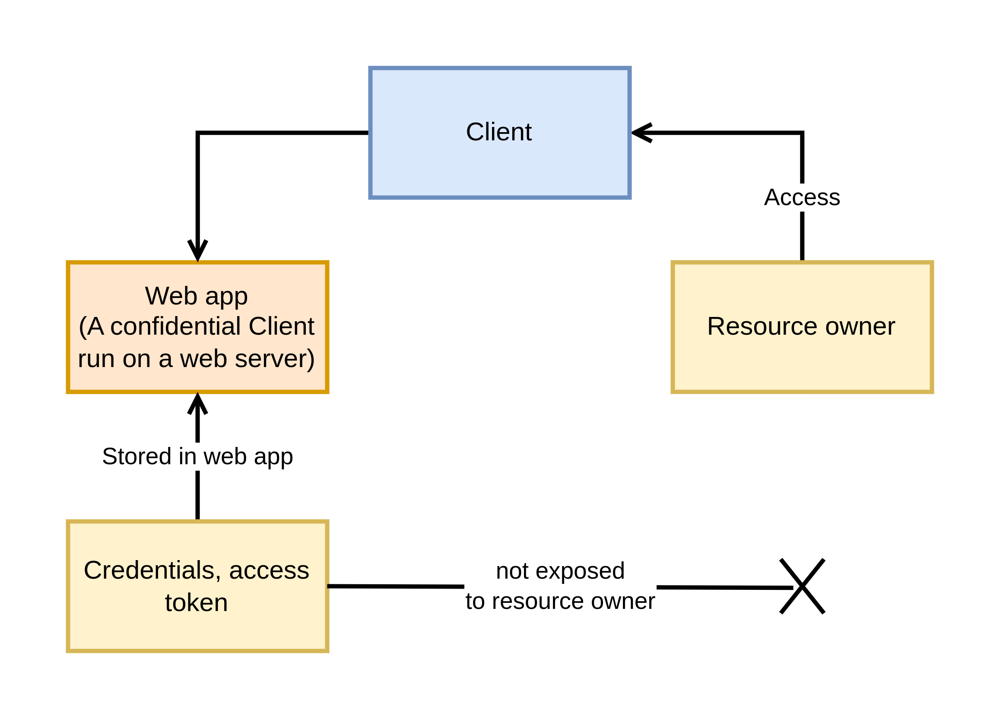

# The OAuth 2.0 Authorization Framework

OAuth 2.0 enables a third-party application to obtain limited access to an HTTP service.

## 1. Introduction

The traditional client-server authentication model

**This creates several problems and limitations:**

- Third-party applications are required to store the resource owner's credentials for future use, typically a password in clear-text.
- Servers are required to support password authentication, despite the security weakness inherent in passwords.
- Third-party applications gain overly broad access to the resource ownner's protected resources, leaving resource owners without any ability to restrict duration or access to a limited subset of resources.
- Resource owners cannot revoke access to an individual third party without revoking access to all third parties, and must do so by chaning the third party's password.

### 1.1. Roles

OAuth2 defines four roles:

|Roles|Description|
|-|-|
|Resource owner|An entity capable of granting access to a protected resource. When resource owner is a person, it is referred to as an end-user|
|Resource server|The server hosting the protected resources, capable of accepting and responding to protected resource requests using access tokens|
|Client|An application making protected resource requests on behalf of the resource owner and with its authorization.|
|Authorization server|The server issuing access tokens to the client after successfully authenticating the resource owner and obtaining authorization|

The authorization server may be the same server as the resource server or a separate entity. A single authorization server may issue access tokens accepted by multiple resource servers.

### 1.2. Protocol Flow

|Step|Action|
|-|-|
|1|Client requests authorization from the resource owner.|
|2|Client receives an authorization grant, a credential represeting the resource owner's authorization.|
|3|Client requests an access token by authenticating with the authorization server and presenting the authorization grant|
|4|Authorization server authenticates the client and validates the authorization grant, issues an access token|
|5|Client requests the protected resource from the resource server and authenticates by presenting the access token|
|6|The resource server validates the access token, and serves the request|

### 1.3. Authorization Grant

An authorization grant is a credential representing the resource owner's authorization (to access its protected resources) used by the client to obtain an access token.

|Grant type|Description|
|-|-|
|Authorization Code*|Using an authorizationg server as an intermediary between the client and resource owner.|
|Implicit|The implicit grant is a simplified authorization code flow optimized for clients implemented in a browser using a scripting language such as JavaScript. Instead of issuing the client an authorization code, the client is issued an access token directly. The grant type is implicit, as no intermediate credentials such as authorization code are issued. This flow against the security.|
|Resource Owner Password Credentials|The resource owner password credentials (i.e username, password) can be used directly as an authorization grant to obtain an access token. The credentials should only be used when there is a high degree of trust betwen the resource owner and the client, and other authorization grant types are not available|
|Client Credentials||

### Access Token

Access tokens are credentials used to access protected resources.

### Refresh Token

Refresh tokens are credentials used to obtain access tokens. Refresh tokens are issued to the client by the authorization server and are used to obtain a new access token when the current access token becomes invalid or expires.

## Client Registration

### Client Types

Based on their ability to authenticate securely with the authorization server (i.e ability to maintain the confidentiality of their client credentials):

**confidential**

Clients capable of maintaining the confidentiality of their credentials (client implemented on a secure server with restricted access to the client credentials) 

**public**

Clients incapable of maintaining the confidentiality of their credentials (e.g clients executing on the device used by the resource owner, such as an installed native application or a web application), and incapable of secure client authentication via any other means.

The client type designation is based on the authorization server's definition of secure authentication and its acceptable exposure levels of client credentials. The authorization server SHOULD NOT make assumptions about the client type.

**Web application**

**User-agent-based application**

**Native application**

### Client Identifier

### Client Authentication

The client MUST NOT use more than one authentication method in each request.

**1. Client Password**

Authorization: Basic xyz

The authorization server MAY support including the clinet credentials in the request-body

client_id: REQUIRED. The client identifier issued to the client during the registration process.

client_secret: REQUIRED. The client secret. The client MAY omit the parameter if the client secret is an empty string.

**2. Other Authentication Methods**

### Unregistered Clients

## Protocol Endpoints

The authorization process has two authorization server endpoints (HTTP resources):

- Authorization endpoint - used by the client to obtain authorization from the resource owner via user-agent redirection.
- Token endpoint - used by the client to exchange an authorization grant for an access token, typically with client authorization.
- Redirection endpoint - used by the authorization server to return responses containing authorization credentials to the client via the resource owner user-agent.

**1. Authorization Endpoint**

The authorization endpoint is used to interact with the resource owner and obtain and authorization grant. The authorization server MUST first verify the identity of the resource owner. The way in which the authorization server authenticates the resource owner (e.g username and password login, session cookies) is beyond the scope of this specification.

**2. Authorization Endpoint Response Type**

The authorization endpoint is used by the authorization code grant and implicit grant type flows.

If an authorization request is missing the response_type parameter, or if the response type is not understood, the authorization server MUST return an error response.