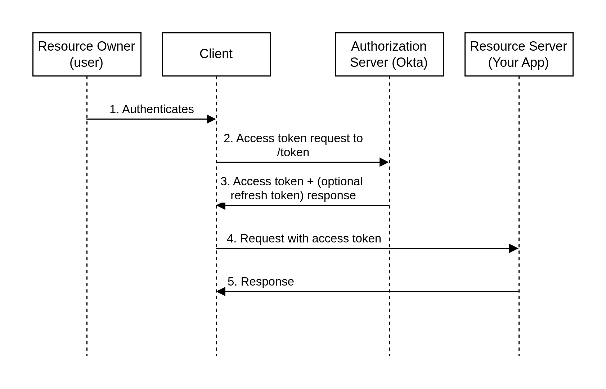

# Resource Owner Password grant

## Learning outcomes

- Understand the OAuth 2.0 Resource Owner Password flow
- Set up your app with the Resource Owner Password grant type
- Implement the Resource Owner Password flow in Okta

## About the ROPassword grant

- is not a recommended approach.
- for applications for which no other flow works
- requires your application code to be fully trusted and protected from credential-stealing attacks.

## Grant-type flow

### Resource Owner Password flow

1. User authenticates with your client application (app), providing their users credentials.
2. Your app sends these credentials to the Okta authorization server with its client ID and secret in the request header.
3,4,5 follow steps in above image.