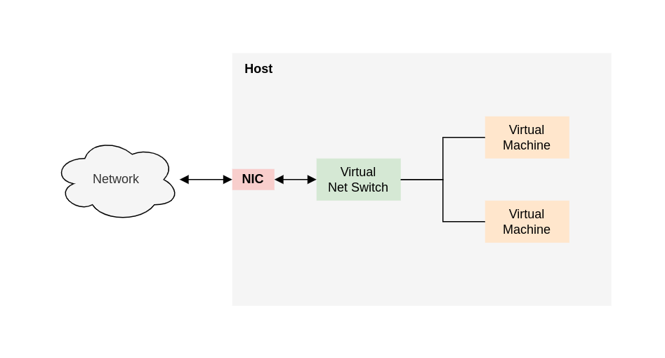
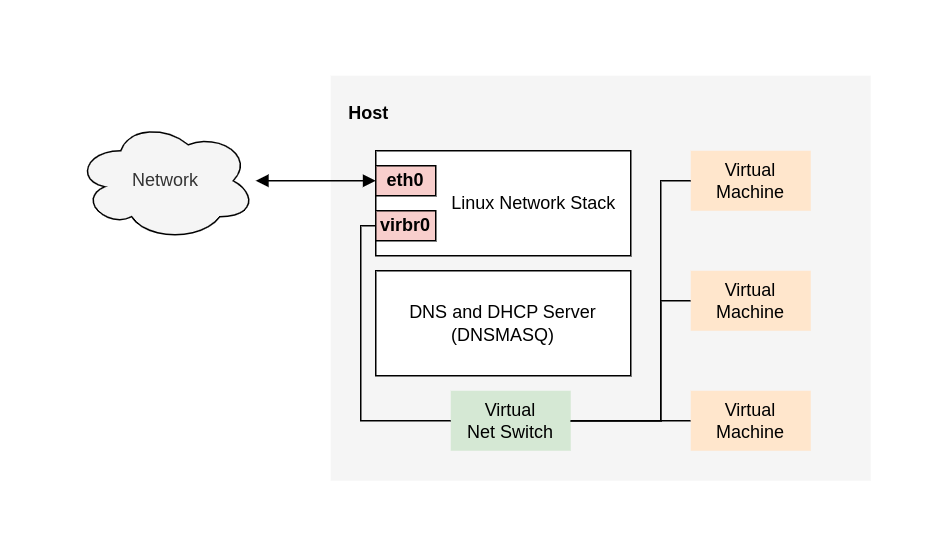
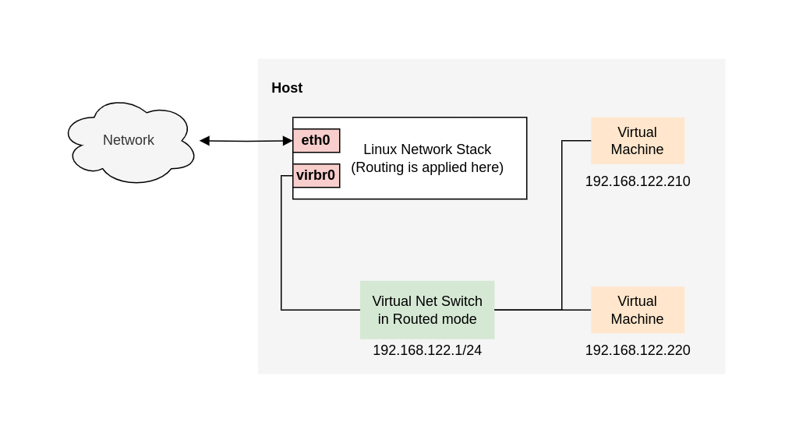
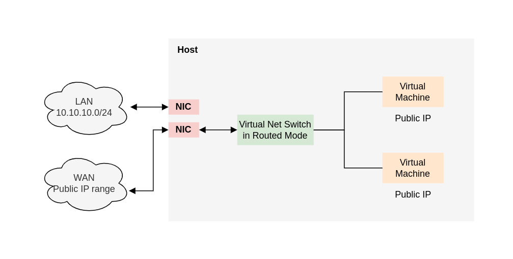
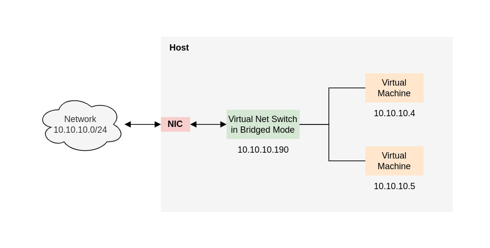
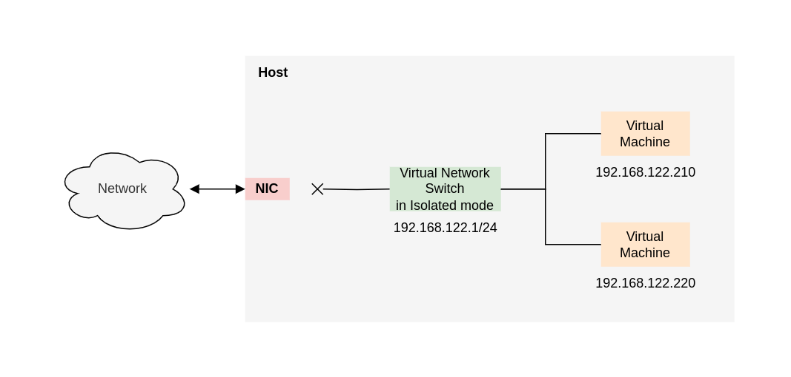

# Chapter 17. Configuring virtual network connections

- You can enable the VMs on your host to be discovered and connected by locations outside the host, as if the VMs were on the same network as the host.
- You can partially or completely isolate a VM from inbound network traffic to increase its security and minimize the risk of any problems with the VM impacting the host.

## 17.1. Understanding virtual networking

The connection of virtual machines (VMs) to other devices and locations on a network has to be facilitated by the host hardware. The following sections explain the mechanisms of VM network connections and describe the default VM network setting.

### 17.1.1. How virtual networks work

Virtual network uses the concept of a virtual network switch. A virtual network switch is a software construct that operates on a host machine. VMs connect to the network through the virtual network switch. Based on the configuration of the virtual switch, a VM can use an existing virtual network managed by the hypervisor, or a different network connection method.

The following figure shows a virtual network switch connecting two VMs to the network:

From the perspective of a guest operating system, a virtual network connect is the same as a physical network connection. Host machines new virtual network switches.

By default, all VMs on a single host are connected to the same NAT-type virtual network, named default, which uses the virbr0 interface.

For basic outbound-only network access from VMs, no additional network setup is usually needed, because the default network is installed along with the libvirt-daemon-config-network package, and is automatically started when the virtnetworkd service is started.

If a different VM network functionality is needed, you can create additional virtual networks and network interfaces and configure yours VMs to use them. In additional to the default NAT, these networks and interfaces can be configured to use one of the following modes:

- Routed mode
- Bridged mode
- Isolated mode
- Open mode

### 17.1.2. Virtual network default configuration

When the virtnetworkd service is first installed on a virtualization host, it contains an initial virtual network configuration in network address translation (NAT) mode. By default, all VMs on the host are connected to the same **libvirt** virtual network, named **default**. VMs on this network can connect to locations both on the host and on the network beyond the host, but with the following limitations:

- VMs on the network are visible to the host and other VMs on the host, but the network traffic is affected by the firewalls in the guest operating system's network stack and by the **libvirt** network filtering rules attached to the guest interface.
- VMs on the network can connect to locations outside the host but are not visible to them. Outbound traffic is affected by the NAT rules, as well as the host system's firewall.

The following diagram illustrates the default VM network configuration:

## 17.2. Using the web console for managing virtual machine network interfaces

- Type - The type of network interface for the VM. The types include virtual network, bridge to Lan, and direct attachment.
- Model type - The model of the virtual network interface.
- MAC Address - The MAC address of the virtual network interface. 
- IP address - The IP address of the virtual network interface.
- Source - The source of the interface interface.
- State - The state of the virtual network interface.

TODO: Read again

## 17.4. Types of virtual machine network connections

To modify the networking properties and behavior of your VMs, change the type of virtual network or interface the VMs use.

### 17.4.1. Virtual networking with network address translation

By default, virtual network switches operate in network address translation (NAT) mode. They use IP masquerading rather than Source-NAT (SNAT) or Desination-NAT (DNAT). IP masquerading enables connected VMs to use the host machine's IP address for communication with any external network. When the virtual network switch is operating in NAT mode, computers external to the host cannot communicate with the VMs inside the host.

### 17.4.2. Virtual networking in routed mode

When using Routed mode, the virtual switch connects to the physical LAN connected to the host machine, passing traffic back and forth without the use of NAT. The virtual switch can examine all traffic and use the information contained with the network packets to make routing decisions. When using this mode, the virtual machines (VMs) are all in a single subnet, separate from the host machine. The VM subnet is routed through a virtual switch, which exists on the host machine. This enables incoming connections, but requires extra routing-table entries for systems on the external network.

Routed mode uses routing based on the IP address:

A common topology that uses routed mode is virtual server hosting (VSH). A VSH provider may have several host machines, each with two physical network connections. One interface is used for management and accounting, the other for the VMs to connect through. Each VM has its own public IP address, but the host machines use private IP addresses so that only internal administrators can manage the VMs.

### 17.4.3. Virtual networking in bridged mode

In most Vm networking modes, VMs automatically create and connect to the **virbr0** virtual bridge. In constrast, in *bridged* mode, the VM connects to an existing Linux bridge on the host. As a result, the VM is directly visible on the physical network. This enables incoming connections, but does not require any extra routing-table entries. 

Bridged mode uses connection switching based on the MAC address:

In bridged mode, the VM appear within the same subnet as the host machine. All other physical machines on the same physical network can detect the VM and access.

**Bridged network bonding**

It is possible to use multiple physical bridge interfaces on the hypervisor by joining them together with a bond. The bond can then be added to a bridge, after which the VMs can be added to the bridge as well. However, the bonding driver has several modes of operation, and not all of these modes work with a bridge where VMs are in use.

...

TODO: Read again

### 17.4.4. Virtual networking in isolated mode

By using isolated mode, virtual machines connected to the virtual switch can communicate with each other and with the host machine, but their traffic will not pass outside of the host machine, and they cannot receive traffic from outside the host machine. Using **dnsmasq** in this mode is required for basic functionality such as DHCP.

### 17.4.5. Virtual networking in open mode

When using open mode for networking, libvirt does not generate any firewall rules for the network. As a result, **libvirt** does not overwrite firewall rules provided by the host, and the user can therefore manually manage the VM's firewall rules.

### 17.4.6. Comparison of virtual machine connection types

|Type|Connection to the host|Connection to other VMs on the host|Connection to outside locations|Visible to outside locations|
|-|-|-|-|-|
|Bridged mode|Yes|Yes|Yes|Yes|
|NAT|Yes|Yes|Yes|No|
|Routed Mode|Yes|Yes|Yes|Yes|
|Isolated Mode|Yes|Yes|No|No|

