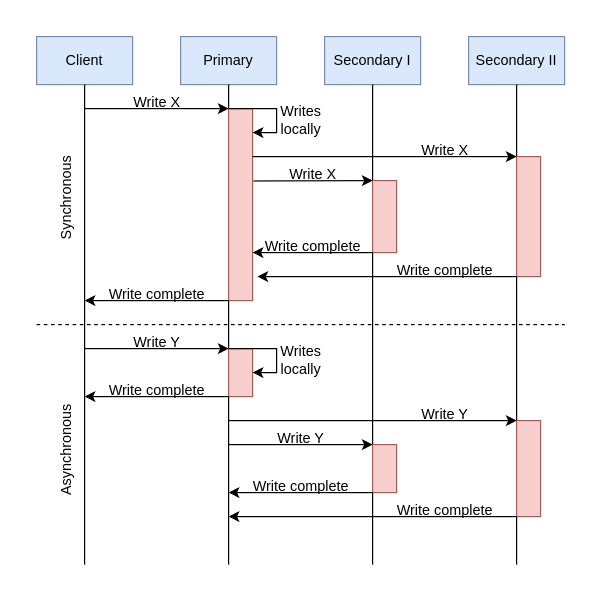

# Database

## Types of Databases

### Relational databases

Relational databases adhere to particular schemas before storing the data. The data stored in relational databases has prior structure. Mostly, this mode organizes data into one or more relations (also called tables), with a unique key for each tuple (instance). Each entity of the data consists of instances and attributes, where instances are stored in rows, and the attributes of each instance are stored in columns. Since each tuple has a unique key, a tuple in one table can be linked to a tuple in other tables by storing the primary keys in other tables, generally known as foreign keys.

A Structure Query Language (SQL) is used for manipulating the database.

Relational databases provide the atomicity, consistency, isolation, and durability (ACID) properties to maintain the integrity of the database. ACID is a powerful abstraction that simplifies complex interactions with the data and hides many anomalies (like dirty reads, drity writes, read skew, lost updates, write skew, and phantom reads) behind a simple transport abort.

Let's discuss ACID in detail:

- Atomicity: A transaction is considered an atomic unit. Therefore, either all the statements within a transaction will successfully execute, or none of them will execute. If a statement fails within a transaction, it should be aborted and rolled back.
- Consistency: At any given time, the database should be in a consistent state, and it should remain in a consistent state after every transaction. For example, if multiple users want to view a record from the database, it should return a similar result each time.
- Isolation: In the case of multiple transactions running concurrently, they shouldn't be affected by each other. The final state of the database should be the same as the transactions were executed sequentially.
- Durability: The system should guarantee that completed transactions will survive permanently in the database even in system failure events.

### Why relational databases?

One of the greatest powers of the relational database is its abstractions of ACID transactions and related programming sematics.

**Flexibility**

**Reduced redundancy**

One of the biggest advantages of the relational database is that it eliminates data redundancy. The information related to a specify entity appears in the other tables linked through foreign keys. This process is called normalized and has the additional benefit of removing an inconsistent dependency.

**Concurrency**

Concurrency is an important factor while designing an enterprise database. In such a case, the data is read and writen by many users at the same time. We need to coordinate such interactions to avoid inconsistency in data - for example, the double booking of hotel rooms. Concurrency in a relational database is handled through transactional access to the data. As explained earlier, a transaction is considered an atomic operation, so it also works in error handling to either roll back or commit a transaction on successful execution.

**Integration**

The process of aggregating data from multiple sources is a common practice in enterprise applications. A common way to perform this aggregation is to integrate a shared database where multiple applications store their data. This way, all the applications can easily access each other's data while the concurrency control measures handle the access of multiple applications.

**Backup and disaster recovery**

Relational databases guarantee the state of data is consistent at any time. The export and import operations make backup and restoration easier. Most cloud-based relational databases perform continuous mirroring to avoid loss of data and make the restoration process easier and quicker.

**Impedance mismatch**

Impedance mismatch is the different between the relational model and the in-memory data structures. The relational model organizes data into a tabular structure with relations and tuples. SQL operation on this structured data yields relations aligned with relational algebra. However, it has some limitations. In particular, the values in a table take simple values that can't be a structure or a list. The case is different for in-memory, where a complex data structure can be stored. To make the complex structures compatible with the relations, 

### Why non-relational (NoSQL) databases?

A NoSQL database is designed for a variety of data models to access and manage data. There are various types of NoSQL databases, which we'll explain in the next section. These databases are used in applications that require a large volume of semi-structured and unstructured data, low latency, and flexible data models. This can be achieved by relaxing some of the data consistency restrictions of other databases. Following are some characteristics of the NoSQL database:

- Simple design: Unlike relation databases, NoSQL doesn't require dealing with the impedance mismatch - for example, storing all the employee's data in one document instead of multiple tables that require join operations. This strategy makes it simple and easier to write less code, debug, and maintain.
- Horizontal scaling: Primarily, NoSQL is preferred due to its ability to run databases on a large cluster. This solves the problem when the number of concurrent users increases. NoSQL makes it easier to scale out since the data related to a specific employee is stored in one document instead of multiple tables over nodes. NoSQL databases ofter spread data across multiple nodes and balance data and queries across nodes automatically. In case of a node failure, it can be transparently replaced without any application disruption.
- Availability: To enhance the availability of data, node replacement can be performed without application downtime. Most of the non-relational database's variants support data replication to ensure high availability and disaster recovery.
- Support for unstructured and semi-structured data: Many NoSQL databases work with data that doesn't have schema at the time of database configuration or data writes.
- Cost: Licenses for many RDBMs are pretty expensive, while many NoSQL databases are open source and freely available. Similarly, some RDBMs rely on costly proprietary hardware and storage systems, while NoSQL databases usually use clusters of cheap commodity servers. 

### Types of NoSQL databases

### Drawbacks of NoSQL databases

**Lack of standardization**

NoSQL doesn't follow any specify standard, like how relational databases follow relational algebra. Porting applications from one type of NoSQL database to another might be a challenge.

**Consistency**

NoSQL databases provide different products based on the specific trade-offs between consistency and availability when failures can happen. We won't have strong data integrity, like primary and referential integrities in a relational database. Data might note be strongly consistent but slowly converging using a weak model like eventual consistency.

**Relational and Non-relational Databases**

|Relational Database|Non-relational Database|
|-|-|
|If the data to be stored is structured|If the data to be stored is unstructured|
|If ACID properties are required|If there's a need to serialize and deserialize data|
|If the size of the data is relatively small and can fit on a node|If the size of the data to be stored is large|

## Data Replication

Understand the models through which data is replicated across several nodes.

We need the following characteristics from our data store:

- Availability under faults (failure of some disk, nodes, and network and power outages).
- Scalability (with increasing reads, writes, and other operations).
- Performance (low latency and high throughput for the clients).

It's challenging, or even impossible, to achieve the above characteristics on a single node.

### Replication

Replication refers to keeping multiple copies of the data at various nodes to achieve availability, scalability, and performance. In this lession, we assume that a single node is enough to hold our entire data. We won't use this assumption while discussing the partitioning of data in multiple nodes. Often, the concepts of replication and partitioning go together.

Replication is relatively simple if the replicated data doesn't require frequent changes. The main problem in replication arises when we have to maintain changes in the replicated data over time.

Additional complexities that could arise due to replication are as follows:

- How do we keep multiple copies of data consistent with each other?
- How do we deal with failed replica nodes?
- Should we replicate synchronously or asynchronously?
    - How do we deal with replication log in case of asynchronous replication?
- How do we handle concurrent writes?
- What consistency model needs to be exposed to the end programmers?

### Synchronous versus asynchronous replication

In synchronous replication, the primary node waits for ack from secondary nodes about updating the data. After receiving ack from all secondary nodes, the primary node reports success to the client. Whereas in asynchronous replication, the primary node doesn't wait for the ack from the secondary nodes and reports success to the client after updating itself.

The advantage of synchronous replication is that all the secondary nodes are completely up to date with the primary node. However, there's a disadvantage to this approach. If one of the secondary nodes doesn't ack due to failure or fault in the network, the primary node would be unable to ack the client until it receives the successfully ack from the crashed node. This causes high latency in the response from the primary node to the client.

On the other hand, the advantage of asynchronous replication is that the primary node can continue its work even if all the secondary nodes are down. However, if the primary node fails, the writes that weren't copied to the secondary nodes will be lost.

### Data replication models

Now, let's discuss various mechnisms of data replication. In this section, we'll discuss the following models along with their strengths and weaknesses:

- Single leader or primary-secondary replication
- Multi-leader replication
- Peer-to-peer or leaderless replication

#### Single leader/primary - secondary replication

In primary-secondary replication, data is replicated across multiple nodes. One node is designed as the primary. It's responsible for processing any writes to data stored on the cluster. It also sends all the writes to the secondary nodes and keeps them in sync.

Primary-secondary replication is appropriate when your workload is read-heavy. To better scale with increasing readers, we can add more followers and distribute the read load across the available followers. However, replicating data to many followers can make a primary bottleneck. Additionally, primary-secondary replication is inappropriate if our workload is write-heavy.

Another advantage of primary-secondary replication is that it's read resilient. Secondary nodes can still handle read requests in case of primary node failure. Therefore, it's a helpful approach for read-intensive applications.

Replication via this approach comes with inconsistency if we use asynchronous replication. Clients reading from different replicas may see inconsistent data in the case of failure of the primary node that couldn't propagate updated data to the secondary nodes. So, if the primary node fails, any missed updates not passed on to the secondary nodes can be lost.

**Question:** What happens when the primary node fails?

In case of failure of the primary node, a secondary node can be appointed as a primary node, which speeds up the process of recovering the initial primary node. There are two approaches to select the new primary node: manual and automatic.

In a manual approach, an operator decides which node should be the primary node and notifies all secondary nodes.

In an automatic approach, when secondary nodes find out that the primary node has failed, they appoint the new primary node by conducting an election known as a leader election.

**Primary-secondary replication methods**

There are many different replication methods in primary-secondary replication:

- Statement-based replication
- Write-ahead log (WAL) shipping
- Logical (row-based) log replication

**Statement-based replication**

In the statement-based replication approach, the primary node saves all statements that it executes, like insert, delete, update and so on, and sends them to the secondary nodes to perform. This type of replication was used in MySQL before version 5.1.

This type of approach seems good, but it has its disadvantages. For example, any nondeterminisitic function (such as NOW()) might result in distinct writes one the follower and leader. Futhermore, if a write statement is dependent on a prior write, and both of them reach the follower in the wrong order, the outcome on the follower node will be uncertain. 

**Write-ahead log (WAL) shipping**

In the write-ahead log (WAL) shipping approach, the primary node saves the query before executing it in a log file known as a write-ahead log file. It then uses these logs to copy the data onto the secondary nodes. This is used in PostgreSQL and Oracle. The problem with WAL is that it only defines data at a very low level. It's tight coupled with the inner structure of the database engine, which makes upgrading software on the leader and followers complicated.

**Logical (row-based) log replication**

In the logical (row-based) log replication approach, all secondary nodes replicate the actual data changes. For example, if a row is inserted or deleted in a table, the secondary nodes will replicate that change in that specific table. The binary log records change to database tables on the primary node at the record level. To create a replica of the primary node, the secondary node reads this data and changes its records accordingly. Row-based replication doesn't have the same difficuties as WAL because it doesn't require information about data layout inside the database engine.

#### Multi-leader replication

As discussed above, single leader replication using asynchronous replication has a drawback. There's only one primary node, and all the writes have to go through it, which limits the performance. In case of failure of the primary node, the secondary nodes may not have the updated database.

Multi-leader replication is an alternative to single leader replication. There are multiple primary nodes that processes the writes and send them to all other primary and secondary nodes to replicate.

This kind of replication is quite useful in applications in which we can continue work even if we're offline - for example, a calendar application in which we can set our meetings even if we don't have access to the internet. Once we're online, it replicates its changes from our local database (our mobile phone or laptop acts as a primary node)  to other nodes.

**Conflict**

Multi-leader replication gives better performance and scalability than single leader replication, but it also has a significant disadvantage. Since all the primary nodes concurrently deal with the write requests, they may modify the same data, which can create a conflict between them. For example, suppose the same data is edited by two clients simultaneously. In that case, their writes will be successfully in their associated primary nodes, but when they reach the other primary nodes asynchronously, it creates a conflict.

**Handle conflicts**

Conflicts can result in different data at different nodes. These should be handled efficiently without losing any data. Let's discuss some of the approaches to handle conflicts:

**Conflict avoidance**

A simple strategy to deal with conflicts is to prevent them from happening in the first place. Conflicts can be avoided if the application can verify that all writes for a given record go via the same leader.

However, the conflict may still occur if a user moves to a different location and is now near a different data center. If that happens, we need to reroute the traffic.

**Last-write-wins**

Using their local clock, all nodes assign a timestamp to each update. When a conflict occurs, the update with the lastest timestamp is selected.    

This approach can also create difficult because the clock synchronization across nodes is challenging in distributed systems. There's clock skew that can result in data loss.

**Custom logic**

**Multi-leader replication topologies**

There are many topologies through which multi-leader replication is implemented, such as circular topology, start topology, and all-to-all topology. The most common is the all-to-all topology. In star and circular topology, there's again a similar drawback that if one of the nodes fails. It can affect the whole system.

#### Peer-to-peer or leaderless replication

In primary-secondary replication, the primary node is bottleneck and a single point of failure. Moreover, it helps to achieve read scalability but fails to provide write scalability. The peer-to-peer replication model resolves these problems by not having a single primary node. All the nodes have equal weightage and can accept read and write requests.

Like primary-secondary replication, this replication can also yield inconsistency. This is because when several nodes accept write requests, it may lead to concurrent writes. A helpful approach used for solving write-write inconsistency is called quorums.

**Quorums**

Let's suppose we have three nodes. If at least two out of three nodes are guaranteed to return successfully updates, it means only one node has failed. This means that if we read from two nodes, at least one of them will have the updated version, and our system can continue working.

If we have n nodes, then every write must be updated in at least w nodes to be considered as success, and we must read from r nodes. We'll get an updated value from reading as long as w + r > n because at least one of the nodes must have an updated write from which we can read. Quorum reads and writes adhere to these r and w values. These n,w and r are configurable in Dynamo-style databases.

A quorum is the minimum number of members that must be present at any meeting to consider the proceedings of the meeting valid.

In distributed systems, we mostly have an odd number of nodes, so the chances of us running into a situation like the one depicted. There will always be more than half the number of given nodes deciding on something.

Quorum is used in almost all consensus-based algorithms in distributed systems. Raft is one of the famous consensus algorithms that uses quorum as the core of their algorithm logic.

## Data Partitioning

### Why do we partition data?

Data is an asset for any organization. Increasing data and concurrent read/write traffic to the data puts scalability pressure on traditional databases.

As a result, the latency and throughput are affected. Traditional databases are attractive due to their properties such as range queries, secondary indices, and transactions with the ACID properties.

At some point, a single node-based database isn't enough to tackle the load. We might need to distribute data over many nodes but still export all the nice properties of relation databases. In practice, it has proved challenging to provide single-node database-like properties over a distributed database.

One solution is move data to a NoSQL-like system. However, the historical codebase and its close cohesion with traditional databases make it an expensive problem to tackle.

Organization might scale traditional databases by using a third-party solution.

Data partitioning (or sharding) enables us to use multiple nodes where each node manages some part of the whole data. To handle increasing query rates and data amounts, we strive for balanced partitions and balanced read/write load.

### Sharding

To divide load among multiple nodes, we need to partition the data by a phenomenon known as partitioning or sharding. In this approach, we split a large dataset into smaller chunks of data stored at different nodes on our network.

The partitioning must be balanced so that each partition receives about the same about of data. If partitioning is unbalanced, the majority of queries will fall into a few partitions.

### Vertical sharding

We can put different tables in various database instances, which might be running on a different physical server. We might break a table into multiple tables so that some columns are in one table while the rest are in the other. We should be careful if there are joins between multiple tables. We may like to keep such tables together on one shard.

Often vertical sharding is used to increase the speed of data retrieval from a table consisting of columns with very wide text or a binary large object (blob). In this case, the column with large text or a blob is split into a different table.

Creating shards by moving specific tables of a database around is also a form of vertical sharding. Usually, those tables are put in the same shard because they often appear together in queries, for example, for joins.

### Horizontal sharding

At times, some tables in the databases become too big and affect read/write latency. Horizontal sharding or partitioning is used to divide a table into multiple tables by splitting data row-wise. Each partition of the original table distributed over database servers is called a shard. Usually, there are two strategies available:

- Key-range based sharding
- Hash based sharding

### Key-range based sharding

In the key-range based sharding, each partition is assigned a continuous range of keys.

In the following figure, horizontal partitioning on the Invoice table is performed using the key-range based sharding with Customer_Id as the partition key. The two different colored tables represent the partitions. 

|customer_id|invoice_id|created_date|
|-|-|-|
|1|5101|01-01-2015|
|2|5201|10-01-2017|
|3|5301|05-01-2018|
|4|5401|30-01-2017|
|5|5501|10-12-2017|
|6|5601|07-11-2017|

*Database shard 1*
|customer_id|invoice_id|created_date|
|-|-|-|
|1|5101|01-01-2015|
|2|5201|10-01-2017|
|3|5301|05-01-2018|

*Database shard 2*
|customer_id|invoice_id|created_date|
|-|-|-|
|4|5401|30-01-2017|
|5|5501|10-12-2017|
|6|5601|07-11-2017|

Sometimes, a database consists of multiple tables bound by foreign key relationships. In such a case, the horizontal partition is performed using the same partition key on all tables in a relation.

The basic design techniques used in multi-table sharding are as follows:

- There's a partition key in the Customer mapping table. This table resides on each shard and stores the partition keys used in the shard. Applications create a mapping logic between the partition keys and database shards by reading this table from all shards to make the mapping efficient. Sometimes, applications use advanced algorithms to determine the location of a partition key belonging to a specific shard. 
- The partition key column, Customer_Id, is replicated in all other tables as a data isolation point. It has a trade-off between an impact on increases storage and locating the desired shards efficiently.
- Primary keys are unique across all database shards to avoid key collision during data migration among shards and the merging of data in the OLAP env.
- The column Create_date serves as the data consistency point, with an assumption that the clocks of all nodes are synchronized.

**Advantages**

- Using key-range-based sharding methods, the range-query-based scheme is easy to implement. We precisely know where (which node, which shard) to look for a specific range of keys.
- Range queries can be performed using the partitioning keys, and those can be kept in partitions in sorted order. How exactly such a sorting happens over time as new data comes in is implementation specific.

**Disadvantages**

- Range queries can't be performed using keys other than the partitioning key.
- If key aren't selected properly, some nodes may have to store more data due to an uneven distribution of the traffic.

### Hash-based sharding

Hash-based sharding uses a hash function on an attribute. This hash function produces a hash value that is used to perform partitioning. The main concept is to use a hash function on the key to get a hash value and then mod by the number of partitions. Once we've found an appropriate hash function for keys, we may give each partition a range of hashes (rather than a range of keys).

In the illustration below, we use a hash function of Value mod = n.

|Key|Value|Hash func(f)|Node|
|-|-|-|-|
|1|226666502|2|2|
|2|150355825|1|1|

f = Value mod 4

**Advantages**

- Keys are uniformly distributed across the nodes.

**Disadvantages**

- We can't perform range queries with this technique. Keys will be spread over all partitions.

### Consistent hashing

Consistent hashing assigns each server or item in a distributed hash table a place on an abstract circle, called a ring, irrespective of the number of servers in the table. This permits servers and objects to scale without compromising the system's overall performance.

**Advantages of consistent hashing**

- It's easy to scale horizontally.
- It increases the throughput and improves the latency of the application.

**Disadvantages of consistent hashing**

- Randomly asigning nodes in the ring may cause non-uniform distribution.

### Rebalance the partitions

Query load can be imbalanced across the nodes due to many reasons, including the following:

- The distribution of the data isn't equal.
- There's too much load on a single partition.
- There's an increase in the query traffic, and we need to add more nodes to keep up.

**Avoid hash mod n**

Usually, we avoid the hash of a key for partitioning (we used such a scheme to explain the concept of hashing in simple terms earlier). The problem with the addition or removal of nodes in the case of hashmodn is that every node's partition number changes and a lot of data moves. For example, assume we have hash(key) = 1235. If we have five nodes at the start, the key will start on node 1 (1235 mode 5 = 0). Now, if a new node is added, the key would have to be moved to node 6 (1235 mode 6 = 5), and so on. This moving of keys from one node to another makes rebalancing costly. 

**Fixed number of partitions**

In this approach, the number of partitions to be created is fixed at the time when we set our database up. We create a higher number of partitions than the nodes and assign partitions to nodes. So, when a new node is added to the system, it can take a few partitions from the existing nodes until the partitions are equally divided.

**Dynamic partitioning**

In this approach, when the size of a partition reaches the threshold, it's split equally into two partitions. One of the two split partitions is assigned to one node and the other one to another node. In this way, the load is divided equally. The number of partitions adapts to the overall data amount, which is an advantage of dynamic partitioning.

**Partition proportionally to nodes**

### Partitioning and secondary indexes

## Trade-offs in Databases

### Which is the best database sharding approach?

Both horizontal and vertical sharding involve adding resources to our computing infrastructure. Our business stakeholders must decide which is suitable for our organization. We must scale our resources accordingly for our organization and business to grow, to prevent downtime, and to reduce latency. We can scale these resources through a combination of adjustments to CPU, physical memory requirements, hard disk adjustments, and network bandwidth.

### Advantages and disadvantages of a centralized database

**Advantages**

- Data maintenance, such as updating and taking backups of a centralized database, is easy.
- Centralized databases provide stronger consistency and ACID transactions than distributed databases.
- Centralized databases provide a much simpler programming model for the end programmers as compared to distributed databases.
- It's more efficient for businesses that have a small amount of data to store can reside on a single node.

**Disadvantages**

- A centralized database can slow down, causing high latency for end users, when the number of queries per second accessing the centralized database is approaching single-node limits
- A centralized database has a single point of failure. Because of this, its probability of not being accessible is much higher.

### Advantages and disadvantages of a distributed database

**Advantages**

- It's fast and easy to access data in a distributed database because data is retrieved from the nearest database shard or the one frequently used.
- Data with different levels of distribution transparent can be stored in separate places.
- Intensive transactions consisting of queries can be divided into multiple optimized subqueries, which can be processed in a parallel fashion.

**Disadvantages**

- Sometimes, data is required from multiple sites, which takes more time than expected.
- Relations are partitioned vertically or horizontal among different nodes. Therefore, operations such as joins need to reconstruct complete relations by carefully fetching data. There operations can become much more expensive and complex.
- It's difficult to maintain consistency of data across sites in the distributed database, and it requires extra measures
- Updations and backups in distributed databases take time to synchronize data.

### Query optimization and processing speed in a distributed database

A transaction in the distributed database depends on the type of query,

### Conclusion

Data distribution (vertical and horizontal sharding) across mutliple nodes aims to improve the following features, considering that the queries are optimized:

- Reliability (fault-tolerance)
- Performance
- Balanced storage capacity and dollar costs
