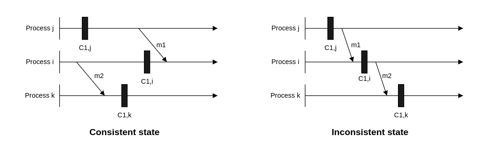

# Fault Tolerance

## What is fault tolerance?

Real-world, large-scale applications run hundreds of servers and databases to accommodate billions of user's requests and store significant data. These applications need a mechanism that helps with data safely and eschews the recaculation of computationally intensive tasks by avoiding a single point of failure.

**Fault tolerance** refers to a system's ability to execute persistently even if one or more of its components fail. Here, components can be software or hardware. Conceiving a system that is hundred percent fault-tolerant is practically very difficult.

Availablity focuses on receiving every client's request by being accessible 24/7.

Reliability is concerned with responding by taking specified action on every client's request.

Avoiding a single point of failure

Fault tolerance refers to a system's ability to execute persistently even if one or more its components fail. Here, components can be software or hardware.

Availablity focuses on receiving every client's request by being accessible 24/7.

Reliability is concerned with responding by taking specified action on every client's request.

## Fault tolerance techniques

Failure occurs at the hardware or software level, which eventually affects the data. Fault tolerance can be achieved by many approaches, considering the system structure.

### Replication

One of the most widely-used techniques is replication-based fault tolerance. With this technique, we can replicate both the services and data. We can swap out failed nodes with healthy ones and a failed data store with it replicas. A large service can transparently make the switch without impacting the end customers.

We create multiple copies of our data in separate storage. All copies need to update regularly for consistency when any update occurs in the data. Updating data in replicas is a challenging job. When a system needs strong consistency, we can synchronously update data in replicas. However, this reduces the Availablity of the system. We can also asynchronously update data in replicas when we can tolerance eventual consistency, resulting in stale reads until all replicas converge. Thus, there is a trade-off between both consistency approaches.

### Checkpointing

**Checkpointing** is a technique that saves the system's state in stable storage for later retrieval in case of failures due to errors or service disruptions. Checkpointing is a fault tolerance technique performed in many stages at different time intervals. When distributed system fails, we can get the last computed data from the previous checkpoint and start working from there.

Checkpointing is performed for different individual processes in a system in such a way that they represent a global state of the actual execution of the system. Depending on the state, we can divide checkpointing into two types:

**- Consistent state:** A state is consistent in which all the individual processes of a system have a consistent view of the shared state or sequence of events that have occurred in a system. Snapshots taken in consistent states have data in coherent states, representing a possible situation of the system. For a checkpoint to be consistent, typically, the following criteria are met:

All updates to data that were completed before the checkout are saved. Any updates to data that were in progress are rolled back as if they didn't initiate.

Checkpoints include all the message that have been sent or received up until the checkpoint. No messages are in transit (in-flight) to avoid cases of missing messages. 

Relationships and dependencies between system components and their states match what would be expected during normal operation.

**- Inconsistent state**

This is a state where there are descrepancies in the save state of different processes of a system. In other words, the checkpoints across different processes are not coherent and coordinated. 

Let's look at an example to understand consistent and inconsistent states in a better way. Consider three processes represented by i, j and k. Two messages, m1 and m2, are exchanged between the processes. Other than that, we have one snapshot/checkout saved for each process represented by C1,i, C1,j and C1,k where 1 represents the number of snapshots for a process and the lowercase letter represents the process itself. 

In the illustration on the left, the first checkpoints at processes j and i are consistent because m1 is send and received after the checkpoints. On the contrary, in the right-hand illustration, the first checkpoint at process j doesn't know about m1, while the first checkpoint at process i recorded the reception of message m1. Therefore, it's an inconsistent state.

