# The Key-value Store

## Introduction to key-value stores

Key-value stores are distributed hash tables (DHTs). A key is generated by the hash function and should be unique.

**Requirements**

- **Configurable service:** Some applications might have a tendency to trade strong consistency for higher availability. We need to provide a configurable service so that different applications could use a range of consistency models. We need tight control over the trade-offs between availability, consistency, cost-effectiveness, and performance.

- **Ability to always write (when we picked "A" over "C" in the context of CAP):** The applications should always have the ability to write into the key-value storage. If the user wants strong consistency, this requirement might not always be fulfilled due to the implications of the CAP theorem.

- **Hardware heterogeneity:** We want to add new servers with different and higher capacities, seamlessly, to our cluster without changing or upgrading existing servers. Our system should be able to accommodate and lerverage different capacity servers, ensuring correct core functionality while balancing the workload distribution according to each server's capacity.


**Non-functional requirements**

The non-functional requirements are as follows:

- Scalability: Key-value stores should run on tens of thousands of servers distributed across the globe. Incremental scalability is highly desirable. We should add or remove the servers as needed with minimal to no disruption to the service availability.
- Fault tolerance: The key-value store should operate uninterrupted despite failures in servers or their components.

### API design

Key-value stores, like ordinary hash tables, provide two primary functions, which are get and put.

Let's look at the API design

**The get function**

The API call to get a value should look like this:

```go
get(key)
```

We return the associated value on the basic of the parameter key. When data is replicated, it locates the object replica associated with a specific key that's hidden from the end user. It's done by the system if the store is configured with a weaker data consistency model. For example, in eventual consistency, there might be more than one value returned against a key.

**The put function**

The API call to put the value into the system should look like this:

```go
put(key, value)
```

## Ensure Scalability and Replication

### Add scalability

Let's start with one of the core design requirements: scalability. We store key-value data in storage nodes. With a change in demand, we might need to add or remove storage nodes. It means we need to partition data over the nodes in the system to distribute the load across all nodes.

For example, let's consider that we have four nodes, and we want 25% of the requests to go to each node to balance the load equally. The traditional way to solve this is through the modulus operator. Each request that arrives has a key associated with it. When a request comes in, we calculate the hash of they key. Then, we find the remainder by taking the modulus of the hashed value with the number of nodes m. The remainder value x is the node number, and we send the request to that node to process it.

We want to add and remove nodes with minimal change in our infrastructure. But in this method, we add or remove a node, we need to move a lot of keys. This is inefficient. For example, node 2 is removed, and suppose for the same key, the new server to process a request will be node 1 because 10%3 = 1. Nodes hold information in their local caches, like keys and their values. So, we need to move that request's data to the next node that has to process the request. But this replication can be costly and can cause high latency.

**Question:** Why didn't we use load balancers to distribute the requests to all nodes?

### Consistent hashing

Consistent hashing is an effective way to manage the load over the set of nodes. In consistent hashing, we consider that we have a conceptual ring of hashes from 0 to n - 1, where n is the number of available hash values. We use each node's ID, calculate its hash, and map it to the ring. We apply the same process to requests. Each request is completed by the next node that it finds by moving in the clockwise direction in the ring.

Whenever a new node is added to the ring, the immediate next node is affected. It has to share its data with the newly added node while other nodes are unaffected. It's easy to scale since we've able to keep changes to our nodes minimal. This is because only a small portion of overall keys need to move. The hashes are randomly distributed, so we expect the load of requests to be random and distributed evenly on average on the ring.

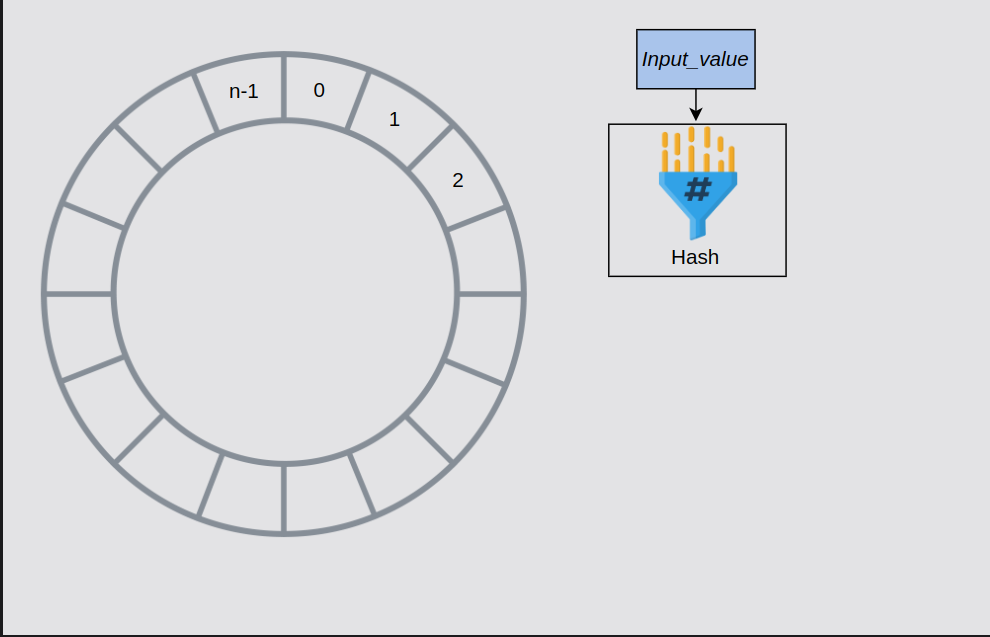

*Consider we have a conceptual ring of hashes from 0 to n-1, where n is the total number of hash values in the ring*

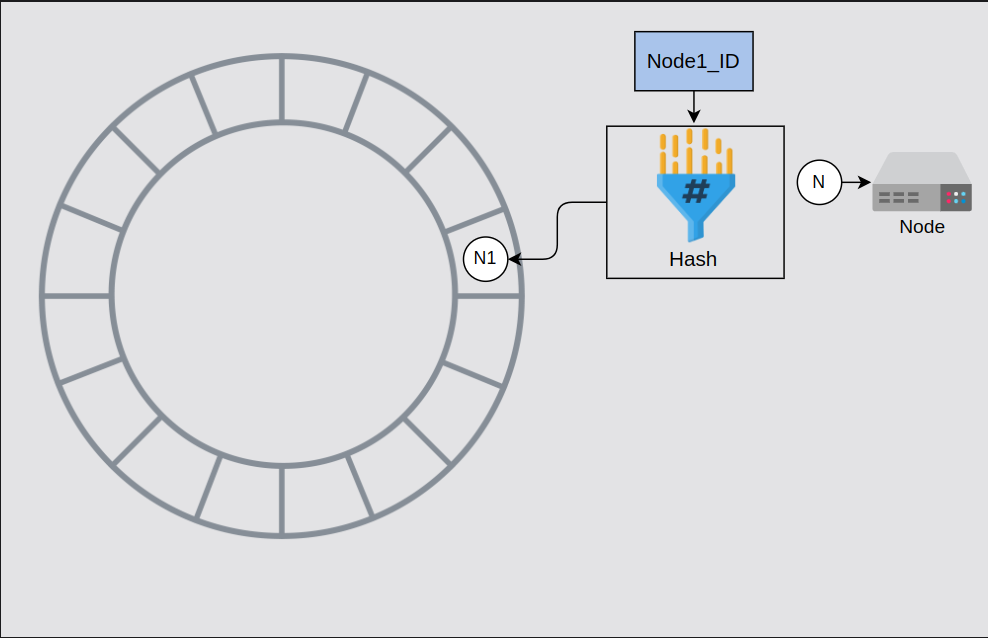

*A hash for Node1 is calculated and Node1 is added to the ring*

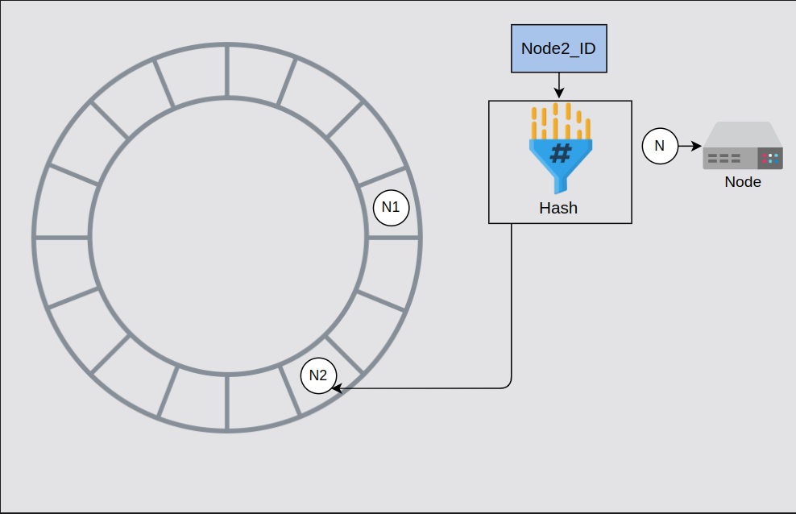

*A hash for Node2 is calculated and Node2 is added to the ring*

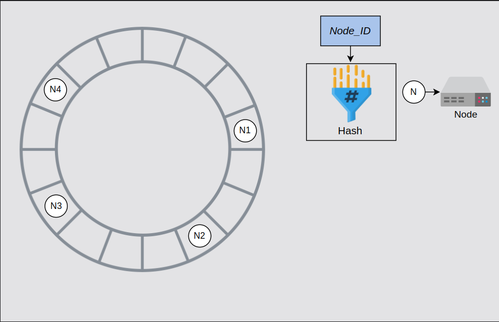

*Hashes for other nodes are calculated and nodes are added to the ring*

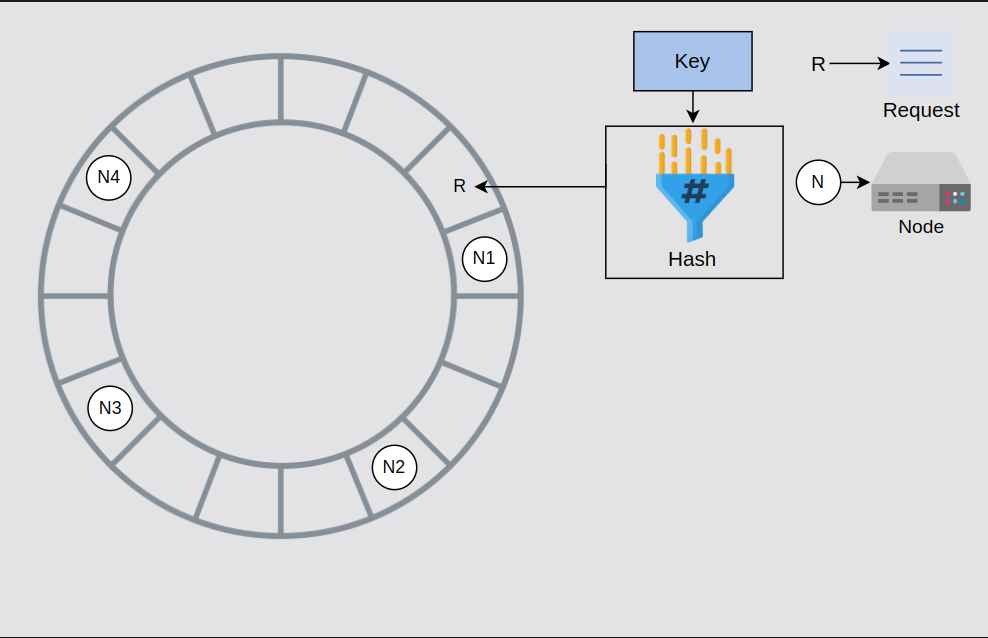

*Similarly, a hash is calculated for the key and the request is added to the ring*

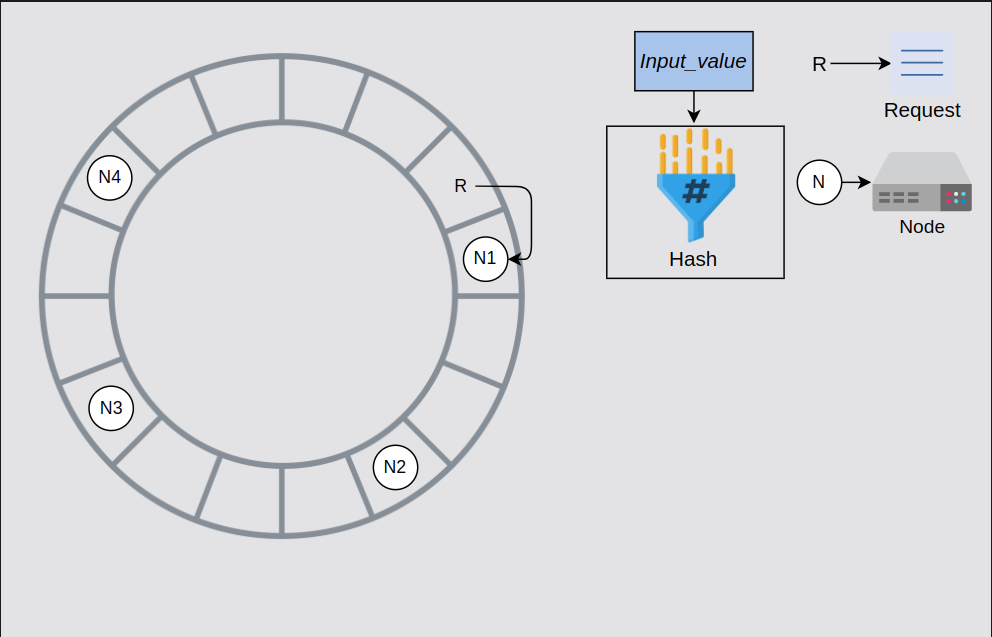

*The request is completed by the next node it finds by moving in the clockwise direction*

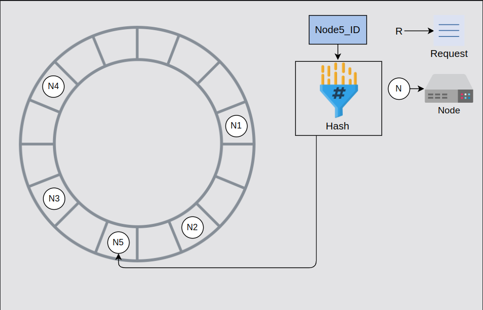

*The hash is calculated for a new node, Node5, which is added to the ring*

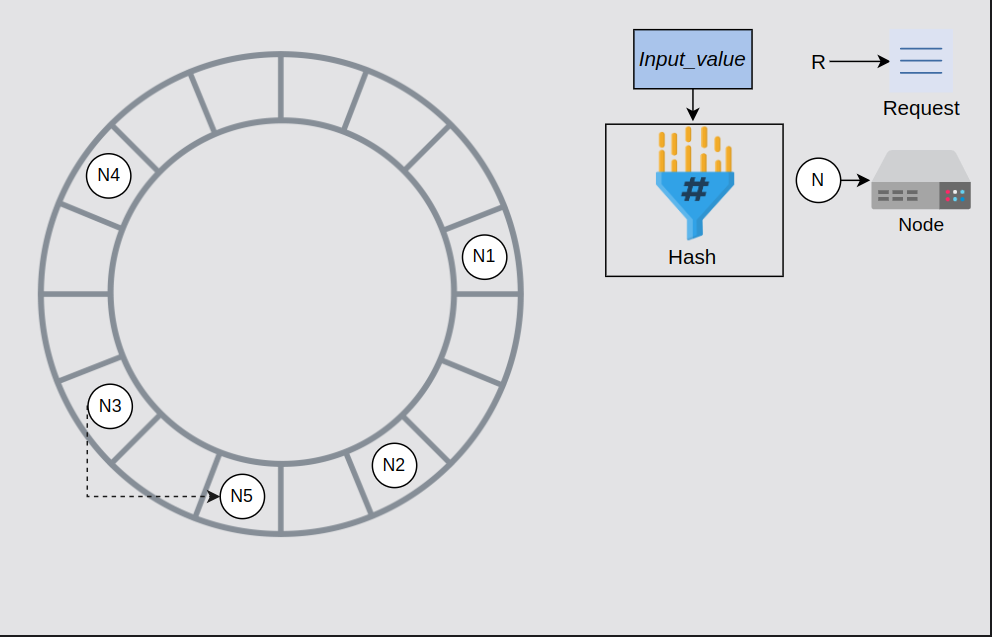

*N3 shares the keys from N2 to N5 with N5*

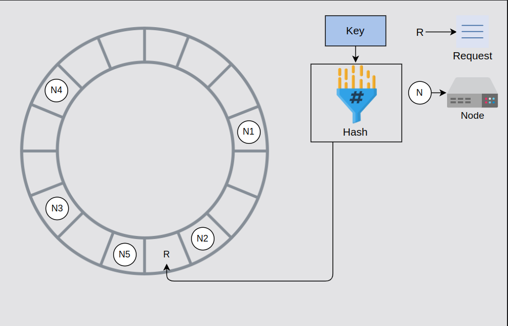

*The hash is calculated for a new request and the request is added to the ring*

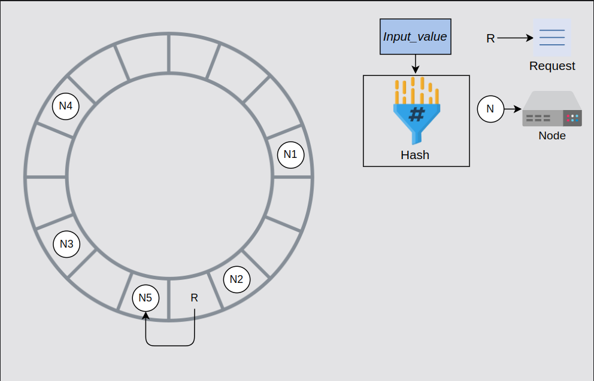

*The request is processed by N5 instead of N3 since N5 is the next node in the clockwise direction*

The primary benefit of consistent hashing is that as nodes join or leave, it ensures that a minimal number of keys need to move. However, the request load isn't equally divided in practice. Any server that handles a large chunk of data can become a bottleneck in a distributed system. That node will be receive a disproportionately large share of data storage and retrieval requests, reducing the overall system performance. As a result, these are referred to as hotspots.

As shown in the figure below, most of the requests are between the N4 and N1 nodes. Now, N1 has to handle most of the requests compared to other nodes, and it has become a hotspot. That means non-uniform distribution has increased load on a single server.

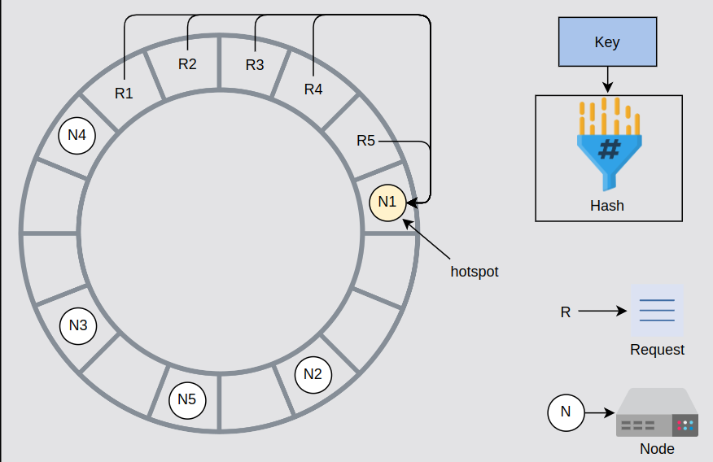

#### Use virtual nodes

We'll use virtual nodes to ensure a more evenly distributed load across the nodes. Instead of applying a single hash function, we'll apply multiple hash functions onto the same key.

Let's take an example. Suppose we have three hash functions. For each node, we calculate three hashes and place them into the ring. For the request use only one hash function. Wherever the request lands onto the ring, it's processed by the next node found while moving in the clockwise direction. Each server has three positions, so the load of requests is more uniform. Moreover, if a node has more hardware capacity than others, we can add more virtual nodes by using additional hash functions. This way, it'll have more positions in the ring and serve more requests.

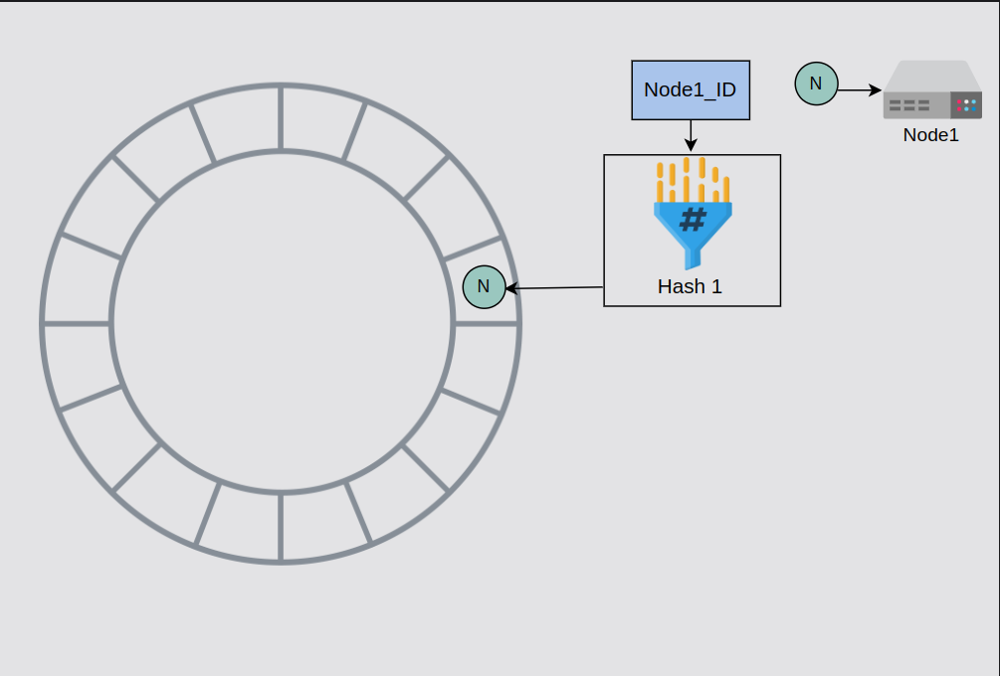

*Calculate the hash for Node1 using Hash 1 then place the node in the ring*

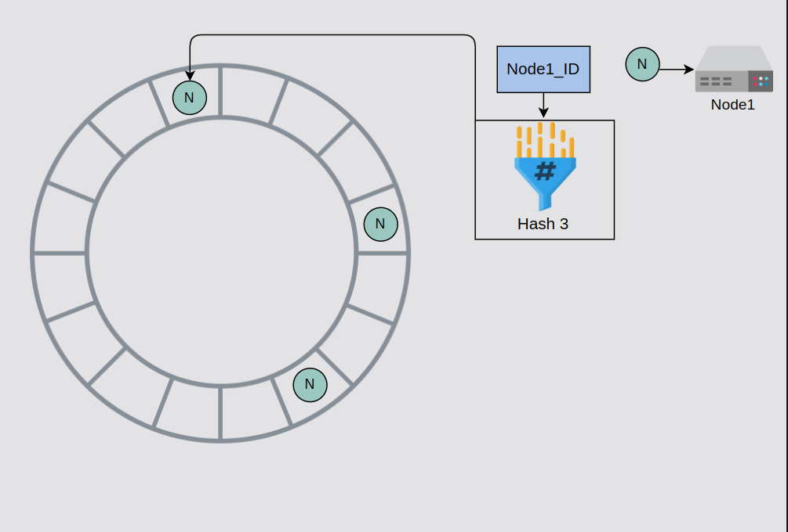

*Calculate the hash for Node1 using Hash 2 and Hash 3 then place the node in the ring*


*Calculate the hash for Node2 using Hash 1,2,3 then place the node in the ring*


*Calculate the hash for the request using Hash 1, and place the request in the ring*


*The request will be processed by the virtual node of Node2*

#### Advantages of virtual nodes

- If a node fails or does routine maintenance, the workload is uniformly distributed over other nodes. For each newly accessible node, the other nodes receive nearly equal load when it comes back online or is added to the system.
- It's up to each node to decide how many virtual node it's responsible for, considering the heterogeneity of the physical infrastructure. For example, if a node has roughly double the computational capacity to the others, it can take more load.


### Data replication

We have various methods to replicate the storage. It can be either a primary-secondary relationship or a peer-to-peer relationship.

#### Primary-secondary approach

In a primary-secondary, one of the storage areas is primary, and other storage areas are secondary. The secondary replicates its data from the primary. The primary serves the writes request while the secondary serves read requests. After writing, there's a lag for replication. Moreover, if the primary goes down, we can't write into the storage, and it becomes a single point of failure. 

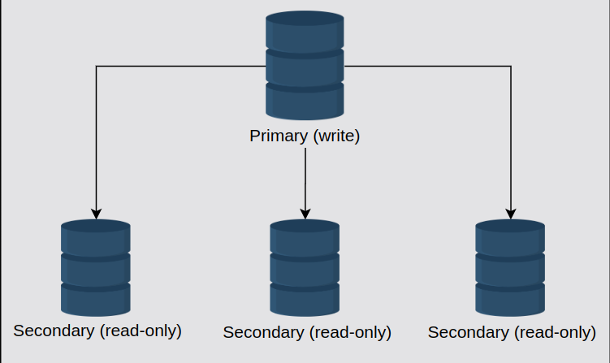

**Question:** Does the primary-secondary approach fulfill requirements of the key-value store that we defined in the System Design: The Key-value Store lesson?

- One of the requirements is that we need the ability to always write. This approach is good for the always read option. However, this approach doesn't include the ability to always write because it will overload the primary storage. Moreover, if a primary server fails, we need to upgrade a secondary to a primary. The availability of write will suffer as we don't allow writes during the switch-over time.

#### Peer-to-peer approach

In the peer-to-peer approach, all involved storage areas are primary, and they replicate the data to stay updated. Both read and write are allowed on all nodes. Usually, it's inefficient and constly to replicate in all n nodes. Instead, three or five is a common choice for the number of storage nodes to be replicated.

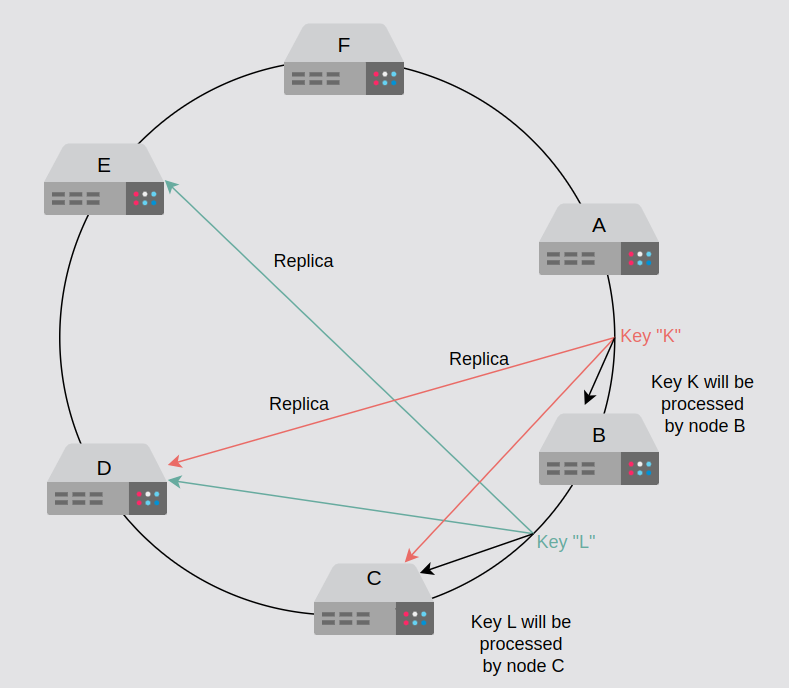

In the context of the CAP theorem, key-value stores can either be consistent or be availability when there are network partitions. For key-value stores, we perfer availability over consistency. It means if the two storage nodes lost connection for replication, they would keep on handling the requests sent to them, and when the connection is restored, they'll sync up. In the disconnected phase, it's highly possible for the nodes to be inconsistent. So, we need to resolve such conflicts. 

## Versioning Data and Achieving Configurability

Learn how to resolve conflicts via versioning and how to make the key-value storage into a configurable service.

### Data versioning


