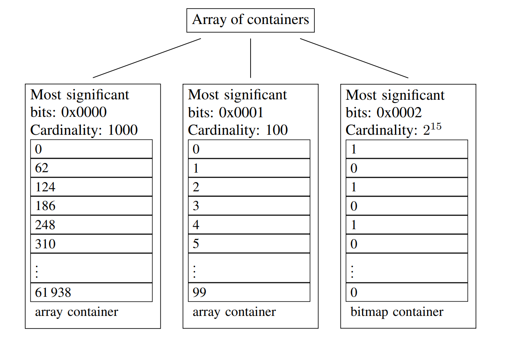

# Better bitmap performance with Roaring bitmaps

## Summary

Bitmap indexes are commonly used in databases and search engines. By exploiting bit-level parallelism, they can significantly accelerate queries. However, they can use much memory, and thus we might prefer compressed bitmap indexes. Following Oracle's lead, bitmaps are often compressed using run-length encoding (RLE). Building on prior work, we introducing the Roaring compressed bitmap format; it uses packed arrays for compression instead of RLE. 

## Introduction

A bitmap (or bitset) is a binary array that we can view as an efficient and compact representation of an integer set.

When the cardinality of S is relatively large compared to the universe size, n (e.g |S| > n/64 on 64-bit processors), bitmaps are often superior to other comparable data structures such as arrays, hash sets or tree. However, on moderately low density bitmaps (n/10000 < |S| < n / 64), compressed bitmaps such as Concise can be preferable.

Instead of using RLE and sacrificing random access, we propose to partition the space [0, n) into chunks are to store dense and sparse chunks differently. On this basic, we introduce a new bitmap compression scheme called Roaring. Roaring bitmaps store 32-bit integers in a compact and efficient two-level indexing data structure. Dense chunks are stored using bitmaps; sparse chunks use packed arrays of 16-bit integers.

A key ingredient in the performance of Roaring bitmaps are the new bit-count processor instructions (such as popcnt) that became available on desktop processors more recently (2008). These new instructions allow us to quickly compute the densite of new chunks, and to efficiently extract the location of the set bits from a bitmap.

## Roaring BITMAP

We partition the range of 32-bit indexes [0, n) into chunks of 2^16 integers sharing the same 16 most significant digits. We use specialized containers to store their 16 least significant bits.

When a chunk contain no more than 4096 integers, we use a sorted array of packed 16-bit integers. When there are more than 4096 integers, we use 2^16 bitmap. Thus we have to types of containers: an array container for sparse chunks and a bitmap container for dense chunks. The 4096 threshold insures that at the level of the containers, each integer use no more than 16 bits: 



The containers are stored in a dynamic array with the shared 16 most-significant bits: this serves as a first-level index. The array keep keeps the containers sorted by the 16 most-significant bits. We expect this first-level index to be typically small: when n = 100000 it contains at most 16 entries. Thus it should often remain in the CPU cache. The containers themselves should never use more than 8kB.

Each Roaring container keep track of its cardinality (number of integers) using a counter. Thus computing the cardinality of a Roaring bitmap can be done quickly: it suffices to sum to most [n/2^16] counters. It also makes it possible to support rank and select queries faster than with a typical bitmap: rank queries count the number of set bits in a range [0, i] whereas select queries seek the location of the ith set bit.

The presented Roaring data layout is intentionally simple. Several variations are possible. For very dense bitmaps, when there are more than 2^16 - 4096 integers per container, we could store the locations of the zero bits instead of 2^16 bit bitmap. Moreover, we could better compress sequences of consecutive integers. We leave the investigation of these possibles as future work.

## Access operations

To check for the presense of a 32-bit integer x, we first seek the container corresponding to x / 2^16, using binary search. If a bitmap container is found, we access (x mod 2^16) bit. If an array container is found, we use a binary search again.

When removing an integer, a bitmap container might become an array container if its cardinality reaches 4096. When adding an integer, an array container might become a bitmap container when its cardinality exceeds 4096. When this happens, a new container is created with the updated data while the old container is discarded. Convert an array container to a bitmap container is done by creating a new bitmap container initialized with zeros, and setting the corresponding bits. To convert a bitmap container to an array container, we extract the location of set bits using an optimized algorithm.

## Logical operations

A bitwise operation between two Roaring bitmaps consists of iterating and comparing the 16 high-bits integers (keys) on the first-level indexes. For better performance, we maintain sorted first-level arrays. Two keys are compared at each iteration. On equality, a second-level logical operation between the corresponding containers is performed. This always generates a new container. If the container is not empty, it is added to the result along with the common key. Then iterators positioned over the first-level arrays are incremented by one. When two keys are not equal, the array containing the smallest one is incremented by one position, and if union is performed, the lowest key and a copy of the corresponding container are added to the answer. When computing unions, we repeat until the two first-level arrays are exhausted.

Sorted first-level arrays allows first-level comparisons in O(n1+n2) time, where n1 and n2 are the respective lengths of the two compared arrays. We also maintain the array containers sorted for the same advantages. As containers can be represented with two different data structures, bitmaps and arrays, a logical union or intersection between two containers involves one of the three following scenarios:

### Bitmap vs Bitmap

We iterate over 1024 64-bit words. For unions, we perform 1024 bitwise ORs and write the result to a new bitmap container. The result cardinality is computed efficiently in Java using the Long.bitCount method.

**Algorithm 1** Routine to compute the union of two bitmaps containers

```txt
input: two bitmaps A and B indexed as arrays of 1024 64-bit integers
output: a bitmap C representing the union of A and B, and its cardinality c
c <- 0
Let C be indexed as an array of 1024 64-bit integers
for i ∈ {1,2,...,1024} do
    Ci <- Ai OR Bi
    c <- c + bitCount(Ci)
return C and c
```

It might seem like computing bitwise ORs and computing the cardinality of the result would be significantly slower than merely computing the bitwise ORs. However, four factors mitigate this potential problem:

1. Popular processors (Intel, AMD, ARM) have fast instructions to compute the number of ones in a word. Intel and AMD's popcnt instruction has a throughput as high as one operation per CPU cycle.
2. Recent Java implementations translate a call to Long.bitCount into such fast instructions.
3. Popular processors are superscalar: they can exececute several operations at once. Thus, while we retrieve the next data elements, compute their bitwise OR and store it in memory, the processor can apply the popcnt instruction on the last result and increment the cardinality counter accordingly.
4. For inexpensive data processing operations, the processor may not run at full capacity due to cache misses.

On the Java platform we used for our experiments, we estimate that we can compute and write bitwise ORs at 700 million 64-bit words per second. If we further compute the cardinality of the result as we produce it, our estimated speed falls to about 500 million words per second. That is, we suffer a speed penalty of about 30% because we maintain the cardinality.

For computing intersections, we use a less direct route. First, we compute the cardinality of the result, using 1024 bitwise AND instructions. If the cardinality is larger than 4096, then we proceed as with the union, writing the result of bitwise ANDs to a new bitmap container. Otherwise, we create a new array container. We extract the set bits from the bitwise ANDs on the fly.

TODO: algorithm 2

**Algorithm 3** Routine to compute the intersection of two bitmap containers. The function bitCount returns the Hamming weight of the integer

```txt
input: two bitmaps A and B indexed as arrays of 1024 64-bit integers
output: a bitmap C representing the intersection of A and B, and its cardinality c if c > 4096 or an equivalent array of integers otherwise
```

### Bitmap vs Array 

When one of the two containers is a bitmap and the other one is a sorted dynamic array, the interaction can be computed very quickly: we iterate over the sorted dynamic array, and verify the existence of each 16-bit integer in the bitmap container. The result is written out to an array container. Unions are also efficient: we create a copy of the bitmap and simply iterate over the array, setting the corresponding bits.

### Array vs Array

For unions, if the sum of the cardinalities is no more than 4096, we use a merge algorithm between the two arrays. Otherwise, we set the bits corresponding to both arrays in a bitmap container. We then compute the cardinality using fast instructions. We then compute the cardinality using fast instructions. If the cardinality is no more than 4096, we convert the bitmap container to an array container (algorithm 2). 

For intersections, we use a simple merge (akin) to what is done in merge sort when the two arrays have cardinalities that differ by less than a factor of 64. Otherwise, we use galloping intersections. The result is always written to a new array container. Galloping is superior to a simple merge when one array (r) is much smaller than other one (f) because it can skip many comparisons. Starting from the beginning  of both arrays, we pick the next available integer ri from the small array r and seek an integer at least as large fj in the large array f, looking first at the next value, then looking at a value twice as far, and so on. Then we use binary search to advance in the second list to the first value larger or equal to ri.

In-place operators can be faster because they avoid allocating and initializing new memory areas. When aggregating many bitmaps, we use other optimizations. For example, when computing the union of many bitmaps (e.g, hundreds), we first locate all containers having the same key (using a priority queue). If one container is a bitmap container, then we can clone this bitmap container (if needed) and compute the union of this container with all corresponding containers in-place. In this instance, the computation of the cardinality can be done at the end.  

**Algorithm 4** Optimized algorithm to compute the union of many roaring bitmaps

input: a set R of Roaring bitmaps as collections of containers; each container has a cardinality and a 16-bit key.
output: a new Roaring bitmap T representing the union

```txt
Let T be an initially empty Roaring bitmap
Let P be the min-heap of containers in the bitmaps of R, configured to order the container by their 16-bit keys.

while P is not empty do
    Let x be the root element of P. Remove from the min-heap P all elements having the same key as x, and call the result Q.
    Sort Q by descending cardinality; Q1 has maximal cardinality.
    Clone Q1 and call the result A. The container A might be an array or bitmap container
    for i ∈ {2, ..., |Q|} do
```
