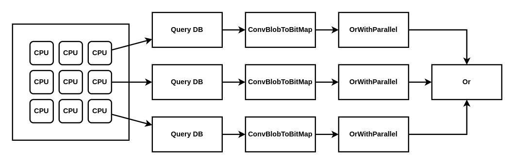
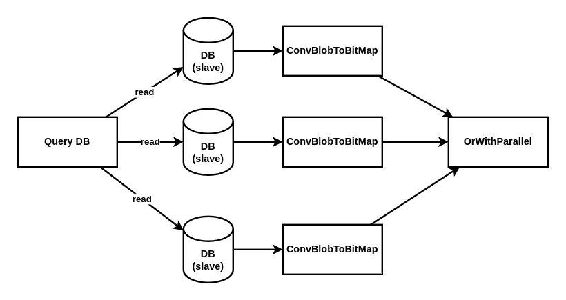
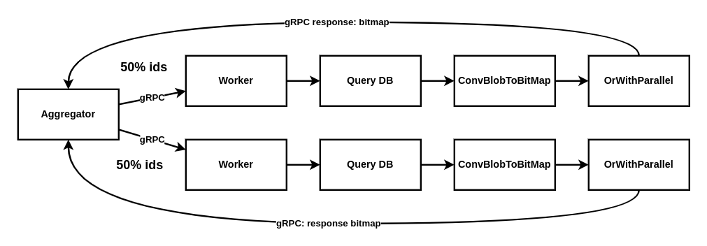
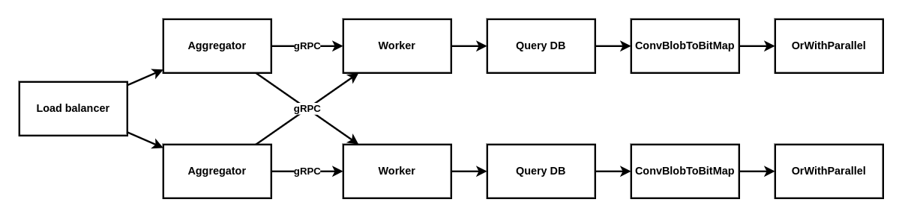

<p style="font-size: 38px; font-weight: 700">GHTK challenge: Đếm trên tập lớn</p>

[[TOC]]

## TLDR;

Bài viết này đưa ra 2 solutions tạm gọi là: single instance, multi instances.

Cả 2 solution đều đáp ứng được nhu cầu của bài toán

**Single instance (vertical scale)**

+ MySQL, Golang

+ Với cấu hình server có 6 **physical CPUs** khoảng 0.6s

**Multi instances (horizontal scale)**

+ MySQL, Golang, gRPC (hoặc REST)

+ Với cấu hình 5 instances, mỗi instance 6 **physical CPUs** thời gian tính toán khoảng 0.2 s

Vì logic tính toán khá nhiều nên thời gian xử lý phụ thuộc rất nhiều vào CPUs. Cả 2 phương án trên đều có thể giảm thời gian tính toán bằng việc cung cấp thêm CPUs cho mỗi instance. Có thể đạt tới 0.1 - 0.2s nếu bỏ nhiều resource.

## Công cụ sử dụng

- Golang, MySQL, bitmap, bit compression, concurrency, gRPC 
- Redis, bloom-filter

## Mô tả lại bài toán

+ A1 gồm ~5000 số integer (unique) ∈ [1, 1e8]
+ A2 gồm ~5000 số integer (unique) ∈ [1, 1e8]<br>
...
+ An gồm ~5000 số integer (unique) ∈ [1, 1e8]
+ n ∈ [5000, 10000]

**Output:** A1 ∪ A2 ∪ ... An-1 ∪ An

## Yêu cầu chính

+ Đếm: A1 ∪ A2 ∪ ... An-1 ∪ An
+ Thêm: relate_item vào Ai (i ∈ [1, 1e8])
+ Xóa: relate_item j từ Ai (i,j ∈ [1, 1e8])
+ **Count phải nhỏ hơn 1s**

## Yêu cầu khác

+ Triển khai được trên phần cứng phổ thông
+ Scalable, High availability

## Cấu trúc dữ liệu bitmap và thuật toán nén

+ Bài toán đếm phần tử chung giữa 2 **tập hợp các số nguyên**

Có thể dùng nhiều cách để biểu diễn tập hợp như hash, set, array...

Tuy nhiên bài toán này có đặc tính là rất lớn => các cấu trúc trên là không hợp lý.

Để biểu diễn tập hợp số nguyên, ta còn có một cách khác là dùng bitmap.

Nếu max(Ai) = n (phần tử lớn nhất trong tập hợp bằng n). Thì ta có thể sử dụng n bit để biểu diễn tập hợp đó.

Phép count: A1 ∪ A2 ∪ ... An-1 ∪ An

Được biến đổi thành phép đếm số 1 trong phép OR bit: A1 | A2 | ... An-1 | An

Ví dụ:

+ Tập hợp A = {1,2,3,4,5}, B = {1,3,5}

=> có thể dùng 5 bits để biểu diễn: 

A = 11111 <br>
B = 10101 <br>
A | B = 11111<br>
Count1(A|B) = 5 <br>

+ Tập hơp A = {1,2,3,4,10}, B = {1,5,7}

=> có thể dùng 10 bits để biểu diễn:

A = 1000001111<br>
B = 0001010001<br>
A | B = 1001011111<br>
Count1(A|B) = 8

+ Tập hợp A = {1,2,3}

bits(A) = 111

Để thêm số 4 vào tập hợp, sử dụng phép OR bit: 

bits(4) = 1000

A | bits(4) = 1111 = {1,2,3,4}

Bản chất việc thêm 1 phần tử vào 1 tập hợp chính là union 2 tập hợp.

+ Tập hợp A = {1,2,3}

Để bỏ 1 số 1 ra khỏi tập hợp, sử dụng phép AND bit:

bits(1) = 001

A & bits(1) = 110 = {2,3}

=> Với cách biểu diễn theo bit, ta có thể count, thêm phần tử, xóa phần tử...

Tuy nhiên bài toán ban đầu max(Ai) = 100M => biểu diễn theo cách này thì cần tới 100M bits => con số không tưởng.

=> Câu hỏi: Có cách nào để làm cho 100M này nhỏ lại không?

Nhìn lại bài toán thì mỗi item chỉ liên quan đến khoảng 5000 items khác => nếu biểu diễn tập A dưới dạng bitmap với 100M bits thì bitmap này chỉ toàn là số 0 (100M - 5000 là số 0).

=> Có cách nào để nén lại không?

Bài toán ban đầu được đưa thành bài toán nén bit.

Có nhiều thuật toán (thuộc lớp run-length-encoded bitmaps) để nén bit.

+ Oracle's BBC
+ WAH (variation on BBC)
+ EWAH

Các thuật toán này có một điểm yếu là không random access. Nếu muốn kiểm tra một giá trị có ở trong set hay không, ta phải bắt đầu từ vị trí đầu tiên, sau đó giải nén. Điều này có nghĩa là khi intersect hoặc union trên một set rất lớn, ta phải giải nén toàn bộ set => không đáp ứng nhu cầu của bài toán.

Để xử lý phần này, đề xuất sử dụng roaring. Roaring chia dữ liệu thành các khối gồm 2^16 số nguyên. Trong một đoạn, nó có thể sử dụng bitmap không nén, một danh sách số nguyên đơn giản hoặc danh sách các lần chạy. Dù nó sử dụng định dạng nào, tất cả chúng đều cho phép kiểm tra sự hiện diện của bất kỳ một giá trịnào một cách nhanh chóng (ví dụ: bằng tìm kiếm nhị phân). Kết quả cuối cùng là Roaring có thể tính toán nhiều thao tác nhanh hơn nhiều so với các định dạng được mã hóa theo thời lượng chạy như WAH, EWAH...

Xem chi tiết tại: https://roaringbitmap.org/

## Basic approach: Single instance

Phần này đề xuất phương án dễ dàng implement với:

+ 1 service (viết bằng Golang)
+ 1 database (dùng MySQL)

### Thiết kế Database 

relate table

|Column|Data type|Description|
|-|-|-|
|id|int unsigned not null|item id + PRIMARY KEY|
|bitmap|blob|represent set of related item|

**Vì data size khả lớn, cần có đánh partition theo id (PRIMARY KEY) khoảng 1M / 1 partition.**

**+ SELECT**

Lấy ra tất cả bitmap từ danh sách các items (theo đề bài thì là từ 5K -> 10K).

```sql
SELECT bitmap FROM relate WHERE id IN (?);
```

**+ INSERT**

```sql
INSERT INTO relate (bitmap) VALUES (?); 
```

**+ UPDATE**

```sql
UPDATE relate SET bitmap = ? WHERE id = ?;
```

Bảng relate chỉ có 2 trường: id, bitmap. Số lượng ids của 1 kho nằm trong khoảng 5000 -> 10000. Query lấy 10K record theo PRIMARY KEY.

### Cost estimate

**Database**

Size của một record trong bảng relate

|column|type|size|
|-|-|-|
|id|unsigned int|4 bytes|
|bitmap|blob|L + 2 bytes, L < 2^16, đã tính thử max = 30KB|

có 100M records = (4 + 30000)*1e8 bytes ~ 30e8 KB ~ 30e5 MB ~ 30e2 GB ~ 3 TB.

### Scale

**Benchmark 10M dữ liệu trên máy cá nhân (single instance) với chỉ 6 physical CPUs, MySQL và server chạy trên cùng 1 máy**

|Items của kho X|Thời gian thực hiện|< 1s|
|-|-|-|
|1000|112.437861 ms|OK|
|5000|273.981094ms|OK|
|8000|464.694475ms|OK|
|10000|608.330203ms|OK|

Để tăng tốc độ xử lý cần chạy trên server có nhiều CPUs hơn (vertical scale). Với khoảng 24 physical cores thì dự kiến đếm distinct 10K items có thể đạt 0.2 => 0.3s. Lý do có con số này là phần code đã apply chia nhỏ câu query theo chunk. Mỗi CPUs sẽ xử lý query 100 ids và thực hiện tính toán. Với 1000 ids chia cho 6 CPUs thời gian trung bình chỉ là 130ms. Lưu ý ở đây yêu cầu physical CPUs. Vì các tác vụ đa phần là tính toán, logical CPUs không có nhiều tác dụng trong xử lý tác vụ liên quan đến tính toán trên CPUs.



Phần bottleneck còn có thể xảy ra ở bước query database. Có thể áp dụng đọc trên nhiều db slave. Và xử lý concurrency kết quả trả về từ DB.



Phần data model cũng chỉ là logic từ 1 id kiểu unsign integer lấy ra mảng bytes (bitmap). Có thể dùng hệ distributed database khác để đảm bảo tính scale.

Về phần Or trên bitmap (implement roaring) thì không có vấn đề gì về hiệu năng.

## Multi instance approach

Phương án single instance sẽ gặp giới hạn về phần cứng vì số lượng CPU trên 1 máy là hữu hạn. Phương án này đưa ra cơ chế cho phép xử lý song song trên nhiều máy. Tuy nhiên sẽ thêm một chút phức tạp và có overhead của việc giao tiếp qua network. Để giám tối đa độ trễ trong việc giao tiếp giữa các service, đề xuất dùng gRPC, tuy nhiên với REST hay cơ chế giao tiếp khác thì implement cũng tương tự, không quá quan trọng.

### Thiết kế database

Như phần trên.

### Scale

#### 1 aggregator, n workers



Aggregator đầu tiên sẽ chia đều lượng ids cho các workers mong muốn sẽ là 2000 ids cho 1 worker. Implement của worker là như phần single instance. Tuy nhiên ở bước cuối cùng, trả về bitmap là Or(ids) chứ không tính trực tiếp ra số lượng phần tử của tập hợp. Bởi vì: 

Ban đầu tập hợp có n ids, chia thành k phần. Kết quả đúng phải là lưc lượng(k1 | k1 ... | kn). Chứ không phải lực lượng k1 + lực lượng k2 ... + lực lượng kn. Do đó worker trả về k1 = bitmap(id1) | bitmap(id2)... | bitmap(idn/k)

Sau đó aggregator sẽ thực hiện phép orBitMap(k1, k2, ..., kn)

#### n aggregators, n workers

Giải pháp trên có bottleneck khi chỉ có một aggregator. Có thể thêm aggregator + load balancer để điều phối requests.



## Các cách tối ưu cho phần lưu trữ database khác

Nhắc lại tính chất của phép OR trên tập ids n phần tử: id1 | id2 ... | idn = (id1 | id2) | (id3 ... | idk) ... | (idk | idn)

Từ tính chất đó, ta có thể chia database thành các cách như sau:

### Partition

Cách đơn giản nhất là partition chia db ban đầu thành k partition, lưu ý là không nên chia quá nhỏ vì query 10K phần tử trong 100M chia khoảng 10 partition là đủ.

### Chia thêm cột

**1. Thiết kế ban đầu**

|Column|Data type|Description|
|-|-|-|
|id|int unsigned not null|item id + PRIMARY KEY|
|bitmap|blob|represent set of related item|

bitmap sẽ chứa thông tin relate của item với id hiện tại, bitmap có khoảng 5000 phần tử (do 1 item relate tới khoảng 5000 items), và range của bitmap từ 1 -> 100M.

Câu count được tính như sau: 

```txt
count(id1.bitmap | id2.bitmap ... | idn.bitmap)
```

**2. Chia thêm cột như sau**

|Column|Data type|Description|
|-|-|-|
|id|int unsigned not null|item id + PRIMARY KEY|
|bitmap1|blob|represent set of related item|
|bitmap2|blob|represent set of related item|
|bitmap3|blob|represent set of related item|
|bitmap4|blob|represent set of related item|
|bitmap5|blob|represent set of related item|

Khi này bitmap1 sẽ chứa thông tin relate item với các item khác nằm trong khoảng 1 -> 20M<br>
Khi này bitmap2 sẽ chứa thông tin relate item với các item khác nằm trong khoảng 20 -> 40M<br>
...
Khi này bitmap5 sẽ chứa thông tin relate item với các item khác nằm trong khoảng 80M -> hết

Câu count được tính như sau: 

```txt
count(id1.bitmap1 | id2.bitmap1 ... | idn.bitmap1) +
count(id1.bitmap2 | id2.bitmap2 ... | idn.bitmap2) +
... +
count(id1.bitmapn | id2.bitmapn ... | idn.bitmapn)
```

### Chia thêm bảng

**1. Bảng ban đầu**

|Column|Data type|Description|
|-|-|-|
|id|int unsigned not null|item id + PRIMARY KEY|
|bitmap|blob|represent set of related item|

Với id thuộc [1,100M]

**2. Ta có thể chia thành 5 bảng như sau**

+ relate20M table

|Column|Data type|Description|
|-|-|-|
|id|int unsigned not null|item id + PRIMARY KEY|
|bitmap|blob|represent set of related item|

Với id thuộc [1,20M]

+ relate40M table

|Column|Data type|Description|
|-|-|-|
|id|int unsigned not null|item id + PRIMARY KEY|
|bitmap|blob|represent set of related item|

Với id thuộc [20M,40M]

...

+ relate100M table

|Column|Data type|Description|
|-|-|-|
|id|int unsigned not null|item id + PRIMARY KEY|
|bitmap|blob|represent set of related item|

Với id thuộc [80M, x]

Câu count được tính như sau: 

```txt
count(
    (tbl1.id1.bitmap | tbl1.id2.bitmap ... | tbl1.idn.bitmap) |
    (tbl2.id1.bitmap | tbl2.id2.bitmap ... | tbl2.idn.bitmap) |
    ... |
    (tbln.id1.bitmap | tbln.id2.bitmap ... | tbln.idn.bitmap)
)
```

### Tách database

Giống như cách chia bảng nhưng mỗi bảng bây giờ sẽ nằm ở một db riêng. Tuy nhiên cách này sẽ phải xử lý distributed transaction trong trường hợp update.

## Xử lý hot key và bloom-filter

Nếu xuất hiện những item là hot key trong hệ thống thì có thể cache lại, giảm tải cho db. Tuy nhiên vì không gian rất lớn (100M) items, mỗi lần query lại lấy ra thông tin của 10000 items. Nếu lần nào cũng check cache thì lại là bottleneck. Yêu cầu là có một cách nào đó tốn chi chí rất thấp mà để có thể đưa ra quyết định có vào cache để lấy hay không. 

Bloom-filter là một cấu trúc dữ liệu như thế. Bloom-filter trả lời câu hỏi sự tồn tại của một phần tử trong tập hợp.

Phần tử A có trong tập X hay không. Kết quả của bloom-filter sẽ là:

+ Chắc chắn không có
+ Có thể có

Trong case chắc chắn không thì đưa cho worker xử lý như bình thường

Còn case có thể có thì kiểm tra cache.

## Tối ưu việc query từ database

### Tối ưu số pages MySQL cần load

Vì mỗi bitmap cần 28KB -> 30KB để lưu trữ, default page size của MySQL là 16KB. Nếu sử dụng default page size này, rất có thể sẽ phải cần đến 3 pages để lưu trữ cho một bitmap. Đề xuất set default page size thành 32KB.

### Tối ưu việc mapping data từ MySQL (blob) -> bitmap

Với kho x có 10K items, mỗi item chứa thông tin relate của 5000 item (khoảng 30KB).

Mỗi lần load 1 record như thế, server phải allocate 1 memory segment gồm ~30K hoặc nhỏ hơn (theo lý thuyết là nhỏ hơn 23K).

Source code hiện tại đang lấy chunk = 100. Mỗi lần lấy như thế thì cần alloc 100*30K = 3MB.

Sau khi chạy xong chunk = 100 ids thì lại giải phóng 3MB đó.

=> Có thể sử dụng pool để giảm tải quá trình alloc.


## Kiểm thử

**1. Để kiểm thử tính chính xác của thuật toán, cần sinh ra một file data.txt với định dạng như đề bài**

1 2 3 4<br>
2 1 3 5<br>
3 1 2<br>
4 2 5<br>
5 1 4<br>

Với cột đầu tiên là id, các cột tiếp theo là các item liên quan

**2. Tạo database cho việc test, thông số cấu hình db điền trong file .env**

**3. Tạo table relate:**

+ Thủ công

```sql
CREATE TABLE relate (
    id INT UNSIGNED AUTO_INCREMENT PRIMARY KEY,
    bitmap blob
);
```

**4. Sau đó chạy lệnh:**

```bash
./cmd/insert_from_file
```

Lệnh này sẽ insert data từ file data.txt vào database.

**5. Đếm distinct relate_item bằng lệnh:**

Đếm unique của relate items có id 1,2,3,4

```bash
./cmd/count 1,2,3,4
```

**6. Setup luồng benchmark**

Trong file env có 3 tham số:

```txt
INSERT_TIMES=2
RECORDS_FOR_INSERT=200
RELATE=5000
```
INSERT_TIMES: số lần chạy câu INSERT

RECORDS_FOR_INSERT: số records cho 1 lần INSERT

RELATE: số lượng item liên quan đến 1 item, môt item sẽ là random từ 1 -> 100M, đúng ra chỗ này phải tạo ra 5000 phần tử unique thì mới đúng business. Tuy nhiên rand trong 1e8 (100M) để lấy 5000 phần tử thì cũng rất khó để trùng.

Với thông số trên => insert 2 lần, mỗi lần 200 records => có 400 records trong database.

```go
for i := 0; i < insertTimesNum; i++ {
    lRecords := make([]any, recordPerInsertNum)
    for j := 0; j < recordPerInsertNum; j++ {
        rb := roaring.New()
        relateItemList := make([]uint32, relatesNum)
        for k := 0; k < relatesNum; k++ {
            relateItemList[k] = uint32(rand.Intn(1e8) + 1)
        }
        rb.AddMany(relateItemList)
        b, err := rb.ToBytes()
        if err != nil {
            log.Fatal(err)
            return
        }
        lRecords[j] = b
    }
    r.InsertMany(lRecords)
    log.Printf("complete insert: %d records, each record  is related to %d items\n", recordPerInsertNum, relatesNum)
}
```

Cách chạy:

```txt
./cmd/insert_from_rand
```

Sau đó chạy câu count để thử tốc độ

```txt
./cmd/count.go 1,2,3,4
```

## Roaring

### Cấu trúc dữ liệu

Roaring chia không gian thành các khối 2^16 integers: [0x2^16, 1x2^16), [1x2^16, 2x2^16), [2x2^16, 3x2^16) ... Việc chia nhỏ thành các khối ngoài việc dễ dàng tính toán ở các phép toán AND, OR, cũng đảm bảo mỗi khối sẽ được giữ lưu trên CPU cache, tránh khỏi tình trạng miss cache.

Với 100M item => chia thành 1526 khối, mỗi khối 2^16 bits.

Roaring gồm 2 thành phần chính là keys, và containers. Mỗi container là một block, vị trí của container trong block được xác định bởi key tương ứng.

```go
type roaring struct {
	keys            []uint16
	containers      []container
}
```

Để thêm phần tử x vào roaring. Thực hiện các bước: 

```txt
+ tính x / 2^16 => xác định vị trí của block (key).
+ tính x % 2^16 => xác định giá trị lưu vào container tương ứng.
```

Ví dụ tập A: {1, 2, 2^16+1, 2^16+2, 2x2^16+1, 2x2^16+2} biểu diễn theo roaring sẽ cần 3 blocks.

```txt
+ Thêm x = 1 vào roaring => key = 0, container[0] = {1}
+ Thêm x = 2 vào roaring => key = 0, container[0] = {1,2}
+ Thêm x = 2^16+1 vào roaring => key = 1, container[1] = {1}
+ Thêm x = 2^16+2 vào roaring => key = 1, container[1] = {1,2}
+ Thêm x = 2x2^16+1 vào roaring => key = 2, container[2] = {1}
+ Thêm x = 2x2^16+2 vào roaring => key = 2, container[2] = {1,2}
```

Do đó max của một phần tử trong container là 2^16 - 1, min là 0.

Mỗi container lại có 3 cách biểu diễn: bitmap container, array container và run container.

Xét tập S, |S| là lực lượng của tập S. S biểu diễn cho một block gồm 2^16 bits.

+ bitmap containers

Nếu |S| > 4096 bitmap container sẽ được sử dụng. Bitmap container gồm một mảng số nguyên không dấu 64 bit. Bitmap được dùng cho trường hợp tập hợp phân bố không đều. Các phần tử tập trung vào một khối.

Với mỗi số nguyên không dấu 64 bits (uint64) ta có thể biểu diễn cho một tập hợp 64 phần tử các số nguyên từ [0, 64).

Do đó bitmap container gồm 2^16 / 64 phần tử (1024 phần tử). Mỗi phần tử là biểu diễn cho sự tồn tại của 64 số nguyên liên tiếp của trong container đó.

```go
type bitmapContainer struct {
	bitmap      []uint64
}
```

Để thêm phần tử x vào bitmap container. Thực hiện các bước: 

```txt
+ tính x / 64 => xác định vị trí của bitmap[i].
+ tính x % 64 => xác định vị trí cần lưu bit 1 trong bitmap[i].
```

Ví dụ tập A = {1,2,64,65} biểu diễn dưới dạng bitmap container B

```txt
+ Thêm 1 vào B => 1 / 64 = 0 => cần set 1 bit vào bitmap[0], bitmap[0] = bitmap[0] | (1 << (1 % 64))
+ Thêm 2 vào B => 2 / 64 = 0 => cần set 1 bit vào bitmap[0], bitmap[0] = bitmap[0] | (1 << (2 % 64))
+ Thêm 64 vào B => 64 / 64 = 1 => cần set 1 bit vào bitmap[1], bitmap[1] = bitmap[1] | (1 << (64 % 64))
```

+ array containers: gồm mảng các số 16-bit integers đã được sắp xếp.

Nếu |S| <= 4096 phần tử array container sẽ được sử dụng.

```go
type arrayContainer struct {
	content []uint16
}
```

Ví dụ tập A = {64,65, 1, 2} biểu diễn dưới dạng array container B thì chỉ đơn giản là B = [1,2,64,65]

+ run containers: dùng để biểu diễn khi các phần tử là các số nguyên liên tiếp

run containers khá giống với việc nén bit dựa trên chiều dài của bit 0, 1 liên tiếp.


```go
type runContainer16 struct {
	iv []pair<uint16, uint16>
}
```

Ví dụ tập A = {1,2,64,65,66, 67} biểu diễn dưới dạng run container B

B = [<1,1>, <64, 3>]

Trong đó phần tử đầu tiên trong cặp là phần tử đầu tiên của dãy liên tiếp, phần tử tiếp theo là số các số liên tiếp.

### Xử lý phép OR

**1. bitmap vs bitmap**

Để thực hiện phép OR trên 2 bitmap containers chỉ cần thực hiện 1024 phép bitwise OR trên 64-bit words tương ứng.

```txt
input: two bitmaps A and B indexed as arrays of 1024 64-bit integers
output: a bitmap C representing the union of A and B
Let C be indexed as an array of 1024 64-bit integers
for i ∈ {1,2,...,1024} do
    Ci <- Ai OR Bi
return C
```

Theo phần thống kê thì với phần cứng phổ thông có thể thực hiện 700M 64-bit words trên 1 giây.

**2. bitmap vs array**

Để thực hiện phép OR trên bitmap container và array container thì với mỗi phần tử xi trong array ta thực hiện phép bitwise OR: bitmap[xi / 64] = bitmap[xi / 64] | (xi % 64)

```txt
Let A be indexed as an array of 1024 64-bit integers (bitmap container)
Let B be indexed as an array 16-bit integers (array container)
for i ∈ {B} do
    Ai <- Ai OR Bi
return A
```

**3. array vs array**

Để thực hiện phép OR trên 2 array (X, Y) thì việc đầu tiên là xác định loại container sẽ sử dụng cho kết quả của phép OR. 

Nếu |X| + |Y| <= 4096 => Là kết qủa của việc merge(X, Y), với X, Y là 2 sorted array.

Nếu |X| + |Y| > 4096 => Thực hiện bitwise OR tương tự như trường hợp của bitmap vs array nhưng. Nhưng bitmap ban đầu là rỗng mà thực hiện trên 2 arrays X, Y.

```txt
Let A be indexed as an array 16-bit integers (array container)
Let B be indexed as an array 16-bit integers (array container)
Let C be indexed as an array of 1024 64-bit integers (bitmap container)
for i ∈ {A} do
    Ci <- Ci OR Ai
for i ∈ {A} do
    Ci <- Ci OR Bi
return C
```

**Các phép trên run container được bỏ qua trong phần mô tả này. Vì nó rất nhanh và cũng tương tự như array**

### Optimize_1: Priority Queue

Khi thực hiện phép Union trên nhiều bitmaps (trường hợp của bài toán), các đơn giản là thực hiện các phép OR liên tiếp. Union (A1, A2) -> B1, Union(B1, A3), ... Các này có lợi ích là không cần quá nhiều bộ nhớ để lưu trữ vì các phép Union được thực hiện liên tiếp, sau khi Union(A1, A2), A1, A2 sẽ được giải phóng. Tuy nhiên chi phí này cũng không nhiều, Roaring sử dụng priority queue để xử lý (nếu yêu cầu về mặt tốc độ).

Đầu tiên Roaring sẽ gom hết các containers có cùng key (sử dụng priority queue - min-heap). Nếu một container là dạng bitmap container thì chỉ cần lấy container này làm gốc, từ đó chạy qua hết các container còn lại và set bit-1 tương ứng qua phép OR (giống trường hợp bitmap vs array).

Trong trường hợp nếu số lượng bitmaps đủ lớn, tính trước lực lượng của các containers > 4096 => tạo ra một bitmaps container rỗng, sau đó chạy qua hết các arrays container còn lại để set bit-1 tương ứng thông qua phép OR (cũng là bitmap vs array nhưng bitmap rỗng).

### Optimize_2: Convert container, CPU instruction

**Convert container**

Vì Roaring sử dụng 3 loại container khác nhau: bitmap container, array container, run container. Việc chuyển đổi giữa bitmap và array container xảy ra ở các bước thêm, xóa phần tử trong container. Còn chuyển đổi sang run container sẽ thực hiện ở bước serialize bitmaps.

Bài toán là làm sao chuyển đổi bitmap container -> run container (array container thì chỉ là bài toán dãy con liên tiếp).

Ví dụ với bitmap container Ci = 000111101111001011111011111000001

Sẽ có 6 runs: 1, 11111, 11111, 1, 1111, 1111 (mỗi run là vùng có các số 1 liên tiếp)

Để đếm được trong Ci có 6 run, Roaring thực hiện các bước như sau: 

```txt
Ci                  = 000111101111001011111011111000001
Ci << 1             = 001111011110010111110111110000010
(Ci << 1) ANDNOT Ci = 001000010000010100000100000000010
bit1Count(001000010000010100000100000000010)
```

=> run_number = bit1Count((Ci << 1) ANDNOT Ci)

Hàm bit1Count cũng là một hàm được tối ưu sẵn, các ngôn ngữ đều support 1 hàm để thực hiện thao tác này chỉ với ~1 CPU cycle.

Ví dụ với source của Golang

```go
func OnesCount64(x uint64) int {
	const m = 1<<64 - 1
	x = x>>1&(m0&m) + x&(m0&m)
	x = x>>2&(m1&m) + x&(m1&m)
	x = (x>>4 + x) & (m2 & m)
	x += x >> 8
	x += x >> 16
	x += x >> 32
	return int(x) & (1<<7 - 1)
}
```

**CPU instruction: SIMD - Single instruction multiple data**

Như tên gọi, SIMD cho phép chỉ với 1 instruction thực hiện được nhiều phép toán. SIMD khác với concurrency, SIMD khai thác tính toán song song trên dữ liệu "data level parallelism". SIMD được ứng dụng nhiều trong các tác vụ liên quan đến xử lý âm thanh.

Ví dụ với bài toán cộng tọa độ: (x1, y1) = (1, 2); (x2, y2) = (3, 4). Tính (x, y) = (x1+x2, y1+y2).

Với thao tác thông thường thì cần 2 instruction CPU

```txt
x = x1 + x2
y = y1 + y2
```

SIMD cho phép thực hiện 2 thao tác này chỉ với 1 instruction.

Trong Roaring, SIMD được áp dụng để xử lý 8 phép bitwise với một instruction (mỗi phép bitwise trên số nguyên 16 bits, vùng chứa thanh ghi là 256 bits = 16 x 8 x 2).

Tuy nhiêu đọc source code thì SIMD mới chỉ đang support cho source C, C++, các source như Go, Java thì vẫn đang dùng single instruction, single data.

**Tham khảo**

- https://arxiv.org/pdf/1402.6407.pdf
- https://arxiv.org/pdf/1603.06549.pdf
- https://arxiv.org/pdf/1709.07821.pdf
