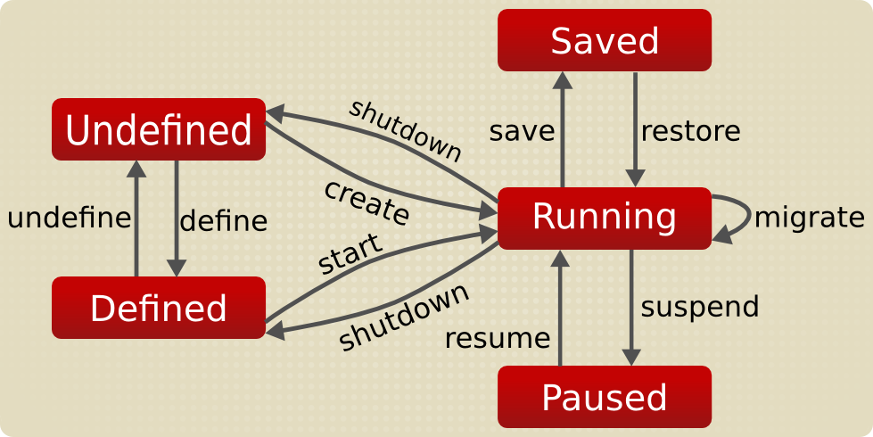

## Virtual Machine Lifecycle

### Terminology

To avoid ambiguity about the terms used, here are the definitions for some of the specific concepts used in libvirt documentation.

- a node is a single physical machine.
- an hypervisor is a layer of software allowing to virtualize a node in a set of virtual machines with possibly different configurations than the node itself.
- a domain is an instance of an operating system (or subsystem in the case of container virtualization) running on a virtualized machine provided by the hypervisor.

Now we can define the goal of libvirt: to provided a common and stable layer sufficient to securely manage domains on a node, possibly remote.

As a result, libvirt should provide all APIs needed to do management, such as: provision, create, modify, monitor, control, migrate and stop the domains - with the limits of the support of the hypervisor for those operations. Not all hypervisors provide the same operations; buf if an operations is useful for domain management of even one specific hypervisor it is worth providing in libvirt. Multile nodes may be accessed with libvirt simultaneously, but the APIs are limited to single node operations. Node resource operations which are needed for the management and provisioning of domains are also in the scope of the libvirt API, such as interface setup, firewall rules, storage management and general provisioning APIs. Libvirt will also provide the state monitoring APIs needed to implement management policies, obviously checking domain state but also exposing local node resource consumption.

## Concepts

### Guest domains are described using XML configuration

XML is used as the file format for storing the configuration of everything in libvirt including domain, network, storage and other elements. XML enables users to use the editors they are comfortable with and to easily integrate with other technologies and tools.

```xml
<domain type='qemu'>
    <name>demo</name>
    <devices>
    </devices>
</domain>
```

### Transient guest domains vs Persistent guest domains

Libvirt distinguishes between two different types of domains: transient and persistent.

- Transient domains only exist until the domain is shutdown or when the host server is restarted.
- Persistent domains last indefinitely.

Once a domain is created (no matter what type) its state can be saved into file and then restored indefinitely as long as the original file still exists. Thus even a transient domain can be restored over and over again.

Creation of transient domains differs slightly from creatoin of persistent domains. Persistent domains need to be defined before being started up.

### States that a guest domain can be in

Domain can be in several states:

**1. Undefined** - This is baseline state. Libvirt does not know anything about domains in this state because the domain hasn't been defined or created yet.

**2. Defined or Stopped** - The domain has been defined, but it's not running. This state is also called stopped. Only persistent domains can be in this state. When a transient domain is stopped or shutdown, it ceases to exist.

**3. Running** - The domain has been created and started either as transient or persistent domain. Either domain in this state is being actively executed on the node's hypervisor.

**4. Paused** - The domain execution on hypervisor has been suspended. Its state has been temporarily stored until it is resumed. The domaind does not have any knowledge whether it was paused or not. If you are familiar with process in operating systems, this is the similar.

The `virsh suspend` command is used to suspend a virtual machine's execution, which effectively pauses the VM. Unlike the `virsh save` command, `virsh suspend` does not write the VM's state to a file on the disk. Instead, the state the VM (primarily its RAM) it kept in memory. 

When you suspend a VM using `virsh suspend`, the VM's processes are paused, and the state remains active in the host's RAM. This operation is quick and does not involve writing any state to disk, making it faster that operations like `virsh save`, which writes out the VM's memory to a file. The primary downside is that if the host machine is rebooted or loses power, the suspended state is lost, and the VM will need to be started fresh from its last disk state (like a cold boot).

Quick pause and resume: Ideal for temporarily reallocating resources without shutting down the VM. For instance, you might want to free up CPU resources for a critical task on the host.

Temporary interruptions: useful when a VM should not perform operatoins for a period, such as during certain backup operations or system maintenance that does not involve rebooting the host.

If you need the VM state to be stored persistently on disk (for example, for a longer-term pause or more reliable state saving), you would use `virsh save` instead, which writes the entire state of the VM's memroy to a file. Upon a host reboot, this file can be used to restore the VM to the saved state using `virsh restore`.

**5. Saved** - Similar to the paused state, but the domain state is stored to persistent storage. Again, the domain in this state can be restored and it does not notice that any time has passed.

The diagram below shows how domain states flow into one another. 



### Snapshots

A snapshot is a view of a virtual machine's operating system and all its applications at a given point in time. Having a restorable snapshot of a virtual machine is a basic feature of the virtualization landscape. Snapshots allow users to save their virtual machien's state at a point in time and roll back to that state. Basic use cases include taking a snapshot, installing new applications, updates or upgrades (discovering they are terrible or broke things) and then rolling back to prior time.

It should be obvious that any changes that occur after a snapshot is taken are not included in the snapshot. A snapshot does not continually update. It represents the virtual machine's state at a single point in time.

### Migration (concepts)

A running domain or virtual machine can be migrated to another host as long as the virtual machine's storage is shared between the hosts and the host's CPU is capable of supporting the guest's CPU model. Depending on the type and application, migration of virtual machines does not need to cause any service interruption.

Libvirt supports a number of different migration types:

**- Standard** A domain is suspended while its resources are being transferred to the destination host. Once done, the VM resumes operation on the destination host. The time spent in suspended state is directly propertional to domain's memory size.

**- Peer-to-peer** This type is used whenever source and destination hosts can communicate directly.

**- Tunnelled** A tunnel is created between source and destination hosts, such as a SSH tunnel. All network communication between the source and destination nodes or physical hosts is sent through the tunnel.

**- Live vs non-live** When migrating in live mode, the domain is not paused and all services on it continue to run. On the destination host the non-live domain or virtual machine has all processes stopped. The domain is effectively invisible during the time necessary to transfer its state through network. Live migration is therefore sensitive to application load. When live migrating a domain, it's allocated memory is sent to the destination host while being watched for changes on the source host. The domain on the source host remains active until all of the memory on both nodes are identical. At that point the domain on the destination node becomes active and the domain on the source node becomes passive or invisible to other machines on the network. 

**- Direct** libvirt initiates the migration using the hypervisor and then the process is entirely under control of the hypervisors. Often they have features to talk directly to each other.

Requirements for migration:

- Shared storage accessible under the same paths and locations
- Exactly same versions of hypervisor software on both physical hosts
- Same network configuration
- Same CPUs or better.

### Guest data security when removing a domain

## Tasks

### Creating a domain

In order to run a domain it is first necessary to create one.
