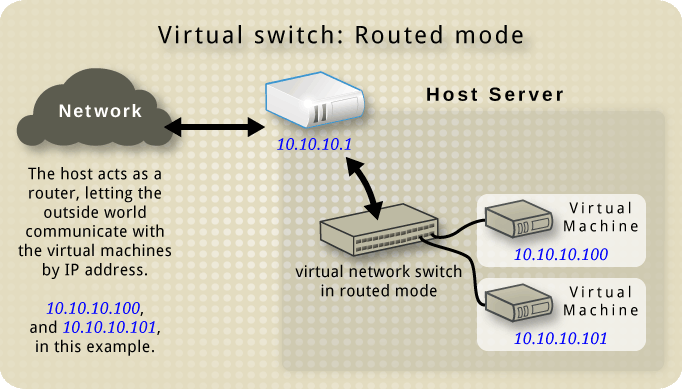

# Virtual networking

**How the virtual networks used by guests work**

Networking using libvirt is generally fairly simple.

## Virtual network switches

Virtual network switch is simple software construction on a host server, that your virtual machines "plug in" to, and direct their traffic through.


On a Linux host server, the virtual network switch shows up as a network interface. 

```txt
ifconfig  virbr0  
virbr0: flags=4099<UP,BROADCAST,MULTICAST>  mtu 1500
        inet 192.168.122.1  netmask 255.255.255.0  broadcast 192.168.122.255
        ether 52:54:00:e9:24:9d  txqueuelen 1000  (Ethernet)
        RX packets 0  bytes 0 (0.0 B)
        RX errors 0  dropped 0  overruns 0  frame 0
        TX packets 0  bytes 0 (0.0 B)
        TX errors 0  dropped 0 overruns 0  carrier 0  collisions 0
```

### Network Address Translation (NAT)

By default, a virtual network switch operates in NAT mode (using IP masquerading rather than SNAT or DNAT).

This means any guests connected through it, use the host IP address for communication to the outside world. Computers external to the host can't initiate communications to the guests inside, when the virtual network switch is operating in NAT mode.


**WARNING** The NAT is set up using iptables rules. Be careful if you change these while the virtual switch is running.

## DNS & DHCP

Each virtual network switch can be given a range of IP addresses, to be provided to guests through DHCP.

Libvirt uses a program, dnsmasq, for this. An instance of dnsmasq is automatically configured and started by libvirt for each virtual network switch needing it.


## Other virtual network switch routing types

Virtual network switches can operate in two other modes, instead of NAT:

### Routed mode

With **routed** mode, the virtual switch is connected to the physical host LAN, passing guest network traffic back and forth without using NAT.

The virtual switch sees the IP addresses in each packet, using that information when deciding what to do.

In this mode all virtual machines are in a subnet routed through the virtual switch. This on its own it not sufficient. Because no other hosts on the physical network know this subnet exists or how to reach it.



### Isolated mode

In this mode, guests connected to the virtual switch can communicate with each other, and with the host. However, their traffic will not pass outside of the host, nor can they receive traffic from outside the host.


## The default configuration

When the libvirt daemon is first installed on a server, it comes with an initial virtual network switch configuration. This virtual switch is in NAT mode, and is used by installed guests for communication.


## Example

**Nat mode example**

This is the default mode and requires no additional configuration at all. It can be used any where where there is no need for 'being seen on the network'. For instance, a web developer who optimizes web pages for different os and web browsers. 

**Isolated mode example**

An example where this mode would be useful is running simulations in the security field, where the spread of malware is being watched. Virtual machines can communicate with each other, but since they are cut off from the physical network, no real damage can be done.

## Creating a virtual network

Creating virtual networks is easy when using the Virtual Machine Manager GUIT. 

### Creating a NAT virtual network

https://wiki.libvirt.org/TaskNATSetupVirtManager.html

The guests connected through a NAT network aren't visible to the outside world.

**Step one: Host properties**

To create a virtual network  with the Virtual Machine Manager tool, you need to go into the "Host properties" screen for the host it will be created on.

**Step two: Virtual Networks tab**

Click on the "Virtual Networks" tab. This will look simialar to the screenshot:

```go
type Detail struct {
    Name string
    Device string
    State int
    Autostart int
}

type IPv4Configuration struct {
    Network int
    Netmask int
    Gateway int
    DHCPRange int
    Forwarding int
}
```

**Step three: Start the New Virtual Network assistant**

In the bottom left corner of the dialog, there is button with a plus sign "+" on it. Click on it to start the "New Virtual Network" assistant.

**NOTE** The screenshot below needs to have some kind of highlight added pointing to the "+" button to add a new virtual network.

**Step four: Choose a name**

In this step, you choose a name for the new NAT network. Use something descriptive you won't forget.

If you know you'll be using command line tools with this virtual network, then choose a name that's easy to type.

**Step five: Choose an IP address range**

In this step, you choose a range of IP addresses to use inside this virtual network. They will be visible to all guests using this virtual network, but won't be seen outside of it due to the NAT.

The key concept here is choosing an address range big enough to accommodate your guests, and that won't interfere with routing externally. It's a good idea to use one of the IPv4 private addresses ranges, as mentioned in the dialog: 

- 10.0.0.0/8
- 172.16.0.0/12 
- 192.168.0.0/16

**Step six: Choose a DHCP address range**

In this step, you choose a range of IP addresses for the DHCP server to assign to guests. This DHCP server and address range are only visible inside this specific NAT network, and won't be seen outside of it.

**DIAGRAM HERE**

- 172.16.99.1 = gateway
- 172.16.99.2 - 127 = static assignment (untouched by DHCP)
- 172.16.99.129 - 254 = DHCP server assigned
- 172.16.99.255 = broadcast address

**Step seven: Choose the type of virtual network**

This is where you choose your network is to bet NAT, Routed, or Isolated

**Step eight: Finish the virtual network creation**

Check the settings are how you want them.

Click the "Finish" button if they are correct.

**Using your new virtual network**

After the virtual network has been created, any subsequent guests you create or edit can be configured to use it.

For example, below we are creating a brand new guest using the Virtual Machine Manager. In the list of virtual networks the guest can connect to, we've chosen the new NAT_Network_172 virtual network.

### Creating a Routed Virtual Network

https://wiki.libvirt.org/TaskRoutedNetworkSetupVirtManager.html

**Step 1:** Naming your virtual network

**Step 2:** Choosing and IPv4 address space

The network should be choosen from one of the IPv4 private address ranges. eg 10.0.0.0/8, 172.16.0.0/12, or 192.168.0.0/16

**Step 3:**  Selecting the DHCP range

### Creating an Isolated Virtual Network

https://wiki.libvirt.org/TaskIsolatedNetworkSetupVirtManager.html

## Starting a virtual network

In virt-manager by clicking Start Network, or in virsh net-start. This command takes one mandatory argument, the networks name. When starting a virtual network, libvirt will automatically set iptables and dnsmasq. However, transient networks are created and started at once.

## Stopping a virtual network

Stopping virtual networking can be done by clicking the appropriate button in Virtual Manager or by net-destroy. If it is a transient network being stopped, it is also removed.

## Removing a virtual network

Again, removign a virtual network is possible in Virtual Manager or in virsh by net-undefine. Pleas keep in mind, only inactive networks can be removed.

## Changing a virtual network

Making changes is only available via the virsh console tool. The net-edit command allows the user to edit the XML configuration of a virtual network.

- Stats collection in virt-manager
    - Need to include which versions of virt-manager have this
    - Implications of stats collection

## Basic command line usage for virtual networks

## Advanced

### Further dnsmasq info
