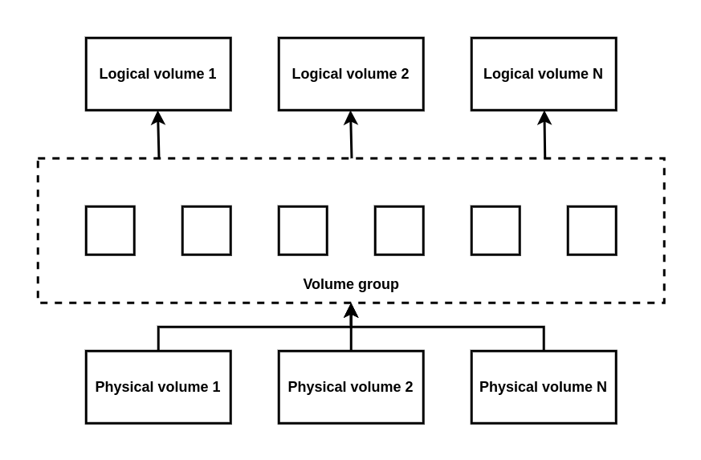

# Chapter 1. Overview of LVM

Logical volume management (LVM) creates a layer of abstraction over physical storage, which helps you to create logical storage volumes. This provides much greater flexibility in a number of ways what using physical storage directly.

In addition, the hardware storage configuration is hidden from the software so it can resized and moved without stopping applications or unmounting file systems. This can reduce operational costs.

## 1.1. LVM Architecture

**Physical volume**

A physical volume (PV) is a partition or whole disk designed for LVM use. 

**Volume group**

A volume group (VG) is a collection of physical volumes (PVs), which creates a pool of disk space out of which logical volumes can be allocated.

**Logical volume**

A logical volume represents a mountable storage device.



## 1.2. Advantages of LVM

Locical volumes provide the following advantages over using physical storage directly: 

**Flexible capacity**

When using logical volumes, you can aggregate devices and partitions into a single logical volume. With this functionality, file systems can extend across multiple devices as though they were a single large one.

**Convenient device naming**

Logical storage volumes can be managed with user-defined and custom names.

**Resizable storage volumes**

You can extend logical volumes or reduce logical volumes in size with simple software commands, without reformatting and repartitioning the underlying devices.

**Online data relocation**

To deploy newer, faster, or more resilient storage subsystems, you can move data while your system is active using the **pvmove** command. Data can be rearranged on disks while the disks are in use.

**Striped Volumes**

You can create a logical volume that stripes data across two or more devices. This can dramatically increase throughput.

**RAID volumes**

Logical volumes provide a conveninet way to configure RAID for you data. This provides protection against device failure and improves performance.

**Volume snapshots**

You can take snapshots, which is a point-in-time copy of logical volumes for consistent backups or to test the effect of changes without affecting the real data.

**Thin volumes**

Logicla volumes can be thinly provisioned. This allows you to create logical volumes that are larger than the available physical space.

**Cache volumes**

A cache logical volume uses a fast block device, such as SSD drive to improve the performance of a larger and slower block device.

# Chapter 2. Managing Local Storage By Using The RHEL System Role

## 2.1. Introduction To The Storage RHEL System Role

- File systems on disks which have not been partitioned.
- Complete LVM volume groups including their logical volumes and file systems.
- MD RAID volumes and their file systems.
- Create a file system.
- Remove a file system.
- Mount a file system.
- Unmount a file system.
- Create LVM volume groups.
- Remove LVM volume groups.
- Create logical volumes.
- Remove logical volumes.
- Create RAID volumes.
- Remove RAID volumes.
- Create LVM volume groups with RAID.
- Remove LVM volume groups with RAID.
- Create encrypted LVM volume groups.
- Create LVM logical volumes with RAID.

## 2.2. Creating An XFS File System On A Block Device By Using The storage RHEL System Role

# Chapter 3. Managing LVM Physical Volumes

The physical volume (PV) is a parition or whole disk designated for LVM use. To use the device for an LVM logical volume, the device must be initialized as a physical volume.

## 3.1. Overview Of Physical Volumes

Initializing a block device as a physical volume places a label near the start of the device. The following describes the LVM label:

- An LVM label provides correct identification and device ordering for a physical device. An unlabled, non-LVM device can change names across reboots depending on the order they are discovered by the system during boot. An LVM label remains persistent across reboots and throughout a cluster.
- The LVM label identifies the device as an LVM physical volume. It contains a random unique identifier, the UUID for the physical volumm. It also stores the size of the block devices in bytes, and it records where the LVM metadata wil be stored on the device.
- By default, the LVM label is placed in the second 512-byte sector. You can overwrite this default setting by placing the label on any of the first 4 sectors.

## 3.2. 

## 3.3. Creating LVM Physical Volume

This procedure describes how to create and label LVM physical volumes (PVs).

In this  procedure, replace the /dev/vdb1, /dev/vdb2, and /dev/vdb3 with the available storage devices in your system.

**Procedure**

1. Create multiple physical volumes by using the space-delimited device names as arguments to the **pvcreate** command:

```txt
# pvcreate /dev/vdb1 /dev/vdb2 /dev/vdb3
```

2. View the created physical volumes by using any one of the following commands

a. The **pvdisplay** command, which provides a verbose multi-line output for each physical volume.

```txt
# pvdisplay
-- NET physical volume--
    PV Name /dev/vdb1
    VG Name 
    PV Size 1.00 GiB
```

## 3.4. Removing LVM Physical Volumes

If a device is no longer required for use by LVM, you can remove the LVM label by using the **pvremove** command. Executing the **pvremove** command zeroes the LVM metadata on an empty physical volume.

# Chapter 4. Managing LVM volume groups

A volume group (VG) is a collection of physical volumes (PVs), which creates a pool of disk space out of which volumes (LVs) can be allocated.

Within a volume group, the disk space available for allocation is divived into units of fixed-size called extents. An extent is the smallest unit of space that can be allocated. Within a physical volume, extents are referred to as physical extents.

## 4.1. Creating LVM Volume Group

You can create an LVM volume group (VG) myvg using the /dev/vdb1 and /dev/vdb2 physical volumes (PVs). By default, when physical volumes are used to create a volume group, its disk space  is divided into 4 MB extents. This extent size is the minimum amount by which the logical volume can be increased or decreased in size. The extent size can be modified using the -s argument of the **vgcreate** command and large numbers of extents have no impact on I/O performance of the logical volume.

**Procedure**

1. Create a myvg VG using any of the following methods:

- Without specifying any options:

```txt
# vgcreate myvg /dev/vdb1 /dev/vdb2
Volume group "myvg" successfully created.
```

2. View the created volume groups by using any one of the following commands according to your requiment:

- The vgs command provides volume group information in a configurable form

- The vgdisplay command displays volume group properties such as size, extents, number of physical volumes...

- The vgscan command scans all supported LVM block devices in the system for volume group

# Chapter 5. Managing LVM Logical Volumes

A logical volume is a virtual, block storage device that a file system, database, or application can use. To create an LVM logical volume, the physical volumes (PVs) are combine into a volume group (VG). This creates a pool of disk space out of which LVM logical volumes (LVs) can be allocated.

## Overview Of Logical Volumes

As administrator can grow or shrink logical volumes without destroying data, unlike standard disk partitions. If the physical volumes in a VG are on separate drives or RAID arrays, then administrators can also spread a logical volume across the storage devices.

You can lose data if you shrink a logical volume to a smaller capacity than the data on the volume requires. Further, some file systems are not capable of shrinking. To ensure maximum flexibility, create logical volumes to use unallocated space, depending on your needs.

**Linear volumes**

A linear volume aggregate space from one or more physical volumes into one logical volume. For example, if you have two 60 GB disks, you can create a 120GB logical volume. The physical storage is concatenated.

**Striped logical volumes**

When  you write data to an LVM logical volume, the file system lays the data out across the underlying physical volume. You can control the way the data is written to the physical volumes by creating a striped logical volume. For large sequential reads and writes, this can improve the efficiency of the data I/O.

Striping enhances performance by writing data to a predetermined number of physical volumes in round-robin fashion. With striping, I/O can be done in parallel. In some situations, this can result in near-linear performance gain for each ...

**RAID logical volumes**

**Thin-provisioned logical volumes (thin volumes)**

Using thin-provisioned logical volumes, you can create logical volumes that are larger than the available physical storage. Creating a thinly provisioned set of volumes allows the system to allocate what you use instead of allocating the full amount of storage that is required.

## 5.2. Creating LVM Logical Volume

```txt
# lvcreate -n mylv -L 500M myvg
Logical volume "mylv" successfully created.
```
